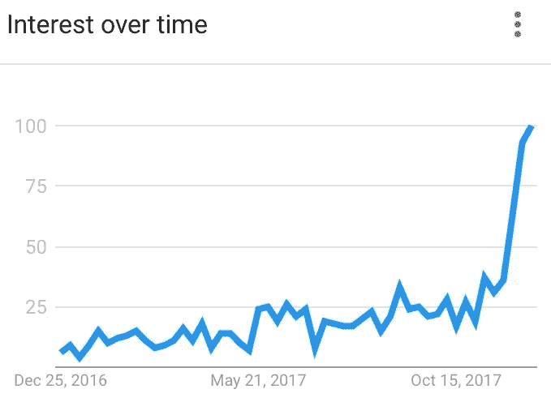
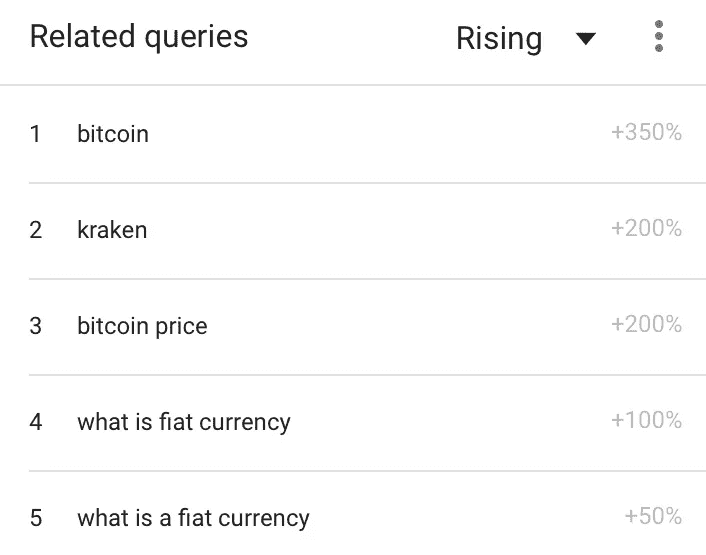
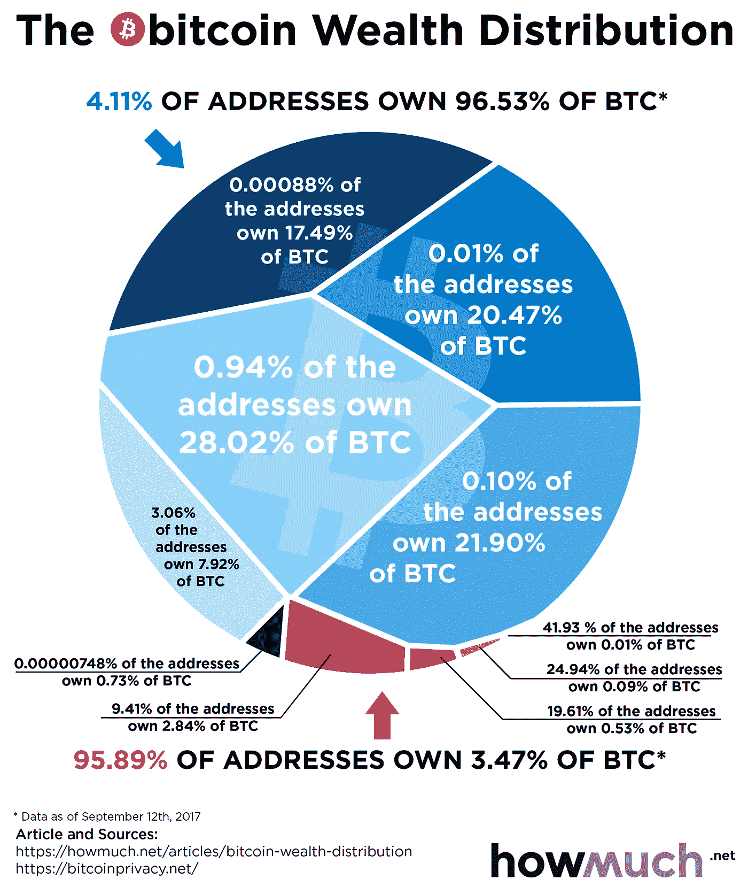

# 加密货币可能是收入不平等的答案吗？

> 原文：<https://medium.com/hackernoon/could-cryptocurrency-be-the-answer-to-income-inequality-59dc8abfdf1d>

## 到目前为止，不太好，但保持希望。

如果你要求我提供最好的证据，证明美国人在不久的将来不能确定明天地心引力会起作用或者太阳会在早上升起，我会通过谷歌搜索趋势向你展示这个对法定货币突然产生强烈兴趣的简单图表:

Google search trend for ‘fiat currency’

随着围绕加密货币的对话呈指数级增长，对这个话题的好奇心也在不断增加，几周前，这个话题几乎没有被考虑为辩论。但是，嘿，鉴于 2017 年的不确定性轨迹，谁会对此感到惊讶呢？如果有人怀疑这是由于对加密货币的未来的质疑，这些相关搜索的峰值不言自明:

Google search trends related to ‘fiat currency’

如果我们认为我们对美国政治的了解不会在今年毁于一旦，我们为什么不在垃圾桶里再增加一个好的美国标准——对美元的信心。

> 比特币混乱的高峰和低谷近乎完美地隐喻了美国政治、经济和我们生活方式的不确定性，这绝非巧合。我们对政府和现有机构的信心已经低得惊人，人们正在放弃我们文明的基石，对加密货币的信心超过了高盛(Goldman Sachs)、摩根大通(JPMorgan)甚至 Visa 等主要货币。

健康经济的参与者相信，其当前的监管、财富分配和自由稳定的货币流动将为所做的工作提供有利可图的回报。相反，今天我们看到越来越多的人争先恐后地用稳定来换取向上流动的一线希望。许多人几乎没有什么可失去的，赚钱的风险超过了几乎相等的损失风险。

比特币价格和其他价格在[的来回波动，在一定程度上反映了我们在从分散、更有价值的加密货币到稳定、易于消费的美元的交换中所做的权衡。](https://hackernoon.com/tagged/bitcoin)

> 然而，似乎保持不变的是，在当今任何特定的货币体系中，富人倾向于保持富有，而穷人仍然贫穷。

虽然利润是共同的动机，但这里更大的画面不是贪婪，而是绝望。

[美国消费者新闻与商业频道 2017 年 9 月报道](https://www.cnbc.com/2017/11/14/richest-1-percent-now-own-half-the-worlds-wealth.html)根据瑞士瑞信银行报告，世界上最富有的 1%的人现在拥有世界上大约 50.1%的财富，仅 15 年就增长了近 5%。很容易理解为什么全球各地的人们都在用他们的法定价值交易更有希望的东西，不管多么不稳定，但如果加密货币真的成为新的储备，我们在经济不平等方面真的会好得多吗？

事实证明，加密货币的财富分配很难衡量，主要是因为其匿名交易的性质——不可能知道谁支付了谁或谁拥有什么。然而，我们确实有完整且无可争议的记录，记录了每枚比特币的数量和流向，这为其在群体中的集中度提供了线索。判决结果？好吧，看看最近来自 h [owmuch.net:](https://howmuch.net/articles/bitcoin-wealth-distribution) 的这个近似值

The whole circle represents 100% circulating Bitcoin.

略高于 4%的人拥有超过 96%的财富，剩下不到 4%的人在为其余 96%的人流通比特币，这并没有描绘出比“真实世界”更美好的画面。虽然我们无法将这些信息浓缩成像全球分布那样的平滑曲线，但 howmuch.net 估计有 1%的比特币地址拥有……你猜对了！比特币财富总量的一半左右。事实上， [BambouClub](https://medium.com/u/a0dbc38e63ae?source=post_page-----59dc8abfdf1d--------------------------------) 在他们的文章中提出了一个令人信服的论点，A [你在比特币的 1%中吗？比特币财富分布的新模型，](/@BambouClub/are-you-in-the-bitcoin-1-a-new-model-of-the-distribution-of-bitcoin-wealth-6adb0d4a6a95)比特币的分布可以更准确地用一个*假设*比特币的财富分布正好反映了全球的分布。我当然不会反对，这让我想到-

## 我们被诅咒了吗？

现在有一部关于网飞的令人大开眼界的纪录片，名为 [11/8/16](https://www.netflix.com/title/80214590) ，采访了美国各地的不同人和家庭，询问他们对 2016 年大选当天的看法和反应。一名黑人被问及为什么他不打算投票，鉴于臭名昭著的争取黑人投票权的斗争。他将美国经济比作富裕白人玩了多年的垄断游戏。他说，当黑人在董事会中获得一个席位时，所有的财产都已经被买走了——所有的钱都已经分发出去了，他说，董事会应该被清理干净，而不是试图参与一场对他不利的游戏。如果说比特币正在大获全胜，那么它已经迅速重新分配了财富，但对财富平等方面的差距却无所作为。

> 如果比特币今天下跌并崩溃，让它成为一个数百万美元的教训，即贪婪和财富囤积是不受约束的经济中的人口(注意我没有说个人)所特有的，这种经济有利于其原始参与者(注意我没有说投资者— [这里是为什么](https://hackernoon.com/stop-treating-bitcoin-like-stock-86f39f094091))。

我可以绝对肯定地预测，如果没有奥威尔式的政府禁令，(让我们面对现实吧，你和我都可以看到这种情况的发生)，比特币的终结不会是加密货币的终结。曾经遥远的喧嚣迅速上升为震耳欲聋的轰鸣声，这意味着你没有错过机会。这意味着这个事情才刚刚开始，所以我们现在有一个机会，不仅可以提升交易交换的未来，还可以让经济公平地为所有人服务，而不仅仅是少数幸运者。

关键在于政策。仅仅改变货币是不够的，但是由于去中心化，加密货币也给了我们优势。如今，我们不必依赖不稳定的政治来引导日益扩大的财富分配差距，而是可以将更公平的“游戏规则”直接编入体系，而无需第三方的影响来破坏它。

那么获胜的硬币已经出来了吗？这是一个很好的机会，因为已经有太多的硬币要跟上了，但如果我们想要的硬币实际上被编程为保持分配公平，我不会急于购买它。我会寻找一个没有太大动机提前购买，但有很大动机保持货币流通而不是囤积的人。它还可能有稳定的法规和快速的交易周转，以保持价格波动低而可靠。