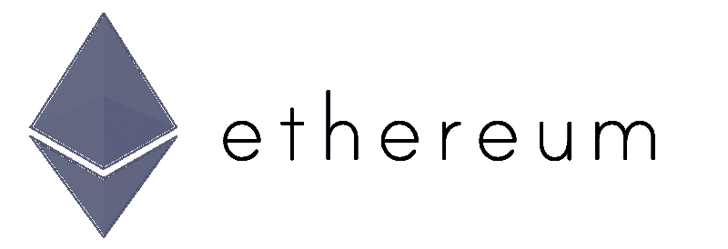

# Reddit 会慢慢过渡到以太坊吗？

> 原文：<https://medium.com/hackernoon/could-reddit-be-slowly-transitioning-to-ethereum-fc8fc444e1f4>

*免责声明:这是一篇纯属猜测的帖子。我和 Reddit 没有任何关系。*

在过去的几天里，我对 Kik 的 Kin 项目做了大量的研究。我一直在听 Ted Livingston 关于这个项目的许多演讲，整合一种[加密货币](https://hackernoon.com/tagged/cryptocurrency)作为一种真正的收入流的想法让我非常兴奋。此外，这是有史以来集成加密货币作为其平台核心部分的最大平台。很自然地，我开始思考主流平台利用加密货币的不同方式，就像 Kik 正在做的那样。

如果你不太了解 Kin 项目，Kik 实际上已经有了几年将加密货币集成到他们的应用程序中的想法。Kik 创造了“Kik 点数”,而不是立即投入并创造一种加密货币。Kik Points 允许用户以各种方式获得积分，然后他们可以用这些积分购买不同的贴纸。在将奖励系统集成到应用程序中后，Kik Points 很快变得非常受欢迎。根据 Kin 的白皮书(【https://kin.kik.com/Kin%20Whitepaper%20v1.pdf】T4)，Kik Points 平均是[比特币](https://hackernoon.com/tagged/bitcoin)月交易额的 3 倍。由于 Kik 点数的成功，Kik 于是决定开发他们自己的基于以太坊的令牌——Kin。

现在知道 Kik 如何慢慢开始将 Kin 集成到他们的应用程序中，我立即发现 Reddit Gold 是一个类似的用例。Reddit Gold 的行为类似于早期的 Kik Points，用户可以交换具有某种潜在、隐藏的金融价值的数字商品。Reddit 的联合创始人亚历克西斯·奥哈尼安(Alexis Ohanian)公开表示自己是以太坊的超级粉丝。

Reddit Gold 会是 Reddit 未来整合加密货币计划的开始吗？我真的觉得很有道理。Reddit 可以开放平台，允许用户以加密货币的形式通过各种方式(流行的子编辑、流行的帖子、有趣的评论等)为平台带来价值，而不是强迫用户以 3.99 美元的价格购买 Reddit 黄金。然后，用户可以像使用“镀金”([https://www.reddit.com/gilding/](https://www.reddit.com/gilding/))一样，相互发送这种加密货币。如果 Reddit 决定像 Kik 一样持有他们假设的加密货币的 30%,它在几年内可能会值一大笔钱。在用例、非常支持的创始人和早期迹象之间，我强烈认为 Reddit 有计划在几年内将 Reddit Gold 转换为基于以太坊的令牌。

*在推特上关注我* [*@maxekaplan*](https://twitter.com/maxekaplan)

> [黑客中午](http://bit.ly/Hackernoon)是黑客如何开始他们的下午。我们是 [@AMI](http://bit.ly/atAMIatAMI) 家庭的一员。我们现在[接受投稿](http://bit.ly/hackernoonsubmission)并乐意[讨论广告&赞助](mailto:partners@amipublications.com)机会。
> 
> 如果你喜欢这个故事，我们推荐你阅读我们的[最新科技故事](http://bit.ly/hackernoonlatestt)和[趋势科技故事](https://hackernoon.com/trending)。直到下一次，不要把世界的现实想当然！

