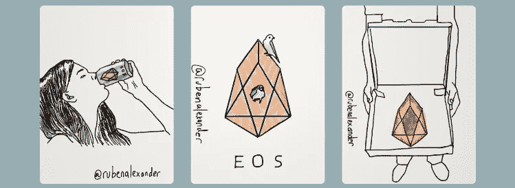
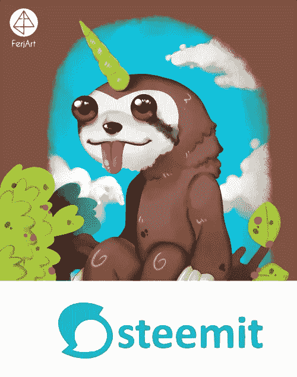

# Slothicorn 能成为创作共用密码艺术家的最终融资解决方案吗？

> 原文：<https://medium.com/hackernoon/could-slothicorn-become-the-ultimate-funding-solution-for-creative-commons-crypto-artists-6ff7dbd6d44e>

remix of art by: @artistchristian and @fluffywiggle

*封面图片混音由:*[*@ artist Christian*](https://steemit.com/slothicorn/@artistchristian/i-would-like-to-introduce-you-to-commander-elmer-entry-1-for-slothicorn-contest-mixed-media)*和@ fluffy wiggle of*[*https://kawaiicrypto.com/*](https://kawaiicrypto.com/)

# Slothicorn 是知识共享加密艺术。

不和:[discord.gg/GWQHDdR](https://discord.gg/GWQHDdR)
斯蒂米特:[https://steemit.com/@slothicorn](https://steemit.com/@slothicorn)
推特:[https://twitter.com/iamslothicorn](https://twitter.com/iamslothicorn)

## Slothicorn 代表了一种远离版权的转变，以及向一种新的去中心化的“我们”经济的转变。我们经济？).

Slothicorn 是开源和知识共享运动的一部分。Slothicorn 属于每个人，不属于任何人。据我所知，Slothicorn 是作为一种网络迷因有机出现的。我还没有发现它的原始创造者。

斯洛希科恩专注于被称为*密码艺术*的新兴艺术。这包括但不限于:加密游戏，包含加密纸钱包的艺术，包含加密谜题的艺术，包含加密货币徽标和主题的艺术，可视化去中心化的艺术，区块链理工大学，crypto vs. fiat，Jamie Dimon 头部爆炸的漫画，你明白了吧。Slothicorn 可能看起来很可爱，但它的爪子象征着 2008 年经济衰退期间银行家和掠夺性放贷者犯下的欺诈记忆。斯洛思科恩从未忘记。

## ***这里有一些 cryptoart 的例子，以防你不确定这个术语的意思:***

*来自@rubenalexander:*

source: [https://steemit.com/eos/@rubenalexander/eos-art-17-71-73-soda-birdhouse-pizza](https://steemit.com/eos/@rubenalexander/eos-art-17-71-73-soda-birdhouse-pizza)

*来自@overkillcoin:*

Source: [https://steemit.com/dtube/@overkillcoin/9wnv4kdg](https://steemit.com/dtube/@overkillcoin/9wnv4kdg)

*来自@marty-arts 最近加入我们的官方创作 Slothicorn 竞赛:*

Source: [https://steemit.com/slothicorn/@marty-arts/my-entry-for-slothicorn-art-contest-digital-painting-process](https://steemit.com/slothicorn/@marty-arts/my-entry-for-slothicorn-art-contest-digital-painting-process)

Slothicorn 用加密货币 STEEM 奖励艺术家。这也许是有史以来第一次，为公共资源做出贡献的艺术家可以获得报酬。过去，知识共享运动中充满了自愿贡献时间和精力的人。维持知识共享运动在很大程度上是一种无偿的牺牲。没有一个好的机制能够从金钱上奖励艺术家的时间和创作。

## 区块链改变了这一点。随着我们的世界和社会变得更加符号化，对版权的需求消失了，我会解释为什么。

区块链和加密货币社区能够将人类行为和经济激励恰当地结合起来。让我们深入了解一下 Slothicorn 如何在区块链街上运营:

我一直是 Steem 区块链非常积极和早期的采用者。当我第一次进入 steemit.com 时，我是一个贫穷的创造者/知识分子。我举例说明了 ***想法丰富，但现金贫乏的*** 类型的个体。

我一无所有地来到了斯提米特。通过我的辛勤工作和持续的创造性努力，我获得了加密货币 STEEM。我现在拥有该平台的股份，并有兴趣为*行星 Steem* 创造更多价值。我对创造价值感兴趣，因为我想增加自己投资的价值。Steem 是一个名为*的股权加权系统，即委托股权证明*。在这里阅读我关于这个系统的文章:[https://hacker noon . com/explain-delegated-proof-of-stake-im-5-888 b2a 74897d](https://hackernoon.com/explain-delegated-proof-of-stake-like-im-5-888b2a74897d)

Planet Steem 是一个象征化系统如何为人类创造适当激励的例子。在像 Steemit 这样的分散系统中，贡献者、股东、所有者和消费者的角色都模糊成一个人。令牌化社区中的每个人都有机会成为所有者、贡献者、股东和用户。只有当你体验到这种整体感的时候，你才会完全明白，集权的企业模式是因为激励错位而被彻底打破的。

# 消费者和工人有不同的动机。股东只关心利润。

工人们可能不太关心高额回报，但他们真的对在日常工作生活中寻找意义感兴趣。投资者可能不太关心工人在工作中找到意义的能力，我甚至可以说，投资者不关心是机器人还是人来做这项工作。他们所关心的只是获得投资回报。

# 没有人想成为奴隶，在分散化、符号化的系统中，我们不再需要奴隶制。

这并不是说每个人都会平等。然而，真正的精英管理可以从这些象征性的、分散的社区中产生。最棒的是，这不再只是一个想法。这些社区已经全面运作。乌托邦. io 是一个例子，我正在建造的 Slothicorn 是另一个例子。艺术家们已经得到了制作知识共享密码艺术的报酬。它正在发生……非常缓慢，非常像树懒。

这个信息被传递给你，而不是作为一些高和强大的哲学谩骂。我是这个新的符号化社区的活生生的例子，我每天都生活在其中。去中心化的象征性经济在一年半的时间里，把我从一个可怜的工资奴隶变成了一个投资者/贡献者/使用者。我一直在深入思考我如何才能更好地不仅为区块链 Steem，而且为整个世界做出贡献。

我创建了 Slothicorn，因为我看到了在去中心化的区块链世界中，对激进的分享和整合的新文化的巨大需求。所有不同的区块链和加密项目都是孤立的，因为它们是分散的。他们似乎也缺少艺术家。我一直在为各种加密项目工作，而 [Slothicorn](https://steemit.com/@slothicorn) 是为了满足那些想要为新兴的分散加密艺术运动做出贡献的艺术家的需求而建造的。

# 如果比特币是真正的占领华尔街，那么创作共用密码艺术革命可以帮助它获得大众的吸引力，也有助于解放世界上有创造力的人们。

我看到未来被大量的“我们”而不是可怕的“我”所传播。这是世界比以往任何时候都更需要的范式转变。

艺术家和创造性思想家可以通过为共享经济做出贡献而成为一股向善的力量，并在此过程中，因其贡献而获得金钱回报。象征性的经济使得这成为可能，这在历史上还是第一次。Kickstarter 向我们展示了众包的作用，而 Steemit 就像吃了类固醇的 Kickstarter，因为经济奖励每周发放一次，并通过一种算法而不是一个集中的实体进行分配。

Source: [https://steemit.com/slothicorn/@ferjart/create-a-slothicorn-art-contest-own-illustration](https://steemit.com/slothicorn/@ferjart/create-a-slothicorn-art-contest-own-illustration)

## 为了启动 Slothicorn 创作共享 Cryptoart 社区，我们目前正在举办一个创建你自己的 Slothicorn 艺术竞赛。

**截止日期:2017 年 12 月 23 日。**

第一名赢得一个 ***密码生存套装*** 。(套件包含一个 Ledger Nano S、一个 Yubikey 和一个 USB 闪存驱动器。)创建你自己的创意共享 Slothicorn，并在[steemit.com](https://steemit.com/)提交你的作品。

**你是一个有创造力的人还是对颠覆感兴趣的艺术家？加入我们吧。
你是相信 Slothicorn 使命的程序员吗？加入我们吧。**

如果匿名黑客组织有幽默感，有为艺术家创造财富的有效方法，你会得到类似 Slothicorn 的东西。我们的 discord 频道也有一个专门针对 CryptoKitties 的聊天室。游戏和娱乐是我们的武器。

我们现在正在寻找希望成为 Slothicorn 核心团队一员的程序员。加入我们的不和谐频道来认识 Slothicorn 社区，并学习如何成为知识共享加密艺术历史的一部分:[discord.gg/GWQHDdR](https://discord.gg/GWQHDdR)

Source: [https://www.shelfies.com/collections/memes/products/sloth-jesus-sweater](https://www.shelfies.com/collections/memes/products/sloth-jesus-sweater)

这个头像不是知识共享。它来自谢尔菲斯。我正在画一个我真正喜欢的头像。