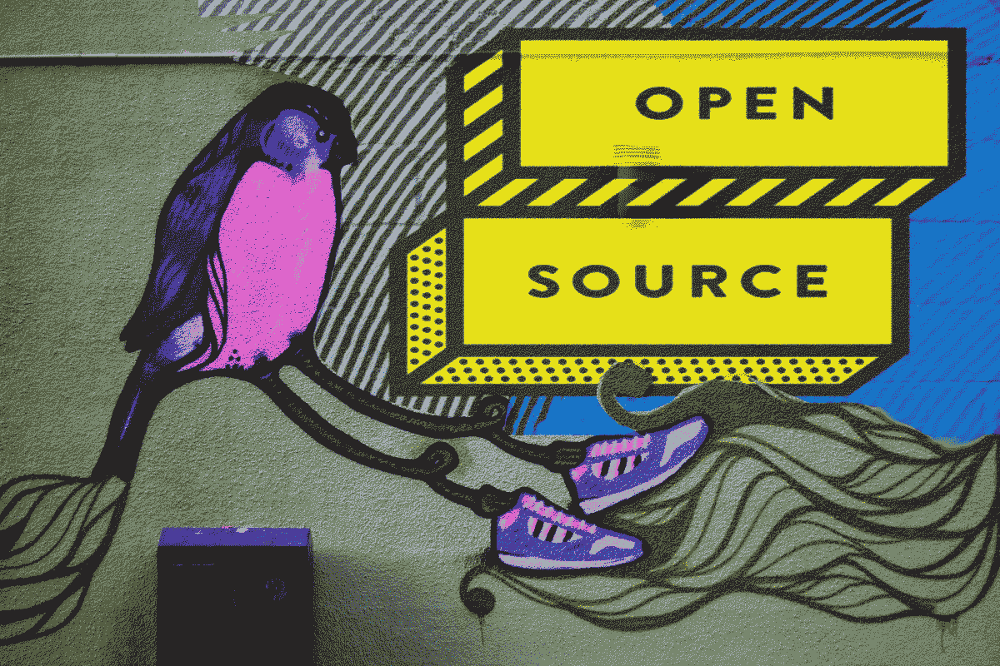
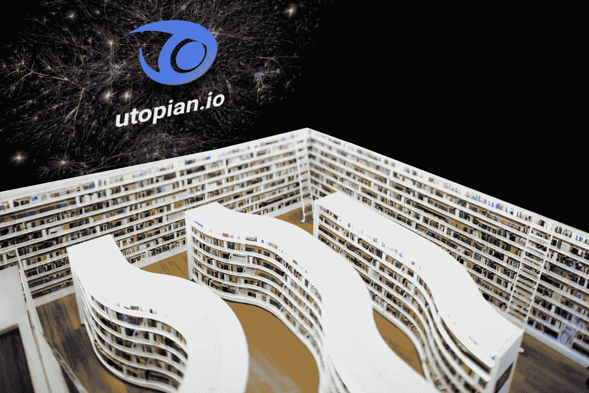
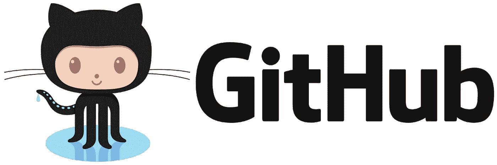

# Utopian.io 会成为开源项目的最终融资解决方案吗？

> 原文：<https://medium.com/hackernoon/could-utopian-io-become-the-ultimate-funding-solution-for-open-source-projects-c516bb0e5a09>

combined image collage from unplash and [http://opensource.muralarts.org/about/](http://opensource.muralarts.org/about/)

# 自从开源运动开始以来，开源项目一直缺乏可靠和可持续的融资模式。

在过去，将自己的精力投入到开源项目中意味着对自己的钱包造成巨大的冲击。经济激励根本不存在。为世界做好事在很大程度上是一种无偿的牺牲，对灵魂有益，但对钱包有害。

一个新的平台可能会改变这一切。叫做[乌托邦。那么，它是如何工作的呢？为什么](http://utopian.io)[是开源项目的理想融资解决方案？](http://utopian.io)

# 简短的回答:区块链。

在[utopia . io](https://utopian.io/)平台上，开源项目的贡献者可以获得加密货币 STEEM，如果他们的提交遵循了他们的指导方针。一些开源项目是 [WordPress](https://wordpress.com/) 、 [Steemit](https://steemit.com/) 、[busy.org、](https://busy.org/) [DTube](https://d.tube/) 、 [DSound](https://dsound.audio/#/feed) 和 [Zappl](https://zappl.com/#!/) 等等。当有人通过[utopia . io](https://utopian.io/)网站对开源项目做出贡献时，人们以及官方[@ utopia-io](https://steemit.com/@utopian-io)Steem 账户可以投票支持帖子，从而获得 Steem 奖励。有 utopian.io 内容版主，他们确保帖子提交的质量符合标准。

## 那么，一个人是如何与乌托邦扯上关系的呢？

unsplash + utopian logo

第一步是在[Steemit.com](https://steemit.com/pick_account)上注册一个免费的 Steem 账户。然后，前往[乌托邦. io](http://utopian.io) 网站开始吧。你用你的 Steem 账户登录[乌托邦. io](https://utopian.io/) ，这样做是安全的。不过，在你开始计划你的新乌托邦生活之前，请阅读这些规则。

[utopia . io](https://utopian.io/)项目与 [Steem 区块链](https://steemd.com/)相集成，因此它使用 Steem 的内置投票算法来使奖励过程以自主方式运行。Steem 的联合创始人 Dan Larimer 发明了 **DAC** 或*分权自治公司*的概念，后来 Vitalk Buterin 将其重命名并推广为 [**DAO**](https://en.wikipedia.org/wiki/Decentralized_autonomous_organization) 或*分权自治组织*。

utopian.io 的这一方面让它看起来像是服用了兴奋剂的众筹 2.0，分散投票是常态，计算机规则决定了贡献者的最终支出。当然，仍然有人类决定投票给哪些帖子，但奖励的分配是由一种算法而不是中央权威机构来处理的。而 utopian.io 在 Steem 生态系统中是独一无二的，因为它有人类内容版主和质量控制专家，他们确保乌托邦的贡献符合某些标准。

除了编码，你还可以写文章、创建图形设计和做社交媒体活动，以帮助各种开源项目获得更多的可见性。这篇文章实际上是这个关于乌托邦的开源合作的一部分。

[https://spin.atomicobject.com/2017/10/23/github-releases/](https://spin.atomicobject.com/2017/10/23/github-releases/)

您还可以同步您的 GitHub 和 utopian.io 帐户，从而将它们连接起来以获得更大的凝聚力。在@elear 的帖子中了解更多信息:[https://utopia . io/utopia-io/@ elear/utopia-is-unstopped-now-fully-integrated-with-the-github-project-feeds](https://utopian.io/utopian-io/@elear/utopian-is-unstoppable-now-fully-integrated-with-the-github-project-feeds)

有很多人参与了乌托邦的建设，因为它也是开源的，我第一次从乌托邦的创始人 [@elear](https://utopian.io/@elear) 那里听说它

# 那么，钱从哪里来？

unsplash

在 [Steem Power](https://www.steem.center/index.php?title=STEEM_Tokens) 代表团中，[乌托邦. io](https://utopian.io/) Steem 账户刚刚收到一百万，而 [Steem Power](https://www.steem.center/index.php?title=STEEM_Tokens) 正是让人们能够在 Steemit.com 和其他网站上赚取 [STEEM](https://www.steem.center/index.php?title=STEEM_Tokens) 奖励的东西。一先令大约相当于 1 美元。Steem Power 类似于拥有一家公司的股票，但有一个额外的好处:你有能力给别人 Steem，而不必实际捐出你的钱。你对 Steem Power 的个人投资决定了算法如何分割奖励池。

你拥有的 STEEM 权力越多，你就越能影响分配每日 Steem 奖励的算法。从这个角度来看，我的 STEEM 权力目前是 111，000，这意味着如果我为你的帖子投票，我可以给你大约 5 美元的 Steem。但在这 111，000 英镑中，我将其中的 20，000 英镑委托给了一位 SP 较低的商业智能领导者。所以，这类似于发放了一笔我可以随时收回的贷款。

有许多大的 Steem Power 账户持有人将他们的 SP 委托给了 T2 的乌托邦-io 账户，因为他们想支持它的发展，并且相信它的使命。据我所知，[@乌托邦-io](https://steemit.com/@utopian-io) 账户现在有 100 万 Steem Power。这意味着[@ utopia-io](https://steemit.com/@utopian-io)账户可以对开源贡献者的帖子进行投票，并以 STEEM 加密货币的形式给予他们可观的奖励。*(澄清:网站为* ***乌托邦. io*** *而 Steem 官方账号为* ***乌托邦-io*** *)*

乌托邦是一个新项目，但我相信它很有可能给世界带来巨大的变化。这是一个新的、共享的、精英经济的开始吗？

这可能是我们梦寐以求的解决方案。我对此超级兴奋，因为我的心属于开源的世界。我从来不关心专利、版权和商标。

***关于作者:***

莉亚·斯蒂芬斯化名为斯特拉贝尔。她是一名作家、社区建设者、企业家和区块链浪荡子。她目前正在开发自己的人工智能聊天机器人。现在可以在这里和 AI 版 Stellabelle 聊天:[*https://chatfuel.com/bot/youtubestellabelle*](https://chatfuel.com/bot/youtubestellabelle)

*跟着她上 Steemit:*[*https://steemit.com/@stellabelle*](https://steemit.com/@stellabelle)

I love open source