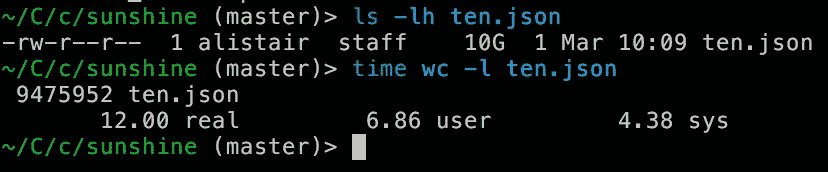

# 使用 Clojure + core.async，计算行数比 wc 快 60%

> 原文：<https://medium.com/hackernoon/counting-lines-60-faster-than-wc-with-clojure-core-async-1af4ce058884>

昨天我注意到[我笔记本电脑的固态硬盘速度非常快，任何一个单核都跟不上](/@atroche/file-processing-in-clojure-can-easily-become-cpu-bound-3c1c38669daf)——即使是像计算[文件中的行数](https://hackernoon.com/tagged/file)这样简单的任务，以及像 [wc](https://en.wikipedia.org/wiki/Wc_(Unix)) 这样久经考验的工具。

833MB/s is not even close to maxing out my SSD’s throughput

今天晚上，在接受了 reddit 帖子上可爱的评论者的许多建议后，我找到了一个更好的方法。

关键思想是让一个线程什么也不做，除了:

*   将数据读入字节数组，以及
*   将数组传递给另一个线程进行“处理”(如果你可以用这个词来美化换行计数的话)。

古老的 unix 工具 WC**计算同一线程中的行数(查看我昨天从 BSD wc 源代码中勾画的这个[超级精简实现](https://gist.github.com/atroche/fe757cc547cace688a65324fa8f99de9))。**

[**Clojure 的**](https://hackernoon.com/tagged/clojures) 默认读取行的方式(line-seq，它使用了 BufferedReader)在同一个线程上执行 UTF 解码，这(正如我昨天注意到的)是一个真正的瓶颈，当你的 SSD 每秒钟泵送超过 1gb 的数据时。

而我 2015 年中期的 MBP 中的那一款再也不是顶级的了:

我今晚编写的并行版本平均需要 6.9 秒才能完成，大约提高了 60%。不仅如此，它没有使用 JVM 丑陋的低级线程和并发原语，而是使用了 core.async 的相当高级的抽象。

(我还对小得多的文件进行了测试，发现了类似的加速效果)。

代码如下:

这里已经很晚了，所以我不打算深入讨论它，但它只是实现了我上面提到的核心思想，即保持一个线程专用于进行系统调用，其他的很少。这里是[完整的名称空间，要求和所有的](https://gist.github.com/atroche/08b966664489f80e87a145cef6775b07)。如果你有问题或意见，请跳到[/r/clo jure Reddit 线程](https://www.reddit.com/r/Clojure/comments/5x2n47/counting_lines_60_faster_than_wc_with_clojure/)。

随着我们向更快的固态硬盘、更多的内核和静态时钟速度发展，CPU 绑定 IO 的问题似乎变得更加重要。我想知道标准库(像 Clojure 的和 Java 的)将如何适应以跟上步伐？

*【编辑:查看* [*令人敬畏的 unix-y 处理多核 IO 的方式*](https://www.reddit.com/r/programming/comments/5x39jh/counting_lines_60_faster_than_wc_with_clojure/) *人们在/r/编程线程中想到的*

*【edit 2:这里有* [*整个 Clojure 文件*](https://gist.github.com/atroche/08b966664489f80e87a145cef6775b07) *，如果你想试着运行或者修改的话。而如果你想生成一个测试文件，试试:"*head-c 10G/dev/random>random . txt "*]*

> [黑客中午](http://bit.ly/Hackernoon)是黑客如何开始他们的下午。我们是 T21 家庭的一员。我们现在[接受投稿](http://bit.ly/hackernoonsubmission)并乐意[讨论广告&赞助](mailto:partners@amipublications.com)机会。
> 
> 如果你喜欢这个故事，我们推荐你阅读我们的[最新科技故事](http://bit.ly/hackernoonlatestt)和[趋势科技故事](https://hackernoon.com/trending)。直到下一次，不要把世界的现实想当然！

