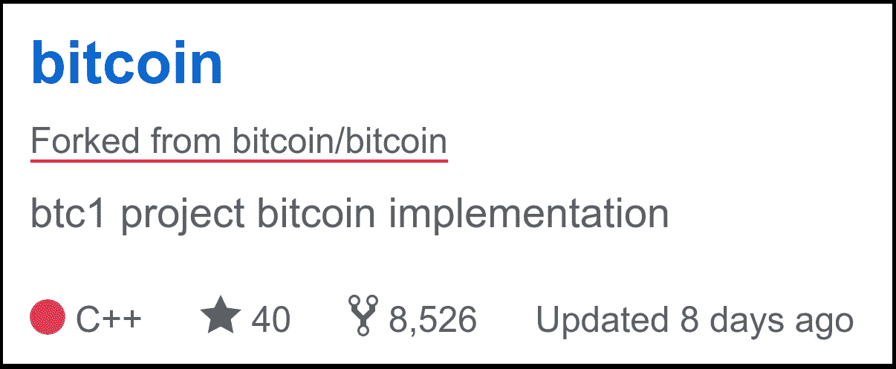

# 打倒你

> 原文：<https://medium.com/hackernoon/coup-you-a99d67477f31>

统治比特币的关键是对参考客户端的控制。一旦你掌管了这一切，你就拥有了对所有比特币的实际控制权。您可以添加功能、删除功能、集中功能或完全改变其本质特征。一旦你控制了参考客户，你就能掌控比特币的命运。比特币的这种力量是通过控制对存储在 GitHub 上的软件“存储库”的访问来维持的。

GitHub 是协调比特币的添加和更改的地方。只有被授予“提交访问”权限的人才能进行更改，这意味着所有者允许他们从用于编译参考客户端新版本的源代码中添加或删除代码。参考客户端定义并执行构成比特币协议的所有规则。

通过推出新的参考客户端来窃取比特币的统治地位，已经有三次试图控制比特币的尝试:

1.  **比特币-XT(迈克·赫恩*军情五处* )**
2.  **比特币经典(加文·安德森*中情局* )**
3.  **比特币无限(罗杰 Ver *星巴克* )**

**“比特币-XT”**旨在从根本上增加区块大小，引入地址黑名单和其他邪恶的反比特币东西，以阻止赫恩著名的所谓的“[无政府主义者的摇摆舞](http://qntra.net/2016/01/nytimes-mike-hearn-gave-up/#comment-40175)”。

**“比特币经典”**是一种类似的尝试，通过增加区块大小来引入集中化政策，之后，政府可以通过针对提供第三方访问的公司的立法来增加完全的控制。你可以在*[*比特币战书*](https://hackernoon.com/the-bitcoin-gauntlet-e9e721297aca) *中读到这方面的内容。**

***“比特币无限”**试图将比特币置于一个块大小增加制度，以提升需要运行完整节点的新市场进入者的地位，取消比特币核心作为比特币协议指导小组的地位，并消除现任者重写其软件平台以适应隔离见证的需要。*

*这三次尝试都失败了。*

*现在**“Bt C1”**是通过引入不合规的参考客户端克隆来窃取比特币控制权的最新尝试。它正在 GitHub 上的新仓库[中开发。该 BTC1 客户端的目标是:](https://github.com/btc1/bitcoin/pull/6)*

1.  *通过替换获取对引用实现的控制。*
2.  *通过增加块大小参数来集中比特币。*
3.  *永久删除并排除比特币核心作为所有未来比特币参考开发的唯一指导小组的角色。*

*为了让这一最新的政变企图成功，运行完整节点的大多数用户需要停止他们当前正在运行的比特币核心版本(或兼容的变体)，安装 BTC1，然后运行它而不是比特币核心。*

**

*Screen grab from the [GitHub page of BTC1](https://github.com/btc1/), clearly showing BTC1 is **forked** from bitcoin. Calling BTC1 “Bitcoin” is not honest. Other implementations use unique names as shown above, to differentiate themselves from other projects, and BTC1, were its motives clean would do exactly the same and use a distinct name.*

*一旦他们这样做了，那么 BTC1 将成为参考客户端，对它进行的所有更改都必须来自他们在 GitHub 上的存储库。比特币核心的开发者无法访问该存储库，将无法控制该协议。*

*即使比特币核心的开发人员在 BTC1 成为默认值后获得了提交权限，他们也无法逆转 BTC1 及其不兼容的 SegWit+2M 软件分支造成的损害。我们将永远走在不断增加的块大小和集中的比特币的道路上。*

*BTC1 成为参考客户将意味着不愿意利用隔离证人提供的优势的企业可以这样做，而无需承担后果。在控制了比特币的发展后，他们可以按照自己选择的任意数量增加块大小参数，并以这种方式扩大网络容量，而不是通过隔离见证和其他计划的效率和创新提供的智能和长期的增长。*

*这将导致比特币没有动力将 SegWit 写入其现有服务，因为比特币在表面上与早期完全一样。对现有公司来说，向新公司收取比特币区块链的使用费也有其他好处，因为托管一份完整的拷贝在硬件和带宽方面会非常昂贵。*

*还要注意的是，“BTC1”并没有犯它的前辈所犯的错误，把它的作品重新命名为“比特币-X”。他们打算试图宣称这个克隆*实际上是比特币*，当然，**不会是**；它将是真实参考客户的**副本**或**分支**，其唯一目的是取代和篡夺比特币核心的道德开发者。他们还劫持了“SegWit”这个名称，并用他们自己的劣质版本替换 Core 的 BIP141。*

*记住所有这些，很明显**你不应该运行 BTC1，因为它不是比特币**，只是作为一种政变的手段而存在。如果你持有比特币的股份，或者对比特币的长期优势和主张感兴趣，那么当 BTC1 最终发布时，你也不应该运行它， *pour 鼓励者 les autres。*这些政变企图是浪费时间；谢天谢地，市场没有注意到它们，它们对价格没有影响。无论任何人提出什么，或者他们编写什么软件，如果没有人运行代码，它对任何事情都没有影响。软件不是感觉或者投票。这是关于有多少人在运行你的代码。*

*BTC1 不道德。它的动机并不诚实，它显然是在使用欺骗手段，通过将比特币核心拒之门外，使比特币向大块方向移动。这是“*”的微妙形式。BTC1 的提议表面上看起来很合理；让所有人都参与进来，达成“共识”，弥合分歧，推动比特币向前发展。当然，这全是谎言。他们真正想要的是杀死比特币的核心，让它分散注意力，直到区块变大，集中的比特币诞生。这是一次侵略性的尝试，就像上三次一样，**盗取比特币**。**

**到 8 月 1 日，UASF ( [*用户激活软叉*](https://www.weusecoins.com/uasf-guide/) )将会发生。虽然就我个人而言，我不喜欢暴民决定软件如何编写的想法，但这是比特币激励失衡造成的紧急情况。单个矿工的权力大到可以封杀 SegWit 的激活，所以可以继续收取高额费用。显然，这是一个无法容忍的人质事件，应该做出强烈的紧急反应，这就是 UASF。一旦 SegWit 激活，将不再需要任何像 UASF 那样的行动，交易率闸门将会打开。无论如何，随着时间的推移，像这样的大问题可能会变得越来越少。**

**很少有人能跟上 BIPS 和比特币的快速发展:而且情况会变得更糟。需要一个[敬业、有道德、无私、值得信任的团队](https://hackernoon.com/the-bitcoin-filibuster-c12231f6feb3)、**比特币核心**，来守护参考远离不良演员、[追救护车的](https://www.youtube.com/watch?v=jV5yDCfDnCI)、[咖啡因](https://www.youtube.com/watch?v=Cqd-_fHdTyA)(*咖啡因恶魔*)。当交易率高于 VISA 和 MasterCard 的总和，以及每笔交易的几分钱时，每个人都将回到开发商业模式和软件，而不是试图永远解释为什么你不能把两品脱苦啤酒装进一品脱玻璃杯。**

***感谢@MediumSqueeze 和@ AnselLindner****对本帖进行事实核查。*****

****100 英镑的双份浓缩咖啡…因为费用太高了。 **↴******

********************************

> ****[黑客中午](http://bit.ly/Hackernoon)是黑客如何开始他们的下午。我们是 T21 家庭的一员。我们现在[接受投稿](http://bit.ly/hackernoonsubmission)并乐意[讨论广告&赞助](mailto:partners@amipublications.com)机会。****
> 
> ****如果你喜欢这个故事，我们推荐你阅读我们的[最新科技故事](http://bit.ly/hackernoonlatestt)和[趋势科技故事](https://hackernoon.com/trending)。直到下一次，不要把世界的现实想当然！****

********