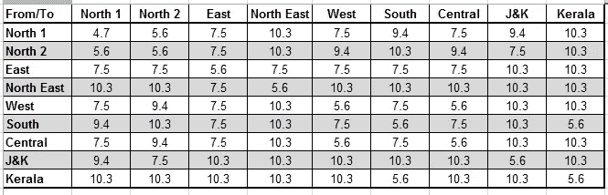
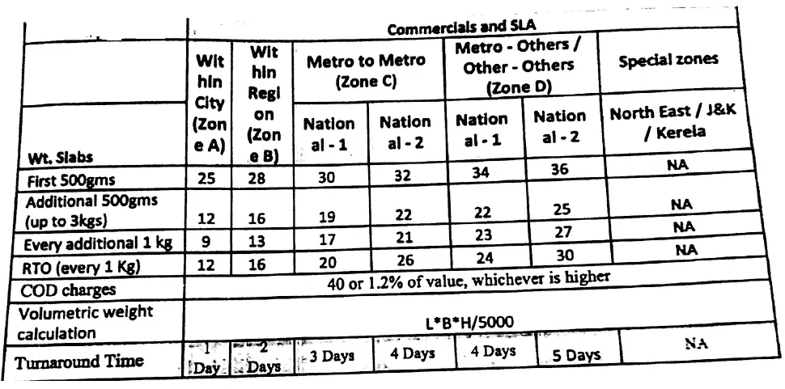
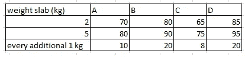
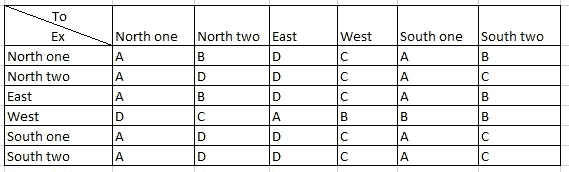

# 电子商务公司的快递选择引擎

> 原文：<https://medium.com/hackernoon/courier-selection-engine-for-e-commerce-companies-71b4450b4fab>

E [commerce](https://hackernoon.com/tagged/commerce) [公司](https://hackernoon.com/tagged/companies)通过多个快递合作伙伴向客户运送产品。他们中的大多数都有一个自动化的快递选择流程。在 IB，我们面临的主要挑战之一是不断增加的物流成本。因此，我们开发了一个系统，可以自动推荐从我们的仓库和遍布印度的卖家发货的每个包裹的快递员。对于每一家依赖多种快递服务公司来说，优化其物流成本至关重要。通过这篇文章，我想给一个简单的快递选择系统的简要概述。这个系统不必是一个网络应用程序，这甚至可以在一个基于 excel 的系统上运行，因此即使是小公司也可以利用这种方法的优势。

## **主数据**

这包括每个 LSP 的 From、To COD 和 To 预付费密码的数据，以及金额限制及其密码区域。费率表和合同中的其他条款，如 COD 费用、AWB 费用。

密码区——快递员将他们可用的密码分为不同的区域。例如东北、西部等..

## 规则

以下是为货物选择快递公司的标准

1.  适用性
2.  运费
3.  解题时间
4.  服务水平，如 RTO、损坏、运输途中丢失、货到付款、提货等

让我们详细地看一下每一步

## **1。可维护性**

该过程包括获取可维修的 LSP 列表。

对以下参数进行适用性检查

1.正在检查哪些 LSP 同时服务于从&到 pin 码。

2.检查哪个 LSP 提供包裹的货到付款/预付金额。

3.检查包裹的计费重量是否超过所选 LSP 的重量限制
**包裹的计费重量** =最大(物理重量、体积重量)

a.物理重量=“SKU 的重量”

b.体积重量= " L*b*h /体积系数(每个 LSP 有不同的体积系数。长、宽、高，单位为厘米)

4.如果 LSP 支持产品运输类别。

各种产品类型属于以下类别

*   常态
*   液体
*   绘画
*   危险品
*   脆的
*   气体

5.箱数——这适用于多部分装运的情况，其中单一产品以多个包装装运。这里，单个 AWB 将具有多个盒子。并非所有物流服务提供商都支持多件装运

## 2.运费

虽然成本不是选择 LSP 的唯一标准，但它是最重要的参数之一，因为它的降低可以大大提高每包的净收入。目前，大多数电子商务公司向客户收取象征性的运费。然而，实际运费会有所不同。这可能高达产品价值的 80%。我甚至见过运费高于产品价值的情况。运费成本优化可能会产生重大影响，尤其是在 B2B 电子商务中，产品尺寸变化很大(从小盒螺钉到大型项目，如太阳能电池板和重型机械)。

每个物流服务提供商根据签订的合同共享一个费率表。

下面是一些抽样率图表。

Fig. 1 Rate Chart type 1

Fig.2 Rate Chart Type 2

联邦快递、Bluedart 等。有类型 1 比率图表。Delhivery 有类型 2 费率表。其他一些快递公司，如 Safexpress，有第三种费率表，如下所示

Fig.3 Rate Chart type 3

Fig.4 Zone Matrix

费率表——物流服务提供商根据费率组制定适用于公斤平板的统一费率，从而制作费率表。参考图 3

区域矩阵——该矩阵定义了适用于货物从一个区域移动到另一个区域的费率组。参考图 4

类型 3 类似于类型 1。这里的不同之处在于，他们没有直接提及从/到区域的每公斤费率，而是给出了重量板和重量组的统一费率。然后在区域矩阵中提到这个比率组。

在这里，我们可以采用类型 3 的情况来计算运费，因为类型 1 和类型 2 的图表可以构造成适合类型 3。

费率表和区域矩阵用于计算基本运费。根据合同，运费中将包含其他费用。以下是这些费用的清单。

*   COD 费用-最大值(最小 COD 费用，占发票价值的百分比)
*   AWB 费用-固定金额
*   燃油附加费——发票金额的%
*   按价值计算的运费(FOV)-发票的%
*   价值风险(ROV)-发票的%
*   附加费用-发票的%
*   可计费重量—最大值(最小可计费重量，最大值(物理重量，体积重量))
*   基本运费= If(可收费重量≤最大(重量板))
    {费率(费率组，重量板)
    Else
    {费率(费率组，最大(重量板))+(四舍五入((可收费重量-最大(重量板))/附加板)，*附加板收费}

注:费率组源自区域矩阵。例如，假设“自密码”属于西区，“至密码”属于东区，包裹的可计费重量为 3 千克。因此，根据图 4，适用的费率组将为“A ”,参考图 3，基本成本将为 80。

*   CAF 值=(基本运费+ COD 费用+ AWB 费用+燃油附加费+FOV+ROV+附加费用)* CAF(%)/100
*   服务税=(基本运费+ COD 费用+ AWB 费用+燃油附加费+FOV+ROV+附加费用+ CAF)*18/100

**总运费** =基本运费+货到付款费用+空运提单费用+燃油附加费+FOV+ROV+附加费用+ CAF+服务税。

由此，我们将得到所有可服务 LSP 的运费成本，并按成本的升序排列。

## 3.周转时间

每个订单可能有一个预期的交货日期。基于的历史趋势，我们可以得出一个区域到区域的 TAT 矩阵。我们可以选择在 TAT 中定义一个正偏差，它可以在全局级别或程序包级别被允许。或者我们使用

## 4.服务水平，如 RTOs 率、损坏、运输途中丢失、货到付款 TAT、提货 TAT 等。

服务级别参数可以用于导出每个 LSP 的性能等级。一个简单的评级公式如下所示

LSP 的评级=((1- ((RTO 案例+损坏案例+运输途中丢失)/过去 3 个月的总运输次数))+(1/平均 COD 汇款 TAT)+(1+平均提货 TAT))*100

你可以根据自己的选择给每一个项目更多的权重。

**您可以根据单个标准选择快递公司，也可以综合使用所有标准。**

*原载于 2017 年 11 月 8 日 www.abhilashjohn.com**的* [*。*](https://abhilashjohn.com/articles/2017-11/Courier-selection-E-commerce)