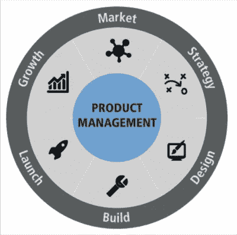

# 破解谷歌面试

> 原文：<https://medium.com/hackernoon/cracking-the-google-pm-interview-a0f6077c7389>

Source: Product Management Festival.

作为一家 501(c)(3)非营利组织[推进女性参与产品(AWIP)](http://www.advancingwomeninproduct.org) 的创始人，我经常被要求就如何赢得 PM 面试或谷歌面试给出建议。因此，通过这篇文章，我希望实现这两个目标，并分享我在任职期间接受 50 多次谷歌采访后获得的一些见解/知识。

*强制性免责声明:以下所有想法/评论都是我自己的，并不反映谷歌或 greater Alphabet 的观点。*

**开始，谷歌面试**:谷歌以只雇佣精英中的精英而自豪。在我的入职培训中，我清楚地记得入职培训负责人说，“我们平均每年收到 400 万份简历，但我们只收了大约 4000 份。”(虽然那是在 2014 年，但我相当有信心，这一比率一直保持不变。)所以这是一个 0.001，或 0.1%的机会从一份冰冷的简历中得到一份工作…那么为什么要这样做呢？嗯，因为你将有一生的机会与这个星球上最聪明、最敏锐、最脚踏实地的人一起工作。

根据角色类型的不同，准备工作可能会有很大的不同，但在大多数情况下(以及我作为面试官坐在桌子另一边的面试)，谷歌的角色分为工程和全球业务组织(或 GBO)(例如，业务分析师、业务运营等)。).我不会在这里讨论工程，因为那里有大量的编码面试学习指南(提示:不要忘记你的大 O 符号概念)。然而，作为一名前顾问，我会对那些想去 GBO 工作的人说，记得回顾你的框架，并准备好评估问题(例如，经典的，一架波音 747 能装多少高尔夫球)。

1.  **(甚至在面试前)获得推荐**！当你可以通过让一个谷歌人(一个谷歌员工)推荐你来大幅增加你获得第一个招聘人员筛选的机会时，为什么要面对 1/1000 的几率呢？所以，走出去，探索你的社交网络(如果你已经在旧金山湾区，或者住在有谷歌办公室的地区，比如西雅图、波士顿、加州，这就容易多了)，找到一个你可以联系的谷歌人，让他/她推荐你！不能保证，但你收到招聘人员邮件联系并谈论空缺职位的几率要高得多。
2.  了解这个职位:这应该是一个显而易见的问题，我不想在这里列出来，但事实上，你会惊讶于我在谷歌参加的多少面试中，应聘者根本不知道这个职位需要什么，也不知道这个职位会与哪些利益相关者打交道。话虽如此，这些候选人并没有入选——但这也回避了一个问题，为什么*不想*你想了解关于你将与之共事的角色、团队和跨职能团队的任何事情和一切？即使你得到了这份工作，一旦你接受了，你还是得和这些人一起工作。因此，简而言之，尽你所能阅读所有关于角色、团队的职责，尤其是团队最近的产品发布和/或发布的任何更新。希望这些问题会在面试中出现。
3.  **描绘出你的核心能力**:在给我们的候选人打分时(我不会说得太详细，因为谷歌的评分系统是完全专有的)，我们通常会根据他们的智力、功能能力(他们能做好工作的程度)和情商(他们处理困难情况或与同事/上级冲突的能力)来给他们打分。我通常告诉面试候选人或有希望的人的是，确保他们有 ***3 个可靠的故事*** 可以在面试中分享，并熟读[明星方法](https://theinterviewguys.com/star-method/)。为了简洁起见，我将让读者去链接(或大量关于它的在线链接)并在他们自己的时间阅读。回到你必须准备的 3 个故事，候选人应该(毫无疑问)选择适合 STAR 方法的故事，并强调面试官正在寻找的每个核心能力。如果你没有 3 个故事，那很好——但最好是一个大故事，可以让你的面试官了解你是如何处理所有这些不同情况的，但也为每个问题提供新的材料，这样谈话就不会变得乏味，如果你重复相同的故事，就会发生这种情况。
4.  **保持冷静:**尽管这不再是普遍的做法(或者可能是……)，谷歌仍然会偶尔给出一些脑筋急转弯的问题。我有时这样做只是为了确保候选人在不确定的情况下保持冷静(我保证我没有从中获得任何乐趣，只是为了评估候选人是否能很好地处理压力)。一个人根本不可能准备好世界上所有的脑筋急转弯，但一个*可以*训练自己在压力下保持冷静，并讨论解决方案/或者如果你无法找到解决方案，通过*讨论你将如何解决它*。有时候我们并没有在寻找正确的答案；我们只是想知道 1)这是否让你感到不快，以及 2)你的思考是否合乎逻辑。但是这里有一个给那些想知道…'你能给我一个脑筋急转弯的例子吗？'

> 楼上有 3 个灯泡，楼下有 3 个——每个开关连接一个灯泡。如果你在扳动一个开关/开关组合后只能上楼一次，你怎么算出哪个开关通向哪个灯泡？(答案请访问 www.advancingwomeninproduct.org 的 AWIP 网站:，并在那里给我留言！)

5.**做谷歌！是什么…？是的，谷歌寻找的最后也可能是最重要的东西是“谷歌性”因素。还记得谷歌的座右铭“不作恶”吗？没错。这不是我能教你的，但一般来说(我也希望)大多数人会在面试中通过他们的举止或经历表现出来。这意味着，你会为了帮助一个同事解决一个棘手的问题而熬夜到很晚吗？小到你会在咖啡馆里自己收拾干净吗？我不得不说，在我工作过的所有“大”公司中，谷歌的招聘流程无疑是最好的(对我来说，这包括 2 次电话面试和 1 次现场面试，其中包括 6 次连续面试和 1 次午餐面试)，他们的一丝不苟显示了他们带来的新员工的质量。**

现在谈谈 PM 特有的面试技巧。

1.  **了解你的产品**:无论产品是消费类、医疗保健类、硬件类还是后端基础设施类，你都应该很好地了解产品是什么，产品是如何开发的，以及你将如何对其进行改进(或添加到现有的愿景/路线图中)。这只是最基本的。在面试中真正出色的候选人是那些让我带着对产品的有趣见解或我以前没有想到的潜在缺点离开面试的人。这些是啊哈！当我们(作为面试官)事后填写面试反馈时，关于该候选人的突出时刻。你想成为给人留下深刻印象的候选人，尤其是当你的面试官一周要面试 5-6 次的时候:)。
2.  **表达产品意识:**这是我告诉许多考虑从事或重新从事产品管理的风险投资人的事情，但也是我将向更广泛的受众强调的事情。了解你面试的产品与市场上的竞争对手相比如何，是向面试官展示你对该产品有独特见解的好方法(并且具备成为一名有远见的产品经理的素质)。举个例子，WhatsApp 是脸书投资组合中的热门产品，但他们需要获得更多的客户(这些客户目前集中在欧洲)，而且似乎缺乏 Messenger 中存在的共同功能。所以，如果你是项目经理候选人，你能告诉我这些功能是什么，你会把哪些(特定的，或者全部)功能添加到 WhatsApp 中，以建立在脸书保护伞下的用户基础上，而不蚕食(或者如果蚕食是一种方式，告诉我为什么)Messenger？你认为这个产品有哪些优点和缺点？你如何将 WhatsApp 与其他消息或协作工具进行比较？谁是理想的用户群？我可以继续说下去，但你明白了——从大处着眼，全方位考虑产品……这就是你想成为项目经理的原因，对吗？
3.  我知道候选人的技术能力各不相同。就我个人而言，我曾与一些历史或英语专业的优秀项目经理合作过，但他们都表现出一个共同的特点——他们很想知道产品是如何工作的，并且非常信任和理解他们团队中的工程师。工程师是最聪明的人之一，但是如果你没有他们的尊重，你将不会成为一个成功的项目经理。句号。没有计算机科学学位，你怎么能做到呢？好吧，你可能不需要在面试中编码(虽然这真的因项目经理角色的类型而异，一些基础设施角色会要求项目经理编码或编写伪代码)，但试着思考一个实际的谷歌项目经理面试问题:“当你在浏览器中键入 google.com 并按 enter 键时会发生什么？”对于那些不会自动跳转到 DNS 查找、TLS 握手和 HTTP 协议的人来说，这里有一个很好的[指南](https://github.com/alex/what-happens-when#http-server-request-handle)有人把它们放在 Git 上。通过至少拥有一些基本的技术敏锐度，你也可以在与你的工程师交谈或安排产品发布时更加自信。
4.  **成为领导者**:有些人害怕在面试中使用白板。我很享受这一点——因为我喜欢把我想到的一切都画出来，尤其是如果这是一个宽泛的问题，比如“告诉我你最喜欢的产品，以及你喜欢/不喜欢它的什么”，这真的有助于有一个空白空间，你可以在那里为功能/线框画圈(或者框，如果你愿意的话)。通过这样做，你在面试中看起来更像一个领导者——因为对于项目经理来说，一个重要的品质就是成为他们产品的领导者。*注意:这并不意味着你可以对产品任意发号施令，而是说你是所有产品利益相关者的中心，你的重要职责是整合和优先考虑他们所有的声音…并使之成为一个一致的声音。*在描述产品时要自信地说话(这更有助于展示和影响，对此我会写另一篇博文)。

如果你能掌握这四点，以及我之前提到的关于谷歌面试的几点，我认为你已经走上了成功之路！当然，一个人准备 PM 面试(或其他任何面试)的最好方法是和已经在这个岗位上的人交谈，并从该领域的领导者那里获得意见。

## 因此，我鼓励那些正在阅读这篇文章的人来参加 AWIP 的下一场活动，“如何破解项目经理访谈”，由亚马逊 Alexa 首席项目经理[苏迪普·沙阿](https://www.linkedin.com/in/sudipshah)主讲。如果你有兴趣成为一名项目经理，或者在你的职业生涯中成长，请加入我们的社区:【www.advancingwomeninproduct.org 。