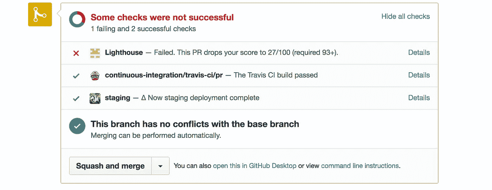
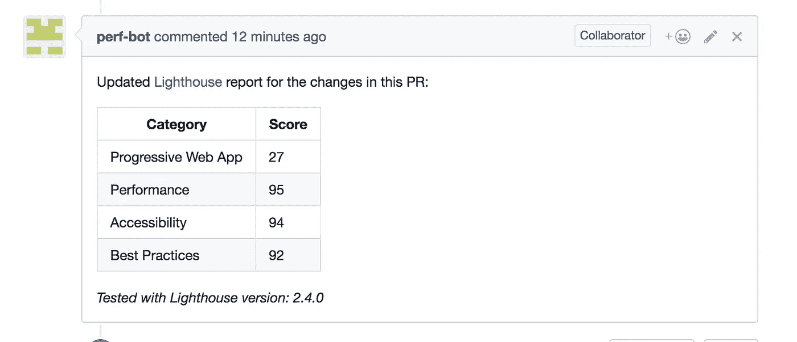

# 制作 PWA:第 1 部分——建立开发工作流程

> 原文：<https://medium.com/hackernoon/crafting-a-pwa-part-1-setting-up-the-development-workflow-705337695748>

T2:PWAs 已经流行了一段时间了。精心打造一个好的、表演性的体验是一个持续的旅程。

> 因此，在开始 [PWA](https://hackernoon.com/tagged/pwa) 旅程之前，我们应该花时间建立开发工作流程。

> 这将伟大的应用程序与曾经伟大的应用程序区分开来。

例如，让我们考虑一个 [GitHub 仓库](https://github.com/ankeetmaini/react-hn)，它实现了黑客新闻前端。这不是 PWA**还不是 。它是由 [React](https://hackernoon.com/tagged/react) 和 Redux 组成的。**

我希望从现在开始，对这个存储库的每个拉请求都进行性能问题的测试和审计。

我该怎么做？使用 CI 服务器，如 [Travis](http://travis-ci.org) 。通过 Travis，我们将增加对 lint 检查、自动阶段部署、使用 lighthouse 进行审计的支持，并且可以随时对应用程序上发生的变化进行绝对控制。

## 步骤 1 —添加 Travis CI

转到您的个人资料页面，为您的存储库启用 Travis CI


一旦您启用了这个开关，您就需要添加一个`.travis.yml`来指导 Travis 在构建的不同阶段做什么。

上面是一个简单的对 PR 运行 lint 检查的`.travis.yml`。

## 步骤 2:添加阶段部署

1.  能够看到运行中的代码变更有助于评审者自信地合并您的变更。
2.  一旦创建了 Pull 请求，我现在将使用[将您的代码部署到一个唯一的 stage URL。您也可以使用](https://zeit.co/now)[浪涌](http://surge.sh/)。
3.  我们面临的挑战是整合 Travis 的 Now 部署，以便在创建/更新 PR 时部署新的更改，并准备好供其他审核者查看/审核。
4.  travis 是一个优秀的实用程序，现在就可以部署。now 部署的特点是— *每次您部署一个项目，now 都会为您提供一个新的、唯一的 URL。*
5.  但是 [now-travis](https://github.com/eliperelman/now-travis) 不提供保存 URL 的能力，以便我们以后可以使用它来运行 lighthouse 审计。我一会儿会谈到这一点。
6.  所以我添加了一个更改，将部署的 URL 保存到一个临时文件中，并创建了一个到目前为止还没有合并的 Pull 请求。你可以在你的设置中使用这把叉子:[https://github.com/ankeetmaini/now-travis](https://github.com/ankeetmaini/now-travis)
7.  这将把 **now-travis** 作为开发依赖项添加到您的项目中。
8.  按照[自述文件](https://github.com/ankeetmaini/now-travis/blob/master/README.md)中的说明将 now 部署与 Travis 集成。
9.  现在使用`npm start`或`npm run now-start`来启动你的应用程序。它为 now-*命令提供了优先权，因此在这种情况下将执行`now-start`而不是`npm start`。这很有用，因为在开发模式下我也会使用`npm start`，而在生产模式下我可能需要传递 NODE_ENV=production。或者你可能需要发送其他的东西。
10.  成功构建后，更新您的`.travis.yml`以运行 now-travis。请看 after _ script `*NOW _ ALIAS = react-HN-ankeemaini node _ modules/中的这行代码。bin/now-Travis-file = now _ URL*` 1

现在有了这个设置，Travis 将部署每个拉取请求。您可以在下图中看到一个临时部署已经完成。



CI checks PR for lint, deploys and audits app performance

## 步骤 3:集成 Lighthouse

1.  [Lighthouse](https://developers.google.com/web/tools/lighthouse/) 是谷歌的一个审计工具，它会根据一些分数检查你的应用程序并给它打分。
2.  持续运行这种审计是至关重要的，以便始终保持我们的应用程序快速和高性能。我们将使用 [lighthouse-ci](https://github.com/ebidel/lighthouse-ci) 将其与 Travis 集成。
3.  将 [lighthousebot](https://github.com/lighthousebot) 作为合作者添加到您的知识库中，这样它就可以更新您的 PR 状态并发布带有灯塔评分的评论。
4.  [请求一个 API 键](https://github.com/ebidel/lighthouse-ci#get-an-api-key)并在 Travis 中添加一个 ENV 变量。目前还没有必要这样做，但将来会这样做。
5.  由于*现在*将我们的应用程序部署到一个唯一的 URL，我们将其保存在一个名为`now-url`的文件中。我们需要从文件中读取这个 URL，并将其作为 lighthouse-ci 的输入。
6.  为此，我在文件夹的根目录下创建了一个文件 *run-lighthouse.js* ，代码如下。 *lighthouse-ci* 采用[以下选项](https://github.com/ebidel/lighthouse-ci#options)，我们在下面的文件中传递相同的选项。

7.最后，在阶段部署完成后，在 **after_script** 部分的`.travis.yml`中添加一个条目来运行上面的文件。 *— file* 是接受文件名的参数，需要从该文件名读取部署的 URL。这会评估你的舞台部署，如果你没有通过 minScore，PR 会失败，还会发布一个带有你的灯塔分数的评论，见这个 PR[https://github.com/ankeetmaini/react-hn/pull/9](https://github.com/ankeetmaini/react-hn/pull/9)

```
./run-lighthouse.js --file=now_url
```



**恭喜你！**，你已经成功设置了一个很棒的工作流程。引用中使用的所有代码都在这里。

[1]由于 now 中的免费 OSS 计划一次只能有三个活动部署，您可能需要使用`now rm id`手动删除部署

[2]现在 lightousebot 将只发布一个评论，不会因为对存储库的权限不足而使您的 PR 失败，上面显示我的 PR 失败的截图是因为我运行了一个单独的 lighthouse-ci 实例用于演示目的。[详见本期](https://github.com/ebidel/lighthouse-ci/issues/8)