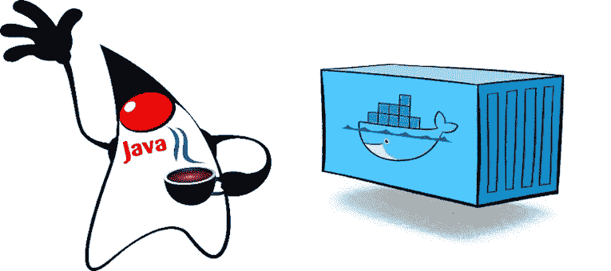

# 打造完美的 Java Docker 构建流程

> 原文：<https://medium.com/hackernoon/crafting-perfect-java-docker-build-flow-740f71638d63>

> 在 Docker 容器中，你至少需要**构建**、**测试**和**运行**我的 Java 应用程序？
> 
> ***菜谱:*** *为每个步骤创建一个单独的 Docker 映像，并优化您运行它的方式。*



# 介绍

我在 1998 年开始使用 [Java](https://hackernoon.com/tagged/java) ，在很长一段时间里，它是我主要的[编程](https://hackernoon.com/tagged/programming)语言。这是一段漫长的又爱又恨的关系。

在我的工作生涯中，我用 Java 写了很多代码。尽管如此，我不认为 Java 通常是编写运行在 Docker 容器中的微服务的正确选择。

但是，有时你必须使用 Java。也许 Java 是您最喜欢的语言，但您不想学习新的语言，或者您有需要维护的遗留代码，或者您的公司决定使用 Java，而您没有其他选择。

不管你有什么理由 ***要和码头工人*** 结婚，你最好 ***做好*** 。

在这篇文章中，我将向您展示如何创建一个有效的 Java-Docker 构建管道来一致地生成小型、高效和安全的 Docker 映像。

# 当心

有很多*“Docker for Java developers”*教程，无意中鼓励了一些 Docker 的坏习惯。

*例如:*

*   [Spark 和 Docker 教程](https://sparktutorials.github.io/2015/04/14/getting-started-with-spark-and-docker.html)
*   [面向 Java 开发人员的 Docker 简介](https://examples.javacodegeeks.com/devops/docker/introduction-docker-java-developers/)
*   [通过 Docker 引擎使用 Java](http://www.developer.com/java/data/using-java-with-docker-engine.html)
*   还有其他人…

对于当前的演示项目，前两个教程花了大约 15 分钟来构建(第一次构建)，并生成了每个大小为 **1.3GB** 的图像。

> *帮自己一个忙，不要跟着这些教程走！*

# 关于 Docker 你应该知道什么？

不熟悉 Docker 的开发人员通常会认为它只是另一个 VM。而是把 Docker 想象成一个“子进程”。整个 VM 所需的文件和包不同于运行 dev 机器的另一个进程所需的文件和包。Docker 甚至比子进程更好，因为它允许更好的隔离和环境控制。

如果你是 Docker 的新手，我建议你阅读这篇[了解 Docker](https://docs.docker.com/engine/understanding-docker/) 的文章。Docker 并不复杂，任何开发人员都不应该理解它是如何工作的。

# Dockerizing Java 应用程序

## Java 应用程序的 Docker 映像中需要包含哪些文件？

因为 Docker 容器只是独立的进程，所以 Java Docker 映像应该只包含运行应用程序所需的文件。

*这些文件是什么？*

它始于一个 Java 运行时环境( **JRE** )。JRE 是一个软件包，拥有运行 Java 程序所需的一切。它包括 Java 虚拟机( **JVM** )的实现和 *Java 类库*的实现。

我推荐使用 [OpenJDK](http://openjdk.java.net/) JRE。OpenJDK 是在 [GPL](https://en.wikipedia.org/wiki/GNU_General_Public_License) 下授权的，带有[类路径异常](http://www.gnu.org/software/classpath/license.html)。*类路径异常*部分很重要。这个许可证允许 OpenJDK 与任何许可证的任何软件一起使用，而不仅仅是 GPL。特别是，您可以在专有软件中使用 OpenJDK，而无需公开您的代码。

在使用甲骨文的 JDK/JRE 之前，请先阅读以下帖子:[《在 Docker 上运行 Java？你违反了法律。”](http://blog.takipi.com/running-java-on-docker-youre-breaking-the-law/)

因为很少使用标准库来开发 Java 应用程序，所以很可能还需要添加第三方 Java 库。然后将应用程序编译的字节码作为普通的 *Java 类*文件或者打包到 *JAR* 档案中。而且，如果您使用本机代码，您也需要添加相应的本机库/包。

# 为 Java 应用程序选择基本 Docker 映像

为了选择基本 Docker 图像，您需要回答以下问题:

*   你的 Java 应用需要哪些原生包？
*   你应该选择 Ubuntu 还是 Debian 作为你的基本映像？
*   *您修补安全漏洞的策略是什么，包括您根本不使用的软件包？*
*   你介意为网络流量和未使用文件的存储支付额外费用(金钱和时间)吗？

有些人可能会说:*“但是，如果你所有的图像共享相同的 Docker 层，你只需下载一次，对吗？”*

理论上是*真的*，但现实中往往大相径庭。

通常，你有许多不同的图像:一些是你最近创建的，另一些是很久以前的，还有一些是你从 DockerHub 上下载的。所有这些映像不共享相同的基础映像或版本。您需要投入大量时间来对齐这些图像以共享相同的基础图像，然后保持这些图像是最新的。

也许有人会说:*“但是，谁在乎图像大小呢？我们只需下载一次，就可以永远运行。*

Docker 图像大小其实很重要。

尺寸对…有影响

*   **网络延迟** —需要通过网络传输 Docker 图像
*   **存储** —需要将所有这些位存储在某个地方
*   **服务可用性和弹性** —使用 Docker 调度程序时，如 Kubernetes、Swarm、DC/OS 或其他(调度程序可以在主机之间移动容器)
*   **安全性**——我的意思是，您真的需要 libpng 包及其所有的 [CVE 漏洞](https://www.cvedetails.com/vulnerability-list/vendor_id-7294/Libpng.html)用于您的 Java 应用程序吗？
*   **开发灵活性** —小型 Docker 映像==更快的构建时间和更快的部署

如果不小心的话，Java Docker 图像会变得非常大。我见过 3GB 的 Java 映像，其中真正的代码和所需的 JAR 库只占用大约 150MB。

考虑使用 [Alpine Linux 映像](https://hub.docker.com/_/alpine/)，它只是一个 5mb 的映像，作为基本 Docker 映像。许多“官方码头工人图像”都带有阿尔卑斯山的味道。

**注意**:很多但不是所有的 Linux 包都有用`musl libc` C 运行时库编译的版本。有时候你想用一个用`glibc` (GNU C 运行时库)编译的包。 [frolvlad/alpine-glibc](https://hub.docker.com/r/frolvlad/alpine-glibc/) 镜像基于 alpine Linux 镜像，包含`glibc`以启用专有项目，针对`glibc`编译(例如 OracleJDK、Anaconda)，在 Alpine 上工作。

# 选择正确的 Java 应用服务器

通常，您还需要公开某种接口来访问运行在 Docker 容器中的 Java 应用程序。

当您使用 Docker 容器部署 Java 应用程序时，默认的 Java 部署模型会发生变化。

最初，Java 服务器端部署假设您已经预先配置了一个 Java Web 服务器(Tomcat、WebLogic、JBoss 或其他)，并且您正在将一个应用程序 **WAR** (Web Archive)打包的 Java 应用程序部署到此服务器上，并将其与其他应用程序一起运行，部署在同一服务器上。

围绕这个概念开发了许多工具，允许您在不停止 Java Application 服务器的情况下更新正在运行的应用程序、将流量路由到新应用程序、解决可能的类加载冲突等等。

通过基于 Docker 的部署，您不再需要这些工具，甚至不需要庞大的“企业就绪”Java Application 服务器。唯一需要的是一个稳定且可扩展的网络服务器，它可以通过 HTTP/TCP 或您选择的其他协议为您的 API 提供服务。在谷歌上搜索[“嵌入式 Java 服务器”](https://www.google.com/search?q=)，然后选一台你最喜欢的。

在这个演示中，我分叉了 [Spring Boot 的 REST 示例](https://github.com/khoubyari/spring-boot-rest-example)，并对其进行了一些修改。演示使用的是带有嵌入式 Tomcat 服务器的 [Spring Boot](https://projects.spring.io/spring-boot/) 。这是我在 GitHub 存储库(`blog`分支)上的[分叉](https://github.com/alexei-led/spring-boot-rest-example)。

# 构建 Java 应用程序 Docker 映像

为了运行这个演示，我需要用 JRE、编译和打包的 Java 应用程序以及所有第三方库创建一个 Docker 映像。

这是我用来塑造码头工人形象的“T1”。这个演示 Docker 映像基于带有 OpenJDK JRE 的 slim Alpine Linux，并且包含应用程序 WAR 文件及其嵌入的所有依赖项。这只是运行演示应用程序所需的最低要求。

```
# Base Alpine Linux based image with OpenJDK JRE only 
FROM openjdk:8-jre-alpine # copy application WAR (with libraries inside) 
COPY target/spring-boot-*.war /app.war # specify default command 
CMD ["/usr/bin/java", "-jar", "-Dspring.profiles.active=test", "/app.war"]
```

要生成 Docker 映像，请运行以下命令:

```
$ docker build -t blog/sbdemo:latest .
```

对已创建的 Docker 图像运行`docker history`命令将允许您查看构成该图像的所有层:

*   **4.8MB** Alpine Linux 层
*   **103MB** OpenJDK JRE 层
*   **61.8MB** 应用 WAR 文件

```
$ docker history blog/sbdemo:latest 
IMAGE CREATED CREATED BY SIZE COMMENT 
16d5236aa7c8 About an hour ago /bin/sh -c #(nop) CMD ["/usr/bin/java" "-... 0 B 
e1bbd125efc4 About an hour ago /bin/sh -c #(nop) COPY file:1af38329f6f390... 61.8 MB 
d85b17c6762e 2 months ago /bin/sh -c set -x && apk add --no-cache ... 103 MB 
<missing> 2 months ago /bin/sh -c #(nop) ENV JAVA_ALPINE_VERSION... 0 B 
<missing> 2 months ago /bin/sh -c #(nop) ENV JAVA_VERSION=8u111 0 B 
<missing> 2 months ago /bin/sh -c #(nop) ENV PATH=/usr/local/sbi... 0 B 
<missing> 2 months ago /bin/sh -c #(nop) ENV JAVA_HOME=/usr/lib/... 0 B 
<missing> 2 months ago /bin/sh -c { echo '#!/bin/sh'; echo 's... 87 B 
<missing> 2 months ago /bin/sh -c #(nop) ENV LANG=C.UTF-8 0 B 
<missing> 2 months ago /bin/sh -c #(nop) ADD file:eeed5f514a35d18... 4.8 MB
```

# 运行 Java 应用程序 Docker 容器

要运行演示应用程序，请运行以下命令:

```
$ docker run -d --name demo-default -p 8090:8090 -p 8091:8091 blog/sbdemo:latest
```

让我们检查一下，该应用程序是否已启动并正在运行(这里我使用的是`httpie`工具):

```
$ http http://localhost:8091/info 
HTTP/1.1 200 OK 
Content-Type: application/json 
Date: Thu, 09 Mar 2017 14:43:28 GMT 
Server: Apache-Coyote/1.1 
Transfer-Encoding: chunked 
{ 
  "build": { 
    "artifact": "${project.artifactId}", 
    "description": "boot-example default description", "name": "spring-boot-rest-example", 
    "version": "0.1" 
  } 
}
```

## 设置 Docker 容器内存限制

关于 Java 进程内存分配，您需要知道的一件事是，实际上它消耗的物理内存比用`-Xmx` JVM 选项指定的要多。`-Xmx`选项只指定最大 Java 堆大小。但是 Java 进程是一个普通的 Linux 进程，有趣的是这个进程消耗了多少实际的物理内存。

或者换句话说— *运行一个 Java 进程的* ***常驻集大小****(****RSS****)值是多少？*

理论上，在 Java 应用程序的情况下，所需的 RSS 大小可以通过下式计算:

```
**RSS** = Heap size + MetaSpace + OffHeap size
```

其中*堆外*由线程堆栈、直接缓冲区、映射文件(库和 jar)和 JVM 代码本身组成。

关于这个话题有一个非常好的帖子:[Mikhail Krestjaninoff 的《在 Docker 容器中分析 java 内存使用情况](http://trustmeiamadeveloper.com/2016/03/18/where-is-my-memory-java/)。

使用`docker run`中的`--memory`选项时，确保限制大于(至少两倍于)您为`-Xmx`指定的值。

## 题外话:使用 OOM 黑仔代替 GC

有一个有趣的**阿列克谢·希皮列夫的 JDK 增强提案(JEP)** :【艾司隆 GC】([http://openjdk.java.net/jeps/8174901](http://openjdk.java.net/jeps/8174901))。这个 JEP 提议开发一个只处理内存分配的 GC，但是不实现任何实际的内存回收机制。

这个 GC，结合`--restart` (Docker 重启策略)理论上应该允许支持用 Java 实现的“极短命的作业”。

对于对性能极其敏感的应用程序，开发人员会注意内存分配，或者希望创建完全无垃圾的应用程序——GC cycle 可能会被认为是一个实现错误，会无缘无故地浪费周期。在这种用例中，最好允许 **OOM 黑仔**(内存不足)终止进程，并使用 Docker 重启策略来重启进程。

反正 **Epsilon GC** 还不可用，暂时只是一个有趣的理论用例。

# 用构建器容器构建 Java 应用程序

正如您可能看到的，在上一步中，我没有解释如何创建应用程序 WAR 文件。

当然，还有一个 Maven 项目文件`pom.xml`，大多数 Java 开发人员应该都很熟悉。但是，为了实际构建，你需要在每台机器上安装*相同的 Java 构建工具* (JDK 和 Maven)*，在那里你构建应用程序。您需要拥有相同的版本，使用相同的存储库并共享相同的配置。虽然这是 tt 的可能，但是管理依赖于不同工具、版本、配置和开发环境的不同项目很快就会变成一场噩梦。*

如果您还想在没有安装 Java 或 Maven 的干净机器上运行构建，该怎么办？*你该怎么办？*

# Java 构建器容器

码头工人也可以在这里帮忙。使用 Docker，您可以创建和共享可移植的开发和构建环境。这个想法是创建一个特殊的**构建器** Docker 镜像，它包含了你正确构建 Java 应用程序所需的所有工具，例如:JDK、Ant、Maven、Gradle、SBT 等等。

要创建一个真正有用的 **Builder** Docker 映像，您需要很好地了解 Java 构建工具是如何工作的，以及`docker build`如何使构建缓存失效。没有适当的设计，您将会以低效和缓慢的构建而告终。

# 在 Docker 中运行 Maven

虽然这些工具中的大部分是在近一代人之前创建的，但它们仍然非常流行，并被 Java 开发人员广泛使用。

如果没有一些额外的构建工具，Java 开发生活是难以想象的。有多种 Java 构建工具，但大多数都有相似的概念并服务于相同的目标——解决繁琐的包依赖性，并运行不同的构建任务，例如，**编译、lint、测试、打包和部署**。

在这篇文章中，我将使用 [Maven](https://maven.apache.org/) ，但是同样的方法也可以应用于 [Gradle](https://gradle.org/) 、 [SBT](http://www.scala-sbt.org/) 以及其他不太流行的 Java 构建工具。

了解 Java 构建工具的工作原理以及如何对其进行调优非常重要。当创建一个 **Builder** Docker 映像以及运行一个 **Builder** Docker 容器时，应用这些知识。

Maven 使用项目级的`pom.xml`文件来解析项目依赖关系。它从私有和公共 Maven 仓库下载丢失的`JAR`文件，并且*缓存*这些文件用于将来的构建。因此，下次运行您的构建时，如果您的依赖关系没有被更改，它不会下载任何东西。

## 官方 Maven Docker 图片:该不该用？

Maven 团队提供了官方 [Docker 图片](https://hub.docker.com/r/_/maven/)。有多个图片(在不同的标签下)允许您选择一个可以满足您需求的图片。在选择要使用的 Maven 映像时，深入查看一下`Dockerfile`文件和`mvn-entrypoint.sh` shell 脚本。

有两种官方的 Maven Docker 映像:普通映像(JDK 版本、Maven 版本和 Linux 发行版)和`onbuild`映像。

官方的 Maven 镜像有什么用？

官方的 Maven 映像在容器化 Maven 工具本身方面做得很好。该图像包含一些 JDK 和 Maven 版本。使用这样的映像，您可以在任何机器上运行 Maven build，而无需安装 JDK 和 Maven。

**示例:**在本地文件夹上运行`mvn clean install`

```
$ docker run -it --rm --name my-maven-project \
    -v "$PWD":/usr/src/app -w /usr/src/app \
    maven:3.2-jdk-7 mvn clean install
```

用于官方 Maven 图像的 Maven 本地存储库位于 Docker *数据卷*中。这意味着，一旦 Maven 容器被销毁，所有下载的依赖关系**都不是映像**的一部分，而**也将消失**。如果您不想下载每个构建的依赖项，请将 Maven repository Docker 卷挂载到某个持久存储上(至少是 Docker 主机上的本地文件夹)。

**示例:**在本地文件夹上运行`mvn clean install`，并正确挂载 Maven 本地存储库

```
$ docker run -it --rm --name my-maven-project \
    -v "$PWD":/usr/src/app -v "$HOME"/.m2:/root/.m2 \
    -w /usr/src/app maven:3.2-jdk-7 mvn clean install
```

现在，让我们看看 onbuild Maven Docker 图像。

什么是 Maven `onbuild`形象？

Maven `onbuild` Docker 镜像的存在是为了*简化开发者的生活，允许他/她跳过写一个`Dockerfile`。实际上，开发人员应该编写一个`Dockerfile`，但是通常只需要一行代码就足够了:*

```
*FROM maven:<versions>-onbuild*
```

*查看 GitHub 存储库上的 onbuild Dockerfile*

```
*FROM maven:<version> 
RUN mkdir -p /usr/src/app 
WORKDIR /usr/src/app 
ONBUILD ADD . /usr/src/app 
ONBUILD RUN mvn install*
```

*…您可以看到几个带有 ONBUILD 前缀的`Dockerfile`命令。`ONBUILD`告诉 Docker 推迟这些构建命令的执行，直到构建一个从当前映像继承的新映像。*

*在我们的示例中，当您构建由`FROM: maven:<version>-onbuild`创建的应用程序`Dockerfile`时，将执行两个构建命令:*

*   *将当前文件夹(所有文件，如果您没有使用`.dockerignore`)添加到新的 Docker 图像*
*   *运行`mvn install` Maven 目标*

*`onbuild` Maven Docker 图像没有之前的图像有用。*

*首先，它从当前存储库中复制所有内容，所以如果没有正确配置的`.dockerignore`文件，就不要使用它。*

*然后，思考:*你在努力塑造什么样的形象？**

*从`onbuild` Maven Docker 映像创建的新映像包括 JDK、Maven、应用程序代码(可能还有来自当前目录的**所有文件**)和**Maven`install`阶段产生的所有文件**(编译、测试和打包的 app 加上许多您并不真正需要的构建垃圾文件)。*

*因此，这个 Docker 映像包含了所有内容，但是，出于某种奇怪的原因，它不包含本地 Maven 存储库。我不知道为什么 Maven 团队创建了这个图像。*

> ****推荐:*** *不要使用 Maven****onbuild****图片！**

*如果只是想用 Maven 工具，就用非 onbuild 镜像。*

*如果你想创建一个合适的生成器图像，我会在这篇文章的后面告诉你怎么做。*

## *Maven 缓存放在哪里？*

*官方的 Maven Docker 映像选择将 Maven 缓存文件夹放在容器之外，使用`Dockerfile`中的`VOLUME root/.m2`命令将其暴露为 Docker *数据卷*。Docker 数据卷是一个或多个容器中的目录，它绕过了 Docker Union 文件系统，简而言之:它不是 Docker 映像的一部分。*

*关于 Docker *数据卷*你应该知道的:*

*   *创建容器时会初始化卷。*
*   *数据卷可以在容器之间共享和重用。*
*   *对数据卷的更改直接在装载的端点上进行(通常是主机上的某个目录，但也可以是某个存储设备)*
*   *更新映像或保存 Docker 容器时，不会包括对数据卷的更改。*
*   *即使容器本身被删除，数据卷仍然存在。*

*因此，为了在不同的构建之间重用 Maven 缓存，将 Maven 缓存数据卷挂载到持久存储中(例如，Docker 主机上的本地目录)。*

```
*$ docker run -it --rm --volume "$PWD"/pom.xml:/usr/src/app/pom.xml \
     --volume "$HOME"/.m2:/root/.m2 maven:3-jdk-8-alpine mvn install*
```

*上面的命令运行官方的 Maven Docker 映像(Maven 3 和 OpenJDK 8)，将项目`pom.xml`文件挂载到 Maven *缓存数据卷*的工作目录和`$HOME"/.m2`文件夹中。在这个 Docker 容器中运行的 Maven 会将所有需要的 JAR 文件下载到主机的本地*

*在这个 Docker 容器中运行的 Maven 会将所有需要的`JAR`文件下载到主机的本地文件夹`$HOME/.m2`中。下次您为相同的`pom.xml`文件和相同的*缓存*挂载创建新的 Maven Docker 容器时，Maven 将重用*缓存*，并将只下载缺失或更新的`JAR`文件。*

## *Maven Builder Docker 图像*

*先来试着公式化*什么是* ***建设者*** *码头工人形象，它应该包含什么？**

> ****Builder*** *是一个 Docker 映像，它包含了* ***的所有内容*** *，允许您在任何机器上、任何时间点创建可重现的构建。**

*那么，*它应该包含什么呢？**

*   **Linux shell 和一些工具* —我更喜欢 Alpine Linux*
*   **JDK(版本)*—`javac`编译器*
*   **Maven(版本)* — Java 构建工具*
*   **应用源代码*和`pom.xml`文件/秒——是特定时间点的应用代码`SNAPSHOT`；只是代码，不需要包含一个`.git`库或其他文件*
*   **项目依赖关系(Maven 本地存储库)* —您需要构建和测试 Java 应用程序的所有`POM`和`JAR`文件，在任何时候，即使离线，即使库从网络上消失*

***构建器**映像在特定时间点捕获代码、依赖项和工具，并将它们存储在 Docker 映像中。**构建器**容器可用于在任何时间、任何机器上创建应用程序“二进制文件”,甚至在没有互联网连接(或连接不良)的情况下。*

*这是我的演示**构建器**的样本`Dockerfile`:*

```
*FROM openjdk:8-jdk-alpine 
# ---- 
# Install Maven 
RUN apk add --no-cache curl tar bash ARG MAVEN_VERSION=3.3.9 
ARG USER_HOME_DIR="/root" RUN mkdir -p /usr/share/maven && \ 
    curl -fsSL http://apache.osuosl.org/maven/maven-3/$MAVEN_VERSION/binaries/apache-maven-$MAVEN_VERSION-bin.tar.gz | tar -xzC /usr/share/maven --strip-components=1 && \ 
    ln -s /usr/share/maven/bin/mvn /usr/bin/mvn ENV MAVEN_HOME /usr/share/maven 
ENV MAVEN_CONFIG "$USER_HOME_DIR/.m2" # speed up Maven JVM a bit 
ENV MAVEN_OPTS="-XX:+TieredCompilation -XX:TieredStopAtLevel=1" ENTRYPOINT ["/usr/bin/mvn"] # ---- 
# Install project dependencies and keep sources 
# make source folder 
RUN mkdir -p /usr/src/app 
WORKDIR /usr/src/app # install maven dependency packages (keep in image) 
COPY pom.xml /usr/src/app 
RUN mvn -T 1C install && rm -rf target # copy other source files (keep in image) 
COPY src /usr/src/app/src*
```

*让我们回顾一下这个`Dockerfile`，我会试着解释每个命令背后的原因。*

*   *`FROM: openjdk:8-jdk-alpine` -选择并冻结 JDK 版本:OpenJDK 8 和 Linux Alpine*
*   *安装 Maven*
*   *`ARG ...`——使用构建参数允许用`docker build --build-arg ...`覆盖 Maven 版本和本地存储库位置(`MAVEN_VERSION`和`USER_HOME_DIR`)*
*   *`RUN mkdir -p ... curl ... tar ...` -下载并安装(`untar`和`ln -s` ) Apache Maven*
*   *把 Maven JVM 加速一点:`MAVEN_OPTS="-XX:+TieredCompilation -XX:TieredStopAtLevel=1"`，看下面的[帖子](https://zeroturnaround.com/rebellabs/your-maven-build-is-slow-speed-it-up/)*
*   *`RUN mvn -T 1C install && rm -rf target`下载项目依赖关系:*
*   *复制项目`pom.xml`文件并运行`mvn install`命令并移除构建工件据我所知，没有哪个 Maven 命令会让你不安装就下载)*
*   *只有当项目的`pom.xml`文件改变时，才会重新构建这个 Docker 图像层*
*   *`COPY src /usr/src/app/src` -复制项目源文件(源代码、测试和资源)*

***注意:**如果你正在使用 [Maven Surefire 插件](http://maven.apache.org/surefire/maven-surefire-plugin)并且想要拥有离线构建的所有依赖项，确保[锁定 Surefire 测试提供者](http://maven.apache.org/surefire/maven-surefire-plugin/examples/providers.html)。*

*当你构建一个新的**构建器**版本时，我建议你使用一个`--cache-from`选项传递先前的构建器图像给它。这将允许你重用任何未修改的 Docker 层，并在大多数时候避免过时的下载(如果`pom.xml`没有改变或者你没有决定升级 Maven 或 JDK)。*

```
*$ # pull latest (or specific version) builder image 
$ docker pull myrep/mvn-builder:latest $ # build new builder 
$ docker build -t myrep/mvn-builder:latest --cache-from myrep/mvn-builder:latest .*
```

*使用生成器容器运行测试*

```
*$ # run tests - test results are saved into $PWD/target/surefire-reports 
$ docker run -it --rm -v "$PWD"/target:/usr/src/app/target myrep/mvn-builder -T 1C -o test*
```

*使用生成器容器创建应用程序 WAR*

```
*$ # create application WAR file (skip tests)
$ docker run -it --rm -v $(shell pwd)/target:/usr/src/app/target myrep/mvn-builder package -T 1C -o -Dmaven.test.skip=true*
```

*看看下面的图片:*

```
*REPOSITORY TAG IMAGE ID CREATED SIZE 
sbdemo/run latest 6f432638aa60 7 minutes ago 143 MB 
sbdemo/tutorial 1 669333d13d71 12 minutes ago 1.28 GB 
sbdemo/tutorial 2 38634e4d9d5e 3 hours ago 1.26 GB 
sbdemo/builder mvn 2d325a403c5f 5 days ago 263 MB*
```

*   *`sbdemo/run:latest` -演示运行时的 Docker 映像:Alpine，仅 OpenJDK JRE，演示 WAR*
*   *`sbdemo/builder:mvn` - **构建器** Docker 镜像:Alpine，OpenJDK 8，Maven 3，代码，依赖*
*   *`sbdemo/tutorial:1` -根据第一个教程创建的 Docker 图像(仅供参考)*
*   *`sbdemo/tutorial:2` -根据第二个教程创建的 Docker 图像(仅供参考)*

# *好处:构建流程自动化*

*在这一节中，我将展示如何使用 Docker 构建流程自动化服务来自动化和编排本文中的所有步骤。*

# *构建管道步骤*

*我将使用[code fresh . io](https://codefresh.io/)Docker CI/CD 服务(我工作的公司)为 Maven 创建一个 **Builder** Docker 映像，运行测试，创建应用程序 WAR，为应用程序构建 Docker 映像并部署到 DockerHub。*

*Codefresh 自动化流程`YAML`(也称为*管道*)非常简单:*

*   *它包含有序的步骤列表*
*   *每个步骤可以是以下类型:*
*   *- `build` -为`docker build`命令*
*   *- `push` -为`docker push`*
*   *- `composition` -用于创建环境，用`docker-compose`指定*
*   *- `freestyle`(如果未指定，则默认)-用于`docker run`命令*
*   *`/codefresh/volume/` *数据量* ( `git clone`和步骤生成的文件)被装入每个步骤*
*   *每一步的当前工作目录默认设置为`/codefresh/volume/`(可以更改)*

*有关详细描述和其他示例，请查看[文档](https://docs.codefresh.io/docs/steps)。*

*对于我的演示流程，我创建了以下自动化步骤:*

1.  *`mvn_builder` -创建 Maven **构建器** Docker 映像*
2.  *`mv_test` -在**构建器**容器中执行测试，将测试结果放入`/codefresh/volume/target/surefire-reports/` *数据卷*文件夹中*
3.  *`mv_package` -创建应用`WAR`文件，将创建的文件放入`/codefresh/volume/target/`数据卷*文件夹**
4.  *`build_image` -使用 JRE 和应用程序`WAR`文件构建应用程序 Docker 映像*
5.  *`push_image` -标记应用程序 Docker 映像并将其推送到 DockerHub*

*下面是完整的代码更新`YAML`:*

```
*version: '1.0' steps: 
  mvn_builder: 
    type: build 
    description: create Maven builder image 
    dockerfile: Dockerfile.build 
    image_name: <put_you_repo_here>/mvn-builder   mvn_test: 
    description: run unit tests 
    image: ${{mvn_builder}} 
    commands: - mvn -T 1C -o test   mvn_package: 
    description: package application and dependencies into WAR 
    image: ${{mvn_builder}} 
    commands: - mvn package -T 1C -o -Dmaven.test.skip=true   build_image: 
    type: build 
    description: create Docker image with application WAR 
    dockerfile: Dockerfile 
    working_directory: ${{main_clone}}/target 
    image_name: <put_you_repo_here>/sbdemo   push_image: 
    type: push 
    description: push application image to DockerHub 
    candidate: '${{build_image}}' 
    tag: '${{CF_BRANCH}}' 
    credentials: 
      # set docker registry credentials in project configuration 
      username: '${{DOCKER_USER}}' 
      password: '${{DOCKER_PASS}}'*
```

*希望，你觉得这篇帖子有用。我期待您的评论和任何问题。*

**原载于*【codefresh.io/blog/java_docker_pipeline】**。***

**[](http://bit.ly/HackernoonFB)****[](https://goo.gl/k7XYbx)****[](https://goo.gl/4ofytp)**

> **[黑客中午](http://bit.ly/Hackernoon)是黑客如何开始他们的下午。我们是 [@AMI](http://bit.ly/atAMIatAMI) 家庭的一员。我们现在[接受投稿](http://bit.ly/hackernoonsubmission)，并乐意[讨论广告&赞助](mailto:partners@amipublications.com)机会。**
> 
> **如果你喜欢这个故事，我们推荐你阅读我们的[最新科技故事](http://bit.ly/hackernoonlatestt)和[趋势科技故事](https://hackernoon.com/trending)。直到下一次，不要把世界的现实想当然！**

****