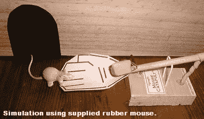

# 疯狂的想法或更好的捕鼠器…

> 原文：<https://medium.com/hackernoon/crazy-idea-or-better-mouse-trap-118f60cb11db>

## 有什么更值得投资的？

这场辩论持续不断。哪一个是更好的投资机会…一个具有巨大潜力的疯狂想法创造了一个全新的类别，还是一个“更好的捕鼠器”想法具有很高的潜力，但在一个已经被证明的现有市场中？投资者的反应无疑会因他们个人的过往记录而异。

在美国东南部，可能在其他许多地方，初创公司向投资者推销时首先会遇到的一个反对理由是市场规模。投资者因不相信企业家预测的市场规模而臭名昭著，就像企业家因高估自己的市场规模而臭名昭著一样。

虽然竞标被拒绝的原因很多，但投资者往往会因为市场规模不够大而拒绝机会。当然，在很多情况下，这个决定是有意义的。然而，我们认为，在许多情况下，市场规模根本不重要，尤其是当涉及到一开始似乎有点疯狂的天才想法时..

想想我们这个时代和过去时代的巨大胜利。优步基本上是出租你的私家车(疯狂的想法)。Twitch 正在观看一个玩视频游戏的直播流(疯狂的想法)。Air B-n-B 在你家出租一个房间(疯狂的想法)。Snap 以消失的消息为特色(疯狂的想法)。比特币、数字、无信任和匿名资产转移都是开创了一个新类别的想法的例子(也就是疯狂的想法)。

当然，钱仍有待于用许多非疯狂的、传统的想法来赚。然而，作为一名投资者，我认为最值得投资的想法是那些对我们这个社会有影响的想法。这些疯狂的想法在表面上对人们来说毫无意义。这些想法是如此愚蠢，以至于只有一群特定的疯狂的人才能真正执行它们。这些想法在开始时被人们嘲笑，当它们实现时，人们会为错过而哭泣。这些想法让我们兴奋不已，原因如下:

1.  新市场——疯狂的想法开辟了以前不存在的新市场。新的市场给新的人提供新的机会。
2.  新工作——因为疯狂的想法打开了新的市场，创造了大量的新工作。优步司机、优步车队老板、优步出租公司、优步送餐公司等。虽然很容易将所有就业机会的增加直接归因于新市场，但通常新市场的开辟会创造 3 倍的辅助就业机会。
3.  创造财富——新市场和新工作意味着一件事:创造财富。任何时候，你都可以通过你的平台，给人们创造财富的权力，你已经创造了革命性的东西。
4.  推进社会——最后，推动我们前进的是疯狂的想法，比如电力、汽车和太空探索。把天然气输送到你家是疯狂的，超级循环是疯狂的，太空电梯也是疯狂的。最后，这些想法让每个人的生活变得更好。

我们投资者可以坐在一起，谈论对大型完全发达市场的需求，但这错过了技术的要点。技术当然可以非常有效地服务于现有的大市场，但真正的力量和真正的变化在于看不见的、未开发的和不坚韧的市场。下次当你在会议中意识到这位企业家卖的东西目前没有市场时，停下来问问自己，他们是否足够疯狂，从零开始建立这个市场，或者他们只是疯了。他们疯狂的想法有可能行得通。也有可能他们也有点疯狂。然而，正如一首古老的海豹歌所唱的那样，除非我们变得有点疯狂，否则我们永远无法生存

> [黑客中午](http://bit.ly/Hackernoon)是黑客如何开始他们的下午。我们是 [@AMI](http://bit.ly/atAMIatAMI) 家庭的一员。我们现在[接受投稿](http://bit.ly/hackernoonsubmission)，并乐意[讨论广告&赞助](mailto:partners@amipublications.com)机会。
> 
> 如果你喜欢这个故事，我们推荐你阅读我们的[最新科技故事](http://bit.ly/hackernoonlatestt)和[趋势科技故事](https://hackernoon.com/trending)。直到下一次，不要把世界的现实想当然！

