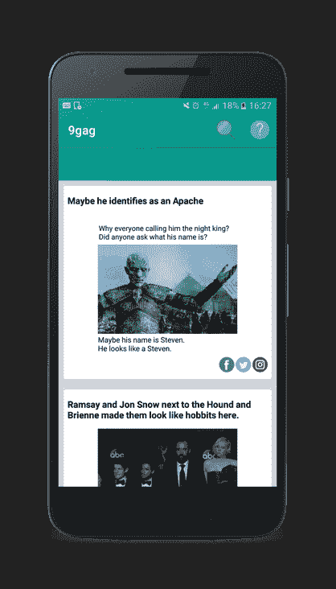
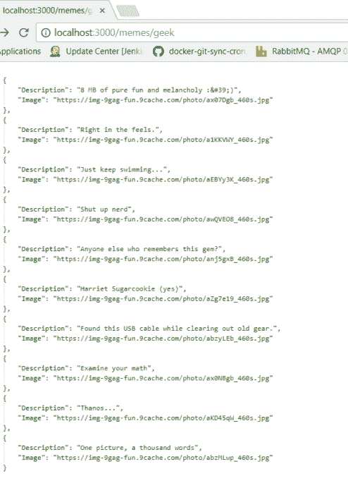
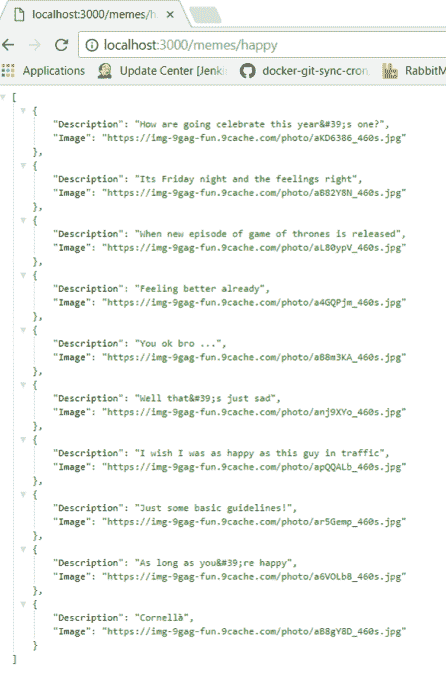
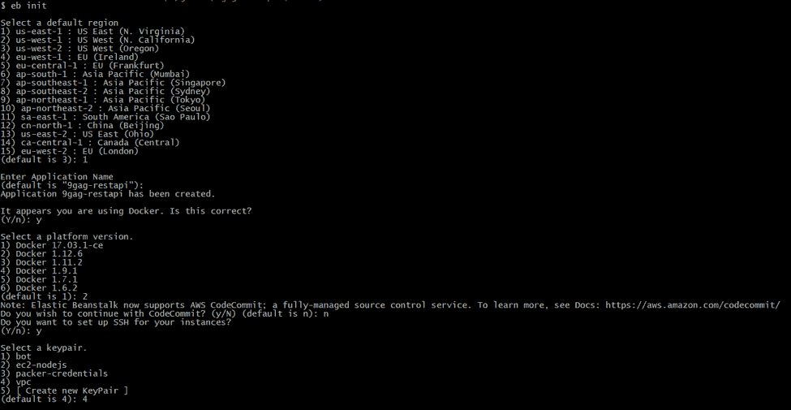
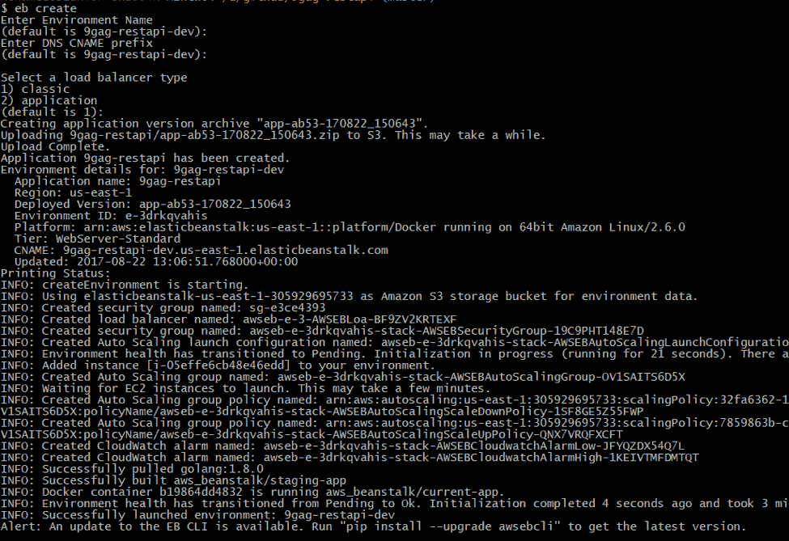
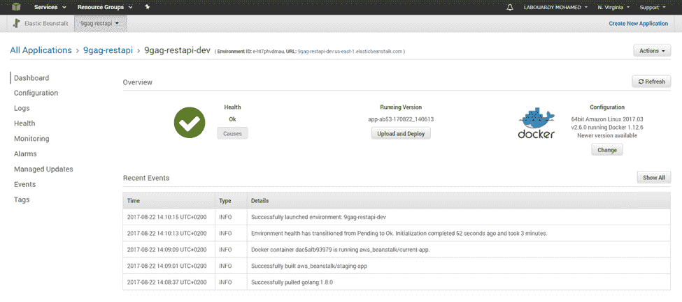
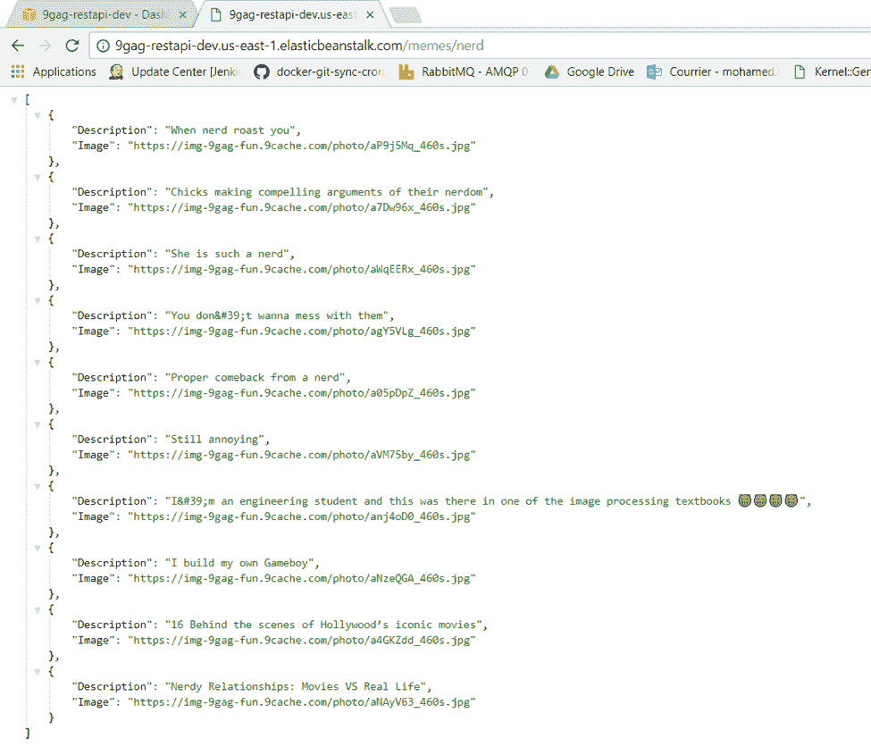
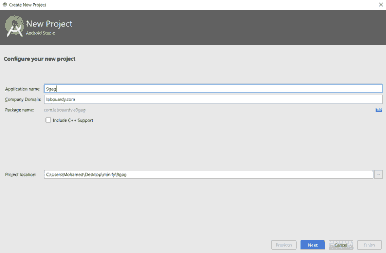
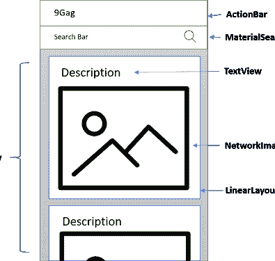

# 创建 9Gag Android 应用程序

> 原文：<https://medium.com/hackernoon/create-9gag-android-application-a845a12b95b0>

在这篇文章中，我们将学习如何创建一个 **9Gag** 应用程序，从 **Go** 中的 **RESTful API** 开始，部署到 **AWS Elastic Beanstalk** ，构建 **Android** 应用程序。

本演示中使用的所有代码都可以在我的 Github 上找到:

*   [RESTful API](https://github.com/mlabouardy/9gag-restapi)
*   [安卓应用](https://github.com/mlabouardy/9gag-clone)

**1 — RESTful API**

为了构建这个应用程序，我们需要一个 **REST API** 来浏览 **9Gag** 网站。希望我已经写了一个 [**9Gag 客户端**](https://github.com/mlabouardy/9gag) 为我们做最难的任务。因此，我们唯一需要做的就是在 Go 中设置一个 [**HTTP 服务器，它公开一个端点来通过标签获取迷因。**](http://www.blog.labouardy.com/build-restful-api-in-go-and-mongodb/)

所以一定要抓住包装:

> 去找 github.com/mlabouardy/9gag，去找 github.com/gorilla/mux

*   [**9gag**](https://github.com/mlabouardy/9gag) : 9Gag 网络爬虫
*   [**mux**](https://github.com/gorilla/mux):**请求路由器和分配器将传入的请求匹配到各自的处理程序**

**安装完依赖项后，创建一个“ **app.go** ”文件，内容如下:**

**让我们通过键入以下命令来测试一下:**

> **去运行 app.go**

**如果你把你最喜欢的网页浏览器(不是你 IE)指向[**http://localhost:3000/memes/geek**](http://localhost:3000/memes/geek)，你应该会看到:**

****

**让我们用不同的标签再试一次:**

****

****Android** 应用将消耗 **API JSON 响应**。因此 **API** 必须可以通过互联网访问。**

****2 —在 AWS 弹性豆茎上展开****

**注意:我已经做了一个关于如何使用 EB 的 [**教程**](http://www.blog.labouardy.com/deploying-node-js-application-on-aws-elastic-beanstalk/) ，所以请务必阅读它以了解更多细节。**

**我们将在一个 **Docker** 容器中部署 API。为了将服务归档，我们需要两个文件:**

****Dockerfile** :创建一个 **Docker 镜像**，包含你的源码包:**

****Dockerrun.aws.json** :在 **AWS EB** 上部署 app，告诉 EB 需要暴露哪个端口。**

**现在我们有了部署所需的所有文件。我们将使用 [**EB CLI**](http://www.blog.labouardy.com/deploying-node-js-application-on-aws-elastic-beanstalk/) ，因此通过键入如下的“ **eb init** ”开始:**

****

**然后，键入“ **eb create** ”:**

****

**一旦展开，转到**弹性豆茎仪表板**:**

****

**如果您将浏览器指向上面显示的应用程序 url:**

****

****3 —安卓应用****

**如果您已经创建了您的 **Android 项目**，那么就从下一部分开始吧。否则，在您最喜欢的 **IDE** 中创建一个新项目。我更喜欢使用 Android Studio 和 Gradle 作为构建系统，但是你也可以使用你选择的 IDE 或者 Maven。**

**于是打开 **Android studio** ，在“**快速启动**菜单下，选择“**启动一个新的 Android studio 项目**”:**

****

**首先，在您的 **build.gradle** 文件中添加项目的库:**

**我们将针对之前部署的 **API** 执行 **HTTP 请求**。执行来自一个 **Android** 应用程序的请求需要**互联网许可**来打开网络套接字。因此，请确保在您的 **AndroidManifest.xml** 文件中要求**互联网权限**:**

**将下面的*字符串*、*尺寸*、*颜色*资源添加到 **res** 目录下各自的文件中:**

**在我们开始编写代码之前，我总是从规划布局开始:**

****

**你可以注意到上面的 **main_activity.xml** 将包含 *ListView* ，*工具栏***搜索栏*。并且 *ListView* 的每一行都会有一个 *TextView* 、 *NetworkImageView* 和 *LinearLayout* 作为包装器来创建*卡片*效果。***

**让我们创建一个 xml 布局，以定制的方式显示每个 meme 项目行:**

**现在，在**适配器**包下，创建一个名为 **MemesAdapter** 的类，将 **Meme** 模型填充到 **ListView:****

**在 **utils** 包下创建一个名为 **BitmapLruCache** 的类，并添加以下代码。该类负责在磁盘上缓存网络映像以获得更好的性能:**

**我们需要定义 **API 端点**。下面的代码定义了 **MemeService** 和方法 **findByTag** 来请求给定标签的 memes 列表。 **@GET** 注释声明这个请求使用了 **HTTP GET** 方法。代码片段还说明了**改型**的路径参数替换功能的使用。在定义的方法中，当调用 **findByTag** 方法时， **{tag}** 路径将被替换为给定的变量值。**

**有一个定义好的类别**模因**。这个类是一个简单的 **POJO** ，带有*getter*和*setter*:**

**注意:注释 **@SerializedName** 用于将 JSON 属性映射到右边的实体字段。**

**现在我们已经有了所有需要的类。打开 **MainActivity** 类并添加以下代码:**

**这个类创建了**改进** **客户端**，每当用户在**搜索栏**中键入新标签时调用 **MemeService** ，并处理结果(它将 memes 列表传递给 **MemesAdapter** ，后者填充**列表视图****

**应用程序的输出如下所示:**

**本教程到此结束。在接下来的教程中，我将向你展示如何用 **JUnit** 进行**单元测试**，用 **Espresso 进行 **UI 测试**。****