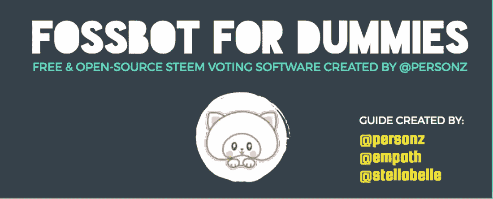
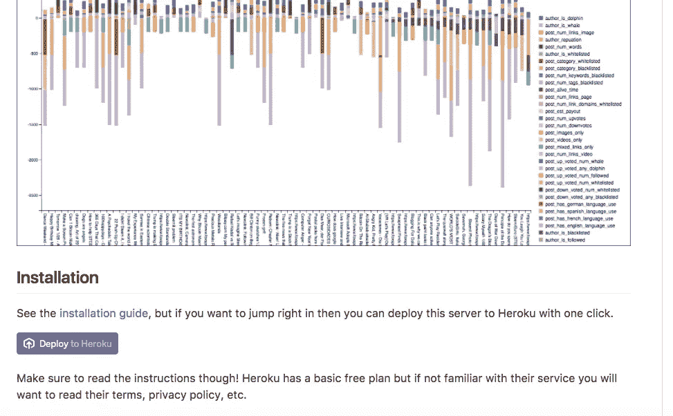

# 为 Steemit 创建一个免费的开源投票机器人

> 原文：<https://medium.com/hackernoon/create-a-free-open-source-voting-bot-for-steemit-b31155ba28f9>

你知道这个词是什么意思，但是*呢？ ***FOSS*** 代表自由、开源软件。这个由@personz 创建的 Steem 投票机器人是免费和开源的。几天前我刚刚部署了我的 ***FOSSbot*** 并且想与你分享这个不可思议的资源，这样你也能受益。我更喜欢这个投票机器人的原因是，我可以控制我的私钥，不必信任其他任何人。*

**

## *[GitHub](https://github.com/)*

## *[Heroku](https://www.heroku.com/)*

*Heroku 是一家云提供商。这意味着你不必在自己的电脑上运行你的机器人。它将在 Heroku 云上运行。当创建您的免费 Heroku 帐户时，它会询问您的信用卡信息。这是因为有些 dynos 可以在 Heroku 上花钱，但 **steem-fossbot-voter** 被设计为在免费账户内运行。即使是几份拷贝也不会闯入 Heroku 提供的付费服务。它不会使用你的信用卡，除非你手动升级你的帐户。顺便说一句，我不为 Heroku 工作。我只是一个用户。到目前为止，我使用投票机器人作为免费帐户。*

**

*在 GitHub 中，转到 [steem-fossbot-voter](https://github.com/Steem-FOSSbot/steem-fossbot-voter) 项目。*

*向下滚动，直到进入**“安装”。***

# *点击紫色按钮:**部署到 HEROKU***

**

# *填写这些字段:*

***STEEM_USER:** 在此输入您的 STEEM 帐户名称，不带@*

*你的私人发布密钥在这里*

***BOT_API_KEY:** 您的 BOT 的密码
注意:这不应该有任何空格并且是随机的，例如:
AOUNA039NA9SDJ*

## *这是您需要填写的所有信息。*

*可以将这些留空:
**EMAIL _ ADDRESS _ TO**
**EMAIL _ ADDRESS _ SENDER**
**send grid _ API _ KEY***

*您可以将这些作为默认值:
**COOKIE _ SECRET**
**VERBOSE _ LOGGING***

# *点击部署按钮*

*等几分钟。部署可能需要几分钟时间，在“部署”按钮下方，您会看到部署正在进行。给它时间来完成。如果您因为 sendgrid 而出现故障，您可以联系 Heroku 支持人员，他们会修复故障。我不得不在 Heroku 为 sendgrid 问题创建一个支持票，但是这个问题很快就解决了。*

**

*您需要派生项目的原因是为了确保当 GitHub 项目发生变化时，您的投票机器人会自动更新。*

## *返回 GitHub 上的 [steem-fossbot-voter。](https://github.com/Steem-FOSSbot/steem-fossbot-voter)*

## *在右上方你会看到一个灰色按钮，上面写着 ***叉。****

## *单击 FORK 按钮创建您自己存储库。你可以使用它为一个或多个机器人你只需要叉一次。*

## *现在它已经分叉了，您将返回 Heroku，并在仪表板中单击投票机器人应用程序的紫色六边形图标。*

## *在该应用程序的 Heroku 仪表板中，您会看到一个部署选项卡，单击它。*

## *选择 GitHub 作为部署方法，并在搜索框中键入 steem-fossbot-voter。*

## *找到存储库时选择它。*

## *要在@personz 做出更改时自动更新您的投票机器人，请向下滚动并单击“启用自动更新”。*

**

*现在你需要让你的机器人每小时投票一次，并告诉它投票给哪些作者。您的机器人的算法有许多不同的方面需要配置，但为了简单起见，我们只将机器人设置为每小时投票一次，并为某些作者投票。*

# *转到 Heroku 仪表板中的**资源**选项卡，点击 **HEROKU 调度程序。***

1.  *将打开一个新的浏览器选项卡或窗口，显示附加设置。*
2.  *点击**添加新作业**按钮。*
3.  *在文本框中输入`node bot.js`。*
4.  *从每日**到每小时*设置频率*。*****
5.  *单击保存按钮。*

*任务现在已经创建。*

# *要向投票机器人添加作者，您需要单击打开应用程序按钮*

# *然后点击编辑配置*

*将作者的名字添加到白名单中，在每个名字之间留出一个空格。*

# *你完了！*

*这是一个非常简单的教程，为了充分利用你的投票机器人，你需要实验算法的不同参数。*

## *如果你在 Steemit 上，你可以投票给@personz，他是 STEEM FOSSbot 投票者的创造者:[https://steemit.com/@personz](https://steemit.com/@personz)*

*如果你在我的指示中发现任何错误，让我知道。我一周前才部署了这个机器人，我对此非常陌生。我综合了 3 个人的指导来创建这个教程。顺便说一句，Steemit 这个星期遇到了一些技术问题，所以我建议等一等再部署你的机器人。*