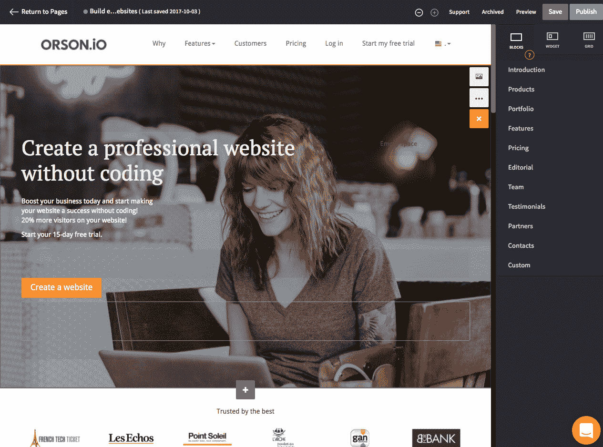
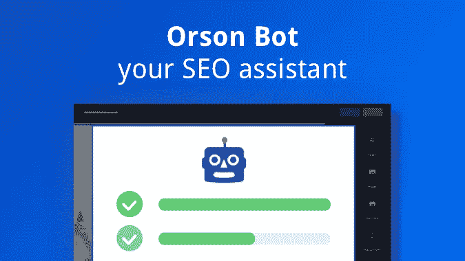
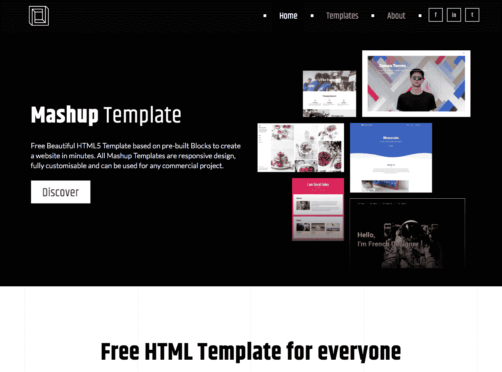

# 创建一个没有编码的专业网站，以获得更多的访问者和更多的业务

> 原文：<https://medium.com/hackernoon/create-a-professional-website-without-coding-to-get-more-visitors-and-more-business-982adb37c836>

[**奥森**](https://en.orson.io/) 帮助创业者和创意者建立高效的网站。Orson.io website creator 帮助您根据以最佳网页设计和营销原则构建的专业模板制作自己的网站。你可以通过拖拽来设计你的网站。不需要代码。创建自己的网站完全优化搜索引擎优化，并遵循网站建设者的建议，以提高您的在线知名度。

[**凯文威廉大卫**](https://medium.com/u/8ea7bd91b1a4?source=post_page-----982adb37c836--------------------------------) 采访了 [**陈子非**](https://medium.com/u/fb0b15bd38b5?source=post_page-----982adb37c836--------------------------------)[**奥森**](https://siftery.com/orson) 了解更多。

## 嗨，瑟菲，奥森是什么？

Orson 是企业家和设计师创建专业的、可见的网站的最简单的方法，不需要一行代码。

## 请多告诉我一些你想解决的问题？

互联网无处不在，然而，拥有一个漂亮且可见的网站仍然非常复杂。让网站可见应该像在 Word 或谷歌文档上编辑文档一样简单。

有一个网站是很好的，但是在搜索引擎上能看到他们的网站更好。在奥森，我们相信 SEO 是帮助他们建立一个更好的网站的答案。

## 奥森与市场上已经存在的有什么不同？

问题是，大多数中小企业甚至没有遵循适当的 SEO 的最基本的规则。

我们希望通过他们的网站和搜索引擎优化让企业家成功。Orson.io 的编辑主要关注 SEO，这要感谢 Orson Bot，它会在你创建网站的过程中为你提供 SEO 建议。

当你发布时，它会检查并确保你正确地填写了标题、描述，甚至会给你提供如何填写的精确提示。

目标受众是希望投资 SEO 并希望能够在不编码的情况下制作网站并制作动画的公司。

## 谁会利用奥森。您的客户在他们的公司中担任什么样的角色？

新企业家使用 Orson.io 来启动他们的创业公司或公司，以便收集电子邮件。已经有一个在设计或搜索引擎优化方面表现不佳的网站，并希望创建一个新网站的企业家。使用 Orson.io 创建网站的营销部门，因此他们可以自主管理，而无需致电其 IT 部门。

网络代理，自由职业者在 Orson.io 上为他们的客户创建网站，给他们未来的自主权。他们真的可以用 HTML/JS 和 CSS 定制 Orson.io 网站。

## 你的客户是如何使用奥森的？你能分享一些不同的使用案例吗？

[**法国科技**](https://siftery.com/company/lafrenchtech) 是一家法国政府组织，旨在通过 Orson.io 为其在世界各地的每个中心创建网站，从而在全世界推广创业精神。它允许他们有一个惊人的模板，每个国家的协调员可以根据他们的国家调整内容。

他们在两周内在 12 个城市推出了 12 个网站。

一些例子:

【http://www.frenchtechticket.com/ 

[http://sf.lafrenchtech.com/](http://sf.lafrenchtech.com/)

[http://tokyo.lafrenchtech.com/](http://tokyo.lafrenchtech.com/)

[**Parlons Terroir**](https://siftery.com/company/parlonsterroirs)是一家很棒的网络机构，它以绿色革命农民为目标，为他们创建令人惊叹的网站，帮助他们在全法国推广他们的新型农业服务。

[http://www.parlonsterroirs.fr/](http://www.parlonsterroirs.fr/)

[http://www.lafermedes3vaches.fr/](http://www.lafermedes3vaches.fr/)

[https://www.fermedetravailles.fr/](https://www.fermedetravailles.fr/)

## Orson 有没有你没有想到或预料到的独特用例？

过去，一些大公司与我们联系，与他们一起创建一个模板，以便他们可以向不同的特许经营商或客户提供该模板，从而统一他们的在线交流。

## 有什么早期的“成长秘诀”或策略促成了你现在的成功吗？

我们的主要增长黑客是创建与我们的业务相关的副业项目，这不仅对产品本身及其曝光率有好处，而且也是有价值的反向链接的重要来源，这只会提高我们的 SEO 排名。

到目前为止，我们已经创建了一些令人惊叹的项目:

[**混搭模板**](http://mashup-template.com/) :可以用惊人的免费 HTML5 和响应式模板投入时间编码的人

[**自举魔法**](https://pikock.github.io/bootstrap-magic/) :自举主题编辑器

[**【Logiciels Saas French tech**](https://www.logicielsaasfrenchtech.fr/):法国创业资源和工具精选列表

## 在早期构建产品时，最大的挑战是什么？你是如何解决的？

在开始构建产品时，最大的挑战之一是对我们希望用于 MVP 的特性进行优先级排序。我们没有与用户联系的工具，如 [**对讲机**](https://siftery.com/intercom) 或 [**Zendesk**](https://siftery.com/zendesk) ，所以我们在用老方法:会见我们的用户，查看他们在屏幕上做什么。

## 你加入的最有趣的整合是什么？有什么对你特别有影响的吗？

在 Orson.io 上，有相当多的用户用糟糕的图片创建了他们的网站，所以我们实现了 [Unsplash](https://medium.com/u/2053395ac335?source=post_page-----982adb37c836--------------------------------) 作为一个开放的画廊，让我们的用户可以即时访问他们令人惊叹的精选收藏系统。

我们还集成了 Google Visual API 来检查客户网站上的低质量图像，以根据他们最初的视觉内容来建议更好的图像质量。

## 在我们结束之前，你运营公司所依赖的顶级产品是什么&你如何使用它们？

[**对讲机**](https://medium.com/u/7ca8972daf76?source=post_page-----982adb37c836--------------------------------)**——**我们每天都使用对讲机进行交流，从我们的用户和客户那里获得反馈。非常棒的产品，每天都有很大的改进。

[**Slack**](https://medium.com/u/26d90a99f605?source=post_page-----982adb37c836--------------------------------) —我们不仅在内部使用，还使用我们的商业合作伙伴、网络代理和自由职业者，他们使用奥森为他们的客户创建令人惊叹的网站。我们就最佳实践、如何回答客户问题以及如何提高效率进行交流。

[**代码库**](https://siftery.com/company/codebase) —我们用来开发产品的票务系统。把产品做的很惊艳真的很棒。我们的营销和 IT 部门对这个软件非常熟悉，使用起来也很愉快。

【siftery.com】最初发表于**。**