# 用 Node 创建一个无服务器 REST API。JS、AWS Lambda、DynamoDB 和 API 网关

> 原文：<https://medium.com/hackernoon/create-a-serverless-rest-api-with-node-js-aws-lambda-dynamodb-api-gateway-f08e7111fd16>

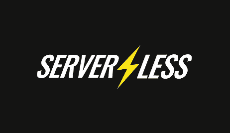

在这篇文章中，我将向你展示如何在**节点中构建一个 **RESTful API** 。JS** 遵循**无服务器**的方法，使用 **AWS Lambda** ， **API 网关** & **DynamoDB** 。

> 无服务器计算是一种云计算执行模型，其中云提供商动态管理机器资源的分配

所有代码都在我的 [**Github**](https://github.com/mlabouardy/movies-dynamodb-lambda) 上

**1 — API 规范**

REST API 服务将公开端点来管理电影商店。我们的端点将允许的操作有:

**2 — DynamoDB 表**

进入 [DynamoDB 控制台](https://console.aws.amazon.com/dynamodb/home)，点击**创建表格**按钮，填写表格名称并设置主键:

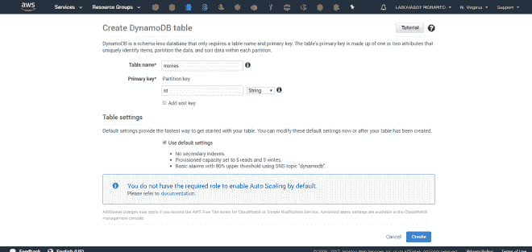

**3 —写一个新的电影 Lambda 函数**

代码是不言自明的，我使用了 *put* 方法来插入一个新的电影项目，并使用 [*uuid*](https://www.npmjs.com/package/uuid) 库来为电影项目生成一个随机的唯一 id:

转到 [Lambda 仪表板](https://console.aws.amazon.com/lambda)并创建一个新功能，如下所示:

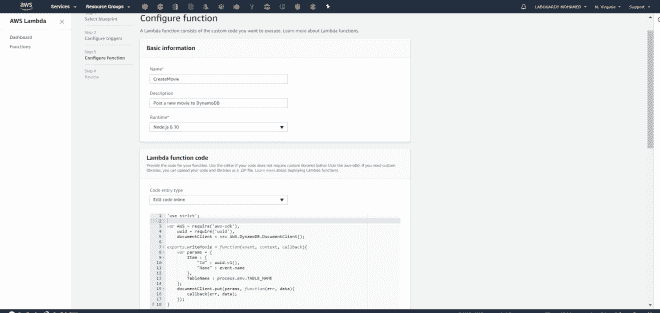

添加 **DynamoDB** 表名作为**环境变量**，并将**处理程序**名更新为上面代码中的函数名:

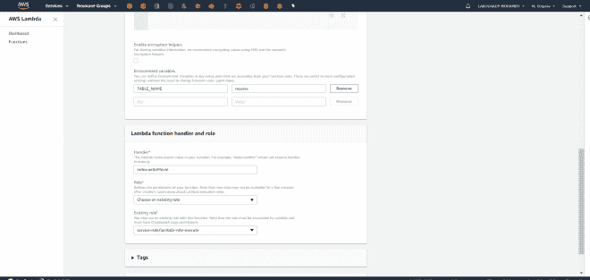

注意:你应该使用一个有权限的 **IAM 角色**来访问**DynamoDB**&**Lambda**。

创建完成后，您可以点击“**测试**”并发送如下 JSON:

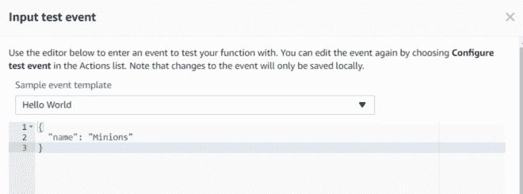

该项目已成功插入 **DynamoDB** :

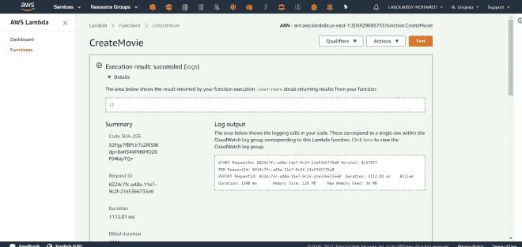

**4 —列出所有电影 Lambda 函数**

代码是不言自明的，我使用*扫描*方法从表中获取所有项目:

如下填写功能配置:

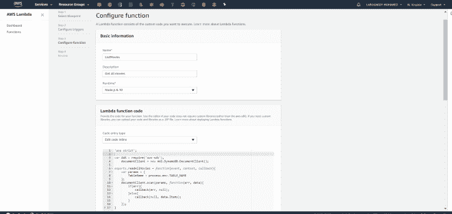

类似于 write 函数，我们需要添加 **DynamoDB** 表名作为**环境变量**:

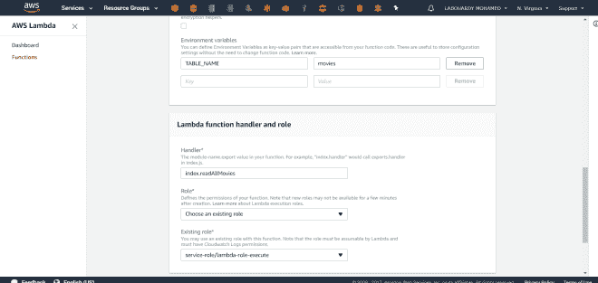

创建完成后，您可以通过点击“**测试**”按钮来测试该功能:

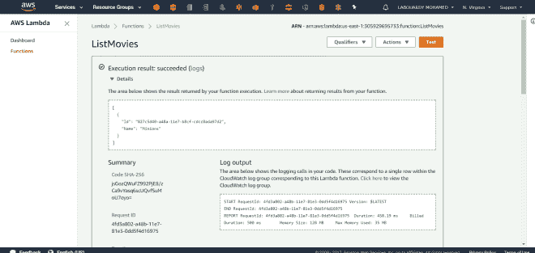

恭喜你！

我们已经成功地创建了我们的 **Lambda 函数**:

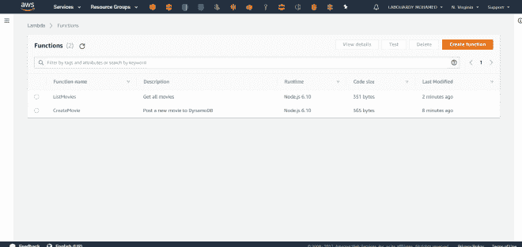

**5 —设置 API 网关**

转到 [API 网关控制台](https://console.aws.amazon.com/apigateway)并创建一个新的 API。

**5.1 —获取/电影**

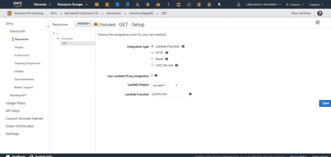

**5.2 —海报/电影**

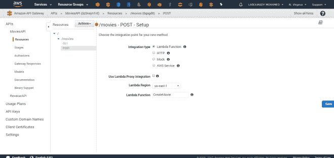

完成后，部署 API:

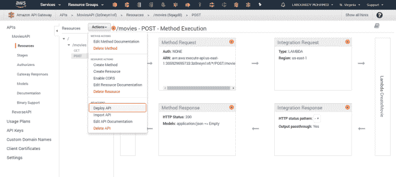

复制下 **API 调用 URL** :

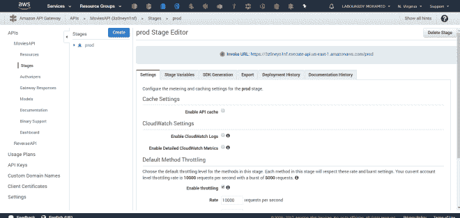

**6 —测试**

让我们来测试一下:

**6.1 —制作电影**

与**邮递员:**

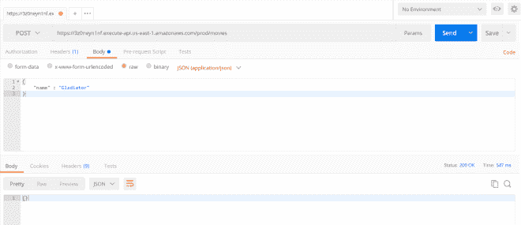

带**卷曲**:

| curl-sSX POST-d ' { " name ":" Gladiator " } '[https://3z 0 neyn 1 nf . execute-API . us-east-1 . Amazon AWS . com/prod/movies](https://3z0neyn1nf.execute-api.us-east-1.amazonaws.com/prod/movies)

**6.2 —列出电影**

同**邮递员**:

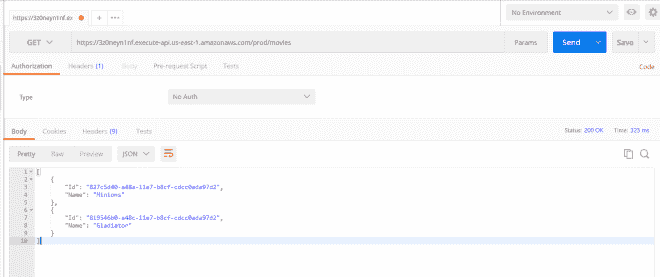

带**卷曲**:

| curl-sSX GET[https://3z 0 neyn 1 nf . execute-API . us-east 1.amazonaws.com/prod/movies](https://3z0neyn1nf.execute-api.us-east-1.amazonaws.com/prod/movies)

如果我们检查我们的 **DynamoDB 表**

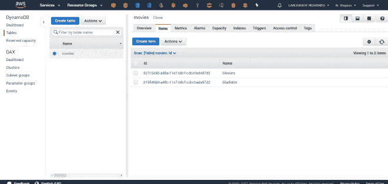