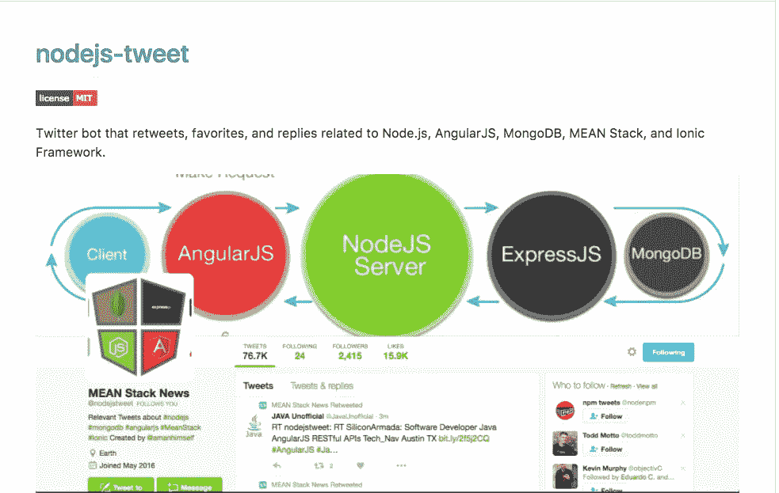

# 用 Node.js 创建一个简单的 Twitter Bot

> 原文：<https://medium.com/hackernoon/create-a-simple-twitter-bot-with-node-js-5b14eb006c08>


一个基于标签转发和回复其他用户的推特机器人怎么样？我做了一个类似的 Twitter 机器人(@ [nodejstweet](https://twitter.com/nodejstweet) )，它在一系列标签上为我提供最新或正在进行的新闻/文章/操作方法，比如#Nodejs、#MongoDB、#AngularJS、#IonicFramework 等等。当时我从没想过它会有比我更多的追随者，但这已经被超越了。



A glimpse of a Twitter Bot that I made for sole purpose of information

# 这个机器人会做什么？

这是一个简单的 Twitter 机器人，将根据 hashtags 随机转发、收藏/喜欢作为查询，我们将使用并在一定时间间隔后继续这样做。

# 你需要什么？

*   您的系统上必须安装有 [Node.js](http://nodejs.org) 。
*   一个推特账号。
*   你的机器人将使用 npm 模块`[twit](https://www.npmjs.com/package/twit)`来操作推文和流，并与 Twitter API 进行通信。

# 我们开始吧

建立一个空目录并用`$ npm init`初始化，用`package.json`文件配置这个 web 应用程序。然后在那个目录下新建两个文件:`bot.js` & `config.js`。

`bot.js`将是我们的主要应用程序文件，我们将在其中编写我们的 Twitter 机器人的源代码，因此在`package.json`中编辑`main`字段:

```
{  
  "main": "bot.js",  
},
```

您当前的目录结构应该如下所示:

```
root/project-name
|- bot.js
|- config.js
|- package.json
```

## 从 Twitter API 配置和授予权限

登录您的 Twitter 账户后，请点击此链接:[https://apps.twitter.com/app/new](https://apps.twitter.com/app/new)创建一个新的应用程序。填写表格中的必要字段，点击按钮*创建您的 Twitter 应用程序。*创建应用程序后，在导航窗格下查找“密钥和访问令牌”,点击“生成令牌操作”,然后复制:

*   消费者密钥
*   消费者秘密
*   访问令牌
*   访问令牌秘密

打开`config.js` 文件，将所有四个值粘贴到其中。使用`module.export`公开这些值:

```
//config.js
/** TWITTER APP CONFIGURATION
 * consumer_key
 * consumer_secret
 * access_token
 * access_token_secret
 */module.exports = {
  consumer_key: '',  
  consumer_secret: '',
  access_token: '',  
  access_token_secret: ''
}
```

现在，Twitter 机器人的配置步骤已经完成。*请注意，*对于每个不同的应用，`consumer key`、`consumer secret`、`access_token`和`access_token_secret`会有所不同。

# 建造机器人

既然配置步骤已经完成，现在让我们安装第三个必备组件，即节点的 [Twitter API 客户端，它将帮助我们与 Twitter API 通信，并为所有必要的操作*提供一个 API(例如转发和收藏一条推文)。*](https://www.npmjs.com/package/twit)

我们将从安装应用程序所需的依赖项开始。

```
$ npm install --save twit
```

依赖项安装完成后，转到`bot.js`文件，需要依赖项和`config.js`文件。

```
var twit = require(’twit’);
var config = require(’./config.js’);
```

将我们的 Twitter 应用程序的配置(*消费者和访问令牌*)从`config.js`传递到`twit:`

```
var Twitter = new twit(config);
```

到目前为止，一切顺利吗？

**请注意:深度参考必须参考** `[**twit**](https://www.npmjs.com/package/twit)` [**文档**](https://www.npmjs.com/package/twit) **。**

## 转发机器人

让我们编写一个函数表达式，根据作为参数传递的查询来查找最新的 tweets。我们将初始化一个包含各种属性的`params`对象来搜索一条 tweet，但最重要的是`query`或`q`属性，它们将细化我们的搜索。无论你在这个属性中输入什么值，我们的机器人都会根据这个标准搜索要转发的推文。您可以像 twitter 处理程序一样提供这个属性值，以监控特定的 twitter 帐户或#hashtag。对于我们的示例机器人，我们可以在#nodejs 上找到最新的推文。

转发机器人的功能是这样启动的:

```
var retweet = function() {
  var params = {
    q: '#nodejs, #Nodejs',
    result_type: 'recent',
    lang: 'en'    
  } 
```

另外两个属性:`result_type`和`lang`是可选的。在定义时,`result_type: 'recent'` 通知 bot 只搜索最新的 tweet，即自我们的 bot 启动或它发出最后一条转发以来的时间段内发生的 tweet。

[Twitter API](// for more parametes, see: https://dev.twitter.com/rest/reference/get/search/tweets)提供了一个参数列表。

我们的下一步是根据我们的参数搜索推文。为此，我们将使用由`twit` API 提供的`Twitter.get`函数来获取任何 REST API 端点。REST API 端点是对 T [witter API 端点](https://dev.twitter.com/docs)的引用，我们将调用它来搜索 tweets。`Twitter.get`函数接受三个参数:API 端点、params 对象(由我们定义)和一个回调。

为了发布或转发我们的机器人发现的 tweet，我们使用`Twitter.post()`方法*发布任何 REST API 端点*。它也需要和`Twitter.get()`一样多的参数。

现在，为了自动化我们上面定义的这个动作，我们可以使用 JavaScript 的定时器函数`setInterval()` 来搜索并在特定的时间段后转发。

```
// grab & retweet as soon as program is running...
retweet();
// retweet in every 50 minutes
setInterval(retweet, 3000000);
```

请注意，所有 JavaScript 的定时器函数都采用以毫秒为单位的*时间量*参数。

## 最喜欢的机器人

类似于`retweet` bot，我们可以定义并初始化另一个函数表达式，该表达式将随机搜索并*收藏*一条推文。是的，这里的区别是搜索和随机抓取推文。我们将从创建一个参数对象`params`开始，它将由三个属性组成，如`retweet()`函数表达式所示。机器人将使用由`twit` API 提供的相同的`.get()`函数来搜索推文，以获得任何 Twitter API 端点。在我们的例子中，我们需要`search/tweets`。然后，我们将在一个变量中存储搜索 tweet 到 *favorite* 的状态，在另一个变量中，我们将通过传递“搜索状态”变量作为参数来应用随机函数。

注意，我们的 bot 搜索到的 tweets 都存储在一个数组中。同样，我们使用 JavaScript 的定时器函数`setInterval()`在特定的时间段(以毫秒为单位)后搜索和收藏推文。

完整模块:`bot.js`:

## 使用

若要运行此 bot，请转到您的终端:

```
$ node bot.js
```

为了避免这种单调的过程，您可以使用`npm scripts`或`nodemon.`，您也可以在`Heroku`上部署该应用程序以实现持续集成。

要使用 npm 脚本，请在`package.json`中的`scripts`下进行编辑:

```
{
  "scripts": {    
    "start": "node bot.js",  
  }
}
```

然后从终端:

```
$ npm start
```

有各种方法来编写一个 Twitter 机器人，这只是其中一种方法。你的机器人可以很聪明，你可以用它做各种事情。你只需要参考`[twit](https://www.npmjs.com/package/twit)` [文档](https://www.npmjs.com/package/twit)中其他 RESTful API 方法来操作 [Twitter API 端点](http://REST API Endpoints: https://dev.twitter.com/rest/public)。

如需进一步阅读，请查看大量平台上各种类型的机器人的[Botwiki.org](https://botwiki.org/bots/twitterbots/)。对于高级阅读，请查看 [Botwiki 的不同编程语言的 Twitter 机器人教程列表](https://botwiki.org/tutorials/twitterbots/)。

如果您已经走了这么远，并且喜欢阅读它，请点击💚按钮。

**想收到更多像这样的文章吗？订阅我** [**这里**](https://patreon.us17.list-manage.com/subscribe?u=ad4c168a6d5bb975f2f282d54&id=39e959cecd) **。有时，我会向我的订户发送“从未见过”的内容。**

我希望这有所帮助！推特[见](https://twitter.com/amanhimself)。

[](http://bit.ly/HackernoonFB)[](https://goo.gl/k7XYbx)[](https://goo.gl/4ofytp)

> [黑客中午](http://bit.ly/Hackernoon)是黑客如何开始他们的下午。我们是这个家庭的一员。我们现在[接受投稿](http://bit.ly/hackernoonsubmission)并乐意[讨论广告&赞助](mailto:partners@amipublications.com)机会。
> 
> 如果你喜欢这个故事，我们推荐你阅读我们的[最新科技故事](http://bit.ly/hackernoonlatestt)和[趋势科技故事](https://hackernoon.com/trending)。直到下一次，不要把世界的现实想当然！

