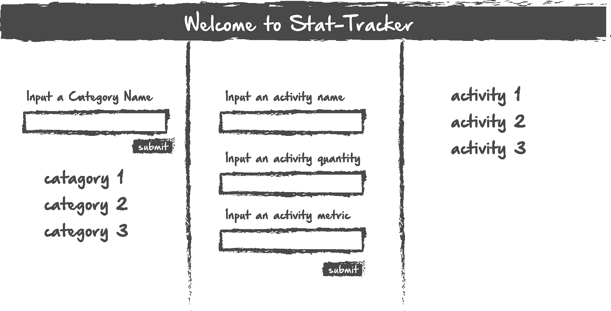
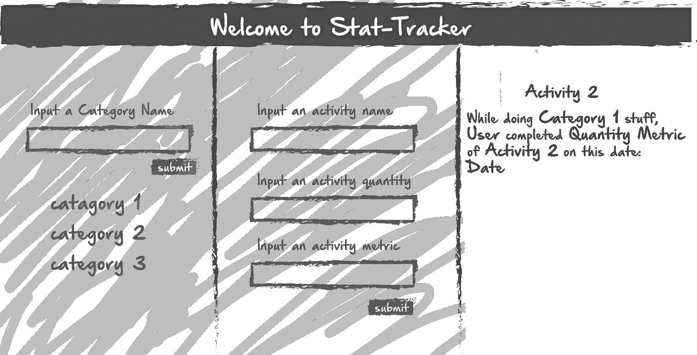
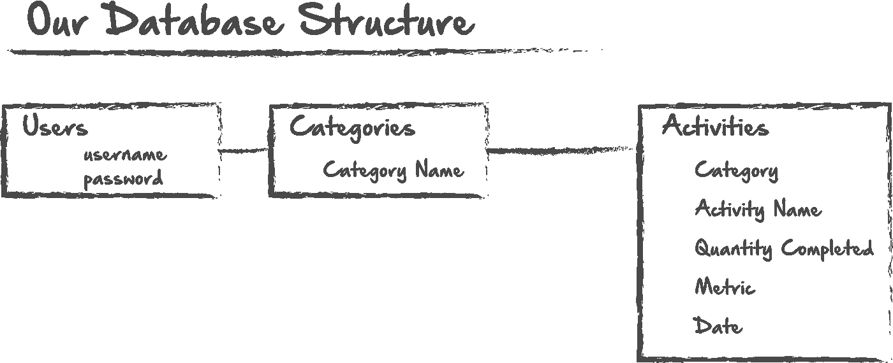
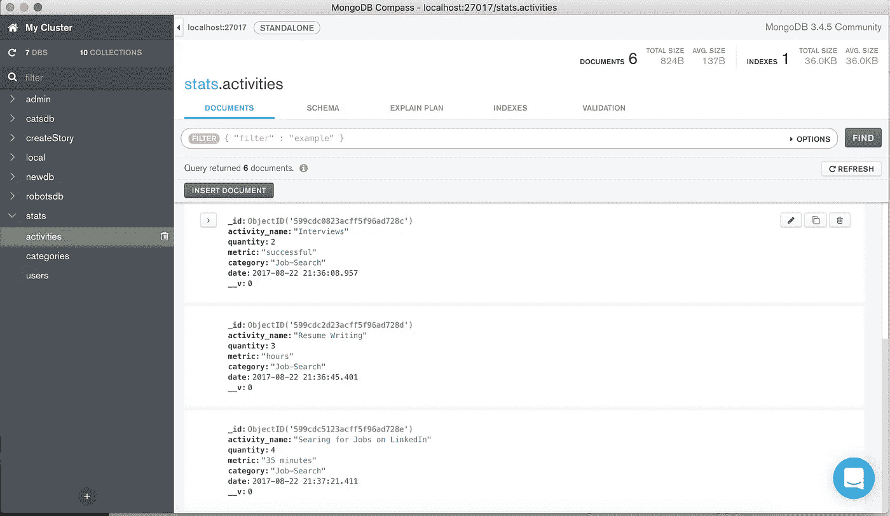

# 组合技术:MongoDB 和 NodeJS

> 原文：<https://medium.com/hackernoon/create-a-stat-tracker-app-1af88abc3165>


在这篇姗姗来迟的博文中，我将介绍创建一个基本的统计跟踪应用程序的过程。在这篇文章中，我将介绍以下技术:

1.  节点. js
2.  Mustache.js
3.  猫鼬
4.  MongoDB

我们想要做的是使用 node 来创建 api 端点，我们可以用它来读写我们的 Mongo 数据库。我们将使用 Mustache 在我们需要的特定页面上显示来自数据库的信息。

您可能会问自己，“我用这样的应用程序做什么？”作为一个完全假设的例子，假设你刚从为期 12 周的紧张的编程训练营毕业，需要一种有效的方法来跟踪你发出的简历和你参加的面试。

在我们真正开始任何编码之前，用白板写出我们想要的样子是个好主意，这样我们就可以想象我们需要什么输入，以及我们的数据库结构应该是什么样子。我的设想在哪里，我将在这篇文章中尝试创造什么:



我想基本上是三栏，一边是我们的类别输入。当我们输入一个新的类别时，我希望它动态地出现在输入的下方。我们将为此创建一个 API 端点，然后通过 Mustache 显示它。我们还希望一个活动与一个类别相关联。由于我们使用的是基于文档的数据库，这可能会比较棘手。因此，为了让我们的生活更简单，我们将强制用户在创建活动之前选择一个类别，或者输入一个新的类别。这样，一旦到达第二个端点，我们就可以从参数中获取类别。最后，我们将在最后一列中列出活动。我想在这里列出我们正在跟踪的所有活动。然后，当用户选择一个类别时，它会过滤这些结果，只显示为该类别列出的活动。我们需要在该端点创建一个 find()查询来过滤我们的结果，然后还要改变 mustache 在我们的视图中显示的内容。



我的看法是，让所有内容同时可见，但每次只允许用户与一列进行交互。这样，用户永远不会觉得他们实际上是在导航到一个新的页面。我们将部分通过端点和小胡子来实现。在这里的第三个面板上，我想要一个基于文本的方法来显示每个活动的数据。类似于最右边的一栏。



下面是我们简单的数据库结构应该是什么样子。最终，我们希望将新用户与类别相关联，然后将类别与用户相关联。这是一个非常简单的一对一关系。创建关系时，基于文档的数据库可能很难使用，因此在开始之前像这样计划您的项目是一个好主意。如果看起来您将需要大量的关系和关联，那么使用关系数据库可能是一个更好的主意。

我还会包含一个到我的 github 的链接，以及一个我完成后的视频，这样你就可以看到我完成的项目是什么样子了。

好吧，那我们开始吧。一般来说，我喜欢先创建我的数据库。如果您还没有这样做，现在就开始安装 MongoDB。可以在这里找到链接:[https://docs . MongoDB . com/getting-started/shell/installation/](https://docs.mongodb.com/getting-started/shell/installation/)

# 安装并启动 Mongo

安装并启动 MongoDB 后，将 mongo shell 连接到正在运行的 MongoDB 实例。

然后，您可以使用以下命令行提示符运行 Mongo Shell:

```
mongo
```

现在，如果您已经保存了任何数据库，您可以通过键入以下命令来查看它们:

```
show dbs
```

接下来，您可以创建一个新的数据库，或者使用一个现有的数据库。这两种情况下的命令都是一样的。我想为我的统计数据创建一个数据库，所以我将创建一个名为 stats 的数据库。

```
use stats
```

在 mongo 中，如果有一个数据库叫做 stats，它就会切换到那个数据库。如果没有同名的现有数据库，它将创建一个。就这么简单。您应该会看到类似这样的内容:

```
switched to db stats
```

现在，通过使用以下命令，我们可以看到数据库中的任何集合:

```
show collections
```

我们还没有为我们的统计追踪器收集任何东西，所以我们将制作一些新的。集合就像关系数据库中的表，尽管它们缺乏在集合之间轻松建立关联的能力，如果您更熟悉 SQL 数据库的话，您可能已经习惯了。对于我们的 stat-tracker，我们知道至少需要 3 次收集:

1.  用户，因此我们可以作为不同的用户登录和注销。
2.  类别，因为我们可能想要跟踪不同类别的统计数据。
3.  活动。活动将是与每个类别相关联的特定活动。这似乎是一个额外的步骤，但我认为这将有助于我们保持事情的条理性。在我们的 Activities 集合中，我们将跟踪数据，例如活动名称、完成的活动数量、完成活动的日期等。

以下是我们创建这些系列的方式:

```
db.createCollection("users")
db.createCollection("categories")
db.createCollection("activities")
```

现在我们已经创建了它们，我们可以使用以下命令查看我们的集合:

```
db.activities.find().pretty()
```

的。pretty()不是必需的，但是它使查看集合中的数据变得更加容易。如果您喜欢在终端中工作，那么您可以继续返回并在终端中键入该命令，这是一个很好的习惯，以确保您想要的数据被正确地添加到数据库中。然而，我是一个非常视觉化的人，希望能够以一种更具视觉吸引力的方式来查看数据。有一些数据库可视化的程序。Robo3T 是一个不错的产品，但我也刚刚发现了一个由 MongoDB 制作的产品，名为 MongoDB Compass。到目前为止，这是我最喜欢的数据库可视化技术，所以如果你对这方面感兴趣，我建议你去下载它。您可能还会发现他们有其他一些很棒的应用程序，如用于数据库部署的 atlas。以下是您使用 Compass 可以看到的内容的截图:



# 设置我们的应用程序。Js 环境

现在我们已经完成了，我们可以在我们的文本编辑器中做剩下的工作。你可能已经注意到了，我喜欢逐步列表。所以让我们列一个我们需要做的事情的清单。

1.  创建一个 app.js 文件，我们将在其中存储所有路线。
2.  为我们的每个系列制作模型。
3.  为我们的每个模型创建 JS 文件，并将它们导入我们的 app.js 文件
4.  创建 Mustache.js 文件，我们将在其中查看所有的数据和信息。
5.  创建一个 CSS 文件来设计我们的视图。

让我们首先从 app.js 文件开始。在这里，我们将列出我们的依赖项，然后开始我们的路线。以下是我认为我们需要的依赖项:

```
const express = require('express');
const parseurl = require('parseurl');
const bodyParser = require('body-parser');
const path = require('path');
const expressValidator = require('express-validator');
const mustacheExpress = require('mustache-express');
const uniqueValidator = require('mongoose-unique-validator');
const mongoose = require('mongoose');
const session = require('express-session');
const app = express();
```

接下来，我们还需要我们的模型。我们还没有创建它们，但是我们现在可以继续并要求它们，只要确保我们在创建和导出它们时使用相同的名称。

```
const Activity = require('./models/activity');
const Category = require('./models/category');
const User = require('./models/user.js');
```

接下来，我们将设置我们的视图引擎和 app.use，用于我们的主体解析器和公共(CSS)文件:

```
app.engine('mustache', mustacheExpress());
app.set('view engine', 'mustache');
app.set('views', './views');
app.use(express.static('public'));
app.use(bodyParser.json());
app.use(bodyParser.urlencoded({
  extended: true
}));
app.use(expressValidator());
```

# 连接到 Mongo

现在我们需要将 app.js 文件连接到 mongoDB。

```
mongoose.connect('mongodb://localhost:27017/stats')
```

我们将我们的数据库命名为“stats ”,所以要确保这里的名称也是相同的。

接下来，我们将为根目录“/”创建一个 app.get，并创建一个 app.use 来测试我们的连接。最好在这里写一条 console.log 消息，让您知道您已经连接上了。

```
app.get('/', function(req, res) {
  res.redirect('/api/splash');
});app.use(function(req, res, next) {
  console.log('Great Job!  You connected, you charming, handsome fellow!');
  next();
})
```

我通常也喜欢在这里加入鼓励的信息。你可能很快就会发现，事情往往不会成功，所以在这里有一点鼓励是很好的。

在我们文件的底部，让我们继续创建一个应用程序。听着，在我们继续之前，我们可以确保一切都已连接。这将放在 app.js 的最底部，我们将在最底部为我们的应用程序包含一个导出。它应该是这样的:

```
app.listen(3000);
console.log('starting applicaiton.  Good job!');module.exports = app;
```

# 建造我们的猫鼬模型

现在，让我们考虑一下我们需要的页面和功能，这样我们就可以开始创建端点了。

1.  登录页面。在这里，用户要么登录，要么注册。登录后，我们将开始一个会话，以便保存信息。
2.  注册页面。这里，我们将创建一个新用户，并将该用户添加到数据库中
3.  登录页面。在这里，我们将启动一个会话，并将任何创建的活动与该用户相关联。
4.  创建类别页面
5.  创建活动页面
6.  查看统计信息页面。在这里，我们希望能够查看每个活动的具体数据。

如果我们愿意，我们可以添加其他功能或其他页面，但这应该让我们现在就开始。先说我们的品类和活动创建。为了做到这一点，我们可能应该首先构建我们的模型。先来看看活动。

```
const mongoose = require('mongoose');
const uniqueValidator = require('mongoose-unique-validator');let Schema = mongoose.Schema;const activitySchema = new mongoose.Schema({category: {
  type: String,
  ref: 'Category',
},
activity_name: {
  type: String,
},
quantity: {
  type: Number,
},
metric: {
  type: String,
},
date: {
  type: Date,
  default: Date.now
},
});const Activity = mongoose.model('Activity', activitySchema);
activitySchema.plugin(uniqueValidator);
module.exports = Activity
```

所以这里有几点需要指出。首先，让我们看看模型的顶部和底部。我们从要求猫鼬开始。然后我们调用变量 Schema，并将其设置为 mongose . Schema，然后我们基于 mongose . Schema 创建我们的 activitySchema。

在文件的最后，我们基本上让 Activity 成为我们正在导出的 const，它是我们的模型中包含的所有数据。请记住，Activity 是我们在 app.js 文件中需要的模型之一，所以请确保我们在这里使用了相同的名称。

介于两者之间的是我们希望包含在模型中的所有数据。我们的模型相当简单，因为我们拥有的每一项实际上只有一条信息，即数据类型。我们可以更简单地编写这一部分，如下所示:

```
activity_name: type: String,quantity: type: Number,

metric: type: String, 
```

但是从每个项目创建一个对象允许我们扩展，如果我们需要的话，可以在以后向每个对象添加数据。你可能也注意到了，我们这里有一个 category 字段，尽管我们要做一个 Category 模型。

```
category: {
  type: String,
  ref: 'Category',
},
```

这包括一个类型和一个名为“ref:”的字段。这引用了我们的类别模型，并将数据，特别是类别名称，引入到我们的活动模型中。您可以将这些数据嵌入到活动模型中，但是有时将它们分开会更方便。好了，让我们创建我们的类别模型。

```
const mongoose = require('mongoose');
const uniqueValidator = require('mongoose-unique-validator');let Schema = mongoose.Schema;const categorySchema = new mongoose.Schema({activity_type: {
  type: String,
},stats: [{
  type: String,
  ref: 'Activity',
}],
});categorySchema.plugin(uniqueValidator);
const Category = mongoose.model('Category', categorySchema);module.exports = Category
```

如您所见，我们的类别模型的设置与活动模型完全一样。同样，我们希望确保我们在 app.js 中使用的名称与我们在这里导出的名称“Category”相匹配。此外，我在这里包含了一个名为 stats 的字段，在这里我还引用了来自我们的活动模型的一组数据。我们可能还想在这里编辑我们的数据类型。我们可能宁愿用`mongoose.Schema.Types.ObjectId`来代替字符串

而且，作为一个公平的警告，我们在这里尝试做的是在文档数据库中的集合之间建立关联。这不是一件容易的事，而且经常不会如你所愿。通常，只有在进行简单的一对一关联时，才需要这样做。当试图建立多个关联或多对多关联时，基于文档的数据库会变得难以使用。

既然我们的联想很简单，那大概还行吧。但是如果你的项目需要更多的东西，那么使用 Postgres 这样的 SQL 数据库可能就不会那么令人头疼了。

好的，现在，让我们继续让我们的用户建模。它应该遵循相同的模式。

```
const mongoose = require('mongoose');let Schema = mongoose.Schema;const userSchema = new Schema({
  username: {
    type: String,
  },
  password: {
    type: String,
  },
  category: [{
    type: mongoose.Schema.Types.ObjectId,
    ref: 'Category'
  }],
})
const User = mongoose.model('User', userSchema);module.exports = User;
```

这里，我再次引用了类别模型，以便我们可以将类别与用户集合关联起来。现在我们已经有了模型，我们可以回到 app.js 文件，创建我们的 api 端点。

# 构建我们的 API 端点

1.  创建新类别

```
//====CREATE NEW CATEGORY===//app.post('/api/home', function(req, res) {
  Category.create({
    activity_type: req.body.category,
  }).then(activity => {
    res.redirect('/api/home')
  });
});
```

这是我们的第一个 app.post，我们需要用它来创建一些东西。当我们在 mustache 视图上创建表单时，我们需要确保表单也有一个 method="post "。

这个端点将是/api/home，或者基本上是我们的根页面。如果有人去“/”，我们可以将他们重定向到主页。如您所见，创建类别后，我们使用 res.redirect 将用户送回主页，或/api/home。

这里，我们使用了 mongoose 的“create”方法，它构建了一个模型，并将其保存在一个文件中。我们基本上是在说，“嘿 Node，还记得我们的分类模型吗？是的，所以，我们有一个称为活动类型的字段。我们希望用数据填充该字段。我们使用的数据，你可以在我们文档的主体中找到，在一个名为“类别”的输入字段中"

现在，我们需要记住“类别”这个名称。当我们构建 mustache 视图时，我们需要使用这个名称作为输入字段的名称，以便它们可以正确地相互连接。

2.呈现类别主页。

```
//====RENDER HOME PAGE===//app.get('/api/home', function(req, res) {
  User.find({}).then(function(users) {
    Category.find({}).then(function(categories) {
      Activity.find({}).then(function(activities) {
        console.log(activities);
        res.render('home', {
          users: users,
          categories: categories,
          activities: activities,
        })
      });
    });
  });
});
```

这是我们的 app.get，我们需要使用它来呈现数据，而不是发布数据。我们在结尾也有一个 res.render 和“home”。当我们在 mustache 中创建视图时，我们需要确保将它命名为“home.mustache ”,以便它对应于这个 res.render 方法，并且可以呈现正确的页面。

在这里，我们使用 User.find、Category.find 和 Activity.find。但是在主页上，我想显示所有的类别和所有的活动，所以我没有在任何查找的({})之间放置任何查询，以确保我获得所有的数据并在该页面上显示所有的数据。

3.创建一项活动

```
app.post('/api/:activity/:_id', function(req, res) {
  Activity.create({
    activity_name: req.body.activity,
    quantity: req.body.quantity,
    metric: req.body.metric,
    category: req.params.activity,
  }).then(activity => {
    console.log("about to log categories");
    res.redirect('/api/:activity/:_id')
  });
});
```

我们的第二个 app.post 有点复杂。对于 activity 和 id，我们的端点有更多的参数，因为我们可能需要从这里的参数中提取数据，以便我们可以填充其中的一些字段。我们再次使用 mongoose 创建方法。我们也告诉 mongoose 基本上和我们在创建类别中做的一样。我们告诉它，“嗨，猫鼬，还记得我们活动模型中的活动字段吗？它们被标记为活动名称、数量和指标。无论如何，您可以在文档的主体中找到相应的活动、数量和度量的输入字段名称。类别，但您需要从 params 获取该信息。”

现在，在创建之后，我们将把用户重定向回带有端点/api/:activity/:_id 的活动页面。

一个旁注。您可能已经注意到，在我们的活动模型中，我们有一个日期字段，但是在这里，我们不要求输入日期。这是因为在日期对象中，我们包含了一个名为“默认”的字段。默认基本上是说，如果没有日期输入，使用今天的日期，或“date.now”。你也可以用“时间戳”来写看起来更像这样:

```
date: {
timestamps: true,
}
```

date.now 还会给你一个时间戳。然而，mongoose 中的 timestamps 方法给你一个自动创建的日期和一个更新的日期。所以根据你的需要，你可以使用任何一种。

4.呈现活动页面。

```
//====RENDER ACTIVITY PAGE===//app.get('/api/:activity/:_id', function(req, res) {
  User.find({}).then(function(users) {
    Category.findOne({activity_type: req.params.activity}).then(function(categories) { Activity.find({category: req.params.activity}).then(function(activities) {
        res.render('activity', {
          users: users,
          activities: activities,
        })
     });
    });
  });
});
```

我们在这里使用 app.get，以及与我们的帖子相同的端点，因为我们还需要在这里为我们的查询拉参数。在 category 中，我们将使用 findOne 方法，因为在这里我们一次只需要一个 Category。我们将一个活动输入到一个类别中。然后我们告诉它在哪里可以找到我们想要的活动，这是在 req.params.activity 中。然后我们也做一个 activity.find，在这里我们找到所有的类别，与 params 中的活动相关联。这听起来可能有点混乱。但是这样想想。假设我们有一个分类叫做“找工作”。在这个类别中，我们希望显示它的活动，比如“发送的简历”和“面试”。我们可以在 activities 模式中包含它，而不是查询 category 模型。因为我们已经在活动模型中包含了对类别的引用，所以我们现在在活动中也有了这些信息。

在这里，我们正在渲染“活动”。因此，让我们提醒自己，当我们创建 mustache 视图时，我们需要确保文件的名称与这里的呈现位置相匹配，以便呈现正确的页面。

5.呈现特定的活动

```
//====RENDER SPECIFIC ACTIVITY===//app.get('/api/:activity', function(req, res) {
  User.find({}).then(function(users) {
    Category.findOne({activity_type: req.params.activity}).then(function(categories) { Activity.find({ activity_name: req.params.activity
    }).then(function(activities) {
          res.render('date', {
            users: users,
            categories: categories,
            activities: activities
          })
      });
    });
  });
});
```

这是另一个 app.get，为这个页面添加了一个新的端点。在这里，我们希望显示关于活动的特定数据。我们再次使用 Activity.find 从活动模型中提取数据，然后根据我们传递给它的参数查询该数据。

# 用小胡子创建视图。射流研究…

现在，在所有这些之后，我们可能想做不同的事情，比如删除或更新一个活动。但是考虑到这篇文章的长度，以及大多数读者(包括我自己)的关注范围，我不会在这里深入讨论。我想展示的最后一件事是这些 api 调用如何与我们的表单相匹配。当你创建你的小胡子文件时，你会再次想要用我们在 res.render 调用中使用的相同名称来命名它们。

然后，在我们的表单中，我们将使用 method="post ",并为输入字段使用相同的名称，就像我们在 Activity.create 和 Category.create 中调用的那样。

```
<div class="activity_input">
      <form action="{{#activities}}{{category}}{{/activities}}" method="post">
        <div class="title1container">
          <div class="title1">Step 3: Use the Input Fields to Add an Activity to the Category You Selected</div>
        </div>
        <div class="formcontainer"><div class="formInput"><div class="labelAndCheckbox">
              <label class="title2">Category Name:</label><div class="act">
                  {{#categories}}
                   {{activity_type}}
                   {{/categories}}
                </div></div><div class="title2">New Activity</div>
            <input autocomplete="off" class="input" required type="text" name="activity"><div class="title2">Quantity</div>
            <input autocomplete="off" class="input" required type="text" name="quantity"><div class="title2">Unit of Measurement</div>
            <input autocomplete="off" class="input" required type="text" name="metric"><input class="form__submit-button" type="submit"></div>
        </div>
      </form>
```

现在，这里发生了很多事情。但是你可以在每个输入中看到，我们使用了 api 调用中使用的相同名称。“度量”、“数量”和“活动”。我们还在表单的顶部添加了这一点:

```
<form action="{{#activities}}{{category}}{{/activities}}" method="post">
```

它告诉 mustache 这是一篇文章，其中的动作是“类别”。我们所有的其他形式将遵循同样的方法。在我们的小胡子看来，这个难题的另一个棘手的部分是弄清楚如何处理从一个页面到另一个页面的链接。您将希望使用 mustache 来调用链接位置，以便这些链接是动态的。下面是一个从主页到活动输入页面的示例:

```
<label class="title2">Category Name:</label>{{#categories}}
          <div class="act"><a class="categoryList" href={{activity_type}}/{{_id}} value= {{_id}}{{#dates}}{{date}}{{/dates}}>{{activity_type}}</a></div>
        {{/categories}}
```

href 值实际上是{{#categories}}数据库的{{_id}}。这可能是一件很难弄清楚的事情，但是一旦你经历了几次，就没那么糟糕了。

在我们的大多数页面上，我们只显示活动或类别名称。但是在我们的最后一个页面上，我们想要实际显示几乎所有关于活动的信息。这也可能会有点混乱，因为有太多的数据，用 mustache 以有组织的方式显示数据有时会有点混乱。以下是我的小胡子档案里我的样子:

```
{{#activities}}<div class="categoryTitle">

      </div><div class="activityDateContainer">
        <span>
             While doing
          </span>
        <span class="bold">
       {{category}}
          </span>
          <span>
               stuff,
            </span>
        <span class="bold">
            {{#users}}{{username}}{{/users}}
          </span>
        <span>
             completed
          </span>
        <span class="bold">
          {{quantity}}
          </span>
        <span class="bold">
          {{metric}}
          </span>
        <span>
            of
          </span>
        <span class="bold">
          {{activity_name}}
          </span>
        <span>
             on this date:
          </span>
        <span class="bold">
          {{date}}
          </span>
      </div>{{/activities}}
```

这可能没什么意义。如果你像我一样是一个视觉型的人，能够看到它实际上会是什么样子会有所帮助。为了有助于所有这一切，我已经包括了一个简短的视频，在那里你可以看到网站实际上是如何工作的。我希望这有所帮助。如果你有任何问题，或者我做错了什么，请随时联系我。谢谢！

[](https://www.linkedin.com/in/ethan-jarrell-1226669/) [## 伊桑·贾雷尔|职业简介| LinkedIn

### 查看 Ethan Jarrell 在 LinkedIn 上的职业简介。LinkedIn 是世界上最大的商业网络，帮助…

www.linkedin.com](https://www.linkedin.com/in/ethan-jarrell-1226669/) [](https://github.com/ethanjarrell/stattracker) [## ethanjarrell/stattracker

### 在 GitHub 上创建一个帐户，为 stattracker 的开发做出贡献。

github.com](https://github.com/ethanjarrell/stattracker)