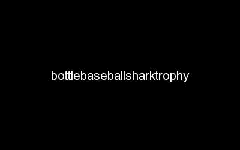

# 创建一个强有力的，安全的和容易记住的密码

> 原文：<https://medium.com/hackernoon/create-a-strong-secure-and-memorable-password-e9d75540e2c4>

创建[安全](https://hackernoon.com/tagged/secure)和记忆[密码](https://hackernoon.com/tagged/password)的最好方法是创建一串不相关的单词，该字符串应该大于 11 个字符。因为长度较小的随机字符比长度较大的不相关单词更容易被破解。

《出埃及记》**bottlebaseballsharktrophy**比 dtvk 强多了！pk@279

因为使用符号、数字和大写字母可以使密码更安全。

但是先进的软件可以搜索这些符号，所以更重要的是单词的长度，而不是字符的随机性。

所以这种使用冗长的不相关单词的策略会给你一个强有力的、更长的、复杂的、容易记住的密码短语。

> [黑客中午](http://bit.ly/Hackernoon)是黑客如何开始他们的下午。我们是 [@AMI](http://bit.ly/atAMIatAMI) 家庭的一员。我们现在[接受投稿](http://bit.ly/hackernoonsubmission)并乐意[讨论广告&赞助](mailto:partners@amipublications.com)机会。
> 
> 如果你喜欢这个故事，我们推荐你阅读我们的[最新科技故事](http://bit.ly/hackernoonlatestt)和[趋势科技故事](https://hackernoon.com/trending)。直到下一次，不要把世界的现实想当然！

