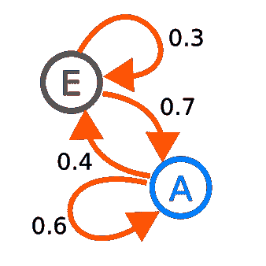
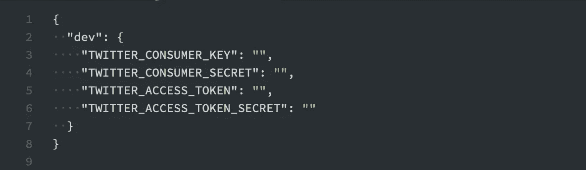
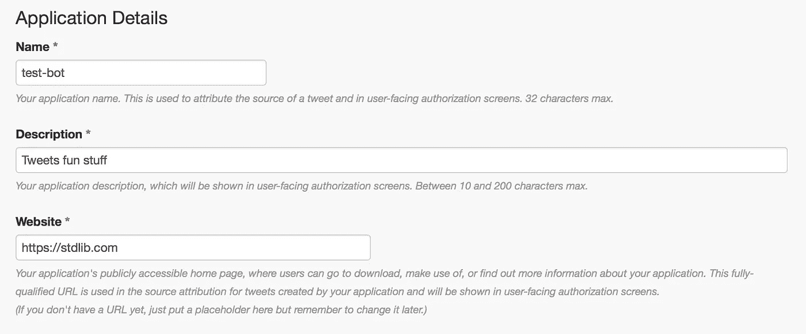
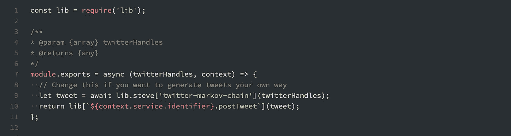

# 用马尔可夫链、Node.js 和 StdLib 创建一个 Twitter 政客机器人

> 原文：<https://medium.com/hackernoon/create-a-twitter-politician-bot-with-markov-chains-node-js-and-stdlib-14df8cc1c68a>

在当今世界的政治气候下，宣传是游戏的名称，Twitter 是首选的媒介。自动化是王道，如果你不使用 [Twitter](https://hackernoon.com/tagged/twitter) 机器人来影响大众，你就做错了。在 [StdLib](https://stdlib.com) 这里，我们真的没有任何政治动机，但我们确实喜欢构建机器人。随着 [StdLib 源代码](https://stdlib.com/sourcecode)的发布，我们与你们分享我们的最新项目变得前所未有的简单:介绍加拿大古怪的未来总理贾登·特鲁多。我们将教你如何建造这个现代工程奇迹，以及如何在几分钟内建造你自己的“政治终结者”。

为了建立一个吸引大众的 Twitter 机器人，我们选择了结合贾登·史密斯的智慧:

贾斯廷·特鲁多的健康:

创造世界上最完美的政治家:杰登·特鲁多。更具体地说，我们的目标是创建一个机器人，它偶尔会以贾登·史密斯和贾斯廷·特鲁多的风格在推特上发布程序生成的句子。这种结合产生了奇妙的标本，例如:

这个项目选择的[工具](https://hackernoon.com/tagged/tools)是马尔可夫链:马尔可夫链有许多现实世界的应用，比如谷歌的页面排名算法，但是没有一个像这个一样重要。如果你想跳到代码的工作版本，你可以在这里查看它的 API 页面。在这个页面上，你可以自己尝试这项服务，甚至加入到其他人的推特中！


Coming to an election near you — Jaden Trudeau

## 马尔可夫链是怎么回事？

> 我们描述一个马尔可夫链如下:我们有一组状态， *S* = { *s_₁，s_₂,…,s_r* }。该过程从这些状态之一开始，并从一个状态连续移动到另一个状态。每一步都叫做一步。如果链当前处于状态 *s_i* ，则它在下一步以由 *p_ij，*表示的概率移动到状态 *s_j* ，并且该概率不取决于链在当前之前处于哪个状态。来源



A two state Markov chain [[source](https://en.wikipedia.org/wiki/Markov_chain#/media/File:Markovkate_01.svg)]

简而言之，马尔可夫链是一种数学模型，它通过抛弃以前状态的历史，只检查现在，从一个状态转换到另一个状态。虽然这个解释仍然有点抽象，但是在生成句子的上下文中就变得更加清晰了。下面是如何使用马尔可夫链生成文本的概要。

1.  将一段文本(你的语料库)分割成记号(单词和标点符号)。
2.  建立一个频率表。这个数据结构为您的语料库中的每个惟一标记都提供了一个键。这个键被映射到跟在这个键后面的所有单词的列表，以及它在这个单词后面出现的频率。它也有助于为句子的开始和结束添加特殊的键。这确保了当从模型中取样时，你总能用合适的词开始和结束句子。
3.  选择一个起点(这些特殊的起始字之一)，然后从密钥后面的标记列表中随机选择一个标记。某个键被选中的概率应该与它出现在该键之后的频率成正比。这个新令牌现在是马尔可夫链的状态。在频率表中查找新的令牌并重复。

## 履行

有了如何进行的大致想法，是时候开始了。首先，我们需要获取一些推文。有了 [Twit](https://github.com/ttezel/twit) ，那没问题。

收到推文后，需要对它们进行标记化。对于推特，这不是一个完全琐碎的过程。推特上充斥着网址、表情符号和不规范的句子。我们可以用下面的代码将一个表示 tweet 的字符串转换成一个令牌数组:

这个函数接收一条 tweet，剥离它的 URL 和提及，并将其拆分成单词。然后，这些数组可以输入频率表。

生成表格的代码对于一个中等的帖子来说有点长，但是你可以在这里[看到它](https://github.com/steveScripts/twitter-markov-chain)。表生成后，条目如下所示:

这些条目可以通过几种方式进行遍历。在开始，有一个 50/50 的变化，选择'*我们的*'或'*我们的*'作为起始单词。假设'*我们的*'被选中，那么'*未来*'或'*差异*'被选中的几率是 2/5，而'*关系*'被选中的几率是 1/5。这个过程不断重复，直到创建一个链，例如:

```
__START -> our -> future -> office -> __END
```

差不多就是这样。如果你想看它的行动，请在推特上关注贾登·特鲁多。当然，有许多可以做的调整。例如，如果你想一次生成多个句子，你可以添加从`__END`到`__START`的边，并确保你以一个完整的句子结束。

# 构建您自己的

如果你想构建自己的 Twitter 机器人，你可以在标准库的[代码中找到机器人的模板。如果您单击该链接，模板将自动打开。如果没有，导航到“**社区 API 源**”选项卡并搜索“ **steve/twitter-bot** ”。一旦加载完毕，打开`env.json`文件，你会看到四个变量。](https://code.stdlib.com/?src=@steve/twitter-bot)



这些变量可以在您的 [Twitter 应用程序管理](https://apps.twitter.com)页面上找到。点击“创建应用”并填写表格:



Twitter application management page

点击“创建”后，您将在下一页找到这四把钥匙。将它们复制到各自在`env.json`中的位置。单击屏幕右下角的绿色“运行”按钮(或按 cmd/ctrl + r)。这将直接从浏览器部署和执行您的代码。

默认情况下，这个机器人使用马尔可夫链来生成推文。如果你想换成另一种方法，你可以打开`functions/__main__.js`，做一个小小的改变:



在第 9 行有一个对`lib.steve[twitter-markov-chain]`的调用，这是前面的马尔可夫链。你可以直接从 [StdLib 库文档页面](https://stdlib.com/@steve/lib/twitter-markov-chain/)使用它。您可以创建自己的函数来生成 tweets，并简单地将它换入。现在，单击 run 重新部署您的 bot。

就这些了，感谢阅读！希望你能够了解一点关于马尔可夫链、Twitter 机器人和 StdLib 的知识。构建宣传机器只是开始使用 StdLib 的众多方法之一。如果你有好主意想分享，请直接通过电子邮件联系我:**steven@stdlib.com**，或者在 Twitter 上关注[我](https://twitter.com/notoriaga)和 [StdLib](https://twitter.com/stdlibhq) 团队。

一如既往，我们期待您和快乐大厦的回音！

史蒂夫·迈耶(Steve Meyer)是欧柏林学院的应届毕业生，是 [*StdLib*](https://stdlib.com) *的软件工程师。当他不编程的时候，你可以看到他在烹饪、烘焙或者玩《野性的呼吸》。*