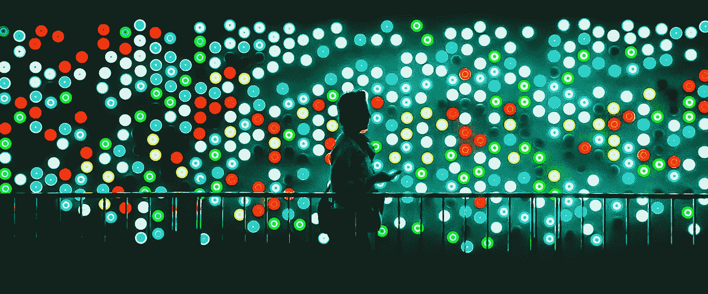
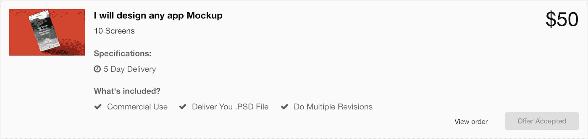

# 在不到一周的时间内为你的应用程序创建一个工作概念原型

> 原文：<https://medium.com/hackernoon/create-a-working-conceptual-prototype-for-your-app-in-less-than-a-week-ce904fe3bc5d>

即使你没有开发和设计技能来支付账单。

当我有了一个关于应用程序的想法时，我知道除非我能向他们展示我的想法，否则没有人会认真对待我。我也想通过自己的概念，给我的想法更多的背景。

我不关心让人们认真对待我。我本可以不在乎向人们解释我的想法。事实上，我的计划很复杂，我正在寻找合作伙伴。我不是专业的开发人员，所以我需要有人和我一起。

> **无意寻找一个没有原型的移动开发者合作伙伴，必须做些什么。**

每个人都对应用程序有“有史以来最好的想法”,这使得人们对讨论应用程序想法的期望越来越小。(如果你是一个移动开发者，我打赌你会给我一个大大的‘阿门’！)

我唯一的选择是设计一个可行的概念原型。虽然我不是设计师或开发人员，但我要求自己在不到一周的时间内完成这个项目。

我从来没有创造过原型，所以我开始了我的研究，并准备研磨。

# 黑进你的原型

由于没有设计或开发经验，我意识到我必须“用自己的方式”做出一个原型。

> 如果你没有完成某件事的技术诀窍，有时候最好的办法就是自己动手。变得斗志昂扬，学习你需要的东西，并把一些很棒的东西放在一起。

我开始寻找最简单的应用原型构建器，并发现了[视觉](https://www.invisionapp.com/)。他们帮助你将你的网络&移动(iOS，Android)设计转化为可点击的，交互式的原型和模型。

就是导入一些截图设计，然后添加叠加按钮执行动作这么简单。对我来说，很简单，'【T6]如果他们点击一个点，然后他们会去应用程序设计[x]。’

在 builder 中玩了一会儿后，我得出结论，用 [InVision](https://www.invisionapp.com/) 创建我的原型应该是轻而易举的事情。现在我只需要截图了。

# 当[五个](https://www.fiverr.com/)的时候，你开始了

我听过太多的人抨击。虽然你永远也不会从网站上获得最好的质量，但它是可靠的。如果你把它用在正确的项目上，它可以成为救命稻草！(您也可以尝试 [Canva](https://www.canva.com) 自己创建屏幕图像)

通过搜索“应用程序设计”，我找到了大量价格合理的卖家，他们愿意与我合作。在对一些潜在客户进行分类和联系后，我决定了我想和谁一起工作。

我们进行了谈判，他们同意以 50 美元的价格设计十个无限修改的应用程序屏幕，并在不到五天的时间内完成。

对我来说这是显而易见的！我已经有了我想要设计的所有规格，并把它们发了过来。经过一些修改和调整，获得最终设计的总时间是五天。

我还有两天时间把设计变成一个功能性的原型。

# 这太容易了

关于[视觉](https://medium.com/u/206c13695d27?source=post_page-----ce904fe3bc5d--------------------------------)我说不完。他们让插入截图和创建任何你想要的东西变得非常简单，这正是我所做的。

通过一点努力，我能够让我的应用程序看起来和感觉起来就像我想要的那样。它还帮助我为我想用这个应用做的事情打下了基础，让我清楚地了解了每个功能的外观和感觉。

在 Vision 里玩了两天后，我完成了我的项目。

# 成品

我的原型很漂亮，我找到了一个合作伙伴，现在我们正处于 UNUM messenger 的早期开发阶段。

UNUM messenger 将所有形式的通信结合到一个简单的应用程序中。这个应用程序将有助于从一个中心位置阅读和发送您的所有消息/电子邮件。

我们计划在 2017 年 3 月推出 UNUM messenger 作为测试版。如果您想在 UNUM messenger 启动时收到通知，您可以在此注册。

感谢所有的反馈！

如果你想在我的旅程中跟随我，请务必在 Medium 上跟随我。此外，如果你喜欢这篇文章，一定要喜欢它！

> [黑客中午](http://bit.ly/Hackernoon)是黑客如何开始他们的下午。我们是 [@AMI](http://bit.ly/atAMIatAMI) 家庭的一员。我们现在[接受投稿](http://bit.ly/hackernoonsubmission)并乐意[讨论广告&赞助](mailto:partners@amipublications.com)机会。
> 
> 如果你喜欢这个故事，我们推荐你阅读我们的[最新科技故事](http://bit.ly/hackernoonlatestt)和[趋势科技故事](https://hackernoon.com/trending)。直到下一次，不要把世界的现实想当然！

