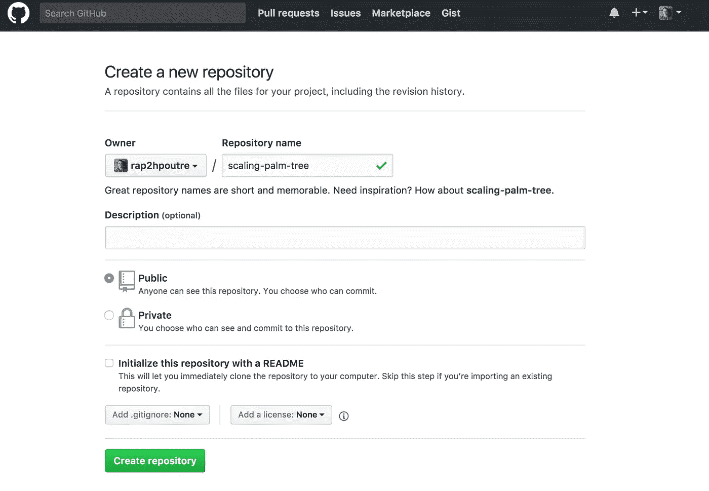
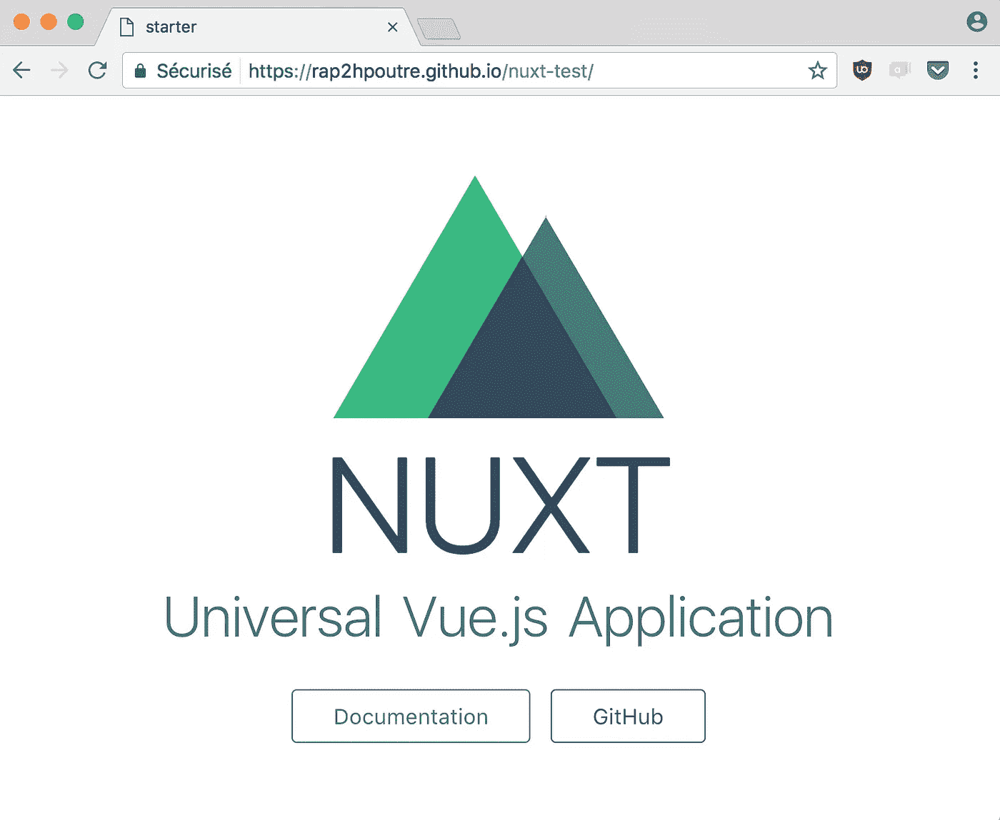

# 在 Github 页面上创建并发布一个 Nuxt.js 驱动的网站

> 原文：<https://medium.com/hackernoon/create-and-publish-a-nuxt-powered-website-on-github-pages-3e922dfa7372>

## 如何在 5 分钟内从零开始建立和分享一个静态站点？


Nuxt.js is a framework for creating Universal Vue.js Applications.

安装 [vue-cli](https://github.com/vuejs/vue-cli) :

```
npm install -g vue-cli
```

创建项目(用您的项目名称替换`my-project`):

```
vue init nuxt/starter my-project
cd my-project
npm install
```

将`nuxt.config.js`更新为[添加一个基础 URL](https://nuxtjs.org/api/configuration-router/#base) (用您的项目名称替换`my-project`):

```
router: { base: '/my-project/' },
```

安装[推动方向](https://github.com/L33T-KR3W/push-dir):

```
npm install push-dir --save-dev
```

通过编辑`package.json`文件并在`script`部分的开头添加这一行，创建一个`deploy`命令发布到 [Github 页面](https://pages.github.com/):

```
"deploy": "push-dir --dir=dist --branch=gh-pages --cleanup",
```

连接到您的 Github 帐户并创建一个空的存储库。



然后提交您的代码并将其推送到您的存储库(用您的名字替换`me`，用您的项目名替换`my-project`):

```
git init
git add .
git commit -m "init"
git remote add origin https://github.com/me/my-project.git
git push -u origin master
```

生成网站并发布它:

```
npm run generate
npm run deploy
```

去你的站点`https://me.github.io/my-project`(用你的名字代替`me`，用你的项目名代替`my-project`)，然后**享受结果**。



您可以通过再次运行以下命令来发布您的更改:

```
npm run generate
npm run deploy
```

**瞧。**🤗

[](http://bit.ly/HackernoonFB)[](https://goo.gl/k7XYbx)[](https://goo.gl/4ofytp)

> [黑客中午](http://bit.ly/Hackernoon)是黑客如何开始他们的下午。我们是这个大家庭的一员。我们现在[接受投稿](http://bit.ly/hackernoonsubmission)并乐意[讨论广告&赞助](mailto:partners@amipublications.com)机会。
> 
> 如果你喜欢这个故事，我们推荐你阅读我们的[最新科技故事](http://bit.ly/hackernoonlatestt)和[趋势科技故事](https://hackernoon.com/trending)。直到下一次，不要把世界的现实想当然！

