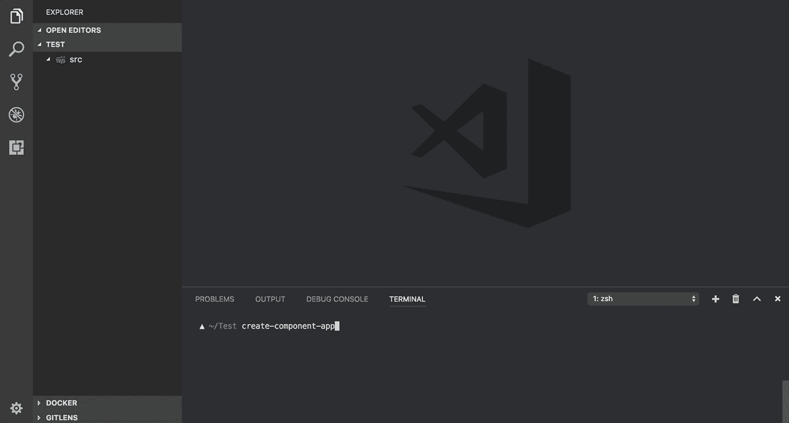

# create-component-app v1 现已发布🎉

> 原文：<https://medium.com/hackernoon/create-component-app-v1-is-out-now-6ca0217992e9>

## 什么是[创建组件应用](https://github.com/CVarisco/create-component-app)？

复制和粘贴组件文件夹来创建一个新文件夹需要花费多少时间？还是在编辑器上创建自己的代码片段？

create-component-app 是一个从终端([)或编辑器](https://github.com/CVarisco/vs-component-app) ) **生成不同类型的 [React](https://hackernoon.com/tagged/react) 组件的工具，帮助您节省大量时间，并防止复制粘贴造成的错误。**

有了许多选项，您可以很容易地快速创建您的 React 组件！

*   [创建您的组件，从终端引导，有很多选择](https://github.com/CVarisco/create-component-app#create-your-components-guided-from-terminal-with-a-lot-of-choices)
*   [您可以在当前项目目录下创建一个配置文件](https://github.com/CVarisco/create-component-app#you-can-create-a-configuration-file-in-your-current-project-directory)
*   [您也可以从 params](https://github.com/CVarisco/create-component-app#you-can-also-pass-a-config-file) 传递配置文件
*   [您可以使用自己的定制模板](https://github.com/CVarisco/create-component-app#you-can-use-your-own-custom-templates)
*   现在… [您可以使用社区中的模板](https://github.com/CVarisco/create-component-app#you-can-use-templates-from-the-community)🎉

## 为什么是中等文章？

因为我们注意到每个团队都有不同的方法来创建 React 组件，并且该工具不能帮助所有人。但是现在，**社区可以分享他们自己的 React 组件模板！**通过这种方式，React 社区中的每个人都可以使用不同的方式来创建组件。

## [如何通过 3 个步骤分享我的模板？](https://github.com/CVarisco/create-component-app/blob/master/docs/CUSTOM-TEMPLATES-COMMUNITY.md)

*   放弃这个项目
*   在模板文件夹中创建你的模板文件夹
*   [创建您的模板](https://github.com/CVarisco/create-component-app/blob/master/docs/CUSTOM-TEMPLATES.md#4-create-your-templates)

## 欢迎反馈！

我认为世界上最重要的事情是收到对我们所做事情的反馈。
我很高兴能帮助社区改善我们的环境，如果能收到这方面的反馈或收到很多贡献，那将是非常棒的！

如果你喜欢[工具](https://hackernoon.com/tagged/tools)与你的团队分享，点击⭐️
享受编码的乐趣！

标志由:[亚历山德罗·马佐拉](https://www.behance.net/gloomyforest)