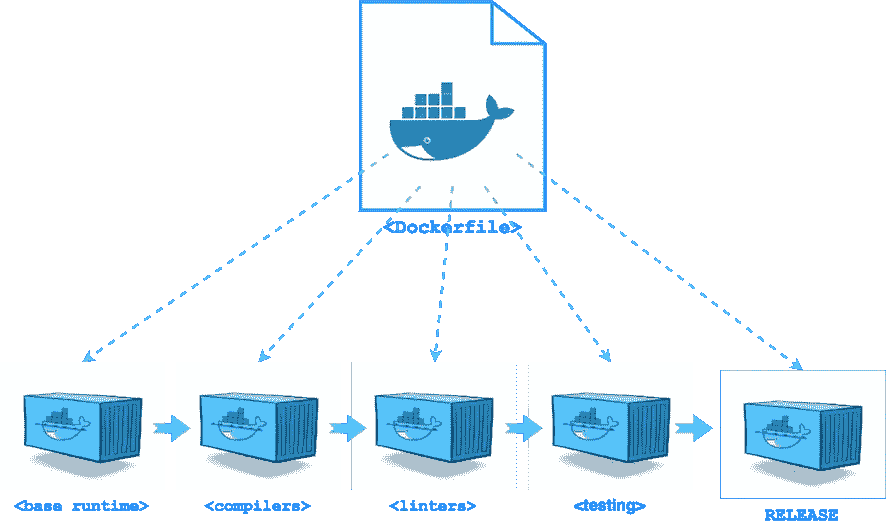

# 使用 Docker 多阶段构建创建精益 Node.js 映像

> 原文：<https://medium.com/hackernoon/create-lean-node-js-image-with-docker-multi-stage-build-252e927cbf3e>

从 [Docker](https://hackernoon.com/tagged/docker) **17.05+** 开始，你可以创建一个单独的`Dockerfile`，它可以用编译器、[工具](https://hackernoon.com/tagged/tools)构建多个辅助映像，并测试和使用来自上述映像的文件来生成**最终的** Docker 映像。



# Dockerfile 的“核心原则”

Docker 可以通过读取来自`Dockerfile`的指令来构建图像。一个`Dockerfile`是一个文本文件，包含构建一个新的 Docker 映像所需的所有命令的列表。`Dockerfile`的语法非常简单，Docker 团队试图在 Docker 引擎发布之间保持它的完整性。

核心原理很简单:`1 Dockerfile -> 1 Docker Image`。

这个原则非常适合基本的用例，在这些用例中，您只需要展示 Docker 的功能或者将一些“静态”内容放入 Docker 图像中。

一旦你使用 Docker 并想要创建安全和精简的 Docker 映像，一个`Dockerfile`是不够的。

坚持遵循上述原则的人发现他们自己有缓慢的 Docker 构建、巨大的 Docker 映像(几 GB 大小的映像)、缓慢的部署时间和嵌入到这些映像中的大量 CVE 违规。

# Docker 构建容器模式

[Docker 模式:构建容器](/@alexeiled/docker-pattern-the-build-container-b0d0e86ad601)

**构建容器**模式背后的基本思想很简单:

> *使用所需的工具(编译器、linters、测试工具)创建额外的 Docker 映像，并使用这些映像生成精简、安全且生产就绪的 Docker 映像。*

典型 Node.js 应用程序的**构建容器**模式示例:

1.  派生`FROM`一个节点基础映像(例如`node:6.10-alpine` ) `node`和`npm`已安装(`Dockerfile.build`)
2.  添加`package.json`
3.  从`dependency`和`devDependency`安装所有节点模块
4.  复制应用程序代码
5.  运行编译器、代码覆盖率、linters、代码分析和测试工具
6.  创建**生产**码头工人形象；派生`FROM`相同或其他节点基础映像
7.  安装运行时所需的节点模块(`npm install --only=production`)
8.  公开`PORT`并定义默认的`CMD`(运行应用程序的命令)
9.  将**生产**映像推送到某个 Docker 注册表

这个流程假设您使用两个或更多的`Dockerfile`和一个 shell 脚本或流程工具来编排上面的所有步骤。

# 例子

我用的是 [Let's Chat](https://github.com/sdelements/lets-chat) node.js 应用的一个分叉。

## 带有 eslint、摩卡和 gulp 的构建者 Docker 图像

```
FROM alpine:3.5
# install node 
RUN apk add --no-cache nodejs
# set working directory
WORKDIR /root/chat
# copy project file
COPY package.json .
# install node packages
RUN npm set progress=false && \
    npm config set depth 0 && \
    npm install
# copy app files
COPY . .
# run linter, setup and tests
CMD npm run lint && npm run setup && npm run test
```

## 仅带有“生产”节点模块的生产停靠站映像

```
FROM alpine:3.5

# install node
RUN apk add --no-cache nodejs tini
# set working directory
WORKDIR /root/chat
# copy project file
COPY package.json .
# install node packages
RUN npm set progress=false && \
    npm config set depth 0 && \
    npm install --only=production && \
    npm cache clean
# copy app files
COPY . .
# Set tini as entrypoint
ENTRYPOINT [“/sbin/tini”, “--”]
# application server port
EXPOSE 5000
# default run command
CMD npm run start
```

# 什么是 Docker 多阶段构建？

Docker 17.0.5 通过扩展两个命令:`FROM`和`COPY`，扩展了`Dockerfile`语法以支持新的**多阶段**构建。

**多阶段**构建允许在同一个 Dockerfile 文件中使用多个`FROM`命令。最后的`FROM`命令产生最终的 Docker 图像，所有其他图像都是中间图像(不产生最终的 Docker 图像，但是*所有层都被缓存*)。

`FROM`语法也支持`AS`关键字。使用`AS`关键字给当前图像一个逻辑名称，并通过该名称引用它。

使用`COPY --from=<image_AS_name|image_number>`从中间映像复制文件，其中数字从`0`开始(但最好通过`AS`关键字使用逻辑名称)。

# 为 Node.js 应用程序创建多阶段 docker 文件

下面的`Dockerfile`使**构建容器**模式过时，允许用单个文件实现相同的结果。

```
#
# ---- Base Node ----
FROM alpine:3.5 AS base
# install node
RUN apk add --no-cache nodejs-npm tini
# set working directory
WORKDIR /root/chat
# Set tini as entrypoint
ENTRYPOINT ["/sbin/tini", "--"]
# copy project file
COPY package.json .

#
# ---- Dependencies ----
FROM base AS dependencies
# install node packages
RUN npm set progress=false && npm config set depth 0
RUN npm install --only=production 
# copy production node_modules aside
RUN cp -R node_modules prod_node_modules
# install ALL node_modules, including 'devDependencies'
RUN npm install

#
# ---- Test ----
# run linters, setup and tests
FROM dependencies AS test
COPY . .
RUN  npm run lint && npm run setup && npm run test

#
# ---- Release ----
FROM base AS release
# copy production node_modules
COPY --from=dependencies /root/chat/prod_node_modules ./node_modules
# copy app sources
COPY . .
# expose port and define CMD
EXPOSE 5000
CMD npm run start
```

以上`Dockerfile`创建了 3 个中间 Docker 图像和单个 **release** Docker 图像(最终`FROM`)。

1.  第一个图像`FROM alpine:3.5 AS base`–是一个基本节点图像，包含:`node`、`npm`、`tini`(初始化应用程序)和`package.json`
2.  第二个映像`FROM base AS dependencies`–包含来自`dependencies`和`devDependencies`的所有节点模块，仅最终映像需要`dependencies`的额外副本
3.  第三张图片`FROM dependencies AS test`——运行棉绒机，设置和测试(用`mocha`)；如果该运行命令失败，则不会生成最终图像
4.  最后一个映像`FROM base AS release`–是一个基本节点映像，包含来自`dependencies`的应用程序代码和所有节点模块

# 立即尝试 Docker 多阶段构建

为了尝试 Docker **多阶段** build，你需要获得 Docker 17.0.5，该版本将于 5 月发布，目前已在 *beta* 频道发售。

所以，你有两个选择:

1.  使用 *beta* 通道获取 Docker 17.0.5
2.  运行*和*容器(对接器中的对接器)

# 运行 Docker-in-Docker 17.0.5(测试版)

在 Docker 容器中运行 Docker 17.0.5(测试版)(需要`--privileged`):

```
$ docker run -d --rm --privileged -p 23751:2375 --name dind \ 
         docker:17.05.0-ce-dind --storage-driver overlay2
```

尝试**多阶段**构建。将`--host=:23751`添加到每个 Docker 命令中，或者设置`DOCKER_HOST`环境变量。

```
$ # using --host
$ docker --host=:23751 build -t local/chat:multi-stage .

$ # OR: setting DOCKER_HOST
$ export DOCKER_HOST=localhost:23751
$ docker build -t local/chat:multi-stage .
```

# 摘要

借助 Docker **多阶段**构建特性，可以使用单个 Docker 文件实现高级 Docker 映像构建流水线。

Docker 团队如此有用的功能值得称赞！

希望，你觉得这篇帖子有用。我期待您的评论和任何问题。

*原载于 2017 年 4 月 24 日*[*code fresh . io*](https://codefresh.io/blog/node_docker_multistage/)*。*

[](http://bit.ly/HackernoonFB)[](https://goo.gl/k7XYbx)[](https://goo.gl/4ofytp)

> [黑客中午](http://bit.ly/Hackernoon)是黑客如何开始他们的下午。我们是 [@AMI](http://bit.ly/atAMIatAMI) 家庭的一员。我们现在[接受投稿](http://bit.ly/hackernoonsubmission)并乐意[讨论广告&赞助](mailto:partners@amipublications.com)机会。
> 
> 如果你喜欢这个故事，我们推荐你阅读我们的[最新科技故事](http://bit.ly/hackernoonlatestt)和[趋势科技故事](https://hackernoon.com/trending)。直到下一次，不要把世界的现实想当然！

