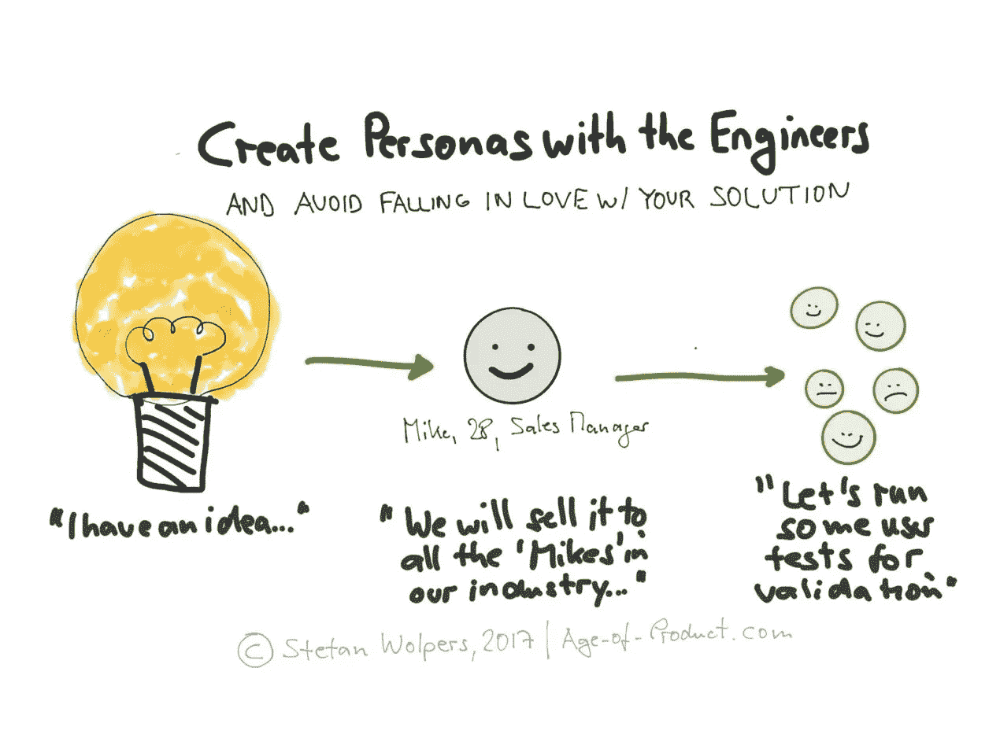
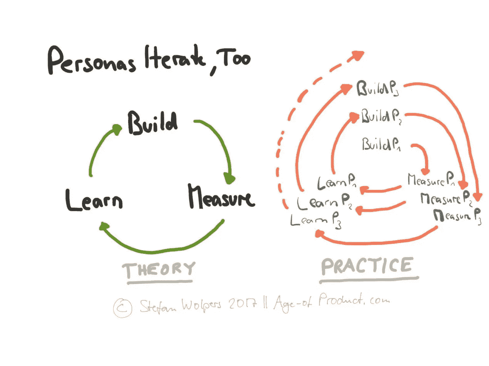

# 在工程师的帮助下创建人物角色

> 原文：<https://medium.com/hackernoon/create-personas-with-the-help-of-the-engineers-c0165dac7629>

# TL；DR:在工程师的帮助下创建人物角色

创造有价值的软件需要了解客户——我们都同意这一点，对吗？然后想到的第一个问题是，如何在敏捷环境中以有意义的方式支持这个产品发现过程？第二个问题随之而来:谁应该参与这个过程——设计师、商业分析师还是工程师？

继续阅读，了解为什么人物角色对产品发现有用，如何创建人物角色，以及为什么整个团队——包括工程师——需要参与他们的创建。

# 定义:什么是人物角色？

这个术语是由艾兰·库伯在他的书《T2》中引入的。(来源:[维基百科](https://en.wikipedia.org/wiki/Persona#In_user_experience_design)。)

人物角色是基于用户研究的虚拟角色，代表与产品或服务交互的一组用户或客户。

# 好处:我们需要人物角色吗？

人物角色被证明有利于支持你的团队，通过理解:他们在为谁构建(一个产品或服务)？人物角色通过展示一张人类的“脸”并给一个匿名实体一个名字和背景来创造共鸣。人物角色将“客户”引入产品团队的日常对话中。换句话说:人物角色是产品叙述的有用部分。

然而，与文学作品相反，产品的叙述既不是“固定的”，也不是由作者预先创造的。它在开始时是模糊的，随着时间的推移，它可能会变得更加具体——如果你幸运地实现了产品与市场的契合。因此，产品叙述总是随着产品寿命的变化而变化。此外，最好的产品故事是由一群不同的观察者和作者创造的——包括工程师在内的整个团队。

# 评论:我们真的需要人物角色吗？

最常见的批评是创建人物角色会消除发现创新用例的机会。没有人需要推特。因此，没有用户研究，没有焦点小组向任何人展示过这个颠覆性的机会。因此，人物角色倾向于瀑布式的渐进主义，而不是破坏性的创新。最后，人物角色是有代价的。以延误和机会成本为代价准备和运行研究结果。

尽管如此，作者确信在大多数情况下，创建人物角色作为产品发现过程的一个组成部分的好处大于成本。

# 下载敏捷过渡 PDF

最新的 174 页的《敏捷过渡——来自战壕的实践手册》就在这里**可以找到，而且是**免费的！****

****

# **让人物角色成为团队的努力:人物角色团队研讨会**

## **准备人物角色研讨会**

**如果人物角色是一项有价值的投资，那么人物角色团队研讨会的先决条件是什么？事实证明我们需要:**

*   **前期市场研究，包括定量研究(➜调查)和定性研究(➜用户测试)**
*   **对研究结果的分析**
*   **可能是为支持产品发现过程而定制的人物角色模板**
*   **所有利益相关者都需要参加研讨会，以消除偏见的风险。**

***请点击【拍手】*👏如果你觉得这篇文章有用——它对我来说意义重大！**

## **设计人物角色模板**

**B2B 产品的角色模板可以包含以下元素的子集:**

*   **人物照片:这是最吸引人的部分**
*   **传记:姓名、年龄、教育**
*   **引用一段话来提供从用户研究中获得的对情感和个性的洞察**
*   **公司:名称、规模和行业**
*   **当前角色作为所有其他角色中的唯一标识符**
*   **上下文:应用程序将在哪里使用？**
*   **目标:为什么客户会雇佣我们的产品？**
*   **旅程:为了实现他或她的目标，客户现在会做什么？**
*   **顾客的动机和抑制因素。**

**人物角色模板的其他问题可以是:**

*   **人物角色与其他产品/品牌的关系**
*   **角色以前的工作经历**
*   **角色在以前的工作或项目中最大的失败**
*   **角色的职业规划。**

**创建一个人物角色矩阵，将应用程序中的所有人物角色相互联系起来，也被证明是有帮助的。**

**最后， [Dave Gray 的同理心映射](http://gamestorming.com/empathy-mapping/)已经被证明是创建人物角色的替代途径，而不是使用人物角色模板。**

## **如何与整个团队一起开展人物角色研讨会**

**人们关心他们帮助创造的东西——这个原则也适用于产品发现过程的每个部分。因此，整个团队——是一个较小的组织——或者来自每个团队的相当数量的代表参与到创建人物角色的研讨会中是至关重要的。以下研讨会议程已被证明是有用的:**

*   **首先，将大团队分成两到四个参与者的小组，介绍您所在组织的人物角色模板，或者考虑戴夫·格雷的移情映射**
*   **现在要求每个小组创造“他们的”角色。将时间框设置为 20 分钟**
*   **20 分钟后，所有小组应通过讲述人物角色的引人入胜的故事来展示他们的人物角色草稿。这一时刻每组需要两到三分钟**
*   **接下来，比较所有不同的人物角色并识别模式。为了这个目，所有的小团体再次聚集成一个大团体**
*   **最后，将相似的草稿合并在一起，在版本 1 中形成你的人物角色:**
*   **合并两个草稿人物角色➜你的人物角色 v1**
*   **先将四个草稿人物角色合并到➜的两个草稿人物角色中，然后将这些角色合并到➜的人物角色 v1 中**
*   **首先将六个人物角色草稿合并到➜三个人物角色草稿中，然后将这些合并到➜你的人物角色 v1 中。**

# **让你的角色 v1“真实”**

**既然你已经创建了你的角色的第一版，你不能把它藏在盒子里，而是要让它在办公室里可见:**

*   **将 LinkedIn 的个人资料印在海报上，并将海报张贴在团队空间的显著位置**
*   **在日常团队讨论中使用角色的名字**
*   **基于角色，定期重新评估产品路线图和产品待办事项**
*   **最重要的是:在用户访谈中验证角色。**

****注意**:确保团队在产品开发的同时迭代每个角色。没有一个人物角色是静态的；人物角色与产品同步发展:**

****

# **当心角色反模式、谬误和自我实现的预言**

**“我有一个杀手级的产品创意，我确切地知道该为谁制造什么。跟我来。”产品发现失败的方式有很多。然而，不可否认的是，爱上你的解决方案而不是客户的问题是太人性化的一个原因。虽然不可能排除偏见，但我们可以通过遵守一些简单的规则来限制不利后果:**

*   **永远不要让一个人预先定义人物角色**
*   **永远不要将角色研讨会的参与者限制在业务分析师和 UX 设计师**
*   **总是协作合并草拟的人物角色**
*   **总是随着时间的推移迭代人物角色**
*   **始终将人物角色嵌入到团队的运营工作中。**

****注意**:你必须和整个团队练习检查&平衡，以避免无意识地选择“验证”你心爱产品想法的“用户”。这是在人物角色创建和迭代过程中包含所有涉众——甚至是“昂贵的工程师”的基本原理。**

# **结论——在工程师的帮助下创建角色**

**“把它带到团队中”是一个行之有效的策略，适用于与跨职能团队以敏捷方式工作的产品创造相关的所有事情。因此，在没有工程师帮助的情况下创建人物角色的想法不仅违反直觉。它还揭示出，该组织似乎固守过时的职能筒仓。敏捷开发——工程师越早参与产品开发，团队就越早学会放弃愚蠢的产品想法。**

**你如何创建人物角色？请在评论中与我分享。**

# **相关文章—在工程师的帮助下创建人物角色**

**[28 产品积压和精化反模式](https://age-of-product.com/28-product-backlog-anti-patterns/)**

**[产品发现反模式导致失败](https://age-of-product.com/product-discovery-anti-patterns/)**

**[免费下载“Scrum 反模式指南”](https://age-of-product.com/scrum-anti-patterns/)**

***请点击【拍手】*👏如果你觉得这篇文章有用，那将对我意义重大！**

***要不要这样多读书？嗯:***

*   **📰*加入 12，812 位同行和* [*报名参加本周简讯*](https://age-of-product.com/subscribe/?ref=Food4ThoughtMedium)**
*   **🐦*关注我的* [*推特*](https://twitter.com/stefanw) *并订阅我的博客* [*产品时代*](https://age-of-product.com)**
*   **💬*或者，免费加入* [*Slack 团队的 2040 多名同行*](https://goo.gl/forms/XIsABn0fLn9O0hqg2) *…***