# 用 passport 在 Laravel 5.5 中创建简单的 REST API

> 原文：<https://medium.com/hackernoon/create-simple-rest-api-in-laravel-5-5-with-passport-29c77c4f48b3>

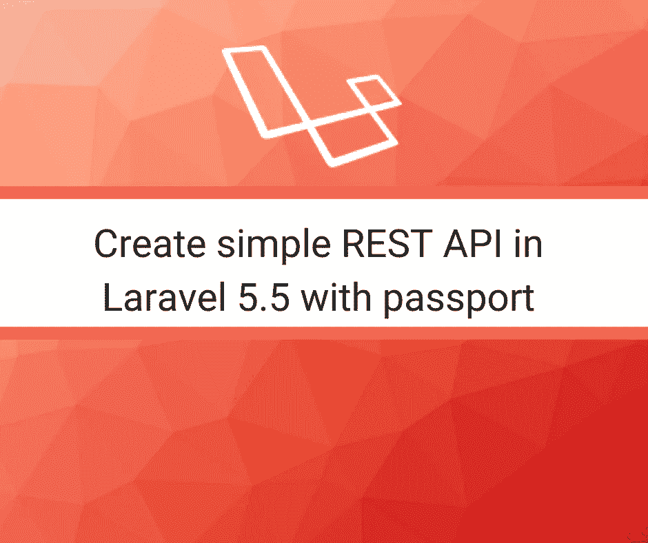

在本教程中，我将带您了解如何使用 laravel passport 包。这是官方支持包，如果你在[之前访问官方文档，你已经看到了](https://laravel.com/docs/5.5/passport)，它是理论上的而不是行动，你没有看到在现实世界中是如何实现的，错误是如何发生的

我分享这篇文章

*   如何在 laravel 5.5 上设置 passport 包
*   如何创建简单的端点
*   如何用[邮递员](https://www.getpostman.com/)测试 api

## 设置 passport

首先打开命令行和 tpye

```
composer require laravel/passport
```

然后打开 app.php 和粘贴

```
Laravel\Passport\PassportServiceProvider::class,
```

下次使用

```
php artisan migrate
```

安装多个表

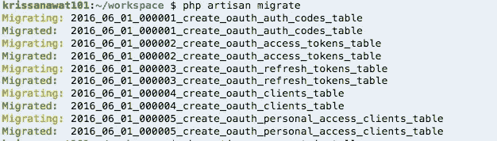

然后设置 passport 迁移

```
php artisan passport:install
```

生成私钥

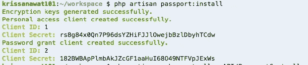

## 3 步配置

首先，在模型中，我们在用户模型中加入了 passport 功能

```
namespace App;use Illuminate\Notifications\Notifiable;
use Illuminate\Foundation\Auth\User as Authenticatable;
use Laravel\Passport\HasApiTokens;
class User extends Authenticatable
{
    use HasApiTokens,Notifiable;
```

我们包含了**的 haspitokens**特质并加以利用

第二个在**app/Providers/authserviceprovider . PHP**

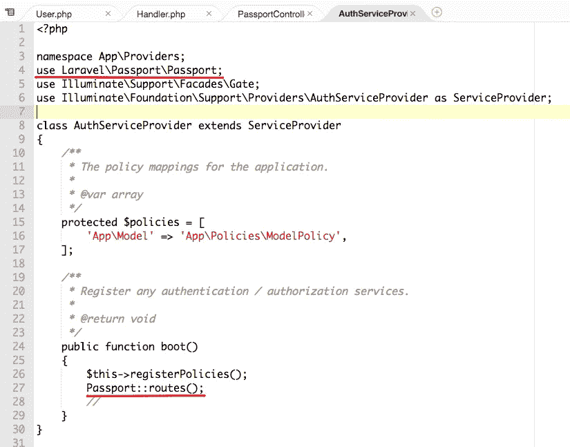

我们包括护照路线

最后，在 **config/auth.php** 中，我们将 api 驱动程序改为 passport

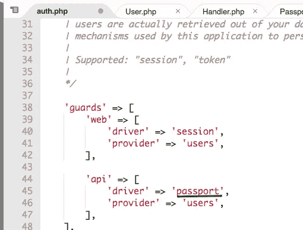

## 创建控制器端点

接下来，我们创建控制器来处理身份验证和消费端点

使用 artisan

```
php artisan make:controller API/PassportController
```

在文件夹 API 中生成控制器

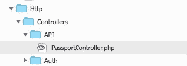

打开文件并包含

```
use App\User;
use Illuminate\Support\Facades\Auth;
use Validator;
```

接下来，我们定义了成功状态代码

```
class PassportController extends Controller
{
   public $successStatus = 200;
```

## 注册页面

我们先取寄存器函数

```
public function register(Request $request)
    {
        $validator = Validator::make($request->all(), [
            'name' => 'required',
            'email' => 'required|email',
            'password' => 'required',
            'c_password' => 'required|same:password',
        ]);if ($validator->fails()) {
            return response()->json(['error'=>$validator->errors()], 401);            
        }$input = $request->all();
        $input['password'] = bcrypt($input['password']);
        $user = User::create($input);
        $success['token'] =  $user->createToken('MyApp')->accessToken;
        $success['name'] =  $user->name;return response()->json(['success'=>$success], $this->successStatus);
    }
```

这一步首先很容易

我们创建绑定到请求输入的数组键的验证规则

如果验证失败，我们会发回错误代码

如果验证通过，加密密码，然后保存用户数据

然后，我们创建带有令牌和名称的响应体并发回

不要忘记用路线创建桥梁

```
Route::post('register', 'API\PassportController@register');
```

## 测试注册 api

open postman 尝试用空正文调用注册端点

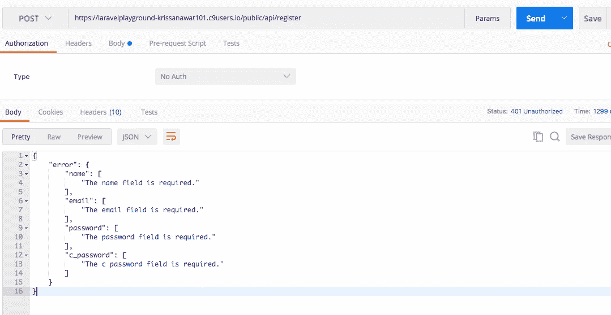

如果我们带着尸体去

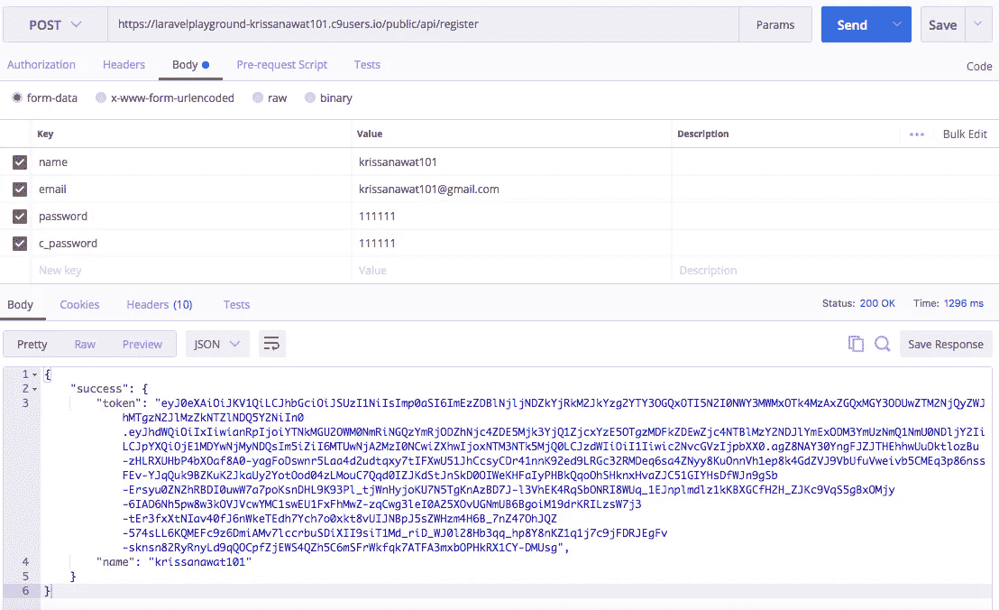

接下来，我们实现登录功能，获得认证令牌

## 登录功能

再次打开 **PassportController** 并粘贴

```
public function login(){
        if(Auth::attempt(['email' => request('email'), 'password' => request('password')])){
            $user = Auth::user();
            $success['token'] =  $user->createToken('MyApp')->accessToken;
            return response()->json(['success' => $success], $this->successStatus);
        }
        else{
            return response()->json(['error'=>'Unauthorised'], 401);
        }
    }
```

这种简单的 if 身份验证成功为用户提供了用于消费端点的访问令牌

保存并转到 **route/api.php** 再次填充

```
Route::post('login', 'API\PassportController@login');
```

保存并返回给邮递员打开新标签

我也试过没有主体 API/登录


和身体

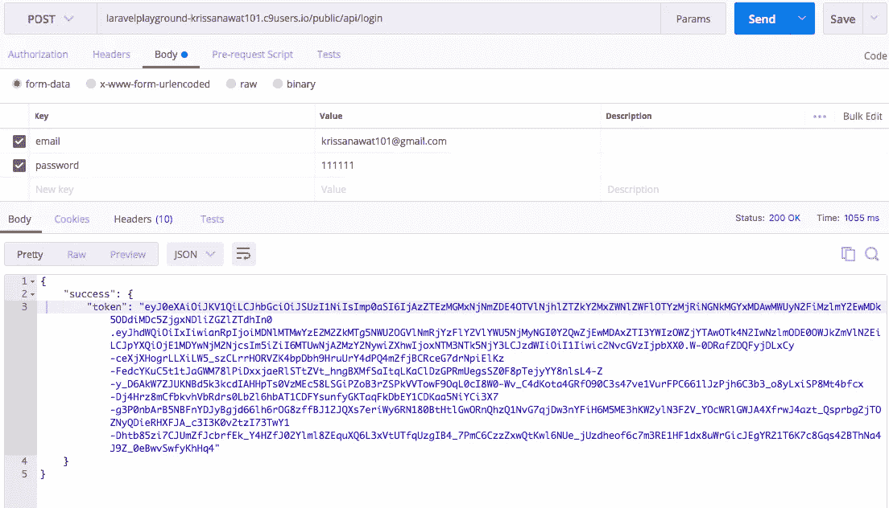

我有很长的访问令牌

## 消费端点

在最后一篇文章中，我展示了如何使用基本端点来获取用户详细信息

**打开 PassportController 并粘贴**

```
public function getDetails()
    {
        $user = Auth::user();
        return response()->json(['success' => $user], $this->successStatus);
    }
```

我们在会话中以 json 响应格式和状态代码发送用户数据

不要忘记用中间件保护端点

```
Route::group(['middleware' => 'auth:api'], function(){
 Route::post('get-details', 'API\PassportController@getDetails');
});
```

回到邮递员身边

在这种情况下，我们在报头中发送访问令牌，并在 Accept 报头中固定返回格式为 json，在报头名称 Authorization 中附加访问令牌，给出前缀名称 Bearer 并与令牌连接

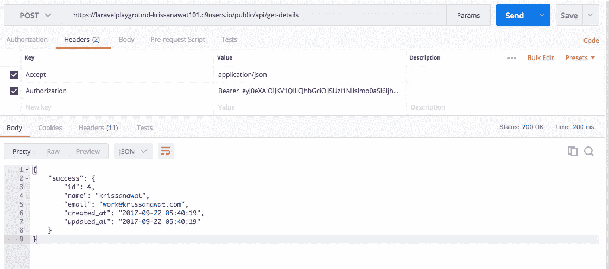

好吧，这就是工作，希望你像我一样工作

# 特色 Laravel 课程

## [面向初学者的带 Laravel 的 PHP 成为 Laravel 高手](http://flyy.link/PHP-with-Laravel-for-beginners-)

4.4/5 颗星 **||** 31.5 小时的视频 **||** 19，080 名学生
学习掌握 Laravel 制作高级应用程序，如我们在此课程上构建的真正的 CMS 应用程序

[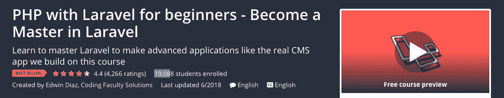](http://flyy.link/PHP-with-Laravel-for-beginners-)

# [拉韦勒项目:学习拉韦勒建筑 10 项目](http://flyy.link/-Learn-Laravel-Building-10-Projects)

4.6 (541 收视率)学员报名 **||** 26 小时视频**| |**2228 名学员
学习 Laravel PHP 框架的核心概念并学习构建真实世界的 Laravel web 应用程序和学习真实世界的 web 编程概念
[了解更多](http://flyy.link/-Learn-Laravel-Building-10-Projects)。

[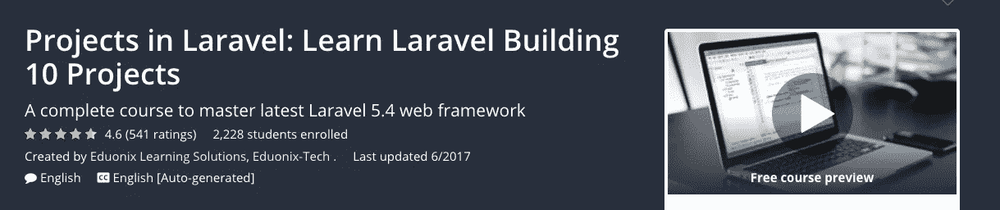](http://flyy.link/-Learn-Laravel-Building-10-Projects)

## 结束语:

我在 [**React Ninja**](http://reactninja.io/) 上发表 React、React Native 以及其他一切与 web 开发相关的文章。一定要在 [**推特**](https://twitter.com/reactninjaio) 上关注我。

加入我们的 [**简讯**](https://reactninja.io/subscribe-our-newsletter/) 获取最新最棒的内容，让你成为更好的开发者。

## 如果这篇文章有帮助，请点击拍手👏按钮下面几下，以示支持！⬇⬇