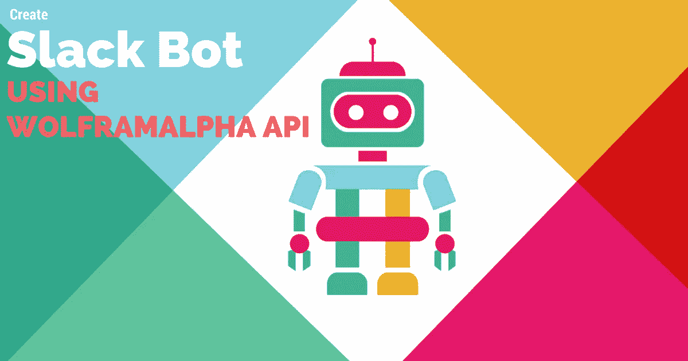
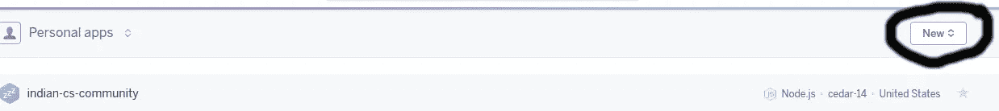

# 使用 WolframAlpha API 创建第一个可以回答任何查询的 Slack 机器人

> 原文：<https://medium.com/hackernoon/create-your-first-slack-bot-that-can-answer-any-queries-using-wolframalpha-api-689890ca7419>

Create Slack Bot using WolframAlpha API

我在 Reddit 上看到了一个关于 WolframAlpha API 的帖子，于是我决定尝试一下。我用 WolframAlpha 创建了两个 slack 机器人，两个都工作得很好。 [L](https://twitter.com/The_L__) 的一些最好的推文。WolframAlpha API 有一个问题，它一个月只允许 2000 个 API 调用，如果你频繁使用，你需要使用他们的付费计划。

好了，在我们开始教程之前，我想提一下，如果你正在准备实习或全职工作，请确保你阅读了目前网络上可用的最佳指南之一:[暑期实习 Hackernoon 上的终极指南](https://hackernoon.com/summer-internship-the-ultimate-guide-to-get-one-1b9be19deff7)，如果你想为像这个 Slack bot 这样的开源项目做贡献，我强烈推荐你阅读我们的[开源入门指南](http://eulercoder.me/2017/07/getting-started-open-source/)。

好了，让我们开始吧。

本教程是关于如何使用 WolframAlpha API 创建自己的 Slack Bot。我创建了一个，但你不能直接使用它，因为它使用我的 App-Id，只能进行 2000 次 API 调用。(显然，我不会花我的钱)

你需要 python 的基础知识来创建你自己的 Slack Bot。

# 创建 Slack Bot 的步骤

# 第一步:基本物品

*   [Dev WolframAlpha](https://developer.wolframalpha.com/)
    -转到 developer WolframAlpha 并创建您的帐户。
    -进入[我的应用](https://developer.wolframalpha.com/portal/myapps/index.html)部分，点击获取 AppID。

*   记下您的 AppID。您将使用此 AppID 拨打电话。
*   前往 Heroku 并在那里创建一个帐号。Heroku 允许你在云上免费部署最多 5 个应用。
    -一旦你在那里创建了你的账户。转到[仪表板](https://dashboard.heroku.com/)。
    -点击右上角的“+”号或“新建”，创建一个新应用。

-写下姓名并点击创建应用程序。
-您将被重定向至您的应用页面。点击连接到 Dropbox。我会告诉你我们选择 Dropbox 来托管代码的原因。

# 步骤 2:代码中的更改

*   在 [Zip](https://github.com/eulercoder/slack-TheL/archive/master.zip) 或 [fork](https://github.com/eulercoder/slack-TheL#fork-destination-box) 中下载我的回购，以便在[未来](https://hackernoon.com/tagged/future)对 git 进行更改。
*   您目录中的文件
    - LICENCE:这是我的许可文件。
    - `Procfile`:这是一个启动文件，告诉我们在云上部署应用的第一步是什么。
    - `app.json`:描述 web apps 的清单格式。它声明了在 Heroku 上运行应用程序所需的环境变量、附加组件和其他信息。本文档详细描述了该模式。
    - `app.py`:你项目的主要部分。
    - `config.py.example` : `config.py`文件存储你的项目(Flask)中用到的变量和其他东西。
    - `requirements.txt`:该文件指定了 Python 模块的依赖关系。部署应用程序时，将首先下载所有需要的模块。点击阅读更多信息[。](https://devcenter.heroku.com/articles/python-pip)
*   要进行的更改
    -打开您的项目，点击文件`config.py.example`，并在单引号中添加您的 APP_ID。
    -将文件名从`config.py.example`更改为`config.py`。
    -如果我在 GitHub 上上传我的文件`config.py`，任何人都可以用我的 APP_ID 打电话。这就是把它命名为`config.py.example`的原因:p

# 第三步:上传你的代码到 Dropbox

*   打开您的 [Dropbox](http://eulercoder.me/recommends/dropbox/) 账户。
*   如果你已经按照第一步中所述将你的账户连接到 Dropbox。打开这个[连杆](https://www.dropbox.com/home/Apps/Heroku)。
*   你会在 [Heroku](https://dashboard.heroku.com/) 上看到一个文件夹，上面有你的应用程序的名称。
*   打开那个文件夹，把你所有的文件上传到那里。

# 步骤 4:在 Heroku 上部署应用程序

*   打开你的 Heroku [仪表盘](https://dashboard.heroku.com/)。
*   点击你的应用，然后部署。
*   在“部署”选项卡的“部署更改”部分中。写并`commit`点击部署。
*   这将下载所有应用程序依赖项。如果一切正常，您将看到一个绿色的勾号，您的部署已经在云上了！

# 第五步:将它融入你的团队

*   打开你的口袋。应该是这样的。`{your_slack_url}/home`
*   点击左上方的集成。
*   单击已配置的集成。
*   点击斜线命令旁边的添加。
    -命令:`thel`【如果你想改变这个检查下面代码的解释】
    -网址:`{your_herokuapp_url}/thel`【这个可以改看，下面代码】
    -自定义名称:给它起个名字。我给了它——`The L` ——对于**自动完成帮助文本**，检查在自动完成列表中显示命令。
    -描述:`The Genius L, is now in slack to answer all your queries`或者【任何你想写的东西】。
    -用法提示:`search query` -描述级:搜索查询

# 第六步:全部完成！

*   打开你的 slack 通道，输入`/thel`或`[your command]`并输入 Query。
*   一切正常，你会看到结果的。
*   出于测试目的，首先尝试基本查询，它将给出即时响应。
*   恭喜你刚刚为自己的团队创建了一个新的 Slack 机器人！！玩得开心！:啤酒:

# 代码的解释

我已经解释了目录中文件的用法。我使用 [WolframAlpha 模块](https://pypi.python.org/pypi/wolframalpha)和 [Flask](http://flask.pocoo.org/) 框架创建了这个 Slack Bot。你应该知道使用 Python 模块和所有的语法来理解代码。

请在下面评论与帖子相关的问题以及与 Slack bot 相关的任何问题。请使用[问题跟踪器](https://github.com/vicky002/slack-TheL/issues)报告任何错误或文件功能请求。你也可以加入 Github 上的 [Eulercoder](http://eulercoder.me/about/) 组织，只需给我们发一封电子邮件提供以下详细信息——你的姓名、教育程度以及你是想作为贡献者还是导师加入。

Clap to Recommend this guide.

*本文原载于我的博客:*[*http://Euler coder . me*](http://eulercoder.me)

*如果有不清楚的地方，你想了解更深入的情况，请发邮件给我—*[*hi @ Euler coder . me*](mailto:hi@eulercoder.me)*。您也可以* [*订阅我们的邮件列表*](http://eepurl.com/bRklFn) *，每周收到我们关于实习和工作的最新帖子！*

谢谢你！