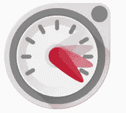
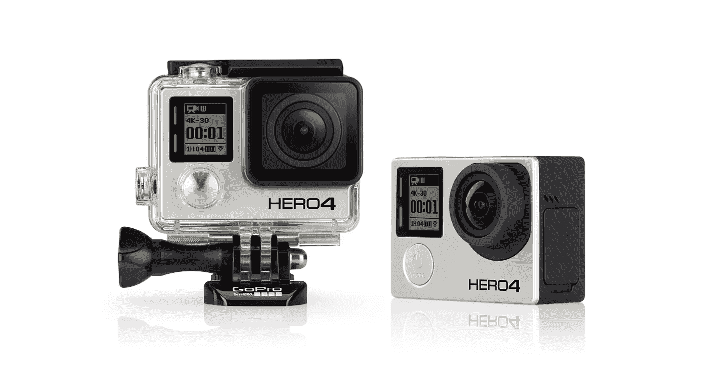
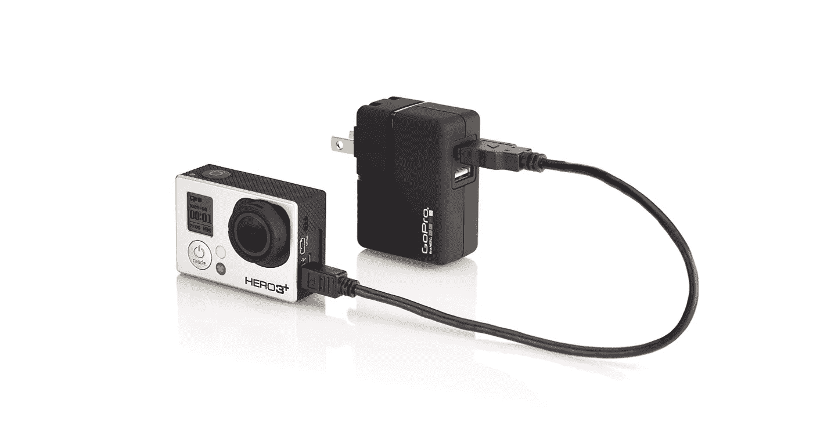
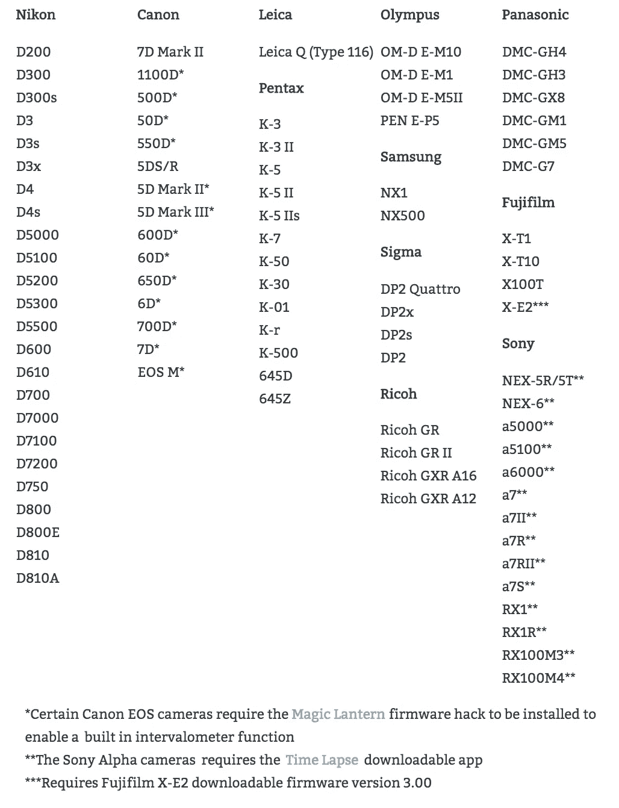
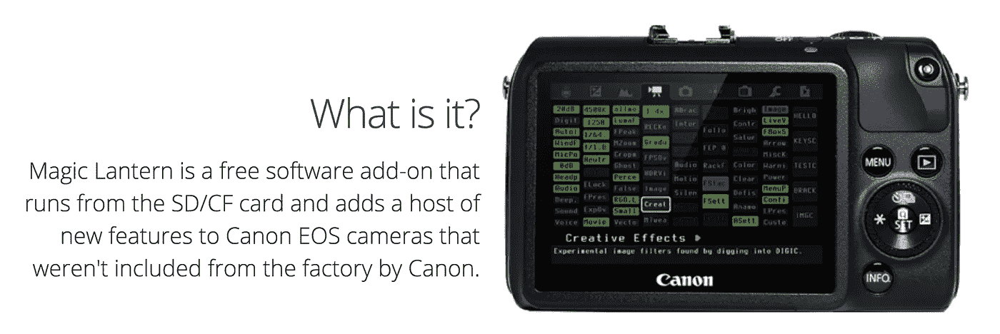
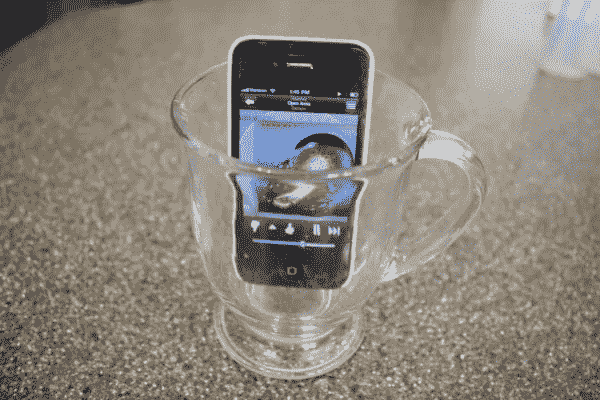

# 用你已经拥有的手机或相机来一次史诗般的“雪地漫步”

> 原文：<https://medium.com/hackernoon/create-your-first-snow-lapse-with-the-cameras-laying-around-your-home-74588bba47d1>

我们都见过他们。积雪瞬间堆积的神奇延时视频。现在，你可以用你家附近的许多相机中的一个来制作一个“降雪”。

Great snow-lapse by Micah Grimes in Massachusetts.

## 开始前的提示

*   15 秒。你拍的视频，做好了应该是 15 秒左右。为什么？人们会感到无聊。如果你想分享它，大多数社交媒体网站(Instagram，Twitter，Vine，Snapchat)允许 15 秒的视频。这里列出的许多应用程序会在开始时提示您为您计算时间。然而，如果你必须手动计算，这里有一个[方便的计算器](http://www.photopills.com/calculators/timelapse)可以帮助你。使用像 [iMovie](http://www.apple.com/mac/imovie/) 、 [Windows Movie Maker](http://windows.microsoft.com/en-us/windows/get-movie-maker-download) 、 [Quicktime](https://support.apple.com/en-us/HT201066) 或 [YouTube](https://www.youtube.com/editor) 这样的工具将你的视频剪短。
*   插上电源。不管是哪个设备，都尽量插上。拍摄照片时电池会很快耗尽。
*   保持温暖。如果你把你的[手机](https://hackernoon.com/tagged/phone)或[相机](https://hackernoon.com/tagged/camera)的插头放在寒冷的窗户附近，甚至是外面，电池会很快耗尽。如果你想疯狂，并且不担心你的设备在外面，尝试使用密封的[化学手环](http://www.amazon.com/Grabber-Hand-Warmers/dp/B002XZTQFK)来保持你的设备电池的温度。
*   绿色模式。保持自动曝光。如果太阳落山，或者落在山或建筑物后面，在手动模式下，您的图像将变得非常暗。
*   封锁它。确保你的 iPhone/相机/GoPro 不会被碰撞、撞击或从你放置的地方掉落。
*   飞行模式。如果你用的是手机，把它设置成飞行模式。一些电话、短信等会干扰定时录像。还有接电话会打乱你的画面。
*   存储空间。当开始定时拍摄时，确保你的手机至少有 1-2GB 的空间，或者你的相机至少有 8GB 的内存。

## iPhone/iPad/iPod Touch

用任何 iPhone、iPad 或 iPod Touch，你都可以捕捉精彩的延时视频。尝试这些应用程序:

Timelapse video made by Studio Neat with iOS timelapse mode.

[iOS 相机内置的延时模式](http://www.studioneat.com/blogs/main/15467765-how-does-the-ios-8-time-lapse-feature-work)
*(iPhone/iPad/iPod Touch，iOS 8.0 及以上，免费)* 死简单的延时方式，无需下载 app。滑动到 iOS 相机中的“延时”设置，点击红色大按钮。记录的时间越长，它会自动计算出时间间隔。

Hyperlapse by Instagram

[Hyperlapse](https://itunes.apple.com/us/app/hyperlapse-from-instagram/id740146917?mt=8&utm_content=7589633&utm_medium=social&utm_source=twitter)By insta gram
*(iPhone/iPad/iPod Touch，iOS 7.0 及以上，免费)* 目前为止最简单的延时 app 使用方法。只要确保为它记录的所有镜头腾出空间。

Lapse It

[失效 It](https://itunes.apple.com/us/app/lapse-it-time-lapse-stop-motion/id539108382?mt=8)
*(iPhone/iPad/iPod Touch，iOS 6.0 及以上，免费)* 简洁的用户界面。提供了比 Hyperlapse 更多的控制选项。

Timelapse

[延时](https://itunes.apple.com/us/app/timelapse/id301050966?mt=8)
*(iPhone/iPad/iPod Touch，iOS 8.3 及以上，$4.99)* 更高级。开始时设置你想要的剪辑长度，它会自动调整设置以达到你想要的 15 秒。

## 机器人

Microsoft Hyperlapse Mobile

[微软 Hyperlapse Mobile](https://play.google.com/store/apps/details?id=com.microsoft.hyperlapsemobile&hl=en)for Android
*(Android 平板电脑和手机，Android 4.4 及以上，免费)* 迄今为止最容易用于 Android 的延时应用。

Framelapse for Android

[frame lapse](https://play.google.com/store/apps/details?id=com.Nishant.Singh.DroidTimelapse&hl=en)for Android
*(Android 平板和手机，Android 4.0 及以上，Free-mium)* 简单的用户界面，多了几个控制的选项。

Lapse it for Android

[Lapse It](https://itunes.apple.com/us/app/lapse-it-time-lapse-stop-motion/id539108382?mt=8)for Android
*(Android 平板和手机，Android 2.2 及以上，免费-mium)* 老设备支持。付费选项增加更多的控制。

内置延时选项
许多安卓手机都直接在相机中内置了延时选项。先检查一下你的原生相机，看看它是否有延时设置。

## GoPro

大多数 GoPros 都内置了延时(或“间隔录制”设置)。最棒的是，你可以把它们放在外面的箱子里，以获得独特的视角。

GoPro 录制的最大障碍是正确设置延时间隔。在 8 小时内，试着将你的照片设置为每 1 分钟拍摄一次。

要将 GoPro 设置为拍摄延时:

1.  [通过日期](https://en.wikipedia.org/wiki/GoPro#Products)确定你拥有哪个 GoPro 或者[通过序列号确定你拥有哪个 GoPro。](http://gopro.com/support/articles/how-to-find-your-gopro-serial-number)
2.  [找到手册，按照说明操作。](https://gopro.com/support/product-manuals-support)
3.  插上电源。GoPro 电池快没电了。他们冷的时候会死得更快。试着把延长线从室内接到拍摄地点。然后使用标准的 Android 或 iPhone 电源模块转 USB，直接插入 GoPro 以保持通电。把你的电砖放在一个有小孔的自封袋里，以防止它的热量融化周围的雪，从而使它短路。

You can use a standard Android or iPhone power brick with the USB cable that came with your GoPro.

## DSLR

市面上有上百种型号的 DSLR 相机。大多数型号，尤其是 2013 年以后生产的型号，都内置了“间隔录音”模式。孤独斑点写的这个列表和文章是一个很好的起点。

Great information from the Lonely Speck website.

判断你的相机是否能做到这一点的最好方法是在谷歌上使用这个公式:

Replace “camera model” with the type of camera you own. Example, Nikon D5100, Canon 6D, etc.

## 指向和拍摄相机

Beautiful time-lapse made by Samuel Orr. [See how he did it.](http://www.motionkicker.com/a-forest-year/)

许多 2012 年后生产的傻瓜相机都集成了延时设置。再次使用谷歌公式:

Replace “camera model” with the type of camera you own. Example, Canon S100, Fuji XQ2, etc.

## 黑客点和拍摄和数码单反

现在也有“黑客固件”，可以让你在这些相机上加载新软件，增加相机原本没有的延时功能。查看[魔灯](http://www.magiclantern.fm/)和[佳能 Hack 开发套件](http://chdk.wikia.com/wiki/CHDK)了解更多信息。

重要！如果安装不正确，使用这些固件会搞乱你相机的大脑。这样做风险自负！

## 嵌套/Dropcam

Why is the pool completely fenced in?

*Dropcam 延时指令:*

1.  瞄准窗口附近的 Dropcam
2.  [遵循这些说明](http://support.dropcam.com/entries/40598288-How-do-I-make-a-Timelapse-clip-)

Great snow-lapse by Colid Lord made with a Nest camera.

*嵌套延时指令:*

1.  将巢式摄像机对准窗户附近
2.  [遵循以下说明:](https://nest.com/support/article/How-do-I-create-a-video-clip-from-my-Nest-Aware-Video-History#anchor2)

## 上升

通常使用手机或相机时，你会使用[三脚架](https://www.studioneat.com/products/glif)、[吸盘](http://www.amazon.com/Belkin-Window-Mount-Apple-iPhone/dp/B004CLYJ2S)、[大猩猩抓手](http://www.bestbuy.com/site/bower-flex-tripod-for-gopro-hero-black-gray/4290741.p?id=1219739458814&skuId=4290741)或[其他设备](https://www.indiegogo.com/projects/slopes-for-gopro-world-s-first-polyhedron-stand#/)。然而，我发现，如果留在室内，简单地使用书籍、杯子和其他家用物品将你的相机倾斜并调整到正确的位置就足够了。

This photo was taken by leaving my old iPhone 5 leaned up against a book near the hangar door of my office. The photo was captured using the app iLightningCam for iOS.

希望这些链接和花絮可以成为任何人尝试制作自己的即将到来的暴风雪的起点。拍摄愉快！

> [黑客中午](http://bit.ly/Hackernoon)是黑客如何开始他们的下午。我们是 [@AMI](http://bit.ly/atAMIatAMI) 家庭的一员。我们现在[接受投稿](http://bit.ly/hackernoonsubmission)并乐意[讨论广告&赞助](mailto:partners@amipublications.com)机会。
> 
> 如果你喜欢这个故事，我们推荐你阅读我们的[最新科技故事](http://bit.ly/hackernoonlatestt)和[趋势科技故事](https://hackernoon.com/trending)。直到下一次，不要把世界的现实想当然！

