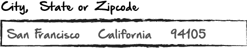
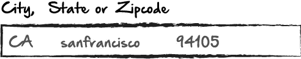
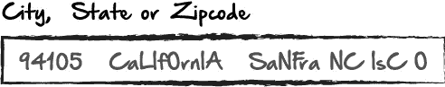

# 使用正则表达式创建更好的用户体验

> 原文：<https://medium.com/hackernoon/creating-a-better-user-experience-with-regular-expressions-f2bbf6e42c87>


我最近开始创建一个网站，用户可以在那里输入城市和州或邮政编码，并返回该位置的天气结果。我意识到，在这样做的过程中，提炼用户输入的一些困难例如，从用户那里，我需要得到一个城市&州或邮政编码。我可以简单地做这样的事情:


一个简单的搜索，有三个独立的输入和漂亮的小标签。然而，从用户体验的角度来看，大多数用户宁愿不使用 3 个独立的输入。所以我们只要改变它，对吗？我们将制作一个搜索栏，让用户将信息输入到一个搜索栏中。够简单了吧？我们可以从一个搜索栏中找到城市、州和邮政编码。如果用户像这样格式化他们的输入会怎么样:



如果每个用户都以这种格式输入他的响应，我们可以简单地将它放入一个数组中，并根据数组中每个元素的位置改进响应。[0]将是城市，[1]将是州，等等。但是，如果响应的格式如下:



或者甚至像这样:



关键是，没有办法保证用户会做什么。所以我们需要做的是写一些逻辑，无论输入什么，找出州和城市，并把两者分开。由于邮政编码是可选的，因为用户可以选择城市和国家或邮政编码，我们更喜欢邮政编码，因为它更具体。为此，我们可以简单地写一个循环输入的语句，并说，“好的，如果你看到一个包含 5 个或更多数字的字符串，隔离它并去掉所有其他的。”

很简单。但是让我们关注如何隔离城市和州，如果这是用户决定使用的。

以下是我的思考过程:州将更容易被隔离，因为州和地区只有 59 种可能性。如果我们有一个包含所有 59 个州的数组，我们可以将用户输入与该数组进行匹配，如果匹配，我们将使用该数组作为我们的州。稍后我将对其进行改进，对每个输入使用两个字母的缩写，但我们稍后会谈到这一点。

接下来，城市。这很棘手，因为一些州和城市包含相似或相同的单词，如，“纽约，纽约州”，“阿拉巴马州阿拉巴马市”，“印第安纳波利斯，印第安纳州”，等等。我们的代码很容易混淆哪个是州，哪个是城市，如果我们不小心的话，我们很容易返回给用户一些他们不期望的东西。

为了避免这种情况，我还将获得一个 JSON 对象数组，其中包含与每个州相关联的所有城市。这样，一旦代码最终隔离了该州，我就可以简单地获取其余的数据，并查看它是否与该州的城市数组中的任何内容相匹配。

最后，我需要做一些重新格式化。我使用的 API 需要城市和州的格式如下:

加州旧金山，

所以一旦我们弄清楚了什么是什么，我们就可以按照我们需要的方式格式化数据。让我们开始吧。首先是城市/州 JSON 对象。这个文件将是我在这里使用的最大的文件，所以一旦页面加载，在用户开始输入任何内容之前，我想在后台加载它以节省时间。我在 github 上找到了一个我喜欢的 JSON 对象，它拥有大部分数据，但我重新格式化了它，所以它更接近我想要的。这是链接，如果你想下载并跟随:[https://www.dropbox.com/s/uvmjnoql2lo5sqk/weather.json?dl=0](https://www.dropbox.com/s/uvmjnoql2lo5sqk/weather.json?dl=0)

我已经将这个文件上传到我的 mlab 数据库，现在我将使用 fetch 在文档加载后立即加载它:

```
fetch('[https://ethans_cute_web_app_api_blah_blah_blah').then(function(response)](https://api.mlab.com/api/1/databases/ethanscuteweatherapp/collections/states?&l=41000&apiKey=_ehmfqV-bs1PDWki2WNFVMsGmXGQuk77').then(function(response)) {
          if (response.status != 200) {
            window.alert("Oopsie.  You must have done something wrong.");
            return;
          }response.json().then(function(data) {let states = data;
```

请记住变量“states”，因为我们将先不讨论它，稍后再来讨论它。我们只是用这个来找出城市。

现在让我们弄清楚状态。

首先，我保存了一些变量，以后会用到。

```
let input = document.getElementById('input');
    let current = document.getElementById('current');
```

接下来，我将启动我的函数，开始获取和提炼用户输入。

```
current.onclick = currentAPI;    

    function currentAPI() {

      let inputValue = input.value;
```

我对此的想法是，用户可能要么输入整个州，要么输入两个字符的缩写。所以我要寻找这两种可能性。首先，我会寻找两个字符的缩写。这里是所有 59 个州和地区缩写的数组。它将直接进入我们的 currentAPI 函数:

```
let stateAbbr = [ "AK",
                      "AL",
                      "AR",
                      "AS",
                      "AZ",
                      "CA",
                      "CO",
                      "CT",
                      "DC",
                      "DE",
                      "FL",
                      "GA",
                      "GU",
                      "HI",
                      "IA",
                      "ID",
                      "IL",
                      "IN",
                      "KS",
                      "KY",
                      "LA",
                      "MA",
                      "MD",
                      "ME",
                      "MI",
                      "MN",
                      "MO",
                      "MS",
                      "MT",
                      "NC",
                      "ND",
                      "NE",
                      "NH",
                      "NJ",
                      "NM",
                      "NV",
                      "NY",
                      "OH",
                      "OK",
                      "OR",
                      "PA",
                      "PR",
                      "RI",
                      "SC",
                      "SD",
                      "TN",
                      "TX",
                      "UT",
                      "VA",
                      "VI",
                      "VT",
                      "WA",
                      "WI",
                      "WV",
                      "WY"]
```

接下来，我们将检查输入中是否有缩写。我们将通过循环输入，把它分成单独的文本块来实现。然后我们将循环遍历每一个，看看是否有两个字符长的。如果是这样，我们将把它与我们的州缩写进行比较。如果有匹配，我们将把它保存为一个变量。我是这样写这个逻辑的:

```
let possibleState = [];
      for (var i = 0; i < text2.length; i++) {
        if (text2[i].length == 2) {
          possibleState.push(text2[i])
        }
      }
```

所以在这里，如果用户输入任何两个字符串，它现在在我们的“possibleState”数组中。如果没有，我们的数组是空的。我们将继续假设那里有一些东西，将其转换为一个字符串，并根据我们的州缩写数组进行测试。

```
let state2 = possibleState.toString();

      let uppercaseState = state2.toUpperCase();

      let confirmedState = "";
      for (var i = 0; i < stateAbbr.length; i++) {
        if (stateAbbr[i] == uppercaseState) {
          confirmedState = stateAbbr[i];
        }
      }
```

我们走吧。我在这里做的是，取我们的 possibleState 数组，它可能有一个州的缩写，我把数组中的任何东西都转换成了一个字符串。接下来，我把它转换成大写，因为我们用来比较的数组是大写的。我们想确保我们是在比较苹果和苹果。然后我在 stateAbbr 数组中循环，如果数组中的任何状态与变量 uppercaseState 中的可能状态匹配，我们会将其定义为变量 confirmedState，因为现在我们已经确认这很可能是一个状态，如果那里有任何数据的话。现在，如果用户没有输入任何两个字符串，仍然可能什么都没有。如果那里有什么东西，那就是我们要用的那个。如果没有，我们将需要搜索一个被打出的州。所以我要做的是继续寻找一个打出的州名。然后我会创建一个名为“myState”的变量。我会说，“如果 possibleState 数组中有东西，那么 myState 就是两个字母的缩写，如果没有，那么它就是被打印出来的状态。”下面是我如何搜索打出的州:

```
let statesArray = ["alaska",
                  "alabama",
                  "arkansas",
                  "americansamoa",
                  "arizona",
                  "california",
                  "colorado",
                  "connecticut",
                  "districtofcolumbia",
                  "delaware",
                  "florida",
                  "georgia",
                  "guam",
                  "hawaii",
                  "iowa",
                  "idaho",
                  "illinois",
                  "indiana",
                  "kansas",
                  "kentucky",
                  "louisiana",
                  "massachusetts",
                  "maryland",
                  "maine",
                  "michigan",
                  "minnesota",
                  "missouri",
                  "mississippi",
                  "montana",
                  "northcarolina",
                  "northdakota",
                  "nebraska",
                  "newhampshire",
                  "newjersey",
                  "newmexico",
                  "nevada",
                  "newyork",
                  "ohio",
                  "oklahoma",
                  "oregon",
                  "pennsylvania",
                  "puertorico",
                  "rhodeisland",
                  "southcarolina",
                  "southdakota",
                  "tennessee",
                  "texas",
                  "utah",
                  "virginia",
                  "virginislands",
                  "vermont",
                  "washington",
                  "wisconsin",
                  "westvirginia",
                  "wyoming"];
```

类似于缩写，我有一个所有小写状态的数组，中间没有空格。

```
let text = inputValue.replace(/\W+/g, "");

      let inputLowerCase = text.toLowerCase(); let inputUpperCase = text.toUpperCase();
```

在这里，我取出了所有的用户输入，去掉了所有的空格和逗号等字符。然后我把它全部转换成小写字符。现在我需要比较两者。

```
let myState = "";

  for (var j = 0; j < inputLowerCase.length; j++) {
    for (var i = 0; i < statesArray.length; i++) {
      if (inputLowerCase.includes(statesArray[i])) {
        myState = statesArray[i];
      }
        }
      }
```

那里。我在比较两者。请记住，我们的输入可能包含许多不同的内容，所以我们只是循环查看 states 数组中的任何一项是否包含在输入的总字符串中。因此，如果输入包含 states 数组中的任何一项，我们就会得到它。最后，我们需要决定是否使用缩写，如果用户给了我们一个缩写的话，或者使用输入的状态，如果用户给了我们一个缩写的话。下面是我检查的方法:

```
let stateToUse = "";
      if (possibleState.length == 0) {
        stateToUse = myState;
      } else {
        stateToUse = confirmedState;
      }
```

好吧，那么现在，不管怎样，我们已经得到了我们的状态。但是，如果 state 不是缩写，我想把它转换成缩写。我们知道无论“stateToUse”是什么，它要么是一个缩写，要么是打出的状态，小写，不带空格。

```
let stateMatch = {"alaska": "AK",
                  "alabama": "AL",
                  "arkansas": "AR",
                  "americansamoa": "AS",
                  "arizona": "AZ",
                  "california": "CA",
                  "colorado": "CO",
                  "connecticut": "CT",
                  "district of columbia": "DC",
                  "delaware": "DE",
                  "florida": "FL",
                  "georgia": "GA",
                  "guam": "GU",
                  "hawaii": "HI",
                  "iowa": "IA",
                  "idaho": "ID",
                  "illinois": "IL",
                  "indiana": "IN",
                  "kansas": "KS",
                  "kentucky": "KY",
                  "louisiana": "LA",
                  "massachusetts": "MA",
                  "maryland": "MD",
                  "maine": "ME",
                  "michigan": "MI",
                  "minnesota": "MN",
                  "missouri": "MO",
                  "mississippi": "MS",
                  "montana": "MT",
                  "northcarolina": "NC",
                  "northdakota": "ND",
                  "nebraska": "NE",
                  "newhampshire": "NH",
                  "newjersey": "NJ",
                  "newmexico": "NM",
                  "nevada": "NV",
                  "newyork": "NY",
                  "ohio": "OH",
                  "oklahoma": "OK",
                  "oregon": "OR",
                  "pennsylvania": "PA",
                  "puertorico": "PR",
                  "rhodeisland": "RI",
                  "southcarolina": "SC",
                  "southdakota": "SD",
                  "tennessee": "TN",
                  "texas": "TX",
                  "utah": "UT",
                  "virginia": "VA",
                  "virginislands": "VI",
                  "vermont": "VT",
                  "washington": "WA",
                  "wisconsin": "WI",
                  "westvirginia": "WV",
                  "wyoming": "WY",
                };
    var re = new RegExp(Object.keys(stateMatch).join("|"), "gi");
    keyWord = stateToUse.replace(re, function(matched) {
      return stateMatch[matched.toLowerCase()];
    });

    let state3 = keyWord.toUpperCase();
```

所以在这里，我把第二种可能性转换成缩写。在这一点上，不管用户输入的是什么，不管它是如何大写的，或者即使它们在字符之间包含空格。不管怎样，在这一点上，我们有他们州的两个字母缩写。完美。现在是棘手的部分。这座城市。

还记得我们首先加载的 JSON 数据吗？这些数据看起来是这样的:

```
{"state":"AL","city":["ABBEVILLE", "ADAMSVILLE", "etc", "etc", "etc"]
}
```

每个州都有。基本上每个城市，每个州，数据都在一个叫做“州”的变量里。我将这样开始循环:

```
let myCity = "";
  for (var i = 0; i < states.length; i++) {
    if (states[i].state == state3) {
      for (var k = 0; k < states[i].city.length; k++) {
        if(text4.includes(states[i].city[k])) {
          myCity = states[i].city[k];
        }
      }
    }
  }
```

我使用了一个嵌套的 for 循环来测试我们的缩写状态和 JSON 数组中的状态，看看是否匹配。一旦我们得到一个匹配，我们就把它保存在变量“myCity”中

现在我们需要格式化它。如果城市是“夏洛特”，我们希望它给我们第一个字母大写的“夏洛特”。但是如果我们有“旧金山”呢？我们希望它返回这个:“San_Francisco”，每个单词的第一个字母大写，用下划线隔开。

```
let twoCity = myCity.toLowerCase();
  let threeCity = [];
  let string3 = [];
    for (var i = 0; i < twoCity.length; i++) {
      if (twoCity[i] == " ") {
        let newCity = twoCity.split(" ");
        threeCity.push(newCity);
    } else if (twoCity.includes(" ") == false && threeCity.includes(twoCity) == false) {
      let newCity2 = twoCity;
      threeCity.push(newCity2);
    }
  }
```

首先，我们将整个字符串转换成小写，然后用空格分割。这样我们现在就有了一个数组，“threeCity”。数组中是我们的城市名。我还在 for 循环的 if 语句中创建了两个场景。一个是两个单词的城市，说，“如果输入字符串包含一个空格，做点什么。”然后，第二个场景是我们正在处理一个单词的城市，所以我说，“如果输入不包含空格。”如果城市名不止一个单词，每个单词都是它自己的数组项。

```
let string4 = [];
for (var i = 0; i < threeCity.length; i++) {
  String.prototype.capitalize = function() {
    return this.charAt(0).toUpperCase() + this.slice(1);
  }
  if (threeCity.length <= 1) {
  let cityString = threeCity.toString();
  let newWord = cityString.capitalize();
  string4.push(newWord);
} else if (threeCity[0].length > 1) {
  for (var i = 0; i < threeCity[0].length; i++) {
    let newWord2 = threeCity[0][i].capitalize();
    string4.push(newWord2);
  }
}
}let string5 = string4.toString();
let string6 = string5.replace(",", "_");
```

在这里，我采用了 threeCity 数组，并通过一个将每个数组项的第一个字母大写的函数来运行它。现在，如果我们的城市是一个单词，两个单词，或 5 个单词或其他什么，每个单词都是大写的。

然后我把数组转换成一个字符串，这意味着我现在把每个单词都大写，用逗号隔开。所以我简单地用一个字符串替换方法，用下划线代替逗号。

哒哒！这可能有点过于复杂了。我相信有更简单的方法。但是它工作了，而且运行得相当快。这很好，因为我可以非常肯定，无论用户输入什么，或者他们的输入格式有多糟糕，我都可以得到州和城市。(只要我的城市数组是最新的)。

现在，我可以使用该城市和州从天气 api 中获取数据，这是我的初衷。但是我已经为最终用户简化了这个过程，他们现在可以在一个简单的搜索栏中输入所有内容。

如果你有任何反馈，请告诉我。谢谢！