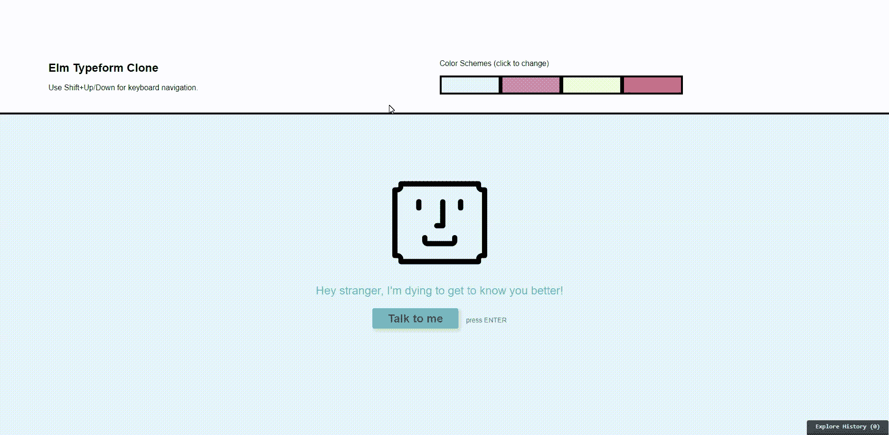
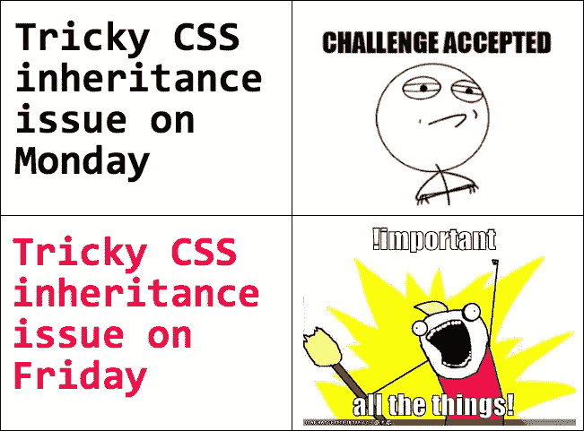
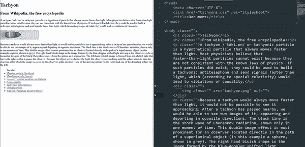
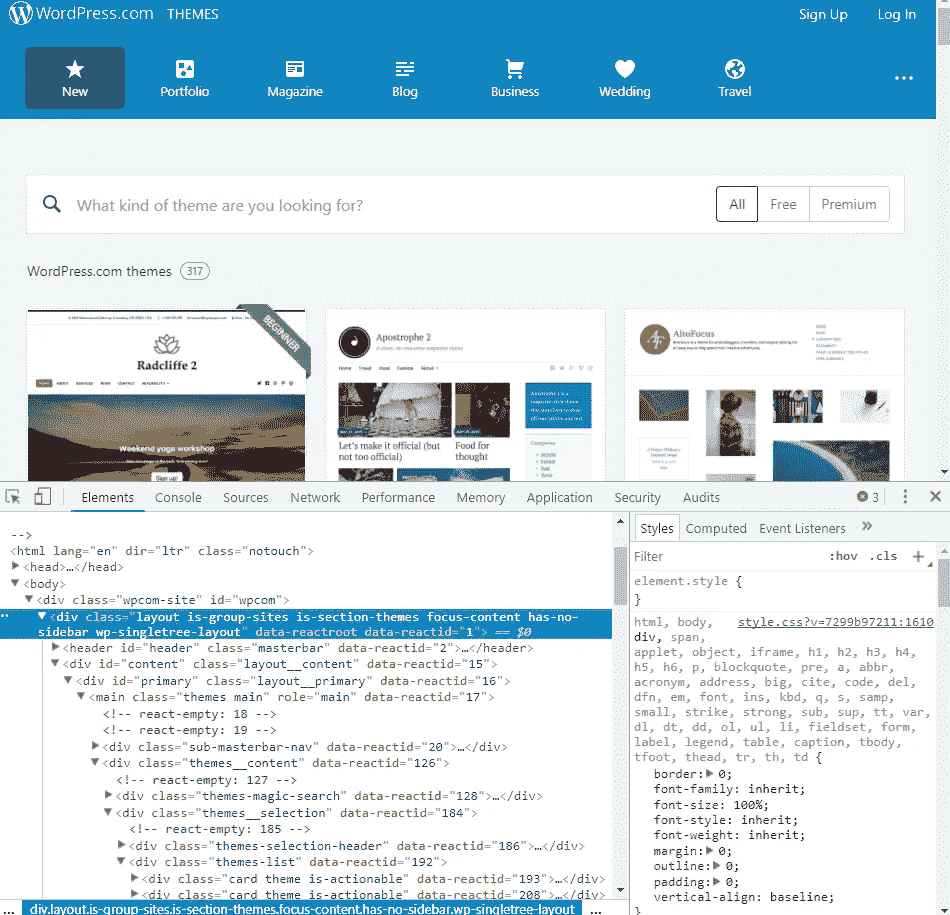
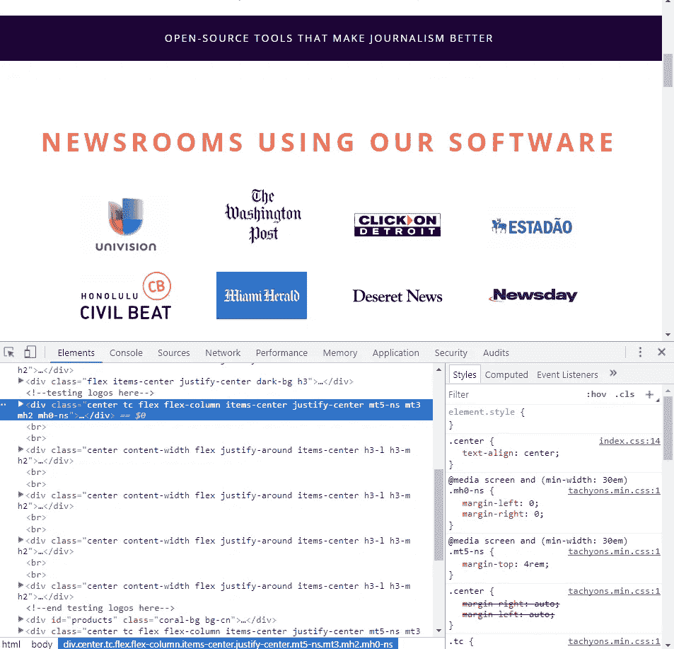
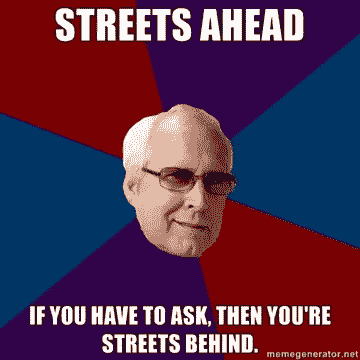

# 用榆树和超光速粒子创造一个复制的字体

> 原文：<https://medium.com/hackernoon/creating-a-clone-of-typeform-with-elm-and-tachyons-40519e6b45b9>

这是一篇关于我这个月做了什么，为什么我有动力去做它，以及我学到了什么的帖子。正如标题所言，该项目是 [Typeform](https://www.typeform.com/) 的克隆，这是一个用于构建和共享漂亮问卷的 web 应用程序。这里是一个[演示](https://dstreet26.github.io/elm-phoenix-typeform-clone/)。这里是[来源](https://github.com/dstreet26/elm-phoenix-typeform-clone)。这里还有一张 gif:



# 为什么是 Typeform？

它有着惊人的用户体验:
1。它的颜色和布局看起来很棒。它是光滑的。在问题间导航很快。
3。它有用于回答问题和导航表单的键盘快捷键。
4。动态问题会根据用户输入的内容而变化。

但那又怎样？为什么这使它成为克隆的一个很好的候选？

丹·平克谈到了激励的三大支柱:自主、掌握和目标。

> “为什么要去追求你永远得不到的东西呢？但它也是诱惑的来源。为什么不伸手去拿呢？快乐在于追求，而不在于实现。最终，精通之所以吸引人，正是因为精通之所以逃避。”
> ――丹尼尔·H·平克，驱动力:关于我们动力的惊人真相

使用 Elm 创建一个具有上述特性的界面是我的技能集中的**边缘。换句话说，我过去从未能做到这种忠诚，但我知道我有能力做到，因此动力十足。**

# 用超光速粒子画草图

大约 6 个月前，我在创建一个新的静态网站，但我不想让它看起来像所有的自举网站一样。我本可以找到一个与给定设计相匹配的 CSS 主题，但是这些主题通常有一些边缘情况需要解决。另外，如果设计只使用了主题中 20%的 CSS，额外的 80%很难去掉，因为像媒体查询和嵌套规则这样的复杂性。



我为那个项目和这个项目都选择了[超光速粒子](https://hackernoon.com/tagged/tachyons),因为我可以创建一个完全设计好的网站，而无需接触 CSS。实际上，我为上一个项目编写的唯一 CSS 是一对夫妇的颜色。

这是我做的一个简单的例子，展示了超光速粒子的迭代过程有多快。



Sketching with Tachyons

[链接到 Jsbin](https://jsbin.com/lavupuc/edit?html,output)

调试超光速粒子设计也更容易。通常情况下，浏览器的开发工具在研究事物的外观时会显示如下内容:



Not only is there a lot of classes to debug, but each one can have many properties!

如果布局有问题需要调试，就必须打开 HTML 和 CSS 代码。这可能只是 2 个文件，但如果 CSS 通过预处理程序包含其他文件，或者如果 HTML 由 JS 控制，可能会更多。

对于超光速粒子，唯一需要担心的代码是 HTML。即使 HTML 很大程度上由 JS 控制，调试元素和测试不同的解决方案仍然更容易。

例如，下面是一个类似的复杂布局:



Still many CSS classes on those elements, but each one only has one property.

在这里，我们看到了影响元素及其父元素的所有属性。虽然看起来和前面的例子一样复杂，但是每个类只做**一件事**，所以调试起来容易多了。

不必编写 CSS 的另一个好处是不必想出类名。给东西命名[很难](https://martinfowler.com/bliki/TwoHardThings.html)。像 BEM 和 SMACCS 这样的约定对于标准化名字是有效的，但是你仍然需要想出名字，而且它们会很长:`sidebar__section sidebar__section — large`

如果你一开始就不用说出任何东西的名字，不是更好吗？为这个项目选择超光速粒子的最后一点:我现在更了解 CSS 了。Bootstrap 和类似的框架使得把一些在大多数环境下看起来不错的东西放在一起变得非常容易，但是不是[学习](https://hackernoon.com/tagged/learning) CSS，而是学习那些框架的特定类名和习惯用法。

关于使用超光速粒子如何简化设计的更多例子，Simon Vrachliotis 写了一个很棒的系列，他重写了 [SocietyOne](https://www.societyone.com.au/) 的设计。

# 用 Elm 建模

[地段](https://hackernoon.com/why-elm-is-going-to-change-the-world-f5a6c693b2ca)的[讨论](/elmlightments/why-elm-is-a-future-of-frontend-interview-with-preethi-kasireddy-92d6bc6a5018)已经[发生](http://ohanhi.com/master-elm-1-why-elm.html)上[为什么](http://www.oreilly.com/web-platform/free/files/why-elm.pdf)到[选择](http://www.chriskrycho.com/2017/why-elm-instead-of-typescript.html)榆树进行[前端](https://css-tricks.com/elm-get-started/)开发。如果文章不是你的风格，那么 YouTube 是你的朋友。

两个特别的优点是它灵活的类型系统和它的编译错误。

Haskell 用户会很快指出他们的类型系统更加灵活，他们是对的！虽然 Elm 没有*类型类，但是*与 JavaScript 相比，它遥遥领先。



## 一些类型和编译器错误

当我过去构建 Angular 应用程序时，我可能会用 JSON 表示一个问题列表，如下所示:

```
[{
    title: "Question 1 - Enter your name",
    type: "text",
    value: ""
},{
    title: "Question 2 - Select a Country",
    type: "dropdown",
    choices: ["Abkhazia", "Afghanistan", "Aland", "..."]
    filteredChoices: [],
    selectedChoice: ""
},{
    title: "Question 3 - Select a Gender",
    type: "select",
    choices: ["Male", "Female", "Other"],
    selectedChoice: ""
}]
```

但是我们可以让 Elm 为我们提供更强类型的保证:

```
type alias Question =
    { title : String
    , type: QuestionType
    , answer : String
    }type QuestionType
    = Text TextOptions
    | Select SelectOptions
    | Dropdown DropdownOptionstype alias TextOptions =
    { internalValue : String
    }type alias DropdownOptions =
    { choices : List String
    , filteredChoices : List String
    , inputValue : String
    }type alias SelectOptions =
    { choices : List String
    }
```

Elm 会让我们预先做更多的工作来编写遵循这个模式的代码，但是如果我们搞砸了，我们会有一些好的错误:

```
-- NAMING ERROR --------------------------------------------------- elm/Main.elmCannot find variable `answr`510|             List.map (\q -> { q | answer = answr }) questions
                                                         ^^^^^^^^^
Maybe you want one of the following?answer
```

## 简易模式

作为开发人员，有效地重构数据是一项很好的技能。在 Elm 中拥有这两个特性意味着当改变应用程序模型时:那些改变做得很正确。
2。依赖于那些变化的一切都知道它。

“当它编译时，它工作”
—榆树社区

## 绊脚石和我的解决方法

这个项目中有几个部分让我耽搁了一天左右。我将尝试涵盖其中的大部分:

**如何获得键盘导航？**使用[键盘-额外](https://github.com/ohanhi/keyboard-extra)，添加一个消息，添加一些`case`逻辑，根据按下的键(Enter、Shift+上/下、Escape)路由到不同的功能

**如何在问题间平滑滚动？**我使用了一个[smooth scroll](https://github.com/alicelieutier/smoothScroll)Javascript 库，并添加了一个端口来告诉它做什么。

**不用单独的 CSS 文件如何做多种配色？**只需做一个类型别名来存储颜色(原色、次色、背景、悬停等。).然后在视图函数中，简单地设置 HTML 样式属性。一个问题是不能使用 CSS hover psuedo 类，所以我使用了 [elm-dynamic-style](https://github.com/identicalsnowflake/elm-dynamic-style) 。

**如何在问题正文中添加 Markdown？**简单:[榆树降价](https://github.com/pablohirafuji/elm-markdown)

**如何在问题之间和下拉项目之间上下导航？**使用拉链结构……一个什么？

# 拉链拯救世界


我第一次听说这种数据结构是在 Richard Feldman 关于[让不可能的状态变得不可能](https://www.youtube.com/watch?v=IcgmSRJHu_8)的演讲中。如果你是 Elm 新手或者正在学习它，我推荐你看完整个视频，因为它是开放的。

[拉链](https://en.wikipedia.org/wiki/Zipper_(data_structure))是一种遍历和更新数据结构的技术。在我的例子中，数据结构是一个列表，但它也可以应用于树。基于列表的 zipper 的类型签名是:

`type Zipper a = Zipper (List a) a (List a)`

[elm-list Zipper](https://github.com/wernerdegroot/listzipper)库实现了一个 API 来使用 Zipper 技术。有了它，我可以把我的列表改成拉链，并轻松地遍历它们。我最常用的函数是*地图*、*地图当前*、*下一个*、*上一个*、*查找*。

例如，演示中的问题列表是一个“拉链问题”，演示中的下拉选项是一个“拉链串”。这允许用一行代码执行常见的操作(下一项、上一项、获取选定项、更新选定项)。

```
-- The updated model for the filterable dropdown, notice the Zipper
type alias DropdownOptions =
    { choices : List String
    , filteredChoices : Zipper String
    , inputValue : String
    , showList : Bool
    }
```

由于 Elm 的编译器消息，您可以简单地更改您的定义并跟踪错误直到代码编译。

下面是一个代码片段，演示了如何处理像上下按键这样的导航事件。如果我不使用 zipper，我将不得不设置“selected id”或“isSelected”标志，并处理边缘情况逻辑。有了拉链，我就可以调用下一个的*或上一个*的*，并给它一个默认值以防出错。*

```
handleUpOrDown : Direction -> Model -> Model
handleUpOrDown direction model =
    let
        nextZipper =
            case direction of
                Up ->
                    Zipper.previous model.filteredChoices
                Down ->
                    Zipper.next model.filteredChoices
    in
        { model | filteredChoices = nextZipper |> Zipper.withDefault "Not Found :(" }
```

使用 *mapCurrent 更新拉链关注的项目也很容易。*

```
setQuestionIsFocused : Zipper Question -> Zipper Question
setQuestionIsFocused zipper =
    Zipper.mapCurrent (\x -> { x | isFocused = True }) zipper
```

# 下一步是什么？

这个项目的主要目标是学习更多的 Elm 和使用超光速粒子。如果有足够的兴趣来克隆更多的 Typeform，我将构建一个界面来交互式地构建问卷并添加用户支持。现在，代码需要重构，这是容易的部分！

我在远程网站开发工作的市场。如果你有兴趣雇用我，给我发电子邮件！

davidstreeterconsulting@gmail.com

[](https://davidstreeterconsulting.com) [## 大卫·斯特里特咨询公司

### 网站优化|重新设计|新网站|网站开发咨询

davidstreeterconsulting.com](https://davidstreeterconsulting.com)