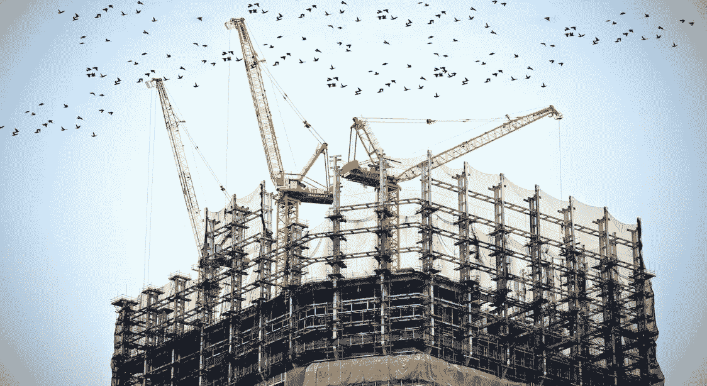

# 创建一家着眼长远的公司

> 原文：<https://medium.com/hackernoon/creating-a-company-designed-for-the-long-haul-b176fe77400a>

[Photo by [贝莉儿 NG](https://unsplash.com/photos/8Gg2Ne_uTcM?utm_source=unsplash&utm_medium=referral&utm_content=creditCopyText) on [Unsplash](https://unsplash.com/?utm_source=unsplash&utm_medium=referral&utm_content=creditCopyText)]

## 创造可持续的价值应该是任何公司的目标。领导者可以用长期愿景、增长模式和良好的工作环境来指引方向。

> 仅仅在某些领域(如书本知识和技术)出类拔萃的人只不过是国家和社会这个庞大机制的组成部分。有能力的人是有创造力的人，他们不懈地追求崇高的理想，具有丰富的个性，能够自由而有效地运用他们的知识和技能。”–池田大作

几十年前，日本哲学家池田将价值创造本质上定义为“在任何情况下，寻找意义、提升自身存在并为他人福祉做出贡献的能力。”

在狭义的财务术语中，价值创造意味着创造收入，收入超过支出，从而为利益相关者带来利润或价值。

管理大师彼得·德鲁克(Peter Drucker)拓宽了商业价值创造的这一狭隘概念，他说:“事实上，现代组织的创建是为了在外部产生结果，也就是说，改变其社会或经济。”

和德鲁克一样，我认为隐性——和显性——期望是企业应该为他人“做好事”:最终目标是产生大量新思想、深刻变革、动态创新和可持续机会。要创造这样的价值，需要:驱动长远的眼光；为增长创造*平台*；和培养协同的生态系统。

为了创造真正的不同，领导者必须着眼于长期目标，而不是盯着短期数字。成功不仅仅是由资产负债表来衡量的，关注季度回报从长远来看是行不通的。动荡的时代是不可避免的，但我们可以通过支持我们愿景并使我们能够创造有意义价值的长期计划，为社会中的任何中断做好准备。

考虑以下愿景陈述:

**Nike:** “为世界上的每一位运动员*带来灵感和创新。*如果你有身材，你就是运动员。”

**宜家:**“宜家的愿景是为大众创造更美好的日常生活。我们提供各种设计精良、功能齐全的家居产品，价格低廉，让尽可能多的人买得起，从而让这一切成为可能。”

这些愿景声明中没有一个真正谈到为自己创造财务价值。

美国西北大学 J. L .凯洛格研究生院名誉教授阿尔弗雷德·拉帕波特(Alfred Rappaport)在他的著作《从短期主义中拯救资本主义 中呼吁克服对短期利润的沉迷——并通过以下方式走上建立长期价值的道路:

*   获得高级管理层和董事会将长期价值创造作为其管理目标的承诺
*   奖励首席执行官、运营部门经理和一线员工实现卓越长期价值的激励措施
*   使投资经理和股东利益一致的绩效费。
*   积极管理的基金，集中持股，投资眼光长远，有利于更好的长期股东回报。

他认为，如果企业和投资领导人不解决短期主义的问题，更多的金融危机可能会发生，而且可能比 2008 年的金融危机更严重、范围更广。权衡显而易见:我们可以继续追求短期利润，代价是经济活力、个人金融安全，甚至可能是自由市场体系本身的主导地位。或者我们可以走负责任的道路，创造创新、质量、增长和长期价值。

## **成功和成长的平台**

术语“平台”在各种上下文中使用。早期，它通常是计算的“操作系统”的同义词。但是今天它被用来描述各种各样的场景。

业务平台创造了一个加速运营、拉近与客户和合作伙伴距离、推动创新和提高效率的环境。

微软和谷歌等科技巨头已经掌握了这一点，但每个行业都需要一个平台来推动它进入下一个阶段。以英国商业巨头理查德·布兰森(Richard Branson)为例，他建立的平台已经发展成为拥有 400 多家公司的维珍集团(Virgin Group)。布兰森的标志性品牌被他非正统的叛逆者形象所打断，他从未让变化阻碍他的长期目标。1970 年，他发起了一项唱片邮购业务，两年后创建了维珍唱片公司。音乐和媒体业务变成了维珍超市。当数字音乐革命迫使他关闭高耸的商店时，他已经扩大了自己的品牌，从 20 世纪 80 年代开始，当时他成立了维珍大西洋航空公司。他从未放缓扩展其平台的雄心，甚至超越了地球，他的最新计划是建立一个轨道空间发射系统。他的平台是业务结构、品牌和独特管理文化的平台。

业务平台具有以下关键属性:

*   它吸引了各种各样的利益群体。为了繁荣，这些社区应该得到管理和培育。
*   围绕一个平台建立一个社区，使我们能够在客户、供应商和合作伙伴的热情帮助下更有效地建立我们的业务。
*   它不区分大小客户或合作伙伴。

## **创造可持续发展的生态系统**

一个成功的商业平台驱动着一个活生生的生态系统。在生态系统中——由供应商和分销商等相互联系的组织组成的网络，它们相互作用，主要是补充或提供其集体产品和服务中的价值主张(客户利益)的关键组成部分。

《竞争之死》的作者詹姆斯·f·摩尔将“商业生态系统”定义为:

“一个由相互作用的组织和个人——商业世界的有机体——组成的基础所支持的经济共同体。随着时间的推移，他们共同进化他们的能力和角色，并倾向于与一个或多个中心公司设定的方向保持一致。那些担任领导角色的公司可能会随着时间的推移而改变，但生态系统领导者的职能受到社区的重视，因为它使成员能够朝着共同的愿景前进，以协调他们的投资，并找到相互支持的角色。”

如今，每位领导者都必须培育一个健康的商业生态系统，以取得长期成功。这是我们围绕我们的组织形成的结构，以度过艰难时期，并在繁荣时期蓬勃发展。正是这种环境让我们能够与带来独特视角和技能的不同个人和团体合作。

可持续的生态系统为我们提供:

*   可以集成到现有流程中的新功能和流程扩展。
*   通过更容易产生、评估和实施的合作伙伴/客户反馈进行创新和改进。
*   可以更快、更有效地获得商业机会。

***版权所有 2017 费萨尔·霍克。保留所有权利。***

我是一名[企业家和作者](http://faisalhoque.com/speaking/)。[沙多卡](http://shadoka.com/)等公司创始人。Shadoka 让抱负成为领导、创新和变革的动力。Shadoka 的加速器和解决方案汇集了管理框架、数字平台和思想领导力，以实现创新、转型、创业、增长和社会影响。

《“ [*《万物互联——如何在创意、创新和可持续发展的时代进行变革和领导》*](http://www.amazon.com/Everything-Connects-Creativity-Innovation-Sustainability/dp/0071830758/ref=sr_1_1?ie=UTF8&qid=1376488798&sr=8-1&keywords=everything+connects%2Bfaisal+hoque) 》(麦格劳·希尔)和《 [*《生存并茁壮成长:弹性企业家、创新者和领导者的 27 种实践*](http://survivetothrive.pub/) 》(励志出版社)的作者。在推特上关注我。*免费使用* [*万物互联*](http://app.everythingconnectsthebook.com/login.php) *领导力 app 和* [*生存茁壮*](http://app.survivetothrive.pub/login.php) *弹性 app。*