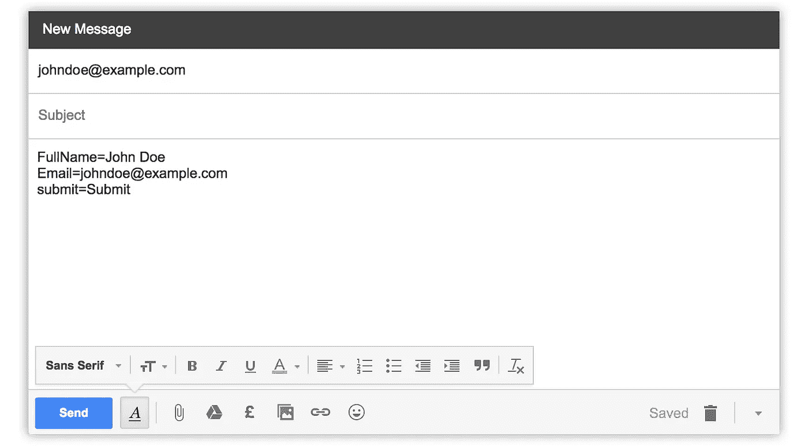
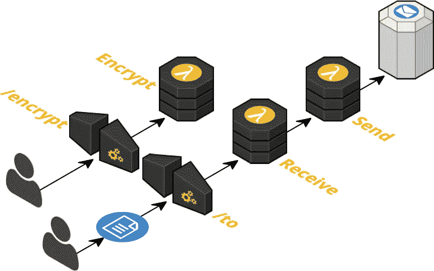
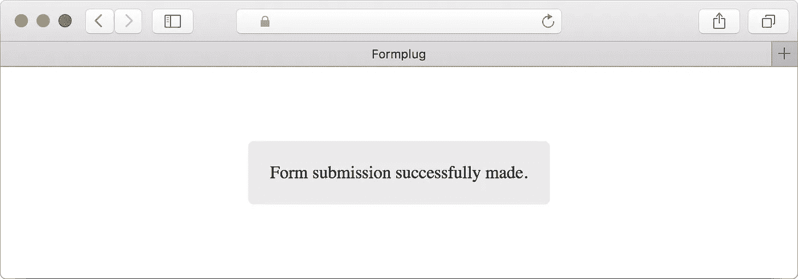

# 为 AWS Lambda 创建表单转发服务

> 原文：<https://medium.com/hackernoon/creating-a-form-forwarding-service-for-aws-lambda-aec07af9f951>


Using graphics from [SAP Scenes Pack](https://experience.sap.com/designservices/approach/scenes)

自从最初发表这篇博文以来，我已经写了一篇更新的文章。我建议你去读它，而不是继续读下去，因为下面的一些内容现在已经过时了 **e** 。

[](https://hackernoon.com/introducing-formplug-v1-a-form-forwarding-service-for-aws-lambda-2c125dfe608e) [## 介绍 Formplug v1，这是一种用于 AWS Lambda 的表单转发服务

### 据估计，每天大约有 2690 亿封电子邮件被发送出去。当你阅读的时候，已经有超过 1000 万封被寄出…

hackernoon.com](https://hackernoon.com/introducing-formplug-v1-a-form-forwarding-service-for-aws-lambda-2c125dfe608e) 

在这篇文章中，我将介绍一个我创建的服务，它可以让设置邮件转发变得简单。它使用 Node.js 和无服务器框架构建在 [Javascript](https://hackernoon.com/tagged/javascript) 中。它部署到 AWS Lambda，并使用亚马逊简单电子邮件服务发送电子邮件。要查看代码，请参见下面的 Github 资源库。请继续阅读问题的解释和技术解决方案的演示。

[](https://github.com/danielireson/formplug-serverless) [## Daniel reson/form plug-无服务器

### 用于 AWS Lambda 的表单插件-无服务器表单转发服务

github.com](https://github.com/danielireson/formplug-serverless) 

# 问题

最近，我发现自己对我的副业项目倾向于静态网站托管。Github Pages 工作得很好，因为像大多数人一样，我使用 Github 来托管我的 git 库。部署一个网站就像`git push`到 *gh-pages* 分支一样简单，几分钟后网站就会上线。在许多情况下，静态托管是非常好的，但现在有几次，我很难建立一个简单的基于电子邮件的联系表单——这通常不会被认为是太有挑战性的任务。有几种方法可以解决这个问题。

## 选项 1:无联系表格

显而易见的第一个选择是完全避免联系表单，而只显示电子邮件地址。这是我在很多场合选择的方法，因为它最简单，但也有一些缺点。它把额外的工作推给了用户——他们必须离开网站，打开他们的电子邮件客户端。当访问者第一次联系你时，也很难指定需要什么信息，例如，你可能需要报价的资格信息。你可以给用户发一条信息询问具体的信息，但是没有验证可以确认人们是否遵守了这个请求。

## *选项 2: mailto 链接*

通过电子邮件发送表单的一个解决方案是将表单的 action 属性设置为一个电子邮件地址的 *mailto* 链接。当用户提交表单时，它打开默认的电子邮件客户端，表单数据作为主体，如下面的屏幕截图所示。结果不是很好的用户体验。并非所有用户都有默认的电子邮件客户端设置，即使他们有，也会收到一封草稿邮件。目前还不清楚该表格是否已经提交，以及他们需要采取什么行动。



## 选项 3:使用服务器端代码

作为一项安全功能，您不能在浏览器中发送电子邮件客户端。如果这是可能的，网站访问者将非常容易受到代表他们发送电子邮件的恶意代码的影响。如果你已经在一个服务器上托管了你的应用程序，那么设置一个联系表单是很容易的。像 PHP、Java 或 ASP 这样的服务器端脚本语言具有使发送电子邮件变得容易的能力。例如在 PHP 中，它可以通过两行代码实现。

```
$message = $_POST['message'];
mail('johndoe@example.com', 'Form submission', $message);
```

然而，如果你还没有一个服务器，只为一个联系表单维护一个服务器似乎有点浪费。维护它需要时间和财务成本，而且它还引入了关于可伸缩性和安全性的其他考虑因素。

## 选项 4:使用第三方服务

托管表单后端服务的功能和范围各不相同。 [FormKeep](https://formkeep.com/) 举例来说，它可以很容易地将表单集成到 Trello、Slack 或 Google Sheets 等服务中，但对于一个简单的联系人表单来说，每月 59 美元起的计划可能会很昂贵。使用第三方服务也总是存在风险；它可以随时离线，你无法控制它。如果服务被关闭，将不会有任何通知，联系方式将会突然停止工作。

# 解决办法

在我看来，自托管表单转发服务是最佳解决方案。您将获得控制的优势，并且不会降低最终用户体验。选择为 AWS Lambda 开发后端进一步减少了自托管的许多缺点。

> AWS Lambda 允许您在不提供或管理服务器的情况下运行代码。您只需为您消耗的计算时间付费，当您的代码不运行时，则不收费。有了 Lambda，你可以为几乎任何类型的应用程序或后端服务运行代码——所有这些都无需管理。只需上传你的代码，Lambda 就会为你的代码提供高可用性的运行和扩展。

在 AWS Lambda 上构建应用程序有多种方法。对于简单的服务，您可以使用 AWS 管理控制台来创建函数和设置触发器。对于更复杂的服务，最好在本地开发，然后部署到 AWS，在那里您可以享受您最喜欢的代码编辑器带来的便利。最初建立项目结构可能具有挑战性，因为有许多事情需要考虑。服务将部署到哪个 AWS 区域？如何提供 AWS 服务？如何管理环境变量？如何管理安全性？出于这些考虑，当使用 AWS Lambda 时，我喜欢使用一个自以为是的框架，称为无服务器框架。它提供了合理的默认值，并允许我们在更高、更容易理解的抽象层次上提供服务。使用 CLI，部署和更新服务就像运行`serverless deploy`一样简单。

如果你想了解更多关于无服务器框架的知识，我推荐你看下面这个视频，它的创作者是奥斯丁·柯林斯。这个视频已经有几年的历史了，但是它很好地介绍了一些核心概念。我还建议浏览一下[的无服务器文档](https://serverless.com/framework/docs/)。

# 架构概述

表单转发服务由三个 lambda 函数组成:加密、接收、发送。加密和接收功能分别通过亚马逊 API 网关路由*/加密*和*/到*触发。(API 网关路由本质上是一个公共 URL。)发送 lambda 函数仅由接收 lambda 函数调用。receive lambda 负责处理表单提交，并调用 send lambda 发送电子邮件。encrypt lambda 可以选择性地用于获取电子邮件地址的加密表示，以便在接收端点 URL 中使用。稍后将对此进行更详细的解释。



# 接收λ

接收处理程序由 */to* 路由触发，该路由接受一个参数，即转发表单的电子邮件地址。端点在初始的`serverless deploy`上生成，并在终端窗口中返回。它采用以下结构。

```
https://apigatewayurl/to/johndoe@example.com
```

HTML 表单应该发送到此端点。这将触发接收 lambda(如下所示)。它负责验证请求，获取表单数据并调用 send lambda。

```
module.exports.handle = (event, context, callback) => {
  let data = receiveRequest.getParams(event)
  if (receiveRequest.validate(data, callback)) {
    eventInvoker.send(data)
      .then(function () {
        httpRoute.render('receive-success', data, callback)
      })
      .catch(function (error) {
        httpRoute.render('receive-error', data, callback)
      })
  }
}
```

## 获取表单数据

表单的 POST 请求将生成一个 API Gateway 事件，该事件将作为第一个参数自动传递给处理程序。下面显示了一个事件示例(删除了敏感字段)。

```
{  
   resource:'/to/{_to}',
   path:'/to/johndoe@example.com',
   httpMethod:'POST',
   headers: {
      Accept:'*/*',
      'Accept-Encoding':'gzip, deflate',
      'cache-control':'no-cache',
      'CloudFront-Forwarded-Proto':'https',
      'CloudFront-Is-Desktop-Viewer':'true',
      'CloudFront-Is-Mobile-Viewer':'false',
      'CloudFront-Is-SmartTV-Viewer':'false',
      'CloudFront-Is-Tablet-Viewer':'false',
      'CloudFront-Viewer-Country':'GB',
      'content-type':'application/x-www-form-urlencoded',
      Host:'',
      'User-Agent':'',
      'X-Amz-Cf-Id':'',
      'X-Amzn-Trace-Id':'',
      'X-Forwarded-For':'',
      'X-Forwarded-Port':'443',
      'X-Forwarded-Proto':'https'
   },
   queryStringParameters:null,
   pathParameters: {
      _to:'johndoe@example.com'
   },
   stageVariables:null,
   requestContext: {  
      path:'/dev/to/johndoe@example.com',
      accountId:'',
      resourceId:'',
      stage:'dev',
      requestId:'',
      identity:{  
         cognitoIdentityPoolId:null,
         accountId:null,
         cognitoIdentityId:null,
         caller:null,
         apiKey:'',
         sourceIp:'',
         accessKey:null,
         cognitoAuthenticationType:null,
         cognitoAuthenticationProvider:null,
         userArn:null,
         userAgent:'',
         user:null
      },
      resourcePath:'/to/{_to}',
      httpMethod:'POST',
      apiId:''
   },
   body:'first=test&second=test&third=test',
   isBase64Encoded:false
}
```

我们只对一些事件数据感兴趣，所以我们通过 *getParams* 函数提取这些数据。具体来说，我们感兴趣的是从 *event.body、*event . path parameters 获取表单数据，从*event . query string parameters*获取查询字符串。

```
module.exports.getParams = function (event) {
  let data = Object.assign({}, querystring.parse(event.body), event.pathParameters, event.queryStringParameters)
  return data
}
```

节点 querystring 模块用于解析来自请求主体的 POST 表单数据。这将获取字符串*first = test&second = test&third = test*，并将其转换为一个 JavaScript 对象。

## 验证请求

然后，数据经过一个验证函数，该函数检查电子邮件是否有效，蜜罐字段是否没有填写。

```
module.exports.validate = function (data, callback) {
  return hasValidEmail(data, callback) && hasNoHoneypot(data, callback)
}function hasValidEmail (data, callback) {
  if (!('_to' in data)) {
    httpRoute.render('receive-no-email', data, callback)
    return false
  }
  if ('_to' in data && !httpValidation.isEmail(data['_to'])) {
    httpRoute.render('receive-bad-email', data, callback)
    return false
  }
  return true
}function hasNoHoneypot (data, callback) {
  if ('_honeypot' in data && data['_honeypot'] !== '') {
    httpRoute.render('receive-honeypot', data, callback)
    return false
  }
  return true
}
```

蜜罐字段是可选的垃圾邮件防御功能。用户可以将该字段添加到表单中，并对访问者隐藏。

```
<input type="text" name="_honeypot" style="display:none">
```

如果表单被提交并且蜜罐字段不为空，请求将被忽略(因为垃圾邮件机器人试图在那里输入值)。

## 调用发送 lambda

验证后，使用 AWS-SDK npm 包异步调用 send lambda 和数据负载。

```
module.exports.send = function (data) {
  let event = {
    FunctionName: `formplug-${config.STAGE}-send`,
    InvocationType: 'Event',
    Payload: JSON.stringify(data)
  }
  return lambda.invoke(event).promise()
}
```

它异步调用它，因为我们不希望访问者在提交表单后等待亚马逊发送电子邮件。以这种方式调用它也意味着如果失败了，AWS 将自动重试。

## 生成 HTTP 响应

HTTP 响应是通过处理程序的*回调*函数做出的。这是由无服务器框架提供的。为了获得成功的响应，回调函数应该使用第一个参数作为 null，第二个参数作为响应对象。例如，要生成一个成功的纯文本 HTTP 响应，我们可以这样做。

```
callback(null, {
  statusCode: 200,
  headers: {
    'Content-Type': 'text/plain'
  },
  body: 'Form submission successfully made'
})
```

但是我们想要的不是纯文本响应，而是 HTML、JSON 或 URL 重定向响应(取决于用户的请求)。应用程序默认为 HTML 响应。



HTML 响应是通过加载本地模板文件并用适当的消息替换 *{{ message }}* 变量来生成的。

```
function buildHtmlResponse (statusCode, message, data) {
  let response = {
    statusCode: statusCode,
    headers: {
      'Content-Type': 'text/html'
    },
    body: generateView(message)
  }
  if (statusCode === 302) {
    response.headers.Location = data['_redirect']
  }
  return response
}function generateView (message) {
  try {
    let template = fs.readFileSync(path.resolve(__dirname, 'template.html')).toString()
    message = template.replace('{{ message }}', message)
  } catch (error) {
    utilityLog.error(error.message)
  }
  return message
}
```

用户还可以在表单提交后请求 URL 重定向。这个 URL 应该作为表单本身的隐藏输入提供。

```
<input type="hidden" name="_redirect" value="http://google.com">
```

如果提供了 *_redirect* 字段，那么应用程序将设置 302 HTTP 状态代码和 [*位置* HTTP 头](https://developer.mozilla.org/en-US/docs/Web/HTTP/Headers/Location)。访问者的网络浏览器将获取这些信息并处理重定向。

非重定向响应消息在路由文件中定义。用户可以在配置中定义自定义消息，或者使用服务默认值。这些都是通过一个路由*渲染*函数调用的。

```
module.exports.render = function (type, data, callback) {
  let routeDetails = module.exports.getRouteDetails(type, data)
  callback(null, httpResponse.build(routeDetails.statusCode, routeDetails.message, data))
}module.exports.getRouteDetails = function (type, data) {
  let statusCode, message
  switch (type) {
    case 'encrypt-no-email':
      statusCode = 422
      message = config.MSG_ENCRYPT_NO_EMAIL || 'You need to provide an email address to encrypt.'
      break
    case 'encrypt-bad-email':
      statusCode = 422
      message = config.MSG_ENCRYPT_BAD_EMAIL || 'The supplied email address is not valid.'
      break
    case 'encrypt-success':
      statusCode = 200
      message = data['_encrypted']
      break
    case 'receive-honeypot':
      statusCode = 422
      message = config.MSG_RECEIVE_HONEYPOT || 'You shall not pass.'
      break
    case 'receive-no-email':
      statusCode = 422
      message = config.MSG_RECEIVE_NO_EMAIL || 'Form not sent, the admin has not set up a forwarding email address.'
      break
    case 'receive-bad-email':
      statusCode = 422
      message = config.MSG_RECEIVE_BAD_EMAIL || 'Form not sent, the admin email address is not valid.'
      break
    case 'receive-error':
      statusCode = 500
      message = config.MSG_RECEIVE_ERROR || 'Form not sent, an error occurred while sending.'
      break
    case 'receive-success':
      statusCode = httpValidation.hasRedirect(data) ? 302 : 200
      message = config.MSG_RECEIVE_SUCCESS || 'Form submission successfully made.'
      break
    default:
      statusCode = 500
      message = 'An error has occurred.'
  }
  return {statusCode, message}
}
```

经常会用 JavaScript 调用表单转发服务，在这种情况下，应该请求 JSON 响应。这是通过将 *_format=json* 附加到接收端点 URL 查询字符串(下划线用于遵守与其他私有字段相同的命名约定)来实现的。

```
https://apigatewayurl/to/johndoe@example.com?_format=json
```

这将返回一个带有*访问控制允许来源*报头的响应，该报头设置为 **、*以表示所有域。这个 [CORS 头](https://developer.mozilla.org/en/docs/Web/HTTP/Access_control_CORS)是跨域 JavaScript 调用所需的安全特性。

```
function buildJsonResponse (statusCode, message, data) {
  let response = {
    statusCode: statusCode,
    headers: {
      'Access-Control-Allow-Origin': '*',
      'Content-Type': 'application/json'
    },
    body: JSON.stringify({
      statusCode: statusCode,
      message: message
    })
  }
  return response
}
```

# 发送λ

AWS 将在收到从接收 lambda 调用的事件后触发发送 lambda 处理程序。

```
module.exports.handle = (event, context, callback) => {
  let email = mailBuilder.build(event)
  mailService.send(email)
    .then(function () {
      utilityLog.success('Successfully sent email')
    })
    .catch(function (error) {
      utilityLog.error(['Error sending email', event, error], callback)
    })
}
```

电子邮件正文是通过循环包含所有用户表单字段的事件数据构建的。

```
function buildMessage (data) {
  let message = ''
  for (let field in data) {
    // Don't send private variables prefixed with an underscore
    if (field.slice(0, 1) !== '_') {
      message += field.toUpperCase() + ': ' + data[field] + '\r\n'
    }
  }
  message += '---' + '\r\n'
  message += 'Sent with Formplug'
  return message
}
```

上面的 *buildMessage* 函数在导出的 *build* 函数中被调用，该函数为 send lambda 处理程序组合完整的电子邮件对象。

```
module.exports.build = function (data) {
  return {
    Source: buildSource(),
    Destination: {
      ToAddresses: [
        data['_to']
      ]
    },
    Message: {
      Subject: {
        Data: 'You have a form submission'
      },
      Body: {
        Text: {
          Data: buildMessage(data)
        }
      }
    }
  }
}
```

email 对象是通过 Amazon Simple Email Service 发送的，它被封装在一个单独的函数中(这使得它在测试期间[很容易被存根化)。这个函数是从 send lambda 处理程序调用的。](https://github.com/danielireson/formplug-serverless/blob/master/test/index.js)

```
const aws = require('aws-sdk')
const sesClient = new aws.SES()

module.exports.send = function (email) {
  return sesClient.sendEmail(email).promise()
}
```

# 加密 lambda

加密的使用是可选的；没有它也可以使用该服务。它让用户有机会在接收端点加密他们的电子邮件地址。

```
https://apigatewayurl/to/1974d0cc894607de62f0581ec1334997
```

加密处理程序从 URL 中获取电子邮件地址，验证它并将其传递给加密函数。

```
module.exports.handle = (event, context, callback) => {
  let data = encryptRequest.getParams(event)
  if (encryptRequest.validate(data, callback)) {
    data['_encrypted'] = httpEncryption.encrypt(data['_email'])
    httpRoute.render('encrypt-success', data, callback)
  }
}
```

加密是通过节点的内置 *crypto* 模块完成的，它使用一个由自定义加密密钥环境变量创建的密码。

```
const crypto = require('crypto')

const config = require('../../config.json')

module.exports.encrypt = function (str) {
  let cipher = crypto.createCipher('aes-256-ctr', config.ENCRYPTION_KEY)
  let crypted = cipher.update(str, 'utf8', 'hex')
  crypted += cipher.final('hex')
  return crypted
}

module.exports.decrypt = function (str) {
  let decipher = crypto.createDecipher('aes-256-ctr', config.ENCRYPTION_KEY)
  let text = decipher.update(str, 'hex', 'utf8')
  text += decipher.final('utf8')
  return text
}
```

加密的电子邮件地址通过生成 HTTP 响应的 *encrypt-success* 路由返回给用户。

# 总结

在这篇文章中，我们介绍了表单转发服务的创建过程，该服务可用于处理静态和动态网站的联系表单提交。在继续描述我的解决方案的技术架构之前，我浏览了可能的备选解决方案。该服务使用无服务器框架来部署到 AWS Lambda，这允许它实现自托管的许多好处，但降低了复杂性。

有关完整的项目代码和安装说明，请查看 Github 上的资源库。

[](https://github.com/danielireson/formplug-serverless) [## Daniel reson/form plug-无服务器

### form plug-server less——form plug 是 AWS Lambda 的无服务器表单后端

github.com](https://github.com/danielireson/formplug-serverless) 

如果你觉得这篇文章很有趣，你可能会喜欢[我几周前写的一篇文章](https://hackernoon.com/i-created-a-word-count-webhook-for-github-45c69ba0e22)，在这篇文章中，我经历了另一个无服务器项目。我用无服务器框架为 Github 创建了一个字数 webhook。

[](https://hackernoon.com/i-created-a-word-count-webhook-for-github-45c69ba0e22) [## 为 GitHub 创建字数统计 webhook

### 虽然听起来像个人武器，但网钩不是个人武器。所以如果你想学习如何造成伤害…

hackernoon.com](https://hackernoon.com/i-created-a-word-count-webhook-for-github-45c69ba0e22) [](http://bit.ly/HackernoonFB)[](https://goo.gl/k7XYbx)[](https://goo.gl/4ofytp)

> [黑客中午](http://bit.ly/Hackernoon)是黑客如何开始他们的下午。我们是 [@AMI](http://bit.ly/atAMIatAMI) 家庭的一员。我们现在[接受投稿](http://bit.ly/hackernoonsubmission)并乐意[讨论广告&赞助](mailto:partners@amipublications.com)机会。
> 
> 如果你喜欢这个故事，我们推荐你阅读我们的[最新科技故事](http://bit.ly/hackernoonlatestt)和[趋势科技故事](https://hackernoon.com/trending)。直到下一次，不要把世界的现实想当然！

