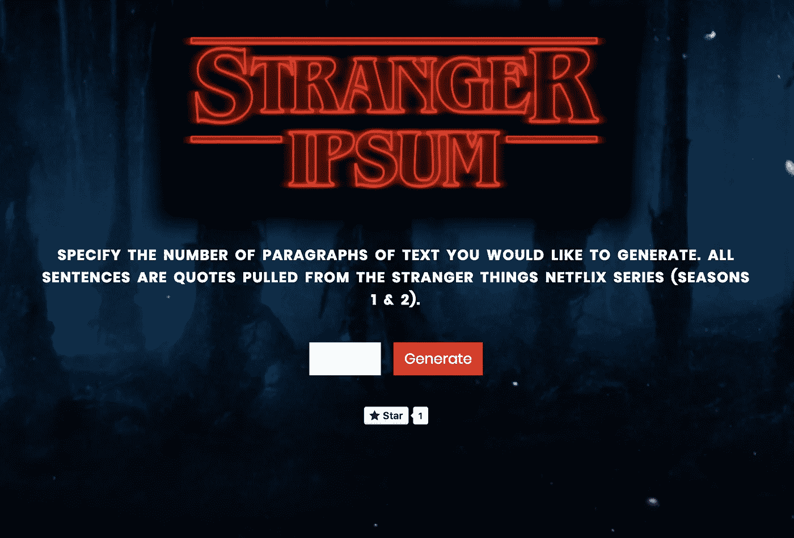
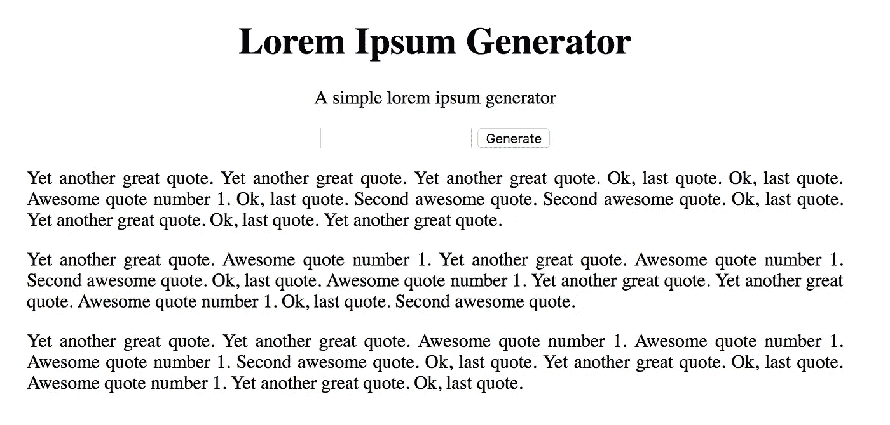

# 使用 Node 和 Express 创建 Lorem Ipsum 生成器

> 原文：<https://medium.com/hackernoon/creating-a-lorem-ipsum-generator-with-node-and-express-9e1af0b31c86>



A look at the lorem ipsum application I created, based on the Stranger Things series

几个月前，我制作了一个 lorem ipsum 应用程序，它可以将与技术相关的单词组合成句子和段落。在看了最新一季的[陌生人事物](https://en.wikipedia.org/wiki/Stranger_Things)之后，我决定改变我的应用程序，使用《陌生人事物》系列的引文，并将应用程序重命名为 [**陌生人 Ipsum**](http://stranger-ipsum.robertcooper.me/) 。

应用程序是用 [**Node.js**](https://hackernoon.com/tagged/nodejs) 和 [**Express**](https://hackernoon.com/tagged/express) 构建的。这是一个只有一页的简单应用程序，但我想我应该解释一下应用程序的主要部分，因为它可能对那些学习 Node 和 Express 的人有所帮助。如果您遵循下面概述的步骤，您应该能够创建自己的简单 lorem ipsum 应用程序。

对于那些还不熟悉的人来说， *Node.js* 是一个**服务器框架**而 *Express* 是一个用于 Node 的 **web 框架。基本上，Express 使 Node 的使用变得更加简单，因为您不必编写太多代码来让事情按照您想要的方式工作。Express 也有一些很棒的文档[你可以参考](https://expressjs.com/en/4x/api.html)。**

如果你想查看我的 lorem ipsum 应用程序的最终版本，其中包括下面描述的所有代码以及更多内容，你可以[现场查看](http://stranger-ipsum.robertcooper.me/)或者你可以在 Github 上查看[代码。](https://github.com/Engineering-Robert/stranger-ipsum)

## 入门指南

在做任何事情之前，确保你已经在你的计算机上安装了 npm 和 node。然后创建一个项目目录(`mkdir project-name`)，按照自己的意愿命名。完成之后，使用终端(`cd project-name`)在项目目录中导航，用命令`npm init -y`初始化一个`**package.json**`文件。`init`命令初始化一个新的`**package.json**`文件，`-y`选项接受所有默认参数。

在创建任何文件之前，请确保使用以下命令从 npm 安装 Express:`npm install express`。

完成之后，在项目目录中创建主应用程序文件，并将其命名为`**app.js**`。以下是进入你的`**app.js**`文件的所有代码:

我在代码中添加了注释来帮助理解，但是我会进一步解释。在`**app.js**`顶部定义的变量`express`和`app`是创建快速应用程序所必需的。变量是一个由 Express 创建的对象，它有许多不同的方法可以调用。

`routes`变量保存我们的应用程序路由逻辑，它在`**router.js**`中定义。我过会儿会检查那件事。

`hostname`和`port`变量包含了应用服务器的位置信息。`127.0.0.1`是指您的本地主机，而`3000`是我选择用来服务我的应用程序的端口号。

`app.use(express.static('public'))`告诉 Express 在提供静态资产(比如图像、html 和 css 文件)时应该在哪里查找。在这种情况下，静态资产将保存在`**/public**`文件夹中。

`app.use(routes)`告诉 Express 使用我们之前定义的`routes`变量中定义的路线。

最后，`app.listen()`用于指定我们的应用程序运行的端口，并开始接受应用程序的连接。在我们的例子中，这允许我们在浏览器窗口中查看`localhost:3000`处的应用程序。

## index.html

接下来，让我们创建`**index.html**`文件。由于我们将静态资产目录指定为`**/public**`，请确保创建一个名为`**public**`的目录，并在文件夹中添加一个空白的`**index.html**`和`**styles.css**`文件。

您的项目目录现在应该如下所示:

```
/project-name
  /public
    - index.html
    - styles.css
  - app.js
  - package.json
```

好的，在我们的`**index.html**`文件中我们需要 5 样主要的东西:

1.  链接到我们的样式表(`**styles.css**`)
2.  一个标题
3.  描述
4.  接受要生成的段落数的表单
5.  一个包含生成的 lorem ipsum 文本的`<div>`

下面是所有这些部分都就位后的`**index.html**`文件的样子。

我不打算用 CSS 来检查应用程序的样式。你可以添加你喜欢的任何风格，这样你的应用程序就有了自己的风格。

## 申请途径

我们的应用程序路线将在`**router.js**`组织。我们需要设置两条路线:

1.  a **获取主应用程序网页的路径**
2.  当用户输入他们想要生成的段落数量时，一个**发布路线**

GET route 将服务于我们的`**index.html**`页面，POST route 接收用户输入并将其传递给一个函数，该函数将生成所需数量的文本段落。下面是`**router.js**`文件的样子:

顶部定义的`loremIpsum`变量是一个由构造函数创建的对象，我们将在后面的`**generator.js**`中定义。需要`querystring`模块将字符串解析为 POST 路由中的键/值对，需要`fs`模块获取应用程序中不同文件的内容(`fs`代表*文件系统*)。

Variable declarations in router.js

我们正在从`express.Router`类创建一个`router`实例，以便正确管理我们的路由及其处理程序(路由*处理程序*是为特定路由执行的函数)。我们的第一个路由定义是到我们的主应用程序页面的 GET 路由(即根或`/`路由)。根路由的路由器处理器将`**index.html**`的内容发送给客户端。

GET route defined in router.js

我们的第二个路由定义是 POST 路由，它处理用户提交的输入值。输入值是一个整数，它指定要生成的所需段落数。一旦从客户端接收到数据，就调用对`request.on()`的回调，并且该数据存储在`inputValue`变量中。一旦数据进来，我们使用`.toString()`方法将其转换成可读的字符串。然后，在`querystring`的帮助下，我们将用户输入的数值存储在一个名为`numberOfParagraphs`的变量中。

接下来，我们生成 lorem ipsum 文本并存储在一个名为`loremIpsumText`的变量中。lorem ipsum 文本的生成将在下一节解释。一旦我们得到了文本，我们就将 index.html 的内容加载到一个变量中，并用 lorem ipsum 文本替换占位符`<div>`。修改后的`**index.html**`文件被发送到客户端，瞧！

POST route defined in router.js

别忘了在`**router.js**`的底部加上`module.exports = router;`语句。这允许我们需要`**app.js**`中的文件。

## 生成 Lorem Ipsum

我设置 lorem ipsum 应用程序的方式是将一串引号存储在一个数组中，然后通过从数组中随机选择引号来形成一个段落。创建一个`**generator.js**`文件，并将以下代码添加到该文件中:

在这个文件中，我正在创建一个名为`GenerateNewText()`的构造函数，它将创建一个具有属性`sentences`和方法`getRandomSentence`、`getParagraph`和`getAllParagraphs`的对象。从`GenerateNewText()`构造函数中创建一个名为`loremIpsum`的对象，并将其导出到文件的底部，因此在`**router.js**`中可能需要它。

属性包含一个引用数组，它将被用来构建一个文本段落。

The sentences property stores the strings that will be generated in our lorem ipsum app

我不打算解释`GenerateNewText()`中的每个方法是做什么的，因为我分配给这些方法的名字解释了它们的功能。在`**router.js**`中调用`getAllParagraphs`方法，将段落数作为参数传入。

## 运行应用程序

好了，您应该已经准备好在浏览器中运行自己的应用程序了。在您的终端中，导航到您的项目文件夹并使用`node app.js`运行应用程序。如果一切按计划进行，你应该可以在`localhost:3000`打开你的浏览器，看到你的应用程序正在运行。试着输入一些段落，点击*生成*。您应该看到页面刷新，随机生成的文本出现在底部！

当我按照上面概述的步骤操作时，我的页面看起来是这样的(应用了一些样式):



The result of following the above steps to create your own lorem ipsum app

## 结论

正如你从上面的图片中看到的，结果可以使用更多的样式来使应用程序看起来更好。该应用程序还可以在输出的句子中使用更多的变化。您必须向`**generator.js**`中的字符串数组添加更多的项目。还有很多其他的东西可以用来改进应用程序。有一个很棒的网站[列出了一大堆流行的 lorem ipsum 应用程序，你可以从中获得灵感。](http://meettheipsums.com/)

如果你已经创建了一个 lorem ipsum 应用程序，请在评论中分享它，因为我很想看看它！

如果你觉得这篇文章很有趣，并且对 web 开发感兴趣，可以考虑在 [**Twitter**](https://twitter.com/RobertCooper_RC) 、 [**Github**](https://github.com/robertcoopercode) 或 [**LinkedIn**](https://www.linkedin.com/in/robert-cooper/) 上关注我。