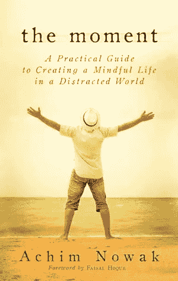

# 在纷乱的世界中创造专注的生活

> 原文：<https://medium.com/hackernoon/creating-a-mindful-life-in-a-distracted-world-e841ee95d377>

[Photo by [John-Mark Kuznietsov](https://unsplash.com/photos/_S6eV1Uz5A8?utm_source=unsplash&utm_medium=referral&utm_content=creditCopyText) on [Unsplash](https://unsplash.com/?utm_source=unsplash&utm_medium=referral&utm_content=creditCopyText)]

## 我们的眼睛专注于终点线，而生活正在发生。这个“现在”正以闪电般的速度飞驰而过。

我们大多数人从很小的时候起就被教导要渴望成功。成功——对成功的追求和追逐我们的目标和梦想的行为——可以成为强有力的个人激励者。我们努力。我们努力工作。我们努力，努力，再努力。如果我们幸运的话，我们的努力会得到有形的回报。

然而，即使在那段时间里，当乘坐的感觉和我们想象的一样令人兴奋时，我们偶尔也会意识到我们真正做的只是努力工作。我们不确定我们是否真的喜欢这种速度。首先，我们甚至不确定我们是否坐对了车。时间一分一秒地流逝，我们有一种怪异的感觉，生命正从我们身边溜走。

我们的眼睛专注于终点线，而生活正在发生。这个“现在”正以闪电般的速度飞驰而过。

活在当下并不意味着我们不关心未来。这意味着当我们选择做某事时，我们只专注于做这件事的行为，而不是让我们的思想徘徊在未来或过去。

在大学里，我的清洁工夜班时，我的一个主管每天晚上都会提醒我“善待地板，小心地擦亮它——然后看看它有多亮。”在那些特别的时刻，其他什么都不重要——只有抛光地板上的光亮。它教会我在一项完全平凡的任务中完全迷失自我。活在当下让我们逃离逆境，保存我们的内在能量。

对于像我这样一个快节奏的企业家来说，也许最矛盾的教训是需要放慢脚步才能前进。放慢脚步是一种深思熟虑的选择，可以让你更加珍惜生活，获得更大程度的幸福，从而在努力中获得更好的结果。

在正念生活的背景下，慢下来并不意味着每隔一个月去度假。是我们每天必须练习的。这意味着花时间去做我们正在做的事情。这意味着只做一件事，而不是在众多任务中切换，一件都不做。

几十年前，术语“正念”用来暗示东方神秘主义，与一个人的精神旅程有关，遵循乔达摩佛陀的教导。佛教徒相信“健康、快乐、和平”来自于修行正念的生活。今天，从自助大师到商业领袖，从科学家到政治家，许多人都在谈论正念。科学界现在认为，通过练习日常正念，我们可以利用大脑的神经可塑性，从而改善我们的生活状态。威廉·詹姆斯是最早提出神经可塑性概念的心理学家之一，他在 1890 年发表了开创性的文章《心理学原理》。神经可塑性背后的中心思想是，我们的大脑可以根据我们的感知和经验进行自我重组。

在我们的书 [*《万物互联——如何在创意、创新和可持续发展的时代转型和领先》*](http://everythingconnectsthebook.com)*中，我们写道:*

> *“加拿大心理学家毕晓普为我们提供了一个有用的正念的两个组成部分的定义:调节我们的注意力以保持专注于我们的即时体验，并以好奇、开放和接受的态度对待我们体验的现象，不管我们发现这些现象多么令人向往。*
> 
> *正念让我们不仅对体外发生的事件，而且对体内发生的事件有更细致入微、更清晰的理解。"*

*当我们正念时，我们开始更客观地见证我们自己的经历:当我们处于通常会变得愤怒的情况下，我们可以观察到我们的愤怒。正如一位冥想老师曾经告诉我的，没有正念，我们就是反应机器。但是有了正念，我们给自己一些活动的空间。我们可以不按照我们长期持有的倾向、偏见和模式行事，而是以服务于情况和服务于相关人员的方式行事。*

*这些个人成果对组织也有重大影响。如果创新和增长是由于能够以新的方式看待同一组数据而产生的，那么允许我们以全新的、不带偏见的、稍微少受限制的心态来处理新情况的实践就是一种资产。如果我们依靠同事分享解决盲点的方法，那么加深我们关系的实践就是一种财富。如果我们需要将长期目标转化为日常行动，允许我们更准确地自省的实践是一种资产。如果我们只是需要更好地驾驭我们生活中的压力刺激，我们需要所有我们能得到的工具。*

*这就是日常正念练习进入画面的地方。它告诉我们如何开始在当下时刻保持更清醒的意识。它教导我们在快节奏中这样做，有时这可能超出我们的控制。它还能帮助我们发现慢下来的方法，这样我们就能更好地享受生活，每时每刻。*

*据说禅宗和尚的两项工作就是坐禅和扫地。清洁是禅宗和尚的日常仪式之一，是他们最重要的日常实践之一。他们清扫或耙，他们试图在那一刻不做任何其他事情。下次你做家务的时候，试着把注意力集中在家务上——灰尘上，动作上，感觉上。做饭和打扫卫生通常被视为无聊的家务，但实际上它们都是练习正念的好方法——我每周至少例行尝试做一两次。听起来简单，但实际上很难。去试试吧。*

*我相信正念生活可以以多种形式实践。*

**

*我的朋友阿奇姆·诺瓦克的书《时刻 》展现了一种全新的专注生活。这本书直接将你和我，读者，放入这个世界——我们与人、地方和事物的相遇。我们中的许多人渴望更充实地“活在当下”我们并不总是确切地知道那意味着什么或者它可能看起来像什么。这一刻是在一个纷乱的世界中创造一个正念生活的伟大开端。*

****版权所有 2017 费萨尔·霍克。保留所有权利。****

*我是一名[企业家和作者](http://faisalhoque.com/speaking/)。SHADOKA 等公司创始人。Shadoka 让抱负成为领导、创新和变革的动力。Shadoka 的加速器和解决方案汇集了管理框架、数字平台和思想领导力，以实现创新、转型、创业、增长和社会影响。*

*《“ [*《万物互联——如何在创意、创新和可持续发展的时代进行变革和领导》*](http://www.amazon.com/Everything-Connects-Creativity-Innovation-Sustainability/dp/0071830758/ref=sr_1_1?ie=UTF8&qid=1376488798&sr=8-1&keywords=everything+connects%2Bfaisal+hoque) 》(麦格劳·希尔)和《 [*《生存并茁壮成长:弹性企业家、创新者和领导者的 27 种实践*](http://survivetothrive.pub/) 》(励志出版社)的作者。在推特上关注我。*免费使用* [*万物互联*](http://app.everythingconnectsthebook.com/login.php) *领导力 app 和* [*生存茁壮*](http://app.survivetothrive.pub/login.php) *弹性 app。**

**