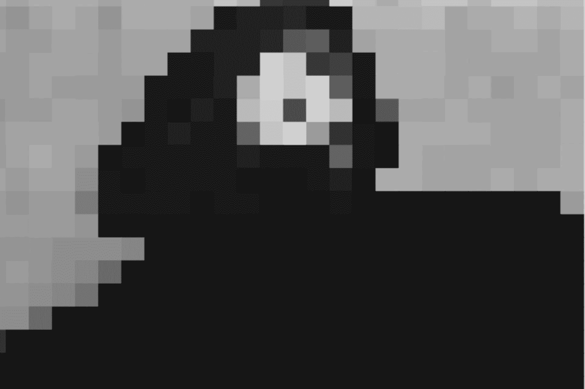
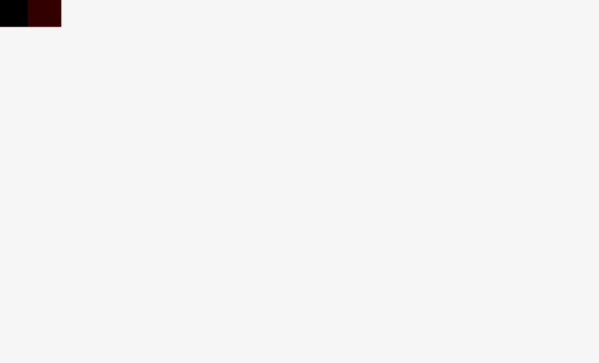
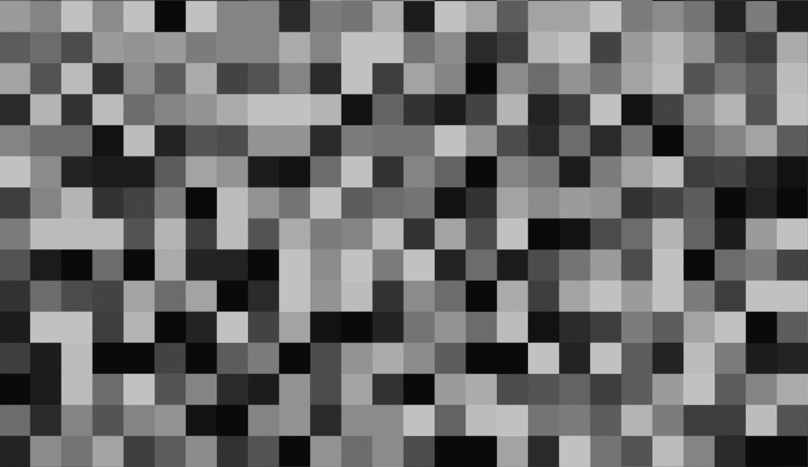
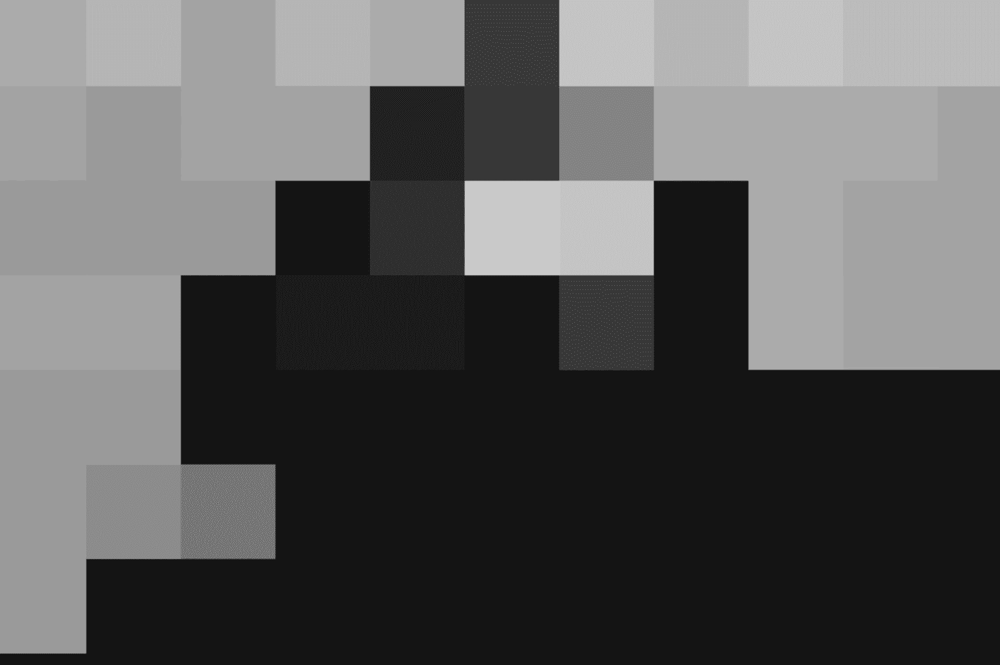

# 在 Javascript 中创建像素过滤器

> 原文：<https://medium.com/hackernoon/creating-a-pixelation-filter-for-creative-coding-fc6dc1d728b2>



Pixelating Stevie, because she’s awesome

欢迎来到创造性[编码](https://hackernoon.com/tagged/coding)基础的下一期。这里可以看到以前的教程[。](/@radarboy3000)

和往常一样，我的 github 上有完整的代码:【https://github.com/GeorgeGally/creative_coding 

像素过滤器很容易创建，采样技术和公式在创造性编码中很有用，特别是在计算机视觉中，我很快就会谈到。

像素化滤镜的本质是简单地将屏幕分成块，然后对块的颜色进行采样。为了提高性能，我们按块采样，而不是每个像素。样本越小，我们的作品运行得越慢。

让我们从将屏幕划分成块开始…我们通过循环所有的行和列来完成，速度变慢了，看起来像这样:



该公式是循环中的循环:

```
*// define the sample size* 
var sample_size = 20;*// loop through the rows from to to bottom of page*
for (var y= 0; y < h; y+= sample_size) { *// loop through all the columns from left to right*
  for (var x = 0; x < w; x+= sample_size) { *// do something* }}
```

这让我们很容易得到这样的好效果:



```
var ctx = createCanvas("canvas1");// define the sample size
var sample_size = randomInt(20, 80);function draw(){ if(chance(200)) sample_size = randomInt(10, 40); // loop through the rows from to to bottom of page
  for (var y= 0; y < h; y+= sample_size) { //loop through all the columns from left to right
    for (var x = 0; x < w; x+= sample_size) {
      ctx.fillStyle = rgb(random(205));
      ctx.fillRect(x, y, sample_size, sample_size);
    } }}
```

唯一的新东西是函数 *chance()，*，这是一个我一直在使用的方便的小随机帮助函数，它使我能够基于概率随机触发事件。代码如下所示:

```
function chance(value){
 return (random(value) > value-1);
}
```

但是我跑题了。

现在我们有了采样的公式，让我们对一个图像进行采样。我们需要一点理论…

用于对画布进行采样的 [Javascript](https://hackernoon.com/tagged/javascript) 函数是: *getImageData(start_x，start_y，sample_width，sample_height)* ，所以要对整个屏幕进行采样，我们可以简单的做:

```
var sample = ctx.getImageData(0,0,w,h);
```

这使我们得到一个包含 rgba 值的数据数组的对象。我们现在需要做的就是遍历数据值并提取我们的像素值。

要获得屏幕上任何一点的位置，我们可以使用神奇的公式:

```
var pos = (x + y * w);
```

但是，请记住，数组返回给我们的数据对于每个像素有四个值，所以要获得该像素在数组中的位置，我们只需将其乘以 4:

```
var sample_point = (x + y * w) * 4;
```

然后数组中接下来的四个值将是该像素的 rgba 值…

```
// we want the data element of the object
var sample = ctx.getImageData(0,0,w,h).data; for (var y= 0; y < h; y+= sample_size) { for (var x = 0; x < w; x+= sample_size) { **var pos = (x + y * w) * 4;
     var red   = sample[pos];
     var green = sample[pos + 1];
     var blue  = sample[pos + 2];
     var alpha  = sample[pos + 3];**

    * // ...do something with those values* }}
```

我们实际上可以忽略 alpha 值，因为我们不需要它。所以为了把它整齐地放入一个函数中，以便我们可以轻松地使用它，并且永远不会再想起它，我们做了这样的事情:

```
function pixelate(sample_size){ var imgData=this.getImageData(0,0,w,h).data;

  for (var y= 0; y < h; y+= sample_size) { for (var x = 0; x < w; x+= sample_size) {

     var pos = (x + y * w) * 4;
     var red   = sample[pos];
     var green = sample[pos + 1];
     var blue  = sample[pos + 2]; ctx.fillStyle = rgb(red, blue, green);
     ctx.fillRect(x, y, sample_size, sample_size); }}
```



我们会这样说:

```
/*/ create canvas*
var ctx = createCanvas("canvas1");*// define the sample size*
var sample_size = randomInt(20, 80);*//load an image*
var img = new Image();
img.src = 'img/stevie.jpg';function draw(){ if(chance(200)) sample_size = randomInt(10, 40);
  ctx.drawImage(img, 0, 0, w, h);
  pixelate(sample_size);} function pixelate(sample_size){ var imgData=this.getImageData(0,0,w,h).data;

  for (var y= 0; y < h; y+= sample_size) { for (var x = 0; x < w; x+= sample_size) {

     var pos = (x + y * w) * 4;
     var red   = sample[pos];
     var green = sample[pos + 1];
     var blue  = sample[pos + 2]; ctx.fillStyle = rgb(red, blue, green);
     ctx.fillRect(x, y, sample_size, sample_size); } }}
```

我想对这个函数做一些调整。首先，让我们传入一个上下文，所以如果我们愿意，我们可以在屏幕上有多个画布，并且只针对其中的一个…所以我们只传入一个额外的参数。该行:

```
var context = _ctx || ctx;
```

…是这样的简写:如果参数 _ctx 未定义，则使用默认变量 ctx。如果我只有一块画布，这允许我不必传递参数。

```
function pixelate(sample_size, **_ctx**){ **var context = _ctx || ctx;**
  var sample = context.getImageData(0,0,w,h).data; for (var y= 0; y < h; y+= sample_size) {

    for (var x = 0; x < w; x+= sample_size) { var pos = (x + y * w) * 4;
     var red   = sample[pos];
     var green = sample[pos + 1];
     var blue  = sample[pos + 2];
     **context**.fillStyle = rgb(red, blue, green);
     **context**.fillRect(x, y, sample_size, sample_size);
    }
  }}
```

为了额外加分，我们还可以使用一个技巧来加快速度。以上功能完全没问题。但是和往常一样，在 Javascript 中有很多方法可以剥一只猫的皮。

我们可以使用一个无符号的 [32 位整数数组](https://developer.mozilla.org/en-US/docs/Web/JavaScript/Reference/Global_Objects/Uint32Array)，再加上使用[位操作符](https://www.w3schools.com/js/js_bitwise.asp)，我们可以获得一点额外的性能…所以我们的最终函数看起来像这样:

```
function pixelate(sample_size, _ctx){ var context = _ctx || ctx;
  **var sourceBuffer32 = new Uint32Array(context.getImageData(0,0,w,h).data.buffer);** for(var y = 0; y < h; y += sample_size){

    for(var x = 0; x < w; x += sample_size){ **var pos = (x + y * w);
      var b = (sourceBuffer32[pos] >> 16) & 0xff;
      var g = (sourceBuffer32[pos] >> 8) & 0xff;
      var r = (sourceBuffer32[pos] >> 0) & 0xff;**
      context.fillStyle = rgb(r,g,b);
      context.centreFillRect(x, y, sample_size, sample_size); } }}
```

仅此而已。前进并像素化。

像往常一样，我的 github 上有完整的代码:【https://github.com/GeorgeGally/creative_coding 

你可以在这里看到我以前所有的教程。

如果你愿意，请跟我来

[**https://www.instagram.com/radarboy3000/**](https://www.instagram.com/radarboy3000/)

[**https://twitter.com/radarboy_japan**](https://twitter.com/radarboy_japan)

[](https://www.facebook.com/radarboy3000) [## 雷达男孩

### 雷达男孩。145 个赞。艺术、设计可视化、黑客

www.facebook.com](https://www.facebook.com/radarboy3000)