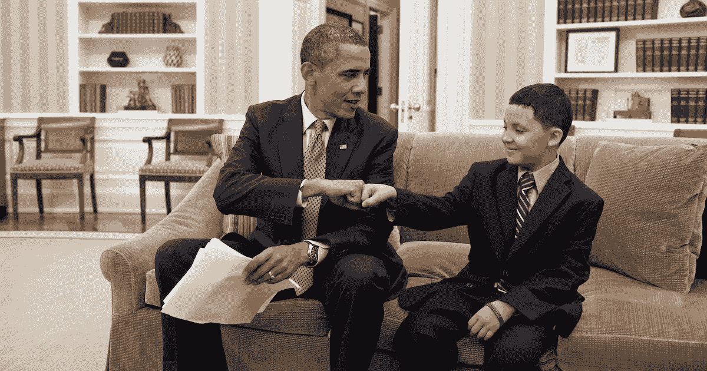

# 创建积极的自由职业者-客户关系

> 原文：<https://medium.com/hackernoon/creating-a-positive-freelancer-client-relationship-e92a290dfa33>

The sign of a good relationship

对我来说，自由职业最重要的部分是和我的客户建立积极的工作关系。不仅工作对双方来说变得更加愉快，而且我能够在将来要求我的客户推荐或证明。

这里有三条原则帮助我成为一名自由职业者，我认为客户喜欢和我一起工作。

# 1.交流！

在我看来，沟通是任何职业关系中最重要的方面，更不用说自由职业关系了。交流有助于每个人保持一致，这大大降低了人们对某事感到意外的可能性。

我喜欢的几种交流方式:

*   我每周安排一次与客户的通话，以确保他们对我的工作方向感到满意
*   我使用任务跟踪系统(例如 GitHub Issues、Trello、Phabricator)，这样客户就不必联系我来查看我的进度
*   我对电子邮件的反应非常迅速，总是会在 12 小时内回复(有时甚至只是说我会在一周内回复更多细节)

Solid communication tools

# 2.为客户生产，而不是为你自己

在我开始一个项目之前，我总是试图了解我的客户的优先事项。有的在乎用户体验，有的在乎性能，有的想尽快推出。无论客户的目标是什么，我都愿意让自己的风格适应他们。

对我来说，重要的是要记住忽略我自己的偏好(见下一节)。如果我花太多时间在客户不重视的事情上，这对双方都是无益的。

# 3.提供建议，但要准备好推迟

即使没有直接询问我的意见，我也总是喜欢提供我的观点。自由职业者最大的价值之一是他或她以前的经历，这种洞察力对于没有类似经历的客户来说非常有价值。

由于我曾与许多早期创业公司合作过，我关于决定是否构建一个功能或使用变通方法的见解特别有帮助。例如，我的上一个客户想要建立一个电子邮件系统，但是我建议 Mailchimp 可以让他的用例达到 90%。他肯定很欣赏这个想法，这为他节省了时间和金钱。

然而，在意见不一致的情况下，争吵是没有意义的。项目是客户的，他们总是说了算。

希望这些建议有用，能帮助你建立良好的自由职业关系！如果你有任何想法，或者想和我一起工作，请随时联系我们😁。

*原载于 2017 年 5 月 17 日*[*【golmansax.com*](https://golmansax.com/blog/posts/2017/05/17/creating-a-positive-freelancer-client-relationship/)*。*