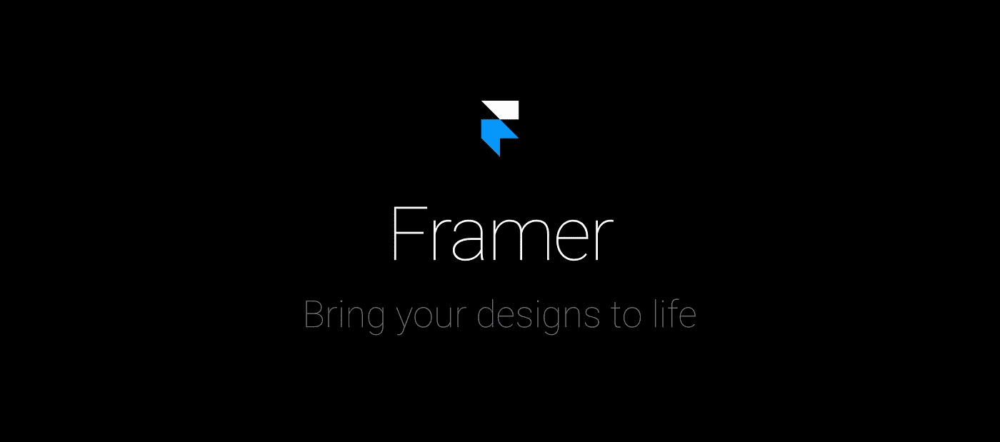
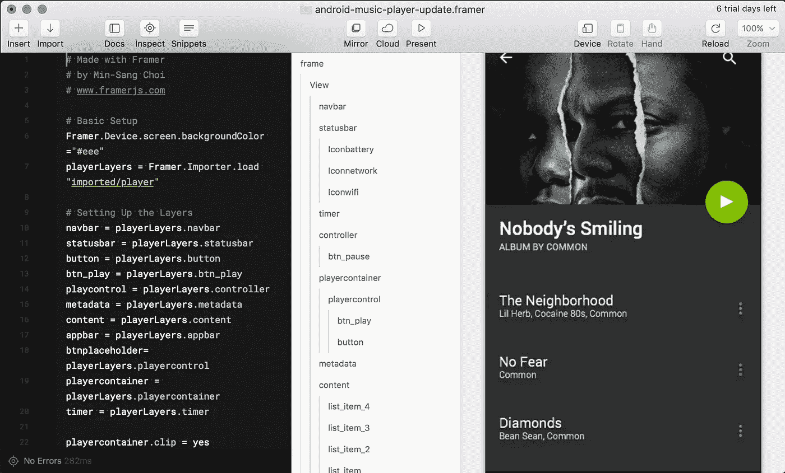
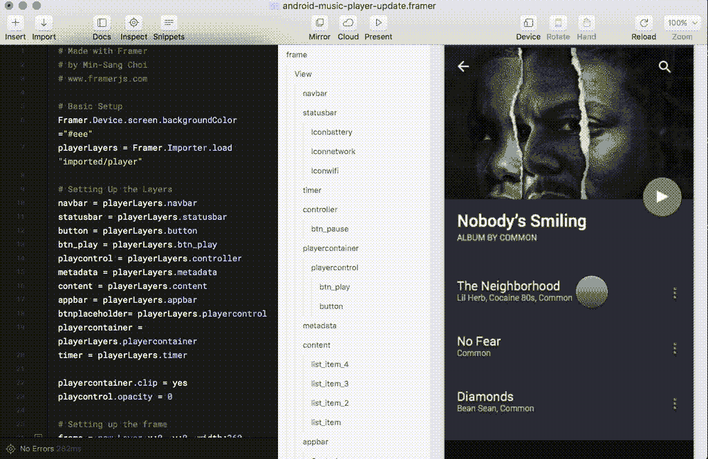
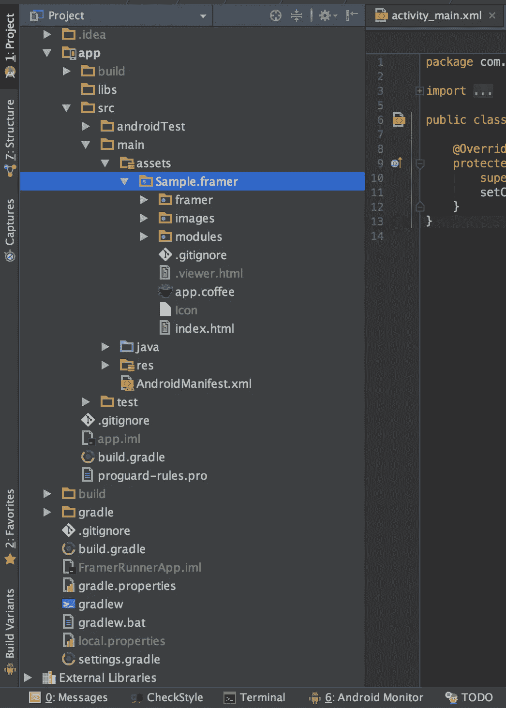
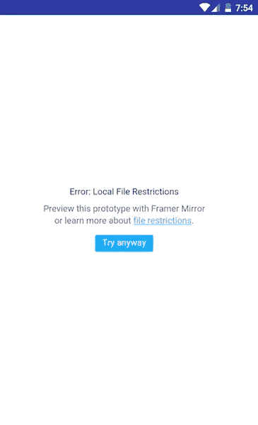
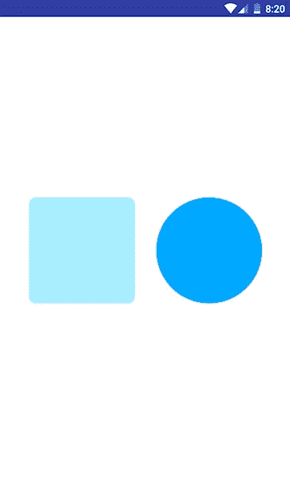
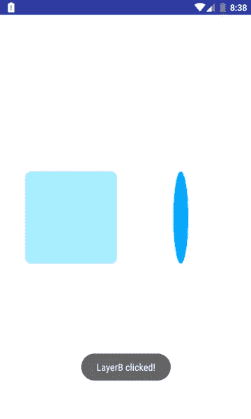

# 创建一个快速花哨的 Android 应用程序原型

> 原文：<https://medium.com/hackernoon/creating-a-quick-fancy-android-application-prototype-77353cbc2207>

## 使用 Framer 进行 Android 原型开发



一个有移动应用程序[开发](https://hackernoon.com/tagged/development)经验的 ll 程序员曾经尝试创建一个原型来快速展示应用程序的想法！

就时间和质量而言，创建原型是一项棘手的任务。通常，你有最少的时间来创建一个花哨的应用程序，它必须不能工作，但看起来很完美。这怎么可能呢？没有人知道我们必须为每一个动画编码或设计，或者在 [Android](https://hackernoon.com/tagged/android) 中加载数据以列表，这真的很耗时。

## 什么是成帧器？

作为[framer.com](http://framer.com)的参考:

> 对可视化编辑和代码灵活性的熟悉。无缝的工作流程，通过设备预览、版本控制和轻松共享进一步完善。开创新的交互模式，创建突破性的应用程序。全球创业公司、机构和财富 500 强的产品团队首选的设计和原型制作工具。

这一段有很多好听的话，但是真的很管用！

不幸的是，你会提到这个工具的大部分屏幕截图是在 iPhone 设备上，他们没有提到我们也可以在 Android 上使用它！



Framer sample project

Framer 使用 JavaScript 创建了一个动态网站包，可以在离线 WebView 中加载，因此集成阶段非常简单。

## 我应该从哪里开始？

Framer 不是免费的，但你可以用试用帐户测试它，如果你或你的公司喜欢它，你可以以后再付费，所以从这里下载它:

[](https://framer.com/download/) [## 用代码设计一切

### 为 iOS、Android、桌面或网络设计交互式高保真原型。发明新的动画和…

framer.com](https://framer.com/download/) 

乍一看，它可能看起来非常拥挤，有很多代码，但我向你保证，只需要一天就可以成为一名专业的框架设计师！只要看看这个产品的 YouTube 频道，观看所有的教程，目前，只有 14 个视频，需要一个半小时！

[](https://www.youtube.com/channel/UCW5gUZ7lKGrAbLOkHv2xfbw) [## 组成者

### 插入，设计和动画与框架类型的文本。我们的 TextLayer 是完全动态的，这意味着我们默认为系统…

www.youtube.com](https://www.youtube.com/channel/UCW5gUZ7lKGrAbLOkHv2xfbw) 

该工具的一个完美特性是直接从[草图](https://sketchapp.com)导入图形资产，这将使您的工作更加容易。你必须让你的 UI/UX 设计师交出一个标准的草图文件，然后你可以直接将它导入到 Framer 项目和一些小代码来使它工作。

# 在 Android 中集成成帧器

正如我提到的，一个 Framer 项目是一个使用 JavaScript 的动态网站，其入口是一个**文件，所以如果你有将这样一个离线网站从 Assets 文件夹加载到 WebView 的经验，你现在就可以开始原型制作了！**

**让我们从创建一个空的 Android 应用程序开始，并将您的 framer 项目复制到 assets 文件夹中。(您可以使用 Android Studio 创建资产文件夹，文件>新建>文件夹>资产文件夹)**

****

**Create assets folder in project**

**，现在将您的 Framer 项目复制到您的 Android 应用程序项目资产文件夹中，**

****

**Framer project added to Assets folder**

**我们需要添加一个 WebView 到我们的布局，并添加一些代码来加载框架项目。**

*****activity _ main . XML*****

```
**<?xml version="1.0" encoding="utf-8"?>
<LinearLayout
    xmlns:android="http://schemas.android.com/apk/res/android"
    android:layout_width="match_parent"
    android:layout_height="match_parent"> <WebView
        android:id="@+id/webView"
        android:layout_width="match_parent"
        android:layout_height="match_parent"/></LinearLayout>**
```

*****MainActivity.java*****

```
**public class MainActivity extends AppCompatActivity { WebView webView; @Override
    protected void onCreate(Bundle savedInstanceState) {
        super.onCreate(savedInstanceState);
        setContentView(R.layout.*activity_main*); webView = (WebView) findViewById(R.id.*webView*); WebSettings settings = webView.getSettings();
        settings.setAllowFileAccessFromFileURLs(true);
        settings.setJavaScriptEnabled(true); webView.loadUrl("file:///android_asset/Sample.framer/index.html");
    }
}**
```

**这是几乎完成了，你现在可以运行应用程序！**

****

**Framer Local File Restrictions warning!**

## **一个可解的警告！**

**将 Framer 直接加载到 WebView 时会出现问题，尽管已将此设置添加到 WebView，但仍会导致文件访问权限警告:**

```
**settings.setAllowFileAccessFromFileURLs(true);**
```

**这可以通过从 web 服务(本地或互联网)加载 Framer 来解决，或者有一种更简单的方法，您可以更改导致此警告的方法！只需在您的 framer 项目的 Framer 文件夹中打开***Framer . init . js***并编辑第一个 JavaScript 函数:**

```
**function isFileLoadingAllowed() {
// return (window.location.protocol.indexOf("file") == -1)
    return true;
}**
```

**就是这样，现在你可以运行你的原型没有任何警告。**

****

**Android Application prototype using Framer**

# **在 Framer 和 Android 之间创建连接**

**在大多数原型案例中，您需要加载一个漂亮的 UI，它通过动画或一些事务或滚动对用户交互做出反应，但是如果您喜欢在代码和 Framer 项目之间建立连接并为事件开发，这是可能的。您也可以将应用程序中的数据加载到 Framer 中。**

**在这种情况下，您需要一个 Javascript 界面来将其添加到 WebView:**

*****JavascriptHandler.java*****

```
**public class JavascriptHandler {

    private Activity activity;
    private WebView webView;

    public JavascriptHandler(Activity activity, WebView webView) {
        this.activity = activity;
        this.webView = webView;
    }

    */**
     * This method handles call from Framer
     */* @JavascriptInterface
    public void javascriptCall(String jsString) {
        Toast.*makeText*(activity, jsString, Toast.*LENGTH_LONG*).show();
    }

    */**
     * This method handles call from Android
     */* public void javaCall(String message) {

        final String webUrl = "javascript:DeviceComponent.displayJavaMessage('" + message + "')";
        // Add this to avoid android.view.windowmanager$badtokenexception unable to add window
        if (!activity.isFinishing())
            // loadurl on UI main thread
            activity.runOnUiThread(new Runnable() {

                @Override
                public void run() {
                    webView.loadUrl(webUrl);
                }
            });
    }
}**
```

**，您可以使用这行代码将其作为 JavaScript 接口添加到 WebView:**

*****MainActivity.java*****

```
**webView.addJavascriptInterface(new JavascriptHandler(this, webView), "JavascriptHandler");**
```

**现在，您可以通过将这行代码添加到您的成帧器项目来向 Android 发送事件:**

*****app.coffee*****

```
**JavascriptHandler.javascriptCall(“LayerA clicked!”)**
```

****

**LayerB clicked event sent from Framer to Android**

**，或者您可以通过从 Android 调用此方法向 Framer 发送消息:**

```
**javascriptHandler.javaCall("Hi!!!");**
```

**搞定了。您现在可以开始创建自己的原型，而无需考虑 Android 开发、UI 元素或动画。**

# **TL；速度三角形定位法(dead reckoning)**

**[Framer](https://framer.com) 是一个完美的工具，可以尽快创建一个设计良好的原型应用程序，可以轻松地与 Android 集成。**

# **源代码和更多信息**

**您可以在 GitHub 上访问这个示例项目源代码报告:**

**[](https://github.com/mirhoseini/framer-android-wrapper) [## mirhoseini/framer-Android-wrapper

### android 包装应用程序

github.com](https://github.com/mirhoseini/framer-android-wrapper) 

，并在此阅读有关 Framer 的更多信息:

[](https://framer.com/docs) [## 用代码设计一切

### 为 iOS、安卓、桌面或网络设计交互式高保真原型。发明新的动画和…

framer.com](https://framer.com/docs) 

## P.S .

这个帖子不是广告，不幸的是没有人不给我一分钱。重点是，我最近创建了这个工具，并决定与它分享我的经验，我也在使用试用版。🤣

我期待您的评论，并与 Framer 分享您的经验。如果您认为这篇文章有用，请通过点击来分享💚按钮，并跟我来获取更多文章[Mohsen Mirrhoxini Argi](https://medium.com/u/6a4ed0c4dd2c?source=post_page-----77353cbc2207--------------------------------)。

 [## 穆赫森·米尔霍西尼——资深安卓开发者

### 我是一名资深安卓开发者，在计算机软件工程领域有大约九年的经验。我有…

mirhoseini.info](http://mirhoseini.info) [](http://bit.ly/HackernoonFB)[](https://goo.gl/k7XYbx)[](https://goo.gl/4ofytp)

> [黑客中午](http://bit.ly/Hackernoon)是黑客们开始他们下午活动的方式。我们是 [@AMI](http://bit.ly/atAMIatAMI) 家庭的一员。我们现在[接受提交](http://bit.ly/hackernoonsubmission)并很高兴[讨论广告&赞助](mailto:partners@amipublications.com)机会。
> 
> 如果您喜欢这个故事，我们建议您阅读我们的[最新科技故事](http://bit.ly/hackernoonlatestt)和[趋势科技故事](https://hackernoon.com/trending)。直到下一次，不要把世界的现实视为理所当然！

**