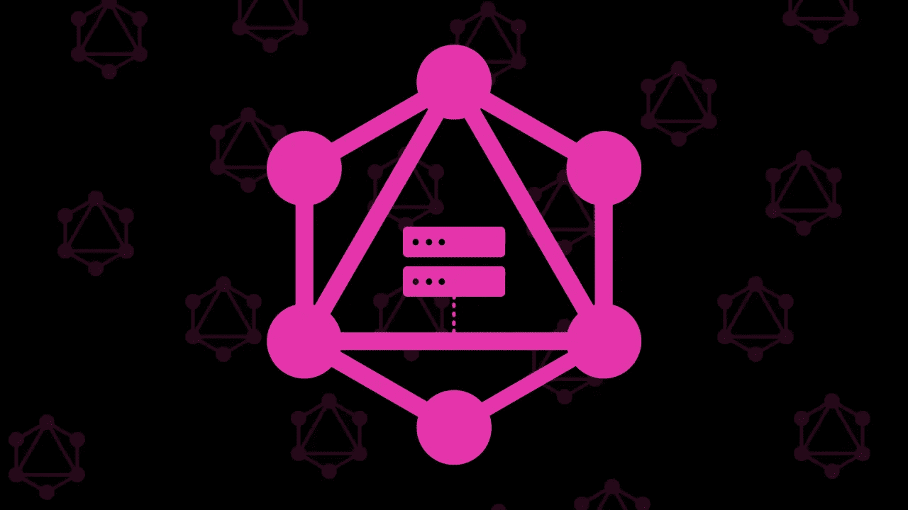
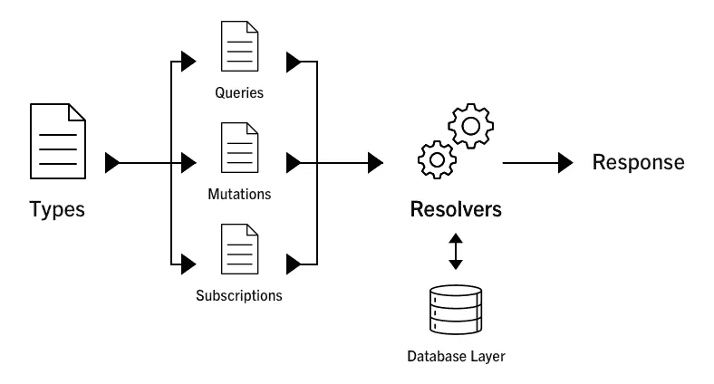
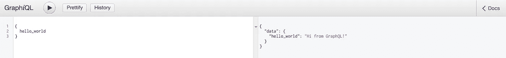

# 用 Express.js、Apollo Server 和 Webpack 创建结构化的、可热加载的 GraphQL API:第 1 部分

> 原文：<https://medium.com/hackernoon/creating-a-structured-hot-reloadable-graphql-api-with-express-js-de62c859643>



GraphQL 是一种通过强类型查询语言构建 API 的新方法。脸书在 2015 年发布的 GraphQL 正迅速获得关注，并被 Twitter 和 Github 等其他大公司采用。在本文中，我们将介绍如何使用 Express 和 Apollo Server 设置 API，以及如何构建 GraphQL 模式以保持其可管理性。
作为奖励，我们也将在我们的 API 中添加热重装。

点击这里查看回购协议；[https://github . com/mhaagens/express _ graph QL _ hmr _ article _ boilerplate](https://github.com/mhaagens/express_graphql_hmr_article_boilerplate)

# 服务器上 GraphQL 的高级概述

一旦熟悉了所有的活动部分，GraphQL 实际上很容易上手。我会尽量缩短这一部分，但是如果你只想得到代码，你可以直接跳过。

GraphQL 服务器是通过一个模式定义的，其工作方式大致如下:



GraphQL schema overview.

类型是数据模型的强类型表示。
这里有一个使用来自 Apollo 的 [graphql-tools](https://github.com/apollographql/graphql-tools) 定义的 post 类型的例子，这是我们将在本教程中用来定义我们的模式的；

```
import User from "./user_type";const Post = `
  type Post {
    id: Int!
    title: String!
    body: String!
    author_id: Int!
    author: User
  }
`;export default () => [Post, User];
```

**查询** 查询是您定义可以对模式运行什么查询的方式。下面是一个模式的根查询中的一些查询的例子；

```
const RootQuery = `
  type RootQuery {
    posts: [Post]
    post(id:Int!): Post
    users: [User]
    user(id:Int!): User
  }
`;
```

**突变** 突变类似于后请求(尽管它们实际上只是查询的同步版本)，它们允许你向服务器发送数据以执行插入、更新和其他工作。这里有一个为新的博客文章定义变异的例子，它接受 postInput 的输入类型，并将创建的文章作为 Post 类型返回。

```
const RootMutation = `
  type RootMutation {
    createPost(input: PostInput!): Post
  }
`;
```

**订阅** 订阅允许您通过 GraphQL 订阅服务器发布实时事件。

下面是一个如何定义订阅的示例；

```
const RootSubscription = `
  type RootSubscription {
    postAdded(title: String): Post
  }
`;
```

现在，您可以通过在 createPost 变异解析器中运行此命令，向订阅者发布事件；

```
pubsub.publish(‘postAdded’, { postAdded: post });
```

**解析器**
解析器是您执行工作以响应查询、变异或订阅的地方。这是您进入数据库层进行 CRUD 操作并返回适当响应的地方。

下面是一些解析器函数的例子；

```
...
resolvers: {
  RootQuery: {
    posts: () => posts,
    post: async (_, { id }) => 
      await Post.query()
  },
  RootMutations: {
    createPost: async (_, { input }) => 
      await Post.query.insert(input)
  },
  RootSubscriptions: {
    postAdded: {
    subscribe: () => 
      pubsub.asyncIterator('postAdded')
  },
  Post: {
    author: async post => 
      await User.query().where("id", "=", post.author_id)
  }
}
...
```

模式是将所有运动的部分连接在一起的东西。让我们开始构建我们的 API，这样我们就可以学习如何制作一个了！

# 入门指南

如果你想抢代码看看，这里有回购；
[https://github . com/mhaagens/express _ graph QL _ hmr _ article _ boilerplate](https://github.com/mhaagens/express_graphql_hmr_article_boilerplate)

**安装依赖关系**

运行`yarn init`然后`yarn add express graphql-server-express graphql-tools graphql body-parser`

然后，我们需要安装一些开发依赖项，我们不想每次做更改时都重启服务器，这就是 Webpack 可以帮助我们的地方。

跑`yarn add webpack webpack-node-externals start-server-webpack-plugin babel-loader babel-core babel-preset-env babel-preset-stage-0 babel-plugin-transform-runtime babel-plugin-transform-regenerator --dev`

**设置我们的 webpack 配置**

在你的文件夹的根目录下，创建一个名为`webpack.config.js`的文件，然后将它粘贴进去；

```
const webpack = require('webpack');
const path = require('path');
const nodeExternals = require('webpack-node-externals');
const StartServerPlugin = require('start-server-webpack-plugin');module.exports = {
    entry: ['webpack/hot/poll?1000', './src/index'],
    watch: true,
    target: 'node',
    node: {
        __filename: true,
        __dirname: true
    },
    externals: [nodeExternals({ whitelist: ['webpack/hot/poll?1000'] })],
    module: {
        rules: [
            {
                test: /\.js?$/,
                use: [
                    {
                        loader: 'babel-loader',
                        options: {
                            babelrc: false,
                            presets: [['env', { modules: false }], 'stage-0'],
                            plugins: ['transform-regenerator', 'transform-runtime']
                        }
                    }
                ],
                exclude: /node_modules/
            }
        ]
    },
    plugins: [
        new StartServerPlugin('server.js'),
        new webpack.NamedModulesPlugin(),
        new webpack.HotModuleReplacementPlugin(),
        new webpack.NoEmitOnErrorsPlugin(),
        new webpack.DefinePlugin({
            'process.env': { BUILD_TARGET: JSON.stringify('server') }
        })
    ],
    output: { path: path.join(__dirname, 'dist'), filename: 'server.js' }
};
```

然后将其添加到 package.json 脚本中；

```
"scripts": {
    "start": "webpack --config webpack.config.js"
},
```

让我们创建一些启动和运行所需的文件

创建一个名为`src`的文件夹，并在其中创建三个文件；`index.js`、`server.js`和`schema.js`

# 用 graphql-tools 设置我们的模式

内部`schema.js`把这个贴进去；

```
import { makeExecutableSchema } from 'graphql-tools';const RootQuery = `
  type RootQuery {
    hello_world: String!
   }
`;const SchemaDefinition = `
  schema {
    query: RootQuery
  }
`;export default makeExecutableSchema({
 typeDefs: [SchemaDefinition, RootQuery],
 resolvers: {
   RootQuery: {
     hello_world: () => "Hi from GraphQL!"
   }
 }
});
```

这里我们定义了一个 RootQuery，它将返回一个名为 hello_world 的查询。它返回一个必需的类型字符串(必需的由！在字符串类型定义之后)。String 是 GraphQL 的内置类型，最终我们将创建自己的类型。

在定义了我们的 RootQuery 之后，我们创建了一个模式定义，它将用于保存我们的查询、突变、订阅等等，然后我们将它导出为一个可执行的模式，供 graphql-server-express 使用。

# 创建我们的 Webpack 入口点

在`index.js`中粘贴这个；

```
import http from 'http';
import { execute, subscribe } from 'graphql';
import { createServer } from 'http';import app from './server';
import schema from './schema';const server = http.createServer(app);
let currentApp = app;server.listen(3000, () => {
  console.log(`GraphQL-server listening on port 3000.`)
});if (module.hot) {
  module.hot.accept(['./server', './schema'], () => {
    server.removeListener('request', currentApp);
    server.on('request', app);
    currentApp = app;
  });
}
```

这个文件作为 webpack 导入我们的 Express 服务器的入口点，并在发生变化时重新热加载我们的服务器。

# 设置我们的 Express GraphQL 服务器

最后，在`server.js`中，我们将它粘贴进去；

```
import express from 'express';
import bodyParser from 'body-parser';
import { graphqlExpress, graphiqlExpress } from 'graphql-server-express';import schema from './schema';const app = express();app.use(
  '/graphiql',
  graphiqlExpress({
    endpointURL: '/graphql'
  })
);
app.use('/graphql', bodyParser.json(), graphqlExpress({ schema: schema }));export default app;
```

这里我们将 GraphQL 附加到我们的/graphql 端点，以及 graph QL——一个用于运行/graph QL 查询的 GUI。

运行`npm start`并打开浏览器，转到`[http://localhost:3000/graphiql](http://localhost:3000/graphiql)`

Apollo Server([Apollo-Server](https://github.com/apollographql/apollo-server))附带了一个测试查询的 GUI 工具，叫做 GraphiQL，这是一个很棒的工具，也是由脸书的好人们(GraphiQL 的创造者)创造的。

在 GraphiQL 的左侧窗格中，粘贴以下内容并单击“运行”按钮(看起来像播放按钮的按钮)；

```
{
  hello_world
}
```

您现在应该会在右边的窗格中看到一个输出，显示“来自 GraphQL 的 Hi！”。



Running our hello_world query.

尝试更改 hello_world 解析器的值并重新运行查询，
由于通过 Webpack 进行了热重新加载，它应该会立即返回您的新值！

为下一部分做准备

GraphQL 可能很快变得难以使用，因此找出一个好的结构并模块化您的模式非常重要。
让我们通过在`src`中添加几个文件夹来为我们的结构打下基础；

`controllers/`、`services/`、`lib/`、`models/`和`types/`

第一部分到此为止。现在，您已经为带有 Express 和 Apollo Server 的可热加载 GraphQL API 做好了基础设置。

在下一部分中，我们将开始构建我们的项目，并添加解析器、突变、数据层、错误处理等等。

## 敬请期待！