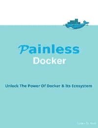
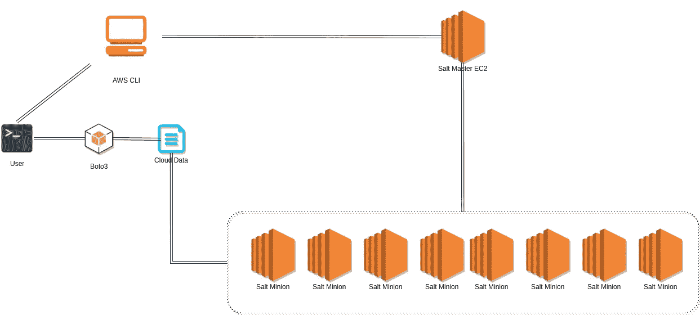

# 在 AWS 上使用 SaltStack、Boto3 和 CloudInit 创建大量 Docker 容器

> 原文：<https://medium.com/hackernoon/creating-an-army-of-docker-containers-using-saltstack-boto3-cloudinit-on-aws-cfd048e9c116>

## 放弃

此内容是我们在线课程/培训的一部分/灵感来源。在 2019 年黑色星期五期间，我们对这些材料提供高达 80%的折扣。

您可以在这里享受您的[折扣。](http://bf.eralabs.io)

[](http://bf.eralabs.io)

不将基础设施作为代码来实施的开发运维转型仍将是不完整的:基础设施自动化是现代数据中心的支柱。

有了 SaltStack 和 Docker 这样的工具，事情变得更容易了。

本教程是[无痛码头工人课程](http://painlessdocker.com/)的一部分。

[](http://painlessdocker.com)

如果您有兴趣了解我们关于 AWS 的新课程，[使用此表格](https://eon01.typeform.com/to/MMPiyz)注册，我们将与您分享有趣的内容！

**更新:**

> *在将这个故事分享给 Reddit 后，我看到一些评论说我正在重新发明 AWS Lambda 或一般的无服务器系统。*
> 
> *我想说耶！为什么不呢！？*
> 
> 毕竟，这个课程的目的是教育，你可以把它当作一个反向黑客。
> 
> *黑客快乐！*

# 介绍

我们将使用一组工具，如 SaltStack、Boto3 (Python3)、AWS CLI、EC2，来创建一个主容器和一些运行 Docker 容器的附属容器。

这张图表解释了我们将要做的许多事情。



# 使用 AWS CLI 创建第一台 EC2 机器

我们需要 VPC 的 ID、安全组的 ID、子网的 ID、密钥对的名称以及我们要使用的操作系统的 AMI(Ubuntu 16.04)。后者取决于区域。

## 描述 VPCs

让我们看看作为 VPC 我们有什么:

```
aws ec2 describe-vpcs
```

您应该会得到一个活动 VPC 的详细列表:

```
{
    "Vpcs": [
        {
            "DhcpOptionsId": "dopt-xxxxxx",
            "CidrBlock": "172.31.0.0/16",
            "InstanceTenancy": "default",
            "State": "available",
            "IsDefault": true,
            "VpcId": "vpc-xxxxx"
        },
        {
            "DhcpOptionsId": "dopt-xxxxx",
            "CidrBlock": "172.20.0.0/16",
            "InstanceTenancy": "default",
            "State": "available",
            "Tags": [
                {
                    "Key": "xxxxx",
                    "Value": "xxxxx"
                },
                {
                    "Key": "xxxxxx",
                    "Value": "xxxxx"
                },
                {
                    "Key": "xxxxxx",
                    "Value": "xxxxxx"
                }
            ],
            "IsDefault": false,
            "VpcId": "vpc-xxxxxx"
        }
    ]
}
```

## 列出安全组

```
aws ec2 describe-security-groups
```

您应该得到一个列表:

```
{
      "IpPermissionsEgress": [
        {
          "IpProtocol": "-1",
          "IpRanges": [
            {
              "CidrIp": "0.0.0.0/0"
            }
          ],
          "UserIdGroupPairs": [

          ],
          "PrefixListIds": [

          ]
        }
      ],
      "Tags": [
        {
          "Key": "Name",
          "Value": "xxxxxx"
        }
      ],
      "OwnerId": "xxxxx",
      "GroupName": "xxxxxxxx",
      "VpcId": "vpc-xxxxxxx",
      "Description": "xxxxxx",
      "IpPermissions": [
        {
          "IpProtocol": "-1",
          "IpRanges": [
            {
              "CidrIp": "0.0.0.0/0"
            }
          ],
          "UserIdGroupPairs": [

          ],
          "PrefixListIds": [

          ]
        },
        {
          "IpRanges": [
            {
              "CidrIp": "0.0.0.0/0"
            }
          ],
          "ToPort": 22,
          "UserIdGroupPairs": [

          ],
          "PrefixListIds": [

          ],
          "IpProtocol": "tcp",
          "FromPort": 22
        },
        {
          "IpRanges": [
            {
              "CidrIp": "0.0.0.0/0"
            }
          ],
          "ToPort": 2376,
          "UserIdGroupPairs": [

          ],
          "PrefixListIds": [

          ],
          "IpProtocol": "tcp",
          "FromPort": 2376
        }
      ],
      "GroupId": "sg-xxxxxx"
    }    
    ...
```

## 描述可用性区域和选择 AMI:

```
aws ec2 describe-availability-zones
```

即使我们不打算直接使用它来查找 AMI，我们也应该首先获得这些信息:

```
{
    "AvailabilityZones": [
        {
            "Messages": [],
            "RegionName": "eu-west-1",
            "ZoneName": "eu-west-1a",
            "State": "available"
        },
        {
            "Messages": [],
            "RegionName": "eu-west-1",
            "ZoneName": "eu-west-1b",
            "State": "available"
        },
        {
            "Messages": [],
            "RegionName": "eu-west-1",
            "ZoneName": "eu-west-1c",
            "State": "available"
        }
    ]
}
```

因为我要用 Ubuntu，所以我用了这个网站:[https://cloud-images.ubuntu.com/locator/ec2/](https://cloud-images.ubuntu.com/locator/ec2/)

## 描述子网

```
aws ec2 describe-subnets
```

你会得到一个类似的列表:

```
{
            "AvailableIpAddressCount": 4091,
            "MapPublicIpOnLaunch": true,
            "AvailabilityZone": "eu-west-1b",
            "VpcId": "vpc-xxxxxx",
            "State": "available",
            "DefaultForAz": true,
            "CidrBlock": "172.31.0.0/20",
            "Tags": [
                {
                    "Value": "xxxxxxxxxx",
                    "Key": "Name"
                }
            ],
            "SubnetId": "subnet-xxxxxxxxxx"
        }
```

## 获取密钥对

```
aws ec2 describe-key-pairs
```

它将显示现有密钥对的列表:

```
{
    "KeyPairs": [
        {
            "KeyFingerprint": "xxxxxxxxxxx",
            "KeyName": "xxxxxxxx"
        },
        {
            "KeyFingerprint": "xxxxxxxxx",
            "KeyName": "xxxxxxxx"
        }
    ]
}
```

## 让我们创造机器

```
aws ec2 run-instances --image-id ami-785db401 --count 1 --instance-type t2.micro --key-name .xxxxx --security-group-ids sg-xxxxx --subnet-id subnet-xxxxx --associate-public-ip-address --query 'Instances[0].InstanceId' --output text
```

这应该向我们显示实例的 id:

```
i-0ed688fc95b1feeb2
```

## 获取公共 DNS

为了使用 SSH 连接，我们应该得到这个！

```
aws ec2 describe-instances --instance-ids i-0ed688fc95b1feeb2 --query 'Reservations[0].Instances[0].PublicDnsName' --output text
```

输出结果是:

```
ec2-34-253-201-12.eu-west-1.compute.amazonaws.com
```

## 让我们试试公共 IP 吧！

与 DNS 相同，类型:

```
aws ec2 describe-instances --instance-ids i-0ed688fc95b1feeb2 --query 'Reservations[0].Instances[0].PublicIpAddress' --output text
```

输出:

```
34.253.201.12
```

## 我需要私有 IP

在我的例子中，我将使用私有 IP 将 Salt Minion 连接到 Salt Master，如果您将在同一个 VPC 中创建两台机器，也可以这样做。

如果您想使用私有 IP:

```
aws ec2 describe-instances --instance-ids i-0ed688fc95b1feeb2 --query 'Reservations[0].Instances[0].PrivateIpAddress' --output text
```

输出:

```
172.31.4.106
```

## 安装主设备

使用公共 DNS 和您的密钥对连接到创建的机器:

```
apt install salt-master
```

# 使用 Boto3 和 Cloudinit 创建和配置多个 Minion 机器

要使用 Boto3 (Python)，如果不想安装到机器上，可以创建一个 Python 虚拟环境。我在任何情况下都是这么做的。

```
virtualenv -p python3 learningcd learning/
. bin/activate
pip install boto3
mkdir app && cd app
```

现在让我们创建 Python 脚本:

```
import boto3
import sysAWS_ACCESS_ID = "xxxxxxxxxx"
AWS_SECRET_KEY = "x/xxxxxx"
ImageId = "ami-785db401"
KeyName = ".xx"
InstanceType = "t2.micro"MinCount = 1
MaxCount = 1
SubnetId = "subnet-xxxxx" 
SecurityGroupIds = ["sg-xxxxxx"]
UserData = open('init.sh')conn = boto3.client(
    'ec2',
    aws_access_key_id=AWS_ACCESS_ID,
    aws_secret_access_key=AWS_SECRET_KEY
)for i in range( int(sys.argv[1]) ):
    reservation = conn.run_instances(ImageId=ImageId,
                                 KeyName=KeyName,
                                 InstanceType=InstanceType,
                                 MinCount=MinCount,
                                 MaxCount=MaxCount,
                                 SecurityGroupIds=SecurityGroupIds,                                
             SubnetId = SubnetId,
                                 UserData=UserData.read())
```

这是用户数据文件:

```
#!/bin/bash#[https://alestic.com/2010/12/ec2-user-data-output/](https://alestic.com/2010/12/ec2-user-data-output/)
exec > >(tee /var/log/user-data.log|logger -t user-data -s 2>/dev/console) 2>&1
echo BEGINsudo apt-get update -y
sudo apt-get upgrade -y# Install saltstack
sudo apt-get install salt-minion -y# Set salt master location and start minion
sudo sed -i 's/#master: salt/master: 34.253.201.12/g' /etc/salt/minion
sudo salt-minion -d# Install Docker
curl -fsSL [https://download.docker.com/linux/ubuntu/gpg](https://download.docker.com/linux/ubuntu/gpg) | sudo apt-key add -sudo add-apt-repository \
   "deb [arch=amd64] [https://download.docker.com/linux/ubuntu](https://download.docker.com/linux/ubuntu) \
   $(lsb_release -cs) \
   stable" -y   

sudo apt-get update -y || :
sudo apt-get install docker-ce -ysudo apt install python-pip -y && sudo pip install docker-py -yecho END
```

它将在机器启动时通过安装 Salt Minion 和 Docker 来配置机器。

请注意，在上面的脚本中，我们已经将 minion 的服务器设置为 master 的私有 IP 地址。

```
sudo sed -i 's/#master: salt/master: 34.253.201.12/g' /etc/salt/minion
```

要创建 5 台机器，只需键入:

```
python <script_name> 5
```

要运行 1000 台机器，只需键入:

```
python <script_name> NO WAY :)
```

现在我们有 5 台机器安装了 Salt Minion 和 Docker 以及一个 Salt Master。

# 连接奴才和主人

在主类型上:

```
salt-key -L 
```

你会得到等待被接受的奴才:

```
Accepted Keys:
Denied Keys:
Unaccepted Keys:
ip-172-31-5-169.eu-west-1.compute.internal
ip-172-31-5-168.eu-west-1.compute.internal
ip-172-31-5-167.eu-west-1.compute.internal
ip-172-31-5-166.eu-west-1.compute.internal
ip-172-31-5-165.eu-west-1.compute.internal
ip-172-31-5-164.eu-west-1.compute.internal
..etcRejected Keys:
```

接受所有使用:

```
salt-key -A
```

然后取消注释/etc/salt/master 中的以下部分:

```
file_roots:
  base:
    - /srv/salt
```

我们将在上述位置为盐状态和盐高状态设置一个文件服务器。现在重新启动主服务器:

```
pkill salt-master
salt-master -d
```

为了在 Minions 上安装 Docker 容器，您不应该忘记这一点:

```
salt * pip.install docker-py>=1.4.0
```

该命令将安装 Python docker 包 1.4.0 的更高版本。

现在创建两个文件，顶层文件

> 在 Salt 中，包含网络上的机器组和应该应用于它们的配置角色之间的映射的文件被称为`top file`。

和 SLS 文件:

> 盐态系统的核心是 SLS，或者说**S**a**L**t**S**tate 文件。SLS 是系统应该处于的状态的表示，并且被设置为以简单的格式包含该数据。这通常被称为配置管理。

*(两个引语均引自官方盐业文献)*

下面是文件树的结构:

```
tree /srv/salt//srv/salt/
├── top.sls
└── webserver.sls
```

# 启动码头集装箱

我们将运行多个 Nginx 容器。Nginx 在这里只是一个例子，你可以运行任何你想要的镜像。

我们来修改一下 webserver.sls 的内容，告诉高手运行 Nginx:

```
my_service:
  dockerng.running:
    - name: nginx
    - image: nginx
```

现在让我们修改顶层文件的内容，并告诉主服务器将状态应用到以 Ubuntu 为操作系统的服务器上。这是一种瞄准技术，您可以选择任何其他瞄准模式。

(阅读这篇文章了解更多信息:[https://docs.saltstack.com/en/latest/topics/targeting/](https://docs.saltstack.com/en/latest/topics/targeting/))

```
#top.sls filebase:
  'os:Ubuntu':
    - match: grain
    - webserver
```

要启动容器，请键入:

```
salt '*' state.apply
```

您将获得执行日志:

```
[...]
ip-172-31-5-169.eu-west-1.compute.internal:
----------
          ID: my_service
    Function: dockerng.running
        Name: nginx
      Result: True
     Comment: Container 'nginx' is already configured as specified
     Started: 01:03:40.062033
    Duration: 28.66 ms
     Changes:Summary for ip-172-31-5-169.eu-west-1.compute.internal
------------
Succeeded: 5
Failed:    0
------------
Total states run:     5
```

Salt、Docker、Boto3 和 AWS 的这种组合可以用于不同的自动化场景，甚至用于自我修复和自动扩展的基础设施。

你可以在我的[无痛码头工课程](http://painlessdocker.com)里找到类似的教程。

*都是乡亲们！*

# 连接更深

如果你对这篇文章产生了共鸣，你可以在[无痛码头工课程](http://painlessdocker.com)中找到更多有趣的内容。

如果您喜欢本课程，请订阅我们的一份或多份简讯:

*   [devo PS links](http://devopslinks.com/):devo PS 生态系统发展迅速。每周，我们都会精心策划必读新闻、教程、评论等等！
*   [发货](http://joinshipped.com):关注无服务器、集装箱、FaaS &和其他有趣事物的独立时事通讯
*   [Kaptain](http://kaptain.xyz/) :一个#Kubernetes 社区中心，手动策划时事通讯，团队聊天，培训&更多

你可以在 [Twitter](https://twitter.com/eon01) 、 [Clarity](https://clarity.fm/aymenelamri/) 或者我的[网站](http://aymenelamri.com)上找到我，你也可以查看我的书: [SaltStack For DevOps](http://saltstackfordevops.com) 。

别忘了加入我们的求职板[devo PS](http://jobsfordevops.com)求职！


如果你喜欢这篇文章，请推荐它并与你的追随者分享。