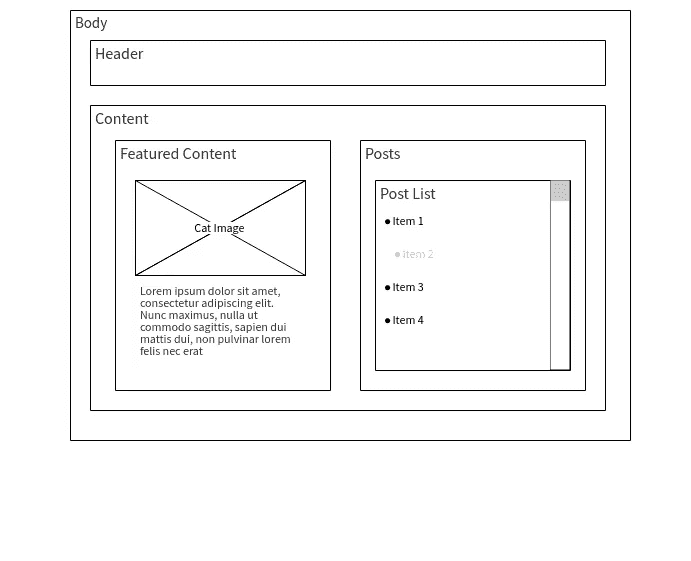
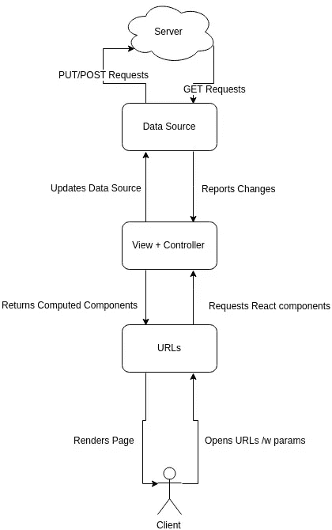

# 使用 React 创建超棒的水疗中心

> 原文：<https://medium.com/hackernoon/creating-awesome-spas-with-react-66b4e2043621>


我记得当我开始构建 webapps 时，我曾经严重依赖后端框架来满足我的大部分模板需求。(一开始)简单地用 Jinja 或 blade 脚本填充我的页面来创建一个功能性的用户界面是非常诱人的。因为那时我对 MVC 的理解非常有限，这让我付出了可维护代码的代价。

我偶然看到一本非常有趣的书，讨论了创建单页应用程序的最佳实践，你可以在这里找到它。我认为视图层仅仅是我的核心逻辑的副产品，它需要更多，它自己的 MVC！规则都差不多。但是必须记住，模型、视图和控制器的复杂性取决于需求。对于像 GitHub 这样的每页操作数相对低于 Gmail 或 Canva 的界面，管理对服务器的调用对于交互性低的应用程序与那些 ui 丰富的应用程序是不同的。因此，事先熟悉设计是很重要的，这种理念有利于在 [react](https://hackernoon.com/tagged/react) 中开发，因为 react 鼓励你将 DOM 元素视为独立的组件。

事不宜迟，让我们讨论一下如何在我们的应用程序中安排文件。

# 成分

让我们讨论 SPA 的不同方面，并对它们进行分解。让我们先看看它们是什么，我们将在下一节中连接它们。

## 数据层

SPA 中的模型，像其他应用程序一样处理项目的数据层，它负责进行获取数据的 API 调用，并使用 [JSON](https://hackernoon.com/tagged/json) 响应来填充模型，因为 react 没有任何定义模型的官方方法，所以我选择使用 [backboneJS](http://backbonejs.org/#) 来实现这一点。这也免去了我定义自己的[数据源](http://singlepageappbook.com/detail2.html#data-source)的麻烦。

backboneJS 中有两个类可以有效地管理数据，即模型和集合类。

**型号**

模型是主干网中数据的绝对表示。下面是一个基本模型的片段。

```
import Backbone from 'backbone'; const Property = Backbone.Model.extend({ urlRoot : Constants.api_url+'/api/property'});export default Property;
```

这是 **Property.js** 文件中的代码，它是一个主干[模型](http://backbonejs.org/#Model)，我们可以调整它的属性来设置验证器、设置默认值等。但最重要的是，我们将使用它从我们的 API 获取数据。我们的模型将通过 jqXHR 请求获取数据，我们所要做的就是指定一个有效的 API URL。

**收藏**

集合用于管理模型集。一个模型仅仅代表了该数据类型的一个实体，如果你的 API 返回一个属性列表呢？

```
import Backbone from 'backbone';import Property from '../models/Property';var PropertyCollection = Backbone.Collection.extend({ model: Property, initialize: function(models, options) { this.data = options.data; }, url: function(){ return Constants.api_url; }, parse: function(data) { return data; }});export default PropertyCollection;
```

上面的代码驻留在 PropertyCollection.js 中，如你所见，我们用之前声明的**属性**模型初始化了‘model’属性。如果您的 REST API 遵循适当的约定，它会自动[配置](http://backbonejs.org/#API-integration)凝乳请求，您可以简单地使用。创建()。fetch()和。destroy()方法。

## 视图+控制器

对于那些想知道我为什么把这两个混在一起的人，我有一个问题。水疗的最终目的是什么？来交付 UI！它毕竟只是一个更复杂的视图层。如果您正在进行一些繁重的客户端计算，那么拥有单独的控制器是有意义的。但是对于大多数应用程序来说，唯一关心的是提供一个无缝的界面，为了达到这个目的，视图是最重要的！有意识地读一下[这首](http://singlepageappbook.com/goal.html#controllers-must-die)。

然而，在 react 的情况下，消除控制器更有意义，因为每个组件都有自己的渲染和生命周期方法。这几乎涵盖了你需要的所有计算。

在你开始写你的观点之前，你必须分析你的终端用户应用的设计。仔细看看你要服务的页面的设计，仔细观察层次结构。例如，看看这个例子。



Wireframe for a hypothetical APP

假设这是您正在尝试构建的应用程序的页面。在顶层有 **Body** ，它封装了你想要显示的所有内容。这将是您的第一个 react 组件。然后在单独的文件中逐个创建子组件。

```
import React from 'react';import Header from '../widgets/Header';import Title from '../widgets/Title';import Footer from '../widgets/Footer';import PropertyDetail from '../widgets/PropertyDetail'const SinglePage = ({match}) => { return( <div id="wrapper" className="clearfix"> <Header></Header> <Title></Title> <PropertyDetail property_id={match.params.id}></PropertyDetail> <Footer></Footer> </div> )}export default SinglePage;
```

这是一个顶级组件，就像我制作的应用程序中的线框的**主体**，**标题**，**标题**，**属性细节**和**页脚**都是顶级包装器的子级。甚至 **PropertyDetail** 也有自己的孩子等等。

> 所有顶级组件后来都作为应用程序的独立页面

现在让我们谈一点线框。虽然我们知道**正文**可以是我们应用程序的页面，但同样不能说**特色内容**或**帖子、**它们将会是我们应用程序的小部件，在大多数情况下，这些小部件将会利用我们之前讨论过的模型。

## 路线

现在，对于路由，我们将使用 react 路由器，你们大多数人肯定听说过它。但在此之前，让我们讨论一下 URL。SPA 中的 URL 是应用的特定状态的表示，即，与路线和参数一起，应用可以在期望的状态下被加载。在交互式 SPA 中，每页有多个状态是很正常的，你会希望通过 URL 访问尽可能多的应用程序状态，但这将意味着混乱的 URL 方案，所以最好平衡两者。

为了创建干净的 URL，我决定将它们保存在一个单独的文件中(并且不使用[动态 URL](https://reacttraining.com/react-router/core/guides/philosophy/dynamic-routing)😄)来获得熟悉的 MVC 感觉。使用 React 路由器定义的路由只是 JSX 标签，组件作为道具传递给它们。

```
<Router><div><Route exact path="/search/:keyword" component={ListPage}/><Route exact path="/property/:id" component={SinglePage}/></div></Router>
```

这里的**列表页**和**单页**是我的顶级 react 组件。还要注意，你必须用 *< div >* 标签包装多个 URL。

# 布线

好了，我们知道什么是一个令人敬畏的温泉，是时候把这些碎片放在一起了。首先使用在脸书孵化器知识库中找到的 [create-react-app](https://github.com/facebookincubator/create-react-app) 生成一个项目，它对设置初始项目非常有帮助，并且所有现代 web 开发工具都为您管理，因此您可以专注于编写应用程序而不是配置 webpack(顺便说一下，这值得单独一篇文章来解释)。由于您将编写模块化代码，编写测试会容易得多，create-react-app 使用 [Jest](https://facebook.github.io/jest/) 来运行测试。

生成应用程序后，你的文件夹结构将如下所示。

```
my-app/
├── package.json
├── package-lock.json
├── public
│   ├── favicon.ico
│   ├── index.html
│   └── manifest.json
├── README.md
└── src
    ├── App.css
    ├── App.js
    ├── App.test.js
    ├── index.css
    ├── index.js
    ├── logo.svg
    └── registerServiceWorker.js
```

尝试运行`npm start`，如果一切正常，你的应用程序应该可以在 3000 端口上访问。还要记住将所有代码放在 **src** 目录中，该文件夹之外的任何内容都是不可访问的，这是 create-react-app generator 强加的限制。

## 重新整理东西

让我们面对现实吧，在当前的工作目录状态下，创建 SPA 的梦想都不会实现。除了 **index.js** 和**registerserviceworker . js**之外，我们将把所有东西都移动到一个新目录。在接触任何东西之前，创建这个目录结构。让脚本留在原处。

```
my-app/
├── package.json
├── package-lock.json
├── public
│   ├── favicon.ico
│   ├── index.html
│   ├── js
│   └── manifest.json
├── README.md
└── src
    ├── assets #All the media/styles/fonts/helper_functions:p
    │   ├── objects
    │   └── styles
    ├── components #controller+view Layer
    │   ├── pages #top-level pages
    │   └── widgets #children
    ├── data #Data Layer
    │   ├── collections #Backbone.Collection
    │   └── models #Backbone.Model
    ├── routes #React router routes
    ├── App.css #unruly mess
    ├── App.js
    ├── App.test.js
    ├── index.css
    ├── index.js
    ├── logo.svg
    └── registerServiceWorker.js #end unruly mess 
```



AppFlowChart.sucks

首先的事情首先创造这些(不一定按照这个顺序)

*   在`/src/components/pages`中创建一个简单的 react 组件，称之为 **Home.js**
*   在`/src/Urls`中创建 **Urls.js** 并创建一条指向 Home 对象`<Route exact path=”/” component={Home}/>`的路线。这将在您访问域根时呈现 **Home.js** 的内容。
*   将 **index.js** 中的渲染行改为`ReactDOM.render(<Urls/>, document.getElementById(‘root’));`

> 这样做时，要确保每个 JavaScript 文件只导出一个东西，并确保正确使用 import 语句。

这里要注意的另一件事是，顶级 react 页面不能是 react 类，因为 React 路由器在 URL 中传递参数，这些参数是作为参数而不是属性传递的！

虽然我们鼓励将您的小部件作为扩展 React.component 的类，但是您现在可以使用您的模型向小部件传递数据或者初始化它们的状态。

最后，当您准备好部署应用程序时，运行`npm run build`，这将捆绑您的所有资产，将 react 设置为生产模式，并保存打包的项目以构建项目目录。您现在可以部署您的应用程序了！

作为临别赠言，我想说我喜欢分享我对水疗的看法，这也帮助我组织我自己对这个话题的想法。

# 如果你喜欢这篇文章，请随意点击下面的按钮👏去帮助别人找到它！