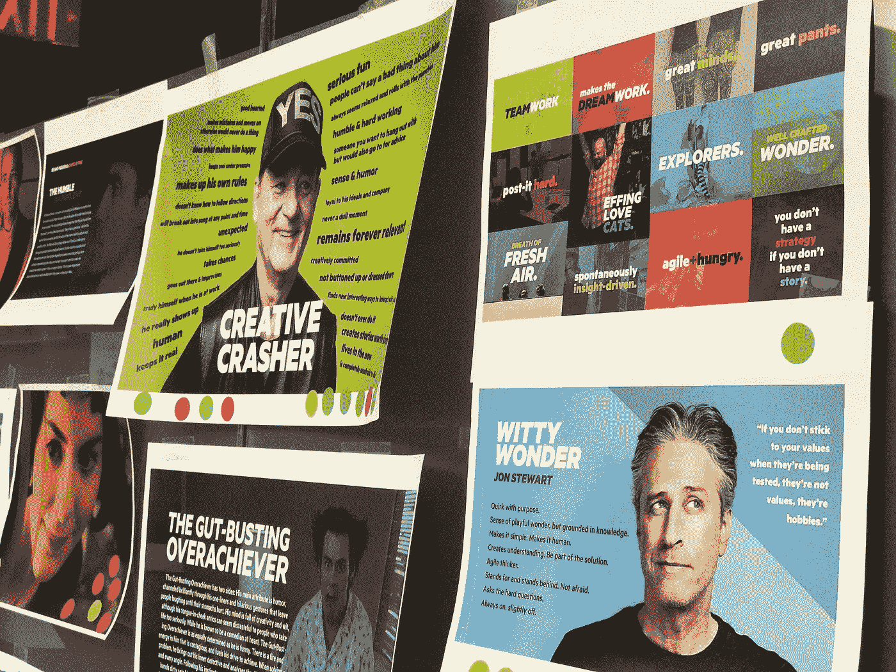
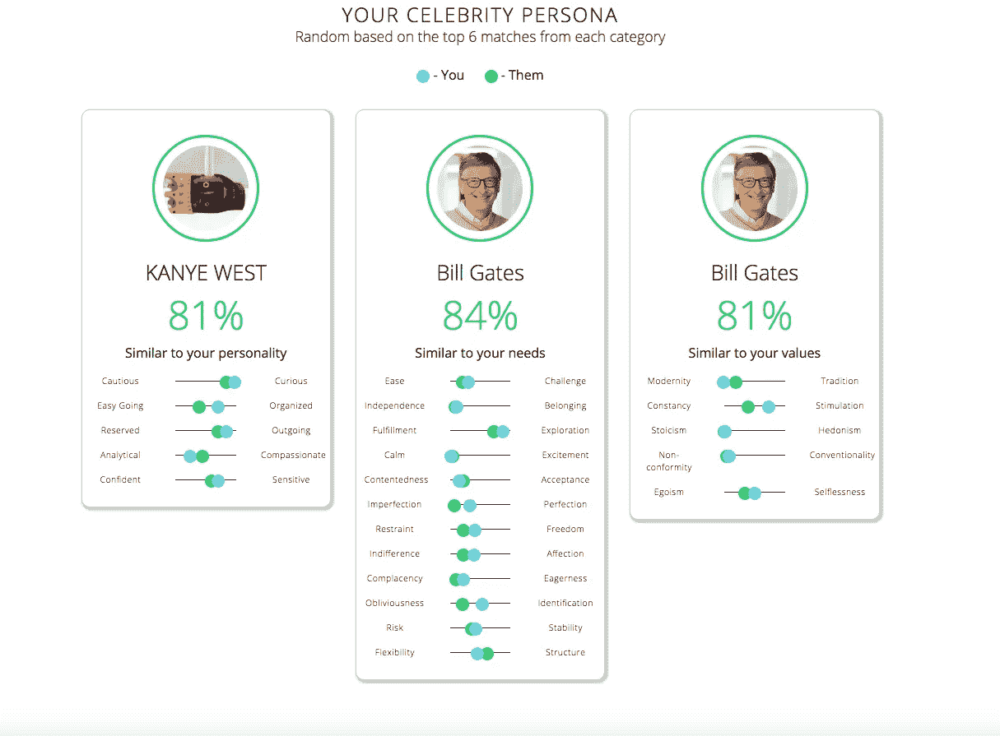
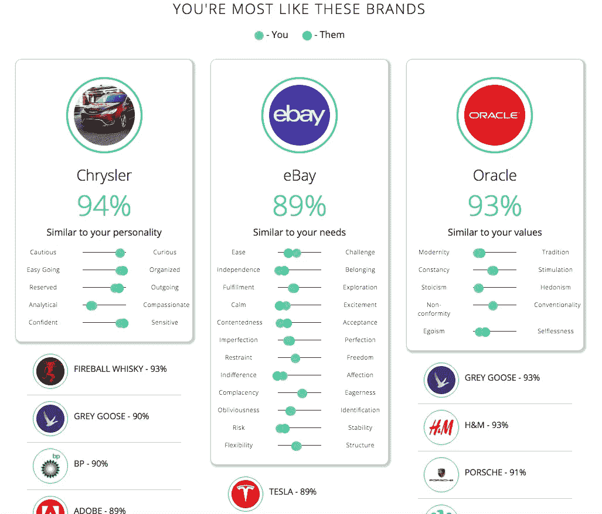
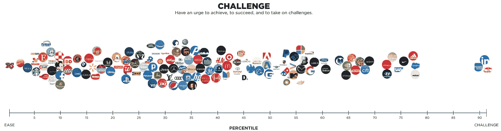
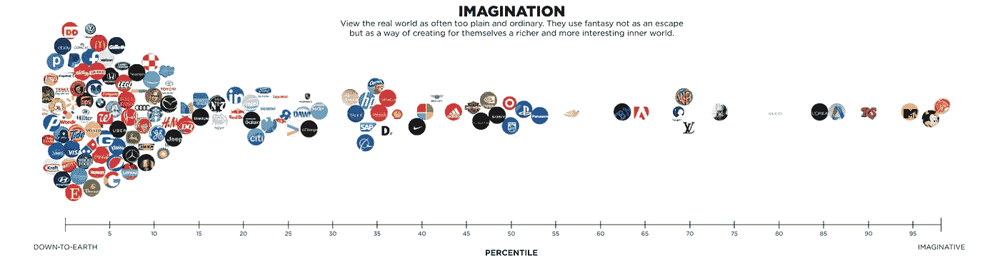
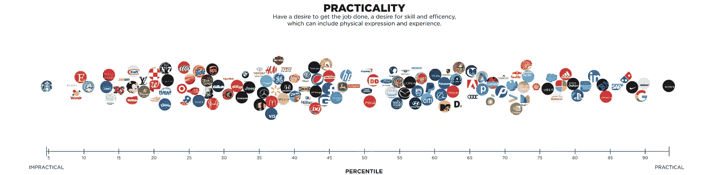

# 利用机器学习创建品牌人物角色

> 原文：<https://medium.com/hackernoon/creating-brand-personas-with-machine-learning-647d9314baaa>

作为一名开发人员，我通常不参加我们的品牌战略会议，但鉴于这个特别的会议是关于 20nine 的品牌，我能够体会到他们是如何工作的。我们的任务之一是想出一个最能代表公司[个性](https://hackernoon.com/tagged/personality)的角色(真实的或虚构的)。

大约在同一时间，我参加了一个当地的会议，并旁听了一个关于根据用户的 Twitter 活动预测他们的消费习惯和偏好的演讲。后来，我研究了 API 背后的科学，这使得这成为可能——**IBM Watson 的人格洞察力**。个性洞察服务基于开放词汇方法从内容输入中推断个性特征。它根据数千个性格测试分数以及相应的 Twitter 账户进行了训练。

我的假设是，通过浏览一家公司的网页，我们可以很好地了解该品牌的“个性”，并将其与名人进行匹配，以创建一个人物角色。我实际上能够找到这个示例应用程序来帮助创建这个:[https://github . com/Watson-developer-cloud/your-Cameron-match](https://github.com/watson-developer-cloud/your-celebrity-match)

# 关于个人资料

除了了解 API 之外，我还必须弄清楚根据给定的数据到底推断出了什么信息。沃森的人格洞察力使用三个著名的模型来确定人格特征。

## 五大银行

“大五”是最广泛使用的模型，用于描述个性特征以及一个人如何与世界打交道。该模型有 5 个维度:*宜人性、责任心、外向性、情绪范围*和*开放性。*

## 需要

这些描述了产品的哪些方面会引起一个人的共鸣。该模型包括十二种特征需求:*兴奋*、*和谐*、*好奇*、*理想*、*亲近*、*自我表达*、*自由*、*热爱*、*实用*、*稳定*、*挑战*、以及*结构*

## *价值观念*

*这些描述了影响一个人决策的激励因素。该模型包括五种价值观:*自我超越/帮助他人*、*保守/传统*、*享乐主义/享受生活*、*自我提升/获得成功*、*开放改变/兴奋*。*

*你可以在这里阅读更多相关内容:[https://www . IBM . com/Watson/developer cloud/doc/personal-insights/user-overview . html](https://www.ibm.com/watson/developercloud/doc/personality-insights/user-overview.html)*

# *建筑*

*我手动抓取了大约 150 个名人推特账号进行分析。使用 Twitter API，我抓取名人的推文，并通过 Personality Insights API 发送出去。输出被保存到 MongoDB 实例中，以便稍后与品牌进行比较。*

*接下来，我在 node.js 中构建了一个非常简单的网站抓取器，它抓取顶级 URL 并删除页面中的所有标题、段落和跨度标签。由于它只抓取顶级 URL，输入主页 URL 和博客 URL 可能会返回不同的结果，因为额外的博客页面会在后者上被拾取。沃森将内容组合在一起并进行分析。*

*然后，我们可以将任何网站与我们之前保存的名人进行比较。*

**

*Example output for 20nine.com*

*为了更进一步，我还抓取了大约 150 个全球最大品牌的 Twitter 账户，并使用相同的机制进行对比。*

**

*Example output for 20nine.com*

# *比较所有品牌*

*创建这个工具的一个意想不到的结果是能够比较和对比保存的品牌。他们可以按行业进行筛选和分析，以发现特定市场的潜在趋势和人物角色差距。*

*以下是这些品牌在挑战性、想象力和实用性方面的例子。*

******

*看到像迪士尼和 MTV 这样的公司在想象力方面得分很高，而红牛在挑战方面得分很高，这真是令人着迷。例如，如果我们希望一个品牌更富有想象力，我们可以研究迪士尼推出的内容，使其更倾向于这种个性特征。*

*[机器学习](https://hackernoon.com/tagged/machine-learning)正被用于越来越多的挑战，所以用数学和数据参与品牌化过程很有趣。*

*有兴趣看看我做的工具吗？你可以在这里查看:【http://insights.20nine.com/[。](http://insights.20nine.com/)*