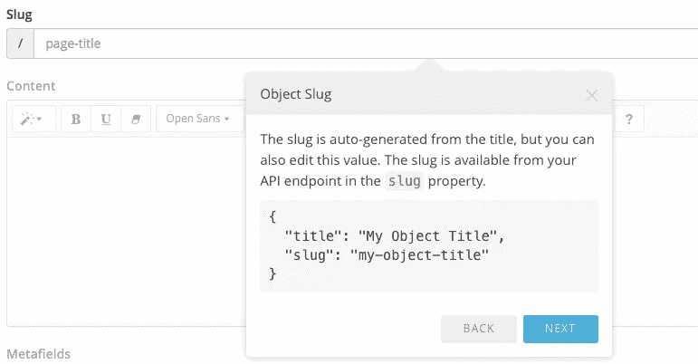

# 创建通过 API 提供的可扩展内容对象

> 原文：<https://medium.com/hackernoon/creating-extendable-content-objects-served-via-api-dbab075f7fe4>

在这篇博客中，我将向你展示如何使用 [Cosmic JS](https://cosmicjs.com/) 内容管理平台通过 4 个步骤创建一个可扩展的内容对象。一旦创建了我的对象，就可以通过 API 端点使用它了。以下 4 个步骤是为你的网络应用程序创建新的可扩展对象的简单方法，所以我鼓励你[注册](https://cosmicjs.com/signup)[宇宙 JS](https://cosmicjs.com/) 的并开始演示。如果你刚刚开始使用 Cosmic JS，我建议你查看一下[入门](https://cosmicjs.com/getting-started)和[文档](https://cosmicjs.com/docs)页面。我将使用 [Cosmic JS CMS Web 应用程序](https://cosmicjs.com/)来完成这 4 个步骤。

注册后，系统会提示您创建一个新的 Bucket，您可以将它视为您的项目:您的新网站、新 iOS 应用程序或新 Android 应用程序。我创建了我的 bucket，并创建了一个名为“Page”的对象类型。下面你可以看到我是如何创建一个可以通过 API 传送到任何联网设备的内容页面的。

# 1.1 添加对象—对象标题

# 1.2 添加对象-自动生成的废料

# 2.添加对象的内容

# 3.向对象添加元字段

# 4.保存对象草稿|发布对象

[Cosmic JS](https://cosmicjs.com/) 是一个 [API 第一的基于云的内容管理平台](https://cosmicjs.com/)，使得管理应用和内容变得容易。如果你有关于 Cosmic JS API 的问题，请在 [Twitter](https://twitter.com/cosmic_js) 或 [Slack](https://cosmicjs.com/community) 上联系创始人。

# 阅读更多

*   用 4 个步骤建立一个静态网站
*   [如何构建一个 API 驱动的静态网站](https://cosmicjs.com/blog/how-to-build-an-api-powered-static-website-the-best-of-both-worlds)
*   [版本迭代—可移植的 JSON 桶](https://cosmicjs.com/blog/version-iteration-portable-json-buckets)
*   [开发者聚焦:乔恩·布鲁默](https://cosmicjs.com/blog/developer-spotlight-jon-bloomer)
*   [通过内容管理 API 共享资源](https://cosmicjs.com/blog/sharing-resources-with-a-content-management-api)
*   [如何使用 React Native 和 Node.js 构建跨平台博客](https://cosmicjs.com/blog/how-to-build-a-cross-platform-blog-using-react-native-and-nodejs)
*   [如何创建直观的网站导航菜单](https://cosmicjs.com/blog/how-to-create-an-intuitive-website-navigation-menu)

> [黑客中午](http://bit.ly/Hackernoon)是黑客如何开始他们的下午。我们是 [@AMI](http://bit.ly/atAMIatAMI) 家庭的一员。我们现在[接受投稿](http://bit.ly/hackernoonsubmission)并乐意[讨论广告&赞助](mailto:partners@amipublications.com)机会。
> 
> 如果你喜欢这个故事，我们推荐你阅读我们的[最新科技故事](http://bit.ly/hackernoonlatestt)和[趋势科技故事](https://hackernoon.com/trending)。直到下一次，不要把世界的现实想当然！

