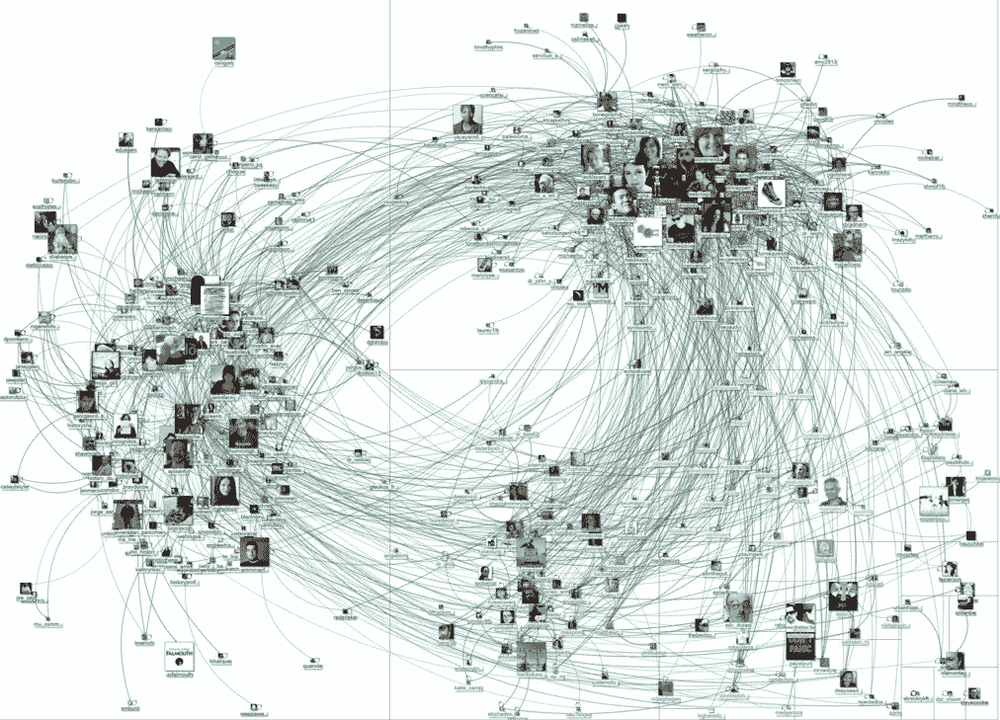

# 在虚拟现实、增强现实和磁共振中创造包容、安全的社交体验

> 原文：<https://medium.com/hackernoon/creating-inclusive-and-safe-social-experiences-in-vr-ar-and-mr-9cdaf2ab3d48>

Credit: Marc Smith ([https://www.flickr.com/photos/marc_smith/6704337077](https://www.flickr.com/photos/marc_smith/6704337077))

我的观点仅代表我个人，并不代表我的公司。

大多数探索虚拟现实(VR)、[、增强现实](https://hackernoon.com/tagged/augmented-reality) (AR)、混合现实(MR)的开发者都专注于寻找下一个媒介定义的产品；开发人员首先发现的一件事是，当 VR、AR 或 MR 体验是*社交*时，它会大幅增加沉浸感和参与度。视频游戏行业多年的研究探索了为什么社交联系和体验是延长产品寿命的关键组成部分，以及为什么社交游戏性是一些最受欢迎的游戏在发布 10 年后仍在玩的原因(如 *DOTA* 、*英雄联盟*、*魔兽世界、*或个人最喜欢的*、Ultima Online* )。所以，许多开发者试图为 VR、AR 和 MR 制作下一个伟大的多人游戏或社交体验并不奇怪。

然而，大多数试图创造社交体验的开发者都是在他们内部的游戏测试，或者朋友和家人的“阿尔法”和“贝塔”的范围内这样做的。在许多 VR、AR 和 MR 产品的整个开发周期中，大多数用户测试人员要么是朋友，要么是朋友的朋友，要么是同事，他们有一个预期的行为准则，并相互尊重。

当这些产品在开发人员的个人社交网络之外发布给消费者时，开发人员立即暴露在网络行为的极端情况下——包括积极的和消极的。只需进行几次搜索就可以发现，虚拟现实([示例 1](https://www.theguardian.com/technology/2016/oct/26/virtual-reality-sexual-harassment-online-groping-quivr) 、[示例 2](/athena-talks/my-first-virtual-reality-sexual-assault-2330410b62ee) 、[示例 3](https://www.polygon.com/2016/3/16/11242294/online-harassment-virtual-reality-gdc-2016) )、AR 或 MR 中的在线骚扰可能会很猖獗——而且由于沉浸感——比任何现有媒体都更具破坏性。然后，开发人员面临挑战*追溯*试图重新设计他们的社交体验，使其在他们的产品到达不归路并因体验易受毒害或骚扰行为的名声而失败之前变得包容和安全。

# 那么，开发者可以做些什么来主动设计更包容、更安全的社交体验呢？

1.  ***口头承诺，和一个社区代号*** 。在社会心理学中，有一个现象被研究叫做 [*口头承诺*](https://www.psychologytoday.com/blog/let-their-words-do-the-talking/201212/get-things-done-get-verbal-commitment) 。基本的想法是，如果你明确地询问并从某人那里得到关于某个问题或任务的肯定，他们更有可能承诺并去做。所以，如果你想让你的孩子打扫他们的房间，你应该问他们，“我能向你保证你会在今晚 5 点前做完家务吗？”如果孩子口头上公开说，“是的，我能”，他们更有可能真的完成任务。开发人员利用这一现象背后的科学的最简单的方法之一是在用户进入在线社交体验之前向他们展示一个“社区行为准则”。**这不是大多数产品都有的典型服务协议条款！用户很少阅读这些内容，它们对社交体验中的在线行为没有影响。社区行为准则必须简单，易读(没有法律术语！)并应使用“我”的语言。例如，“*我会尊重每一个用户，如果做不到这一点，我将放弃成为这个社区一员的特权。*“根据你想在用户体验和口头承诺之间权衡的程度，你可以利用 3 个肯定选项:(1)最弱的选项是让用户在阅读代码后点击“我同意”。(2)中等选项是让用户打出表示“我同意”的字母(3)最强的选项，但是对用户最不友好的，是让用户键入整个句子。根据产品的不同，像这样一个简单的功能可以减少超过 20%的在线骚扰。**
2.  ***记录更好的数据*** 。有了 Unity [这样的引擎简化了数据分析](https://unity3d.com/unity/features/analytics)的实现，不再有借口不对项目进行数据分析；然而，开发人员不应该只关注标准的关键性能指标(KPI ),如 CCU(并发用户)或 MAU(每月活跃用户)。开发人员专门记录与社交体验相关的数据至关重要。许多开发人员只会记录基本信息，比如用户多久被报告一次攻击性行为— *这已经不够好了*。当涉及到 VR、AR 和 MR 等新媒体时，用户更有可能退出体验，再也不会尝试某个产品，而不是提交一份针对违规用户的准确报告。毕竟有 1000 种其他产品可以尝试，为什么他们必须在一个产品中处理攻击性行为？除了实现一个“报告”特性和记录基本的报告指标，开发人员还应该记录次要的指标。例如，对于一个给定的用户，在一次交互后，另一个用户“屏蔽”或“静音”他们的频率是多少？如果你的社交体验中的用户经常被屏蔽或静音，这可能是一个危险信号。对于那些想更深入了解这个领域的人，可以考虑学习一下[社交网络分析](https://en.wikipedia.org/wiki/Social_network_analysis)。通过社交网络分析，可以分析用户之间的交互，并查看一些用户是否对其他用户产生负面影响。例如，想象一下，如果您的开发人员能够识别出在与另一个用户交互后，增加了另一个用户注销并不再返回该产品的几率的用户，这将是多么强大？如今，几乎每个开发人员都会记录某种形式的数据，但是为了优化更加包容和安全的社交体验，开发人员需要开始记录正确的数据。
3.  ***反馈*** 。当谈到在 VR、AR 或 MR 中设计一个包容和安全的社区时，最关键的一个方面是你如何[设计](https://hackernoon.com/tagged/design)反馈回路。你不能**只是**实现允许用户在事后停止骚扰的功能，比如“报告”或“阻止”功能——这些是基础。如果用户不得不使用这些功能，*损害已经造成了*，用户可能会脱离你的产品，永远不再回来。另外，如果你从来不给违规用户反馈，那么你的产品或平台就是*有效地*告诉违规用户，他们的行为是可以的，问题是受害者。一般来说，反馈越快越具体，用户的反应就越好。在视频游戏或社交媒体平台上，公司过去会“禁止”有攻击性行为的用户，但执行力度普遍很差。例如，某天一个用户可能是极端种族主义者，但是**周之后**，公司会给玩家发一封类似这样的电子邮件，“*你因违反服务条款而被封禁。请联系客户支持了解更多详情。“这是一个可怕的反馈，因为它是在攻击性事件发生后**周**发出的，而且没有任何细节。人类几乎不记得他们上周午餐吃了什么；我们不能指望用户记得违反了服务条款的哪一部分。相反，这些用户很可能会指责公司错误地禁止他们。对于大多数产品来说，这是一个双输的局面，因为用户最终会变得愤怒，不知道应该改变什么行为，而只是创建一个新帐户并重新加入在线社区，因为大多数产品的准入门槛都很低。当设计你的客户服务循环或报告系统时，确保你有最快和最具体的反馈循环——对违规用户和受害者都是如此。然而，在创建快速反馈循环时，请注意以下风险。*
4.  ***反馈，第二部分*** 。反馈的另一个对产品设计至关重要的方面是如何将反馈整合到用户体验(UX)设计中。例如，在今天的许多产品中，当一个用户“阻止”或“屏蔽”另一个用户时，违规的用户会得到一个大的闪烁标志。"您已被[用户]静音。""您已被[用户]阻止。"这是糟糕的产品设计，因为这种类型的反馈会引发甚至更多的负面行为。当一个用户骚扰某人时，他们会收到另一个用户阻止了他们的消息，这就像是多巴胺的增加，让骚扰者知道“*他们赢了，“*”和“*”他们的行为产生了影响。在设计反馈系统时，一定要确保你不会向冒犯的用户提供任何关于受害者的信息，这可能会引发更多的负面行为。一种解决方案是不立即传递反馈，让反馈来自“社区”，这样冒犯的用户就不能直接指出是哪个目标报告/阻止/屏蔽了他们并触发了反馈。*
5.  ***空间气泡*** 。像 [AltspaceVR](https://killscreen.com/versions/users-can-no-longer-encroach-personal-space-thanks-altspaces-space-bubble/) 这样的产品已经开始探索虚拟现实特有的功能，这些功能可以创造更积极的在线体验，例如可以打开/关闭的个人空间气泡，可以允许或阻止其他用户进入你的个人空间。这是一个伟大的设计，可以改善在线体验；然而，开发者可以进一步推进这一点。例如，不要切换，将你的个人空间气泡与你的好友列表绑定，这样更容易选择谁可以进入你的个人空间。或者，基于文化背景调整个人空间气泡(例如，对于来自对个人空间更尊重/严格的文化的用户，具有更严格的个人空间气泡)。您还可以将个人空间气泡与我们在本文前面提到的其他功能联系起来，例如自动打开针对所有用户的个人空间气泡，这些用户有大量用户阻止或屏蔽它们。
6.  ***承担风险*。**在 PC 或移动平台上，被禁止的用户通常可以在几分钟内创建一个新帐户并重新加入在线体验；然而，VR、AR 和 MR 不像你常规的移动或 PC 体验——在大多数情况下，身份与昂贵的硬件相关联，并且解决方法不太明显。平台公司可以承担风险，将用户从他们的生态系统中完全移除。将潜在的付费消费者从生态系统中剔除，听起来可能很荒谬；但是，一些研究表明，你从一个平台上移除每一个恶劣的冒犯者，就会有更多的用户保持参与。

设计包容和安全的社交体验并不容易，设计师们仍在寻找解决这类问题的最佳方法。希望这些技巧可以帮助您的产品团队从第一天起就在产品设计中考虑这些问题，从而为 VR、AR 和 MR 创造出更具包容性和安全性的产品。追溯过去，*重新设计*产品以解决包容性和用户安全*几乎总是更加困难。如果你对这个话题感兴趣，可以看看我之前的演讲:*

1.  [网络游戏中塑造玩家行为背后的更多科学](http://www.gdcvault.com/play/1022160/More-Science-Behind-Shaping-Player)。

# 关于作者:

**杰弗里·林博士**

Jeffrey Lin 目前是脸书领先设计团队 AR/VR 体验的设计总监，该团队正在为第一代虚拟和增强现实内容铺平道路。他之前是 Magic Leap 的设计总监，也是 Riot Games 获奖电脑游戏《英雄联盟》的首席设计师，Riot Games 是《财富》杂志评选的最佳雇主之一。他也是 Valve Software 的研究科学家，屡获殊荣的 PC 游戏 *Portal 2* 的制作者，以及 *Steam* 平台的创造者。他在华盛顿大学获得了认知神经科学博士学位，并得到了霍华德·休斯医学研究所的资助。他的设计作品被刊登在*连线杂志、麻省理工学院技术评论、The Verge、科学美国人*、*时代健康&科学、*和 *Re/code* 上。他的研究被刊登在许多同行评审期刊上，包括《自然》。