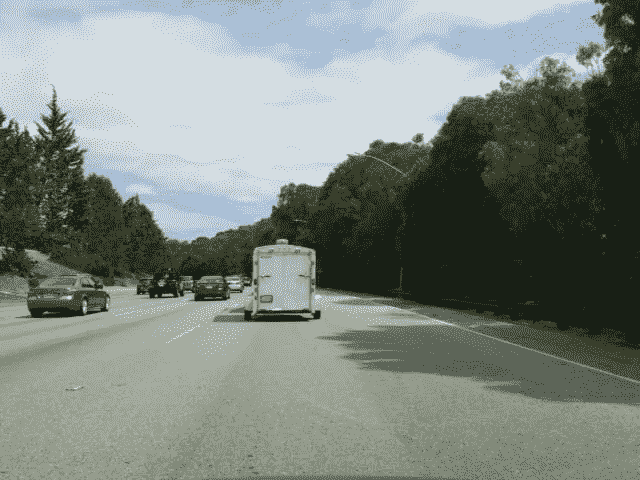
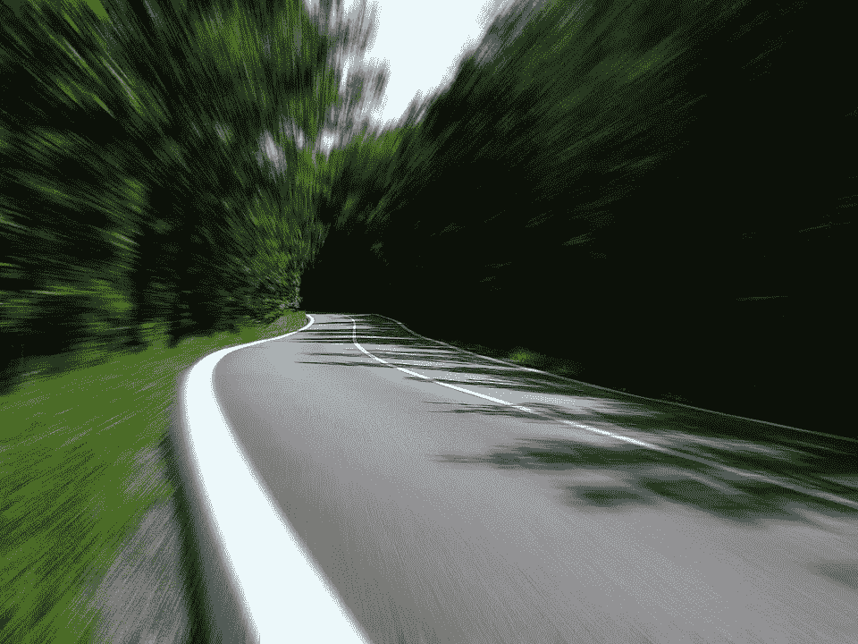

# 用 TensorFlow 中的 MobileNet 创建超快的图像分类器

> 原文：<https://medium.com/hackernoon/creating-insanely-fast-image-classifiers-with-mobilenet-in-tensorflow-f030ce0a2991>

## "这就像热狗不是热狗，而是为了道路."

MobileNets 是一个新的卷积神经网络家族，它将会让你大吃一惊，今天我们将在一个自定义数据集上训练一个。

有几件事让 MobileNets 变得很棒:

1.  它们小得惊人
2.  他们快得惊人
3.  它们非常准确
4.  它们很容易针对资源和准确性进行调整

为什么这很重要？很多移动深度[学习](https://hackernoon.com/tagged/learning)任务实际上都是在云端执行的。当你想对一张图片进行分类时，这张图片会被发送到一个网络服务，在一个远程服务器上进行分类，然后结果会被发送回你的手机。

这种情况正在迅速改变。你手机上的计算能力正在迅速增加，计算机视觉所需的[网络](https://hackernoon.com/tagged/network)复杂性正在缩小(这要感谢像 SqueezeNet 和 MobileNet 这样的架构)。

除了没有互联网连接的人工智能的明显优势之外，在速度饥渴的情况下，向云端发送图像是不切实际的，就像我们在[海岸线](http://coast.ai)开发的车辆安全应用程序。

至此，让我们学习以下内容:

*   什么是移动网络？
*   如何使用 TensorFlow 构建自定义数据集来训练 MobileNet
*   如何使用 TensorFlow 训练预先在 ImageNet 上训练的 MobileNet
*   MobileNets 在 Inception V3 中的表现
*   如何使用经过再培训的 MobileNet 对图像进行分类


We’ll use MobileNets to build a road, not road classifer to identify images like this one.

# 什么是移动网络？

MobileNets 是由谷歌的研究人员设计的一类卷积神经网络。它们被称为“移动优先”,因为它们是从基础上设计的，是资源友好的，运行迅速，就在你的手机上。

MobileNet 架构与“传统”CNN 架构之间的主要区别在于，MobileNet 将卷积分成 3×3 深度方向的 conv 和 1×1 点方向的 conv，而不是单个 3×3 卷积层后跟 batch norm 和 ReLU。为什么这如此重要的细节可以在 [MobileNet 论文](https://arxiv.org/pdf/1704.04861.pdf)中找到，我强烈建议你去读一读。

那么有什么问题呢？准确性。手机网络通常不如我们所熟悉和喜爱的更大、资源更密集的网络准确。但是发现资源/准确性的权衡才是 MobileNets 真正闪光的地方。

MobileNets 提供了两个参数，我们可以调整这两个参数来适应我们的实际问题的资源/精度权衡:宽度乘数和分辨率乘数。宽度乘数允许我们细化网络，而分辨率乘数改变图像的输入维度，减少每一层的内部表示。

谷歌[开源了 MobileNet 架构](https://research.googleblog.com/2017/06/mobilenets-open-source-models-for.html)，发布了 16 个 ImageNet 检查点，每个检查点对应不同的参数配置。这为我们训练自己的分类器提供了一个极好的起点，这些分类器*小得惊人*快得惊人*。*

*要了解更多关于 MobileNets 如何工作的信息，请阅读* [*MobileNets:用于移动视觉应用的高效卷积神经网络*](https://arxiv.org/pdf/1704.04861.pdf) *。*

# 如何构建自己的数据集来训练 MobileNet

我们今天面临的挑战是建立一个图像分类器，它可以检测图像是否是道路。就像[热狗，不是热狗](https://www.youtube.com/watch?v=ACmydtFDTGs)，而是为了道路。

为什么是路，不是路？在[海岸线](https://coast.ai)，我们正在利用使用计算机视觉的移动应用程序为您的汽车开发安全功能。与所有视力问题一样，用户隐私至关重要。因此，当用户打开我们应用程序中的摄像头时，我们首先检查的是它是否看到了道路。如果没有，我们就关掉摄像头。我们希望能够快速完成这项工作，并尽可能降低用户的计算成本。

因为我们正在处理一个自定义问题，所以我们需要从创建数据集开始。我们的目标是收集 10，000 张图像，大致平均分成 50/50 路/非路。

我们将从几个不同的地方获取数据:

*   从海岸线驾驶数据集中随机采样的 4000 幅明显的道路图像
*   2000 张显然不是从 ImageNet 数据集中随机抽取的道路图像
*   3，000 个从互联网上采样的明显不是道路的场景，以确保分类器不只是学习天空，而不是天空
*   还从互联网上采样了 1，000 个不太明显的道路场景，以确保分类器不会识别挡风玻璃反射或海岸线数据中的其他共性

我们将每个图像放入两个文件夹中的一个，每个文件夹代表该图像的类别:`road`和`not-road`。这就是我们为再培训准备图像所要做的一切！

然而，虽然从互联网上抓取 [CC 图像](https://search.creativecommons.org/)是一个给你的数据集增加多样性的好地方，但它也有一个缺点:标签很嘈杂。例如，通过搜索“道路景观”找到的图像可能有道路前方和中心，背景中有一个不错的场景，或者它可能是远处有一条小路的山区场景。


Two images both labeled “road”. For our problem, the first should be “not road” and the second should be “road”. Left: [“Scenic Mountain Road”](https://www.flickr.com/photos/82036561@N00/7524452224) by [*Tyler Thompson*](https://www.flickr.com/people/82036561@N00/)is licensed under [CC BY 2.0](https://creativecommons.org/licenses/by/2.0) Right: [“150927-road-scenic-bypass-mountains.jpg”](https://www.flickr.com/photos/zionfiction/21808267691) by [*r. nial bradshaw*](https://www.flickr.com/people/zionfiction/)is licensed under [CC BY 2.0](https://creativecommons.org/licenses/by/2.0)

我们可以通过浏览每张图片并手工标记来解决这个问题，但当我们有深度学习时为什么要这样做呢？！相反，我们在我们所有的数据上重新训练一个大网络(像 Inception V3)，特别注意不要通过早期停止和大量数据扩充来过度适应我们的训练数据。然后我们运行数据集的每个图像(甚至是我们刚刚用来训练的那些图像！)并跟踪它分类不正确或没有多少把握的图像。然后，我们浏览每一个图像，如果适用的话，将它们移动到相应的类别中。这大大减少了我们必须手动清理的图像数量。多次使用这项技术帮助我们在初始阶段提高了 7 个百分点的准确率。

现在我们有 5000 幅道路图像和 5000 幅非道路图像，在这样的结构中…

```
data/
  road/[images...]
  not-road/[images...]
```

…我们将使用 TensorFlow 和迁移学习在我们的自定义数据集上微调 MobileNets。

# 如何重新训练在 ImageNet 上预训练的 MobileNet

TensorFlow 附带了很棒的工具，您可以使用这些工具来重新训练 MobileNets，而无需实际编写任何代码。这是刚出版的东西:不到一周前[增加了对 MobileNet 的再培训支持](https://github.com/tensorflow/tensorflow/commit/055500bbcea60513c0160d213a10a7055f079312)！



A couple very obviously road images from the Coastline dataset.

如果您尚未下载，请派生和/或复制 TensorFlow repo:

```
git clone https://github.com/tensorflow/tensorflow.git
```

现在，您可以使用示例文件夹中的脚本在您自己的数据上重新训练 MobileNet。

但是等等！您应该使用哪个 MobileNet？这个问题问得好。让我们重新训练一个小组合，看看他们表现如何。为了开始培训，我们将从 TensorFlow repo 的根目录运行以下命令:

```
python tensorflow/examples/image_retraining/retrain.py \
    --image_dir ~/ml/blogs/road-not-road/data/ \
    --learning_rate=0.0001 \
    --testing_percentage=20 \
    --validation_percentage=20 \
    --train_batch_size=32 \
    --validation_batch_size=-1 \
    --flip_left_right True \
    --random_scale=30 \
    --random_brightness=30 \
    --eval_step_interval=100 \
    --how_many_training_steps=600 \
    --architecture mobilenet_1.0_224
```

`architecture`标志是我们告诉再训练脚本我们想要使用哪个版本的 MobileNet 的地方。1.0 对应于宽度乘数，可以是 1.0、0.75、0.50 或 0.25。224 对应于图像分辨率，可以是 224、192、160 或 128。例如，为了训练最小的版本，您可以使用`--architecture mobilenet_0.25_128`。

其他一些重要参数:

*   learning_rate:这是你想玩的东西。我发现 0.0001 很好用。
*   测试和验证百分比:脚本会将您的数据分为 train/val/test。它将使用 train 来训练，val 每隔“eval_step_interval”提供性能更新，测试将在“how_many_training_steps”之后运行，以给出您的最终分数。
*   validation_batch_size:将此值设置为-1 会告诉脚本使用您的所有数据进行验证。当您没有很多数据时(比如只有 10，000 张图像)，在这里使用-1 来减少评估步骤之间的差异是一个好主意。

在对几个模型架构进行再培训之后，我们来看看他们的对比如何。

# 将 MobileNet 参数及其性能与初始状态进行比较

在对 Inception 进行 600 步训练以获得基线(通过将`— architecture`标志设置为`inception_v3)`，我们达到了 95.9%)。训练进行了 18 分钟。(这里有很大的提升空间，但是我们没有一整天的时间！)产生的检查点大小为 84mb。通过运行 1，000 张图像进行快速测试表明，它可以在 NVIDIA GeForce 960m GPU 上以大约 19fps 的速度对图像进行分类。

*先不说:为什么“只有”95.9%而不是 100%？这似乎是一个非常简单的问题，对吗？嗯，除了我们可以对训练参数进行充分的调整(我们实际上在另一次使用不同配置的相同数据中实现了 98.9%)，事实证明类之间的区别比表面上看起来更微妙。拿这些案例来说:*

*   *图像是树林中一条单车道的土路:这是一条路还是一条小径？我都不知道。*
*   远处有一条路，是一处风景名胜。是一幅画还是一条路，还是画中只有一条路？景区什么时候移班？
*   这是一张艺术照，前景是一对手牵着手的夫妇，背景是一条经过时间推移的街道。路还是不路？抛硬币。

那么，移动互联网的表现如何呢？不奇怪，不太好。然而，权衡利益是令人震惊的。

使用最大的 MobileNet (1.0，224)，我们只需要 4 分钟的训练就可以达到 95.5%的准确率。最终的模型大小只有 17mb，可以在相同的 GPU 上以大约 135fps 的速度运行。

对于那些保持分数的人来说，这比**快 7 倍，大小是**的四分之一。所有这些只损失了 0.4%的精度。


最小的 MobileNet (0.24，128)怎么样，用量化权重？大的准确度折衷，仅达到 89.2%。但是看看这个:每秒 450 帧，而这个模型只占用 930kb 的内存。那是千字节！


# 使用重新培训的 MobileNet 对图像进行分类

现在，您已经在自定义数据集上对 MobileNet 进行了重新训练，是时候尝试一下了。毫不奇怪，TensorFlow 也附带了一个脚本来完成这一任务。

```
python3 tensorflow/examples/label_image/label_image.py \ 
  --graph=/tmp/mobilenet_0.50_192.pb \
  --labels=/tmp/output_labels.txt \
  --image=/home/harvitronix/ml/blogs/road-not-road/test-image.jpg \
  --input_layer=input \
  --output_layer=final_result \
  --input_mean=128 \
  --input_std=128 \
  --input_width=192 \
  --input_height=192
```



Our network classifies this as road, with confidence of 0.686811\. Not too confidence, but hey, that’s a FAST road!

*题外话:应该注意的是，在我们相当简单的两类问题中，精度权衡并不是那么大。对于有 1，001 个类的 ImageNet 来说，准确性的权衡要重要得多。[见](https://research.googleblog.com/2017/06/mobilenets-open-source-models-for.html)*此处的*表* *。*

# 后续步骤

好的，MobileNets 的全部意义就是在移动设备上运行，对吗？敬请期待！在我们的下一篇文章中，我们将创建一些专门构建的训练数据，再次进行微调，并将经过重新训练的 MobileNet 加载到 Android 应用程序中。我们将看到它在移动设备上运行的速度有多快，在现实世界中有多准确。

> *更新*:第二部现已上线！不要错过[用 TensorFlow](https://hackernoon.com/building-an-insanely-fast-image-classifier-on-android-with-mobilenets-in-tensorflow-dc3e0c4410d4) 中的 MobileNets 在 Android 上构建一个速度惊人的图像分类器。