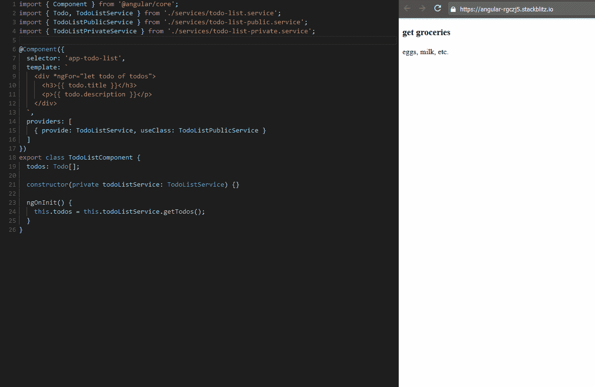

# 为角度服务创建接口

> 原文：<https://medium.com/hackernoon/creating-interfaces-for-angular-services-1bb41fbbe47c>

当处理一个需要根据上下文访问不同数据源的类时，用一个公共接口对这些数据源建模通常是有用的。同样，在 Angular 中，我们可能会遇到这样的情况，注入的服务需要根据其上下文有不同的实现，这是接口的完美候选。然而，由于接口没有被编译到 TypeScript 的 JavaScript 输出中，用 Angular 服务来实现这一点是相当不直观的。

本指南将通过一个简单的应用程序演示如何在 Angular 中创建服务接口。

Easily Swap Providers for Different Implementations

在这个[裸机应用程序](https://github.com/mgmarlow/Creating-Interfaces-Angular-Services)中，我将建立一个 todo-list 组件，它与两种不同类型的数据兼容:(a)公共数据，包含每个人都可见的 todo 和(b)私有数据，包含只对给定用户可见的 todo。然后，我将演示如何在这种情况下利用接口服务来帮助促进代码重用。

## 接口服务

我在上面提到过 Angular 不允许我们提供接口作为提供者，因为接口不是由 TypeScript 编译的。因此，当将服务建模为接口时，我们实际上必须使用抽象类。由于这个原因，当我引用接口服务时，我实际上指的是抽象类。

让我们设置作为基础的第一个服务:

`TodoListService`是一个简单的抽象类，除了我们的公共和私有实现之间的共享逻辑的定义之外，它什么也不包含(稍后会显示)。这个类实际上只不过是一个通知 Angular 关于`getTodos`方法的容器。通过使用这个服务，我们可以利用 Angular 的内置依赖注入来交换公共或私有数据的输入/输出实现。

让我们为公共和私人 todos 提供一些快速服务:

行`implements TodoListService`是告诉 Angular 使用这些服务中的任何一个来代替基本服务`TodoListService`是没问题的关键部分。这些服务需要做的另一件事是为接口服务中定义的所有方法提供实现；在这种情况下，方法就是`getTodos`。

最后，让我们设置待办事项列表的组件:

这就是接口服务真正发挥作用的地方。在`TodoListComponent`的构造函数中，我们可以引用我们的基础类`TodoListService`，而不需要区分公共或私有实现。**对于组件，任何实现** `TodoListService` **的服务都是有效的。**这意味着我们可以根据我们在特定组件或模块中的需求来交换公共和私有实现。

实际的交换发生在组件定义中的`providers`数组内。下面的代码行:`{ provide: TodoListService, useClass: TodoListPublicService }`通知 Angular，组件中对`TodoListService`的任何引用都将调用`TodoListPublicService`上的相同方法。类似地，如果我们想切换到私有数据，我们可以简单地将`useClass`属性切换到`TodoListPrivateService`。

需要注意的是，为了使用这个模式，这个`providers`数组不需要存在于组件上。同样的技术可以用在模块级。

## 资源:

*   App 代码:[https://github . com/mgmarlow/Creating-Interfaces-Angular-Services](https://github.com/mgmarlow/Creating-Interfaces-Angular-Services)