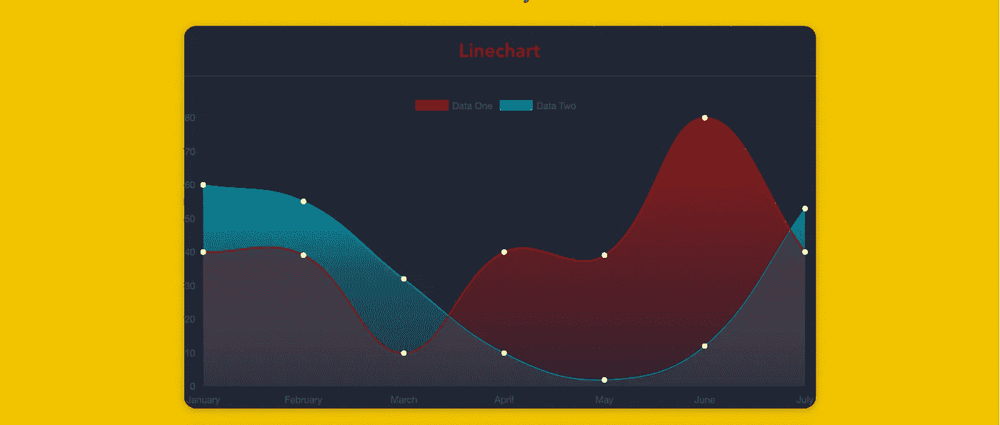

# 使用 Vue.js 和 Chart.js 创建令人惊叹的图表

> 原文：<https://medium.com/hackernoon/creating-stunning-charts-with-vue-js-and-chart-js-28af584adc0a>



深入 chart.js 的选项来创建令人惊叹的图表。

交互式图表可以提供一种很酷的方式来可视化您的数据。
然而，大多数开箱即用的解决方案都没有它们应有的漂亮，都有默认选项。

我将向你展示如何定制你的 chart.js 选项来制作一些很酷的图表！

# ⚡快速启动

我们将使用什么:

*   [Vue.js](https://vuejs.org/)
*   [vue-chart.js](http://vue-chartjs.org)
*   [vue-cli](https://github.com/vuejs/vue-cli)

我们使用 *vue-cli* 创建一个基本结构。所以我希望你已经安装好了。我们使用 *vue-chart.js* 作为 chart.js 的包装器。

```
vue init webpack awesome-charts
```

然后，我们进入项目文件夹，安装我们的依赖项。

```
cd awesome-charts && yarn install
```

我们加上 [vue-chartjs](http://vue-chartjs.org) :

```
yarn add vue-chartjs chart.js
```

# 我们的第一张图表

那么，让我们创建第一个折线图。

```
touch src/components/LineChart.js && subl .
```

现在我们需要从 [vue-chartjs](http://vue-chartjs.org) 导入线条基础图，并创建我们的组件。

在 **mount()** 函数中，我们需要用我们的数据和选项调用 **renderChart()** 方法。

LineChart.js

我们传入一个基本的 chart.js 数据对象和一些样本数据，在 option 参数中，我们传入 **responsive: true。所以这张图表将会印在我们的外箱上。**

☝我们可以调用方法 **renderChart()** 因为我们扩展了 BaseChart，定义了这个方法和一些道具

## 安装并测试它

现在，我们从 App.vue 中删除 Hello.vue 组件，并导入图表。

App.vue

在我们的终端中运行开发脚本之后，我们应该会看到我们的图表。

```
yarn run dev 
```

# 💄让我美丽

好了，现在是美化的时候了💅。chart.js 里有几个很酷的小技巧，我们可以传递一个颜色十六进制值给**background color；**但是我们也可以传递一个 rgba()值。所以我们可以使我们的颜色透明。而且由于 chart.js 是用 html canvas 来绘制的，我们可以利用[createlanegradient()](https://developer.mozilla.org/de/docs/Web/API/CanvasRenderingContext2D/createLinearGradient)

这就是乐趣的开始。🎢但是要使用它，我们需要画布对象。但是这没什么大不了的，因为 vue-chartjs 有一个对它的引用。我们可以通过这个访问它。$refs.canvas

因此，在我们的 LineChart.js 中，我们创建了两个变量来存储梯度。因为我们需要数据集。

然后我们创建两个梯度:

```
this.gradient = this.$refs.canvas
 .getContext(‘2d’)
 .createLinearGradient(0, 0, 0, 450)this.gradient2 = this.$refs.canvas
 .getContext(‘2d’)
 .createLinearGradient(0, 0, 0, 450)
```

还有一个很酷的函数我们可以用: [addColorStop()](https://developer.mozilla.org/en-US/docs/Web/API/CanvasGradient/addColorStop)

我们为每个渐变创建三个颜色停止。对于 0%、50%和 100%。

```
this.gradient.addColorStop(0, ‘rgba(255, 0,0, 0.5)’)
this.gradient.addColorStop(0.5, ‘rgba(255, 0, 0, 0.25)’);
this.gradient.addColorStop(1, ‘rgba(255, 0, 0, 0)’);

this.gradient2.addColorStop(0, ‘rgba(0, 231, 255, 0.9)’)
this.gradient2.addColorStop(0.5, ‘rgba(0, 231, 255, 0.25)’);
this.gradient2.addColorStop(1, ‘rgba(0, 231, 255, 0)’);
```

现在我们可以通过**这个渐变**到**背景色**。我们有一个非常好的梯度。为了获得更好的效果，我们还将 borderColor 设置为 alpha 为 1 的单独颜色。(或者我们使用十六进制值)并将 borderWidth 设置为 1，最后但同样重要的是 pointColor。

```
borderColor: ‘#FC2525’, 
pointBackgroundColor: ‘white’, 
borderWidth: 1, 
pointBorderColor: ‘white’,
```

## 介绍会；展示会

最后一步是给 App.vue 中的容器添加一些样式

# 👏决赛成绩


编码快乐！

[](http://bit.ly/HackernoonFB)[](https://goo.gl/k7XYbx)[](https://goo.gl/4ofytp)

> [黑客中午](http://bit.ly/Hackernoon)是黑客如何开始他们的下午。我们是 [@AMI](http://bit.ly/atAMIatAMI) 家庭的一员。我们现在[接受投稿](http://bit.ly/hackernoonsubmission)并乐意[讨论广告&赞助](mailto:partners@amipublications.com)机会。
> 
> 如果你喜欢这个故事，我们推荐你阅读我们的[最新科技故事](http://bit.ly/hackernoonlatestt)和[趋势科技故事](https://hackernoon.com/trending)。直到下一次，不要把世界的现实想当然！

