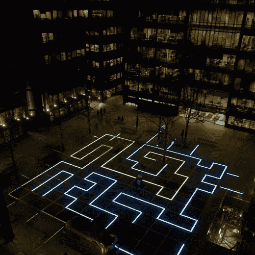
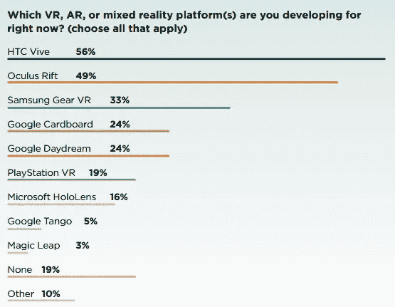
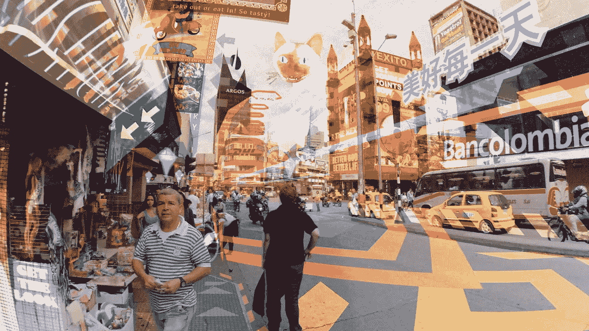

# 为 VR、AR 或 MR 创造合适的产品

> 原文：<https://medium.com/hackernoon/creating-the-right-products-for-vr-ar-or-mr-3a093c5ba1a0>

Credit: [http://www.theupcoming.co.uk](http://www.theupcoming.co.uk)

*注意，观点仅代表我个人，并不代表我的公司。*

有几篇文章已经透彻的解释了虚拟现实(VR)、(AR)、混合现实(MR)的区别；然而，很少有文章描述了每个平台的最佳产品类型。简而言之，虚拟现实封闭了现实世界，让你完全沉浸在数字世界中，感受到*的存在。增强现实就是你简单地将数字内容覆盖在现实世界上。对于混合现实，我的朋友 Graeme Devine 说得最好:混合现实是现实和虚拟世界的混合，这样一个人可以理解另一个人。在混合现实中，你感觉*共感*，以至于你相信数字内容就在你身边*。**

随着各种虚拟现实平台的兴起，如 [HTC Vive](https://www.vive.com/us/) 和 [Oculus Rift](https://www.oculus.com/rift/) ，以及 AR 平台，如 [ARKit](https://developer.apple.com/arkit/) ，越来越多的开发者正在探索跨越所有这些媒介的潜在产品，希望其中一个平台在未来起飞。你可以在 2017 年虚拟现实开发者大会(VRDC)的最新[报告](http://reg.vrdconf.com/VRDC-2017-Innovation-Report?kcode=VRRGDC)中看到开发者目前正在探索的平台的样本分析，该报告对 600 名开发者进行了调查。

然而，要为这些媒介中的一种构建成功的产品，开发人员需要真正理解它们的不同之处。

*   *虚拟现实。虚拟现实的一个独特优势是大视野(FOV)——通过完全封闭现实世界，你可以为用户提供无与伦比的沉浸感和*存在感*，这非常适合将用户带到幻想世界，如《哈利·波特》宇宙*中的古灵阁巫师银行*，或遥远但真实的地点，如火星。然而，虚拟现实的核心弱点之一是移动性(无法在不需要大空间的情况下自然移动，而山谷中的普通用户从来没有这样的空间)。许多产品试图用*传送机制[设计](https://hackernoon.com/tagged/design)来解决这个问题，在*中，你可以指向一个位置，然后点击一个按钮传送到那里；像 NeatCorp 这样的一些公司甚至做了很棒的工作[优化这个设计](/neat-corp/the-design-of-the-portal-locomotion-2677f3b3f9b5)得出结论，抛射体力学为用户带来了更精确的传送。即使有了这种设计，事实仍然是移动不是虚拟现实的优势——你现在必须围绕它来设计。因此，在技术改进之前，开发者应该避免直接翻译游戏类型，如第一或第三人称动作平台游戏(如《镜像边缘》)或“奔跑与射击”第一人称射击游戏(如《雷神之锤》),这些游戏需要精确的、基于技能的移动。相反，开发人员应该专注于充分利用虚拟现实优势的产品，如轨道体验(体验故意没有移动，而是“在轨道上”，如在获奖的 [Pearl](https://www.youtube.com/watch?v=WqCH4DNQBUA) 中成为移动车辆中的乘客，或在用户必须环顾四周并射击目标的汽车追逐中作为乘客参与)。目前另一个很棒的虚拟现实游戏类型是“驾驶舱”游戏，如[精英:危险虚拟现实](https://www.youtube.com/watch?v=wcZvPzVaPy4)，用户在车辆的驾驶舱中扮演一名飞行员，整个游戏在角色静止不动的情况下进行。*
*   ****增强现实。*** 我将保持这一节的简短，因为取决于你和谁说话，它要么是*混合现实*的一个子类，要么是同一个东西。增强现实目前的核心优势之一是能够以正常的移动方式移动。无论你去哪里，你都可以体验增强现实，一些游戏，如[口袋妖怪 Go](http://pokemongo.nianticlabs.com/en) 已经明确设计了他们的机制，以鼓励对现实世界的探索。然而，目前许多增强现实平台缺乏用户与数字内容进行复杂交互的能力，并且被限制在小视野(FOV)和屏幕(例如移动电话或平板电脑)中。*
*   ****混合现实*。** AR 和 MR 可能是三者中最不被理解的媒介。MR 的优势之一是能够感受到共感，将数字内容带入现实世界，而不会将你与周围的人排斥在外。虽然简单地*看到*数字内容与现实世界互动感觉很神奇，比如一个数字角色在你的客厅家具周围走动，但重要的是要认识到这在很大程度上是由一种被称为*新奇效应*的心理现象驱动的。对于许多人来说，由 ARKit 这样的东西创建的内容是他们第一次在现实世界中看到数字对象，这本身就令人兴奋。然而，如果你设计的产品或游戏严重依赖于第一次在现实世界中看到数字内容的“哇”的因素，你的产品就会失败。随着越来越多的 MR 产品发布，或者随着用户反复体验你的产品，他们将开始习惯于在现实世界中看到数字内容，过去的“哇”很快就会变成“那又怎样？”这也提高了正确的用户测试的重要性。如果你目前正在开发一个 AR/MR 产品，新奇效应是如此强大，以至于每一个走进你办公室测试你产品的用户都很可能给你带来令人兴奋的结果；然而，这是在转移视线。对于当前的 AR/MR 产品，关键是要针对重复会话进行用户测试——让同一个用户在几天、几周或几个月内每天一个小时试用你的产品。目前来看，这是 AR/MR 产品获得精准反馈的唯一途径。*

# *那么开发者在增强或混合现实中应该关注什么呢？*

*   ****核心循环*** 。在视频游戏行业的设计师中，核心循环是一个流行的术语，它让一些东西变得引人入胜。这是任何游戏或产品中最重要的部分，是*有意* *设计的*用户在产品中采取的行动链(希望重复起来很有趣！)因为目前 AR/MR 中的*新奇效果*如此强大，所以开发人员忽略在现实世界中看到数字内容的最初“惊叹”很重要，并专注于产品设计的基础，开发强大、迷人、有趣的核心循环。*
*   ****交互*** 。当你把现实世界中的数字内容放在某人面前时，绝大多数用户希望通过伸出他们的手并简单地抓取内容来与数字内容进行交互。许多开发人员关注于使用控制台控制器、遥控器或其他输入设备，它们是现实世界中数字内容的控制的抽象映射，并且在许多情况下，它工作得相当不错。然而，开发出允许用户做他们想做的事情，并以更实际的方式与数字内容互动的产品的开发者将最终胜出。其次，现在最关键的是专注于数字内容与现实世界互动的体验——没有这一点，它就不是混合现实。*
*   ****少即是多*。因为将数字内容放入现实世界是如此令人惊奇，许多开发者错误地开始用数字内容填充整个世界。***

**

*这不是我们任何人想要生活的世界。第一，它基本上以低于标准的 VR 体验征服了用户，不再感觉像 ar/MR。第二，用户已经习惯了“数字屏幕”的概念，以至于当这么多数字内容充满你的视野时(FOV)，他们开始像对待屏幕一样对待体验，并停止四处移动(AR 的优势之一！)*

*希望这篇文章能帮助你的产品团队更好地理解虚拟现实(VR)、增强现实(AR)和混合现实(MR)的优点和缺点，以便你的团队能为你选择的媒体做出最好的产品。当现在为这些媒介创造一个产品时，总是问你自己，“*当前的产品设计在其他媒介中是否更好？*“如果是这样，你可能希望[尽快转向](http://theleanstartup.com/principles)。*

# *关于作者:*

***杰弗里·林博士***

*Jeffrey Lin 目前是脸书领先设计团队 AR/VR 体验的设计总监，该团队正在为第一代虚拟和增强现实内容铺平道路。他之前是 Magic Leap 的设计总监，也是 Riot Games 的获奖电脑游戏《英雄联盟》的首席设计师，Riot Games 是《财富》杂志(Fortune)评选的最适合为 T3 工作的公司之一。他也是 Valve Software 的研究科学家，屡获殊荣的个人电脑游戏《T4》门户 2 的开发者，以及 Steam 平台的创造者。他在华盛顿大学获得了认知神经科学博士学位，并得到了霍华德·休斯医学研究所的资助。他的设计作品被刊登在 *Wired 杂志、麻省理工学院技术评论、The Verge、科学美国人*、*时代健康&科学、*和 *Re/code* 上。他的研究已经在许多同行评审期刊上发表，包括*自然*。*