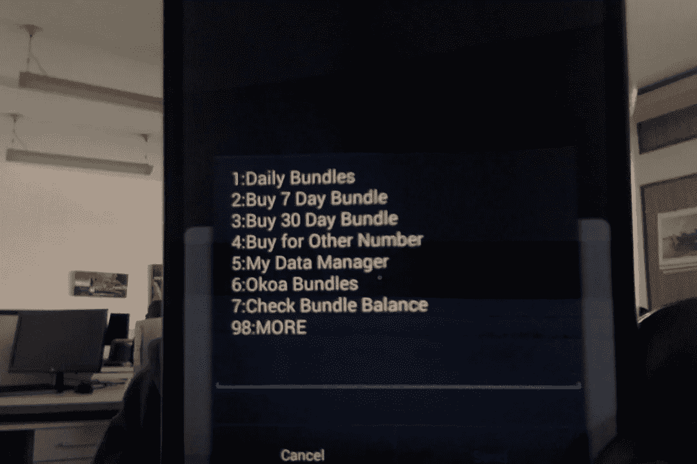

# 创建 USSD 应用程序

> 原文：<https://medium.com/hackernoon/creating-ussd-applications-69e7d6911158>

有时或可能所有的时间都很难用外行的语言解释技术概念。这种解释一个 2 岁可能涉及。今天，我会尽量压低声音，讲一个关于 USSD 科技的故事。

现在我得到了一点技术，但冷静，并假设一切都很好。

# 什么是 USSD？

在每天的基础上，我们有许多事情，我们互动，但我们实际上从来不知道他们的真实姓名。USSD 就是其中之一。根据维基百科，USSD 代表“非结构化补充服务数据”，这是一个全球系统，用于移动设备与服务提供商(Safaricom、Airtel、Orange)计算机上的程序直接通信。

如果你没有得到以上我想让你想想任何操作你做你的电话这是不是短信互联网或作出的电话。让我们来选择一个操作，比如检查信用或购买捆绑包(而不是捆绑包“mwitu”)。这个过程通常需要你在手机中输入一个具有独特结构的号码。

> ***144#或*544#**
> 
> 当您拨打上述号码时，您将会收到一条提示，为您提供获得相应服务所需的数据或说明。

此屏幕显示用户发起的 USSD 请求的示例请求。



我相信现在你可以和这项技术建立联系了。现在我想直截了当地解释一下，为什么会出现这种情况。

所以基本上情况是这样的:

*   用户拨打提供的 USSD 代码。
*   该请求被转发到移动服务提供商。
*   提供程序通过网关将请求路由到承载应用程序的计算机。
*   应用程序处理它接收的请求并发回反馈。
*   该反馈由提供商处理并被发送回移动电话。

我将解释如何创建 USSD 应用程序。

# USSD 背后的魔力

要让咒语成功，你需要一根魔杖，它有几个部分:

*   Chrome 的邮差客户端
*   运行 web 服务器(LAMP、xamp 等)
*   崇高文本编辑
*   脑
*   一杯咖啡(几杯)

当你满足以上要求时，你将获得迪迪(一位虚构的古埃及**魔术师的**名字**)的力量**书写和执行咒语。

请注意，在本教程中，我们不会使用实时网关，而只是模拟它在实际环境中的运行方式。*

## 拼写 1

要为 USSD 发展，他们是你需要理解的关键。其中一些是基本的编程技能，包括条件语句、Switch 语句等。

原因是因为我们将进行大量的字符串操作，以提取数据并解释 USSD 网关发送给我们的请求。需要注意的一点是，USSD 网关使用不同的语言，即发送具有不同命名的字符串。

对于本教程，我们将采用以下内容作为示例请求参数。

> MSISDN ' = > ' 254714611388 '(发送请求的电话号码)
> 
> SESSION_ID' => '355562002 '，(SESSION in case you need to perform audit)
> 
> USSD _ 字符串' => '58*1234*456*252 '，(这是包含从 USSD 网关发送的请求的字符串，基本上是用户在电话上得到提示时给出的答案。)

所有答案(用户在移动电话上输入的数据)由“*”分隔，用户输入的每个答案都连接到现有字符串。所以你需要熟悉 php 的 explode()函数。

## 咒语 2

这个魔咒现在是橡胶与路面相遇的地方。它包括创建一个样本代码来模拟一个过程。在本课程中，我将考虑一个选民登记系统。

在 USSD 你需要知道的一件非常重要的事情是关键字 CON 和 END 的用法。

CON 关键字用于暗示连续请求。例如，当您希望用户输入答案时。

END 用于终止 USSD 会话。当你在你的脚本的开头添加这个的时候，它会告诉提供者会话已经结束了，因此用户不会得到一个输入框，而是一个“确定”或者“退出”

下面是一个示例 php 代码，它也被加上了注释，以便更容易理解发生了什么。

```
<?php
 #We obtain the data which is contained in the post url on our server.

 $text=$_GET[‘USSD_STRING’];
 $phonenumber=$_GET[‘MSISDN’];
 $serviceCode=$_GET[‘serviceCode’];#we explode the text using the separator ‘*’ which will give us an array.$level = explode(“*”, $text);//check to see of the text variable has data to avoid errors.
 if (isset($text)) {
```

第一个请求将有一个空的文本字段，因此应该向用户显示欢迎屏幕。注意 CON 关键字的使用。

```
if ( $text == “” ) {
 $response=”CON Welcome to the registration portal.\nPlease enter you full name”;
 }
```

我们检查每个级别，以确保它有数据，已经通过或正在排队。希望你能弄清楚这里发生了什么。

```
if(isset($level[0]) && $level[0]!=”” && !isset($level[1])){$response=”CON Hi “.$level[0].”, enter your ward name”;

 }
 else if(isset($level[1]) && $level[1]!=”” && !isset($level[2])){
 $response=”CON Please enter you national ID number\n”;}
 else if(isset($level[2]) && $level[2]!=”” && !isset($level[3])){
 //Save data to database
 $data=array(
 ‘phonenumber’=>$phonenumber,
 ‘fullname’ =>$level[1],
 ‘electoral_ward’ => $level[2],
 ‘national_id’=>$level[3]
 );//Insert the values into the db SOMEWHERE HERE!!We end the session using the keyword END.$response=”END Thank you “.$level[1].” for registering.\nWe will keep you updated”; 
 }Also note that we echo the response for every successful request.header(‘Content-type: text/plain’);
 echo $response;}?>
```

## 咒语 3

如果你忍到这个地步，我应该给你一个忍者贴。:-)

第三个咒语将帮助我们知道我们的代码是否有效。为了测试代码，请从

```
[https://gist.github.com/drizzentic/18522c06e4529c58bc82fefe429e319b](https://gist.github.com/drizzentic/18522c06e4529c58bc82fefe429e319b)
```

并遵循以下步骤:

*   将代码放在您的 web 服务器文件夹中，即 htdocs 或/var/www/html
*   打开邮递员客户端
*   将 url 放在托管代码的位置，例如 localhost
*   将拼写 1 中指定的参数添加到请求 url，例如

> [http://localhost:9000？MSISDN = 0713038301&USSD _ 字符串= &服务代码=*144#](http://localhost:9000?MSISDN=0713038301&USSD_STRING=&serviceCode=*144#)

*   请注意，USSD 字符串应该为空，以便您看到欢迎页面。
*   发送请求并检查来自服务器的响应的邮差响应窗口。这代表了用户发出请求时在手机上得到的反馈。
*   通过添加您的姓名来修改 USSD 字符串，例如

> [http://localhost:9000？MSISDN = 0713038301&USSD _ 字符串=无名氏&服务代码=*144#](http://localhost:9000?MSISDN=0713038301&USSD_STRING=&serviceCode=*144#)

*   将会出现不同提示。要继续下一步，请在您的姓名后加一个“*”作为分隔符。对其余的提示重复此操作，直到完成为止。例如

> [http://localhost:9000？MSISDN = 0713038301&USSD _ 字符串=约翰·多伊*内罗比&服务代码=*144#](http://localhost:9000?MSISDN=0713038301&USSD_STRING=&serviceCode=*144#)

当您开发 USSD 应用程序时，上面的过程会很方便。在真实环境中测试是非常昂贵的，所以在你得到一个测试平台来测试之前，坚持使用 postman。

## 咒语 4

这不是很重要，但你也可以做。将 USSD 作为一项技能添加到您的 linkedIn 个人资料中:-)

**法术 5**

【https://www.buymeacoffee.com/rono 

## 为了帮助其他人获得免费新闻，请友好地按下心形按钮，以显示对工作的热爱并传播新闻。

> [黑客中午](http://bit.ly/Hackernoon)是黑客如何开始他们的下午。我们是 [@AMI](http://bit.ly/atAMIatAMI) 家庭的一员。我们现在[接受投稿](http://bit.ly/hackernoonsubmission)并乐意[讨论广告&赞助](mailto:partners@amipublications.com)机会。
> 
> 要了解更多信息，请[阅读我们的“关于”页面](https://goo.gl/4ofytp)、[在脸书上给我们点赞/发消息](http://bit.ly/HackernoonFB)，或者简单地说， [tweet/DM @HackerNoon。](https://goo.gl/k7XYbx)
> 
> 如果你喜欢这个故事，我们推荐你阅读我们的[最新科技故事](http://bit.ly/hackernoonlatestt)和[趋势科技故事](https://hackernoon.com/trending)。直到下一次，不要把世界的现实想当然！