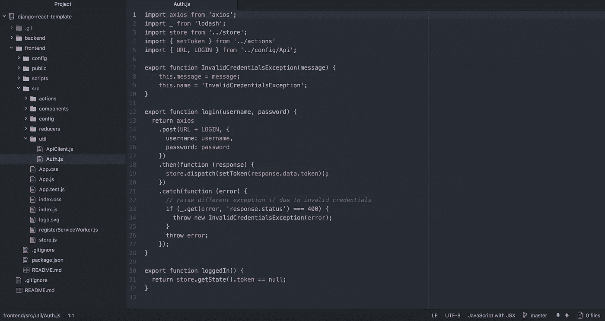

# 使用 React 和 Django REST 框架创建网站

> 原文：<https://medium.com/hackernoon/creating-websites-using-react-and-django-rest-framework-b14c066087c7>



最近在工作中，我们使用 React 前端和 Django REST 框架(DRF)后端来创建网站。这两者在前端通过使用 axios 的 API 调用来连接。一些 [Redux](https://hackernoon.com/tagged/redux) 也用于存储全局应用状态。这是我们的首选方法，因为它允许前端和后端完全解耦。只要我们定义一个端点和返回数据的列表，前端和后端就可以并行开发。这也让我们可以选择在未来轻松地为任何项目创建移动应用程序，因为他们可以只使用后端 API。另外，我们目前正在考虑在未来的移动应用项目中使用 React Native。

在这篇文章的其余部分，我将介绍如何设置一个反应前端和 DRF 后端项目。注:我假设你已经熟悉 React，Redux，Django，DRF，npm 等。这不是他们的教程。

# 后端

除了简单地安装 Django 和 DRF，并设置数据库之外，默认后端没有太多事情要做。从你的项目文件夹的根目录，创建一个 virtualenv 并安装 Django 和 DRF。

```
$ virtualenv env
$ source env/bin/activate
$ pip3 install django djangorestframework
$ pip3 freeze > requirements.txt
```

现在开始一个新的 Django 项目和 Django app。

```
$ django-admin startproject backend
$ cd backend
$ django-admin startapp api
```

现在，您应该设置数据库并编辑项目设置以使用该数据库。在 [Django 的网站](https://docs.djangoproject.com/en/1.11/topics/install/#get-your-database-running)上可以找到关于如何为您的特定 DB 做这件事的好文档。然后你应该按照他们网站上的说明配置 DRF。

下一步您很可能要在 API 中设置身份验证。如果您不需要认证(例如，没有用户登录)，您可以跳过这一步。我公司的 React/Django 模板项目目前使用普通令牌认证，因为它最容易设置。我也向那些学习者推荐这种方法，但它对生产来说不是最好的。这些令牌永不过期，一旦泄露，会带来相当大的安全风险。很快我们将更新模板项目，使用 oauth 或过期 JWT 令牌之类的东西——目前还没有决定。配置令牌认证的文档在这里是。

一旦令牌认证被配置，你将想要在你的应用中创建一个`urls.py` (如果你还没有的话)，并且使用 DRF 的令牌认证视图。这个位于`/auth`的端点允许用户发布他们的用户名和密码，并获得他们的身份验证令牌作为响应。在前端，这个令牌将被存储在 Redux 存储中，以供进一步的 API 调用。

```
# file: api/urls.pyfrom django.conf.urls import url
from rest_framework.authtoken import views as drf_viewsurlpatterns = [
    url(r'^auth$', drf_views.obtain_auth_token, name='auth'),
]
```

为了确保它是清楚的，你的`backend/urls.py`文件现在应该是这样的

```
# file: backend/urls.pyfrom django.conf.urls import url, include

urlpatterns = [
    url(r'^', include('api.urls', namespace='api', app_name='api')),
]
```

通过这样做，我们只是让每个应用程序关注自己的 URL。也许将来你会在后端添加更多的应用程序，把所有东西都添加到`backend/urls.py`会变得很麻烦

现在您应该有了一个运行正常的后端 DRF API，它有一个端点`/auth`，让用户获得他们的身份验证令牌。让我们设置一个用户，然后运行后端服务器进行测试。

```
$ python3 manage.py migrate
$ python3 manage.py createsuperuser
$ python3 manage.py runserver 0.0.0.0:8000
```

记得第一次运行 migrate 来创建数据库。然后，我们将创建一个用户，我们可以为其获取一个身份验证令牌。现在服务器正在运行，您可以使用 curl 快速测试您的`/auth`端点的工作情况

```
$ curl -X POST -d "username=username&password=password" http://localhost:8000/auth
```

# 前端

对于前端，我们使用脸书的 create-react-app 作为起点。所以要做的第一件事就是安装它，并使用它在项目文件夹的根目录下创建一个新项目。当我们需要更多的控制时，我们也退出配置，我们团队中的每个人都可以使用 webpack 等。

```
$ npm install -g create-react-app
$ create-react-app frontend
$ cd frontend
$ npm run eject
```

接下来，我们希望安装一些附加的依赖项。

```
$ npm install --save-dev babel-preset-es2015 babel-preset-stage-3
$ npm install --save redux redux-logger redux-persist react-redux
$ npm install --save axios react-router-dom lodash
```

现在，我不再列出 React 模板项目使用的所有代码，而是展示连接前端和后端的重要部分。首先创建一个 redux 存储，因为我们希望保存用户的 auth 令牌，以便将来进行更多的 API 调用

```
// file: src/store.js
import { compose, createStore, applyMiddleware } from 'redux';
import { createLogger } from 'redux-logger';
import { persistStore, autoRehydrate } from 'redux-persist';
import rootReducer from './reducers';

const store = createStore(
  rootReducer,
  compose(
    applyMiddleware(
      createLogger(),
    ),
    autoRehydrate()
  )
);
persistStore(store);
export default store;
```

然后设置令牌缩减器

```
// file: src/reducers/index.js
import { combineReducers } from 'redux';
import * as actionType from '../actions/types';

const tokenInitialState = null;
const token = (state = tokenInitialState, action) => {
  switch(action.type) {
    case actionType.SET_TOKEN:
      return action.data;
    default:
      return state;
  }
}

const appReducer = combineReducers({
  token,
})

const rootReducer = (state, action) => {
  return appReducer(state, action);
}

export default rootReducer;
```

最后是动作(注意这是一个代码块中的两个文件)

```
// file: src/actions/index.js
import * as actionType from './types';

export const setToken = (data) => {
  return {
    type: actionType.SET_TOKEN,
    data
  }
}// file: src/actions/types.js
export const SET_TOKEN = "SET_TOKEN";
```

我们现在有了一个可以在登录后发送以存储用户令牌的操作。接下来让我们看看如何登录

```
// file: src/util/Auth.js
import axios from 'axios';
import _ from 'lodash';
import store from '../store';
import { setToken } from '../actions'
import { URL, LOGIN } from '../config/Api';

export function InvalidCredentialsException(message) {
    this.message = message;
    this.name = 'InvalidCredentialsException';
}

export function login(username, password) {
  return axios
    .post(URL + LOGIN, {
      username,
      password
    })
    .then(function (response) {
      store.dispatch(setToken(response.data.token));
    })
    .catch(function (error) {
      // raise different exception if due to invalid credentials
      if (_.get(error, 'response.status') === 400) {
        throw new InvalidCredentialsException(error);
      }
      throw error;
    });
}

export function loggedIn() {
  return store.getState().token !== null;
}
```

这段代码使用 axios 发送到我们的`/auth`后端，然后将返回的令牌发送到我们的 redux 存储。一旦完成，我们现在就可以创建一个基于 axios 的 API 客户端，使用我们存储的令牌从 React 组件中的其他地方进行进一步的 API 调用。

```
// file: src/util/ApiClient.js
import axios from 'axios';
import store from '../store';
import { URL } from '../config/Api';

export const apiClient = function() {
        const token = store.getState().token;
        const params = {
            baseURL: URL,
            headers: {'Authorization': 'Token ' + token}
        };
        return axios.create(params);
}
```

我们在最后两个代码块中引用了文件`../config/Api`。这个文件看起来是这样的——它只是一个将常量映射到端点的文件，使得代码可读性更好，以后也更容易修改。

```
export const URL = process.env.API_URL;
export const LOGIN = "/auth";
```

这就是连接我们前端和后端的全部内容。您现在可以尝试使用`Auth.js`登录函数来获取我们之前创建的用户的 auth 令牌。如果是这样，可以查看浏览器的开发工具，检查 redux-logger 的输出，以查看 setToken redux 操作的结果。

我很想听听其他人对这种设置的反馈:我可以如何改进它，有什么需要改变或可以做得更好的，等等。