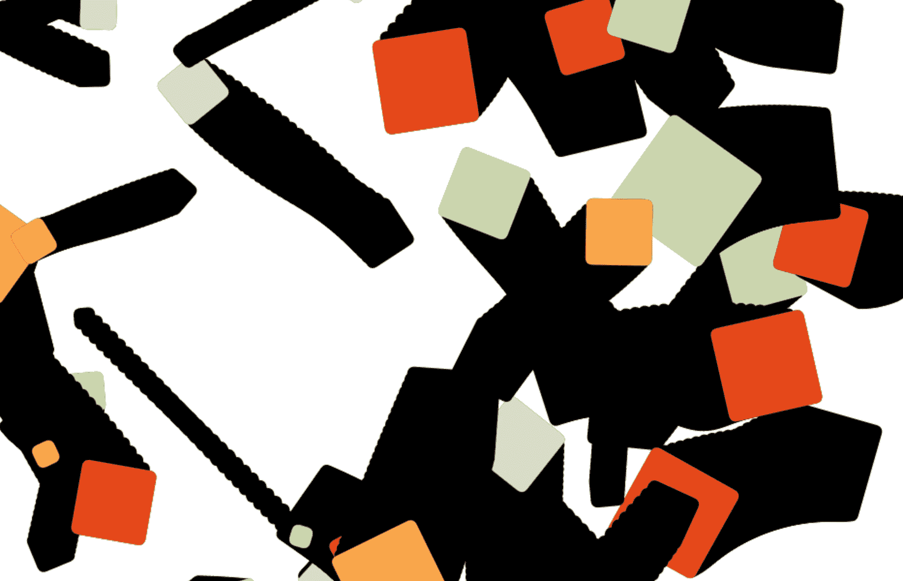

# 创造性编码:构建可重用对象

> 原文：<https://medium.com/hackernoon/creative-coding-building-objects-dd3659a9ab33>



## 对象是封装代码的好方法，可以让代码更简洁，让你的代码更快。

让我们来看看如何构建一个简单的 [colourPool](https://hackernoon.com/tagged/colourpool) 对象——因为在创造性编码中让事物看起来更好与颜色有很大关系。因为我们和。因为这是一个很好的方法来了解如何构建对象，这些对象实际上只是一些奇特的函数。

使用 [Javascript](https://hackernoon.com/tagged/javascript) API，我们可以创建如下颜色:

```
// using hex values
ctx.fillColor = “#ff0000”;// using a colour name
ctx.fillColor = “red”;//using a RGB value
ctx.fillColor = "rgb(255, 0, 0)";//using a RGBA value
ctx.fillColor = "rgb(255, 0, 0, 1)";//using a HSL value
ctx.fillColor = "hsl(0, 100, 100)";
```

但是这经常是重复的、笨拙的和不直观的，所以让我们构建一个 colourPool 对象来存储和检索调色板。这个概念直接取自约书亚·戴维斯的[炒作框架](http://www.hypeframework.org/)。谢谢乔希。

*(大喊到*[*Joshua*](http://www.joshuadavis.com/)*因为是第一批开源创意编码教程的人之一，当时开源还不是个东西)。*

那么我们如何用 Javascript 创建一个对象呢？Javascript 的美(有人会说是弱点，但他们只是脾气暴躁的编码员，我们是艺术家。太好了。)就是它只是一个函数。它实际上是一个物体吗？我们在乎吗？我们只想做酷的东西。

因此，我们创建了一个函数，并添加了一个 *return this* ，以便访问该函数及其内部工作方式。

```
// create an object
function colourPool(){
 return this;}
```

要声明我们的对象，我们只需这样做:

```
var colours = new ColourPool();
```

包含“ *this* ”的对象的变量和函数可以通过点语法访问。把“这个”想象成进入物体的入口。因此，如果我们想要一种添加颜色的方法，我们可以在 colourPool()对象中添加一个函数，返回“this”。add 函数接受一个参数，这个参数就是我们想要添加的颜色，然后我们将这个值放入一个数组来记录我们所有的颜色:

```
function colourPool(){ *// an empty array where we'll store our colours***
 this.pool = [];**// the add function takes in an argument of our colour we want to add to the pool*// this.add = function(_colour){} may look funky but
// it's the same as writing: function add(_colour){}
// the this. just now gives us a door to the function***this.add = function(_colour){** // push the new colour onto the pool array  **     
  this.pool.push(_colour);
    return this;
  }** return this;}
```

(是的，在对象中有很多“这样”的事情发生，在 javaScript 中有其他的方法——总有其他的方法——比如使用 prototype——但是我发现这些方法更加丑陋和冗长，而且对人们来说常常太难了[阅读:我！]让他们的头脑清醒过来。).

所以现在，如果我们想给我们的颜色池对象添加颜色，我们可以简单地做:

```
var colours = newColourPool();
colours.add("#cc0000");
```

为了检索我们的颜色，我们现在可以通过点语法简单地访问池数组:

```
*// create a new colourPool and add some colours*
var colours = newColourPool();
colours.add("#cc0000");
colours.add("#cccc00");
```

从 add 函数返回这个值还允许我们将调用链接在一起，就像这样:

```
// we can also chain them together
var colours = newColourPool()
.add("#cc0000");
.add("#cccc00");
```

相当整洁。但是如果我们只想得到一个随机的颜色，让我们为此建立一个函数:

```
this.get = function(){ // because arrays start from 0, 
 // the last value pool array would be it’s length - 1
 // in this case we added two colours, 
 // so the second colour would be //pool[1]var colour_pool_length = this.pool.length-1;// get a random value from our pool array
// we use randomInt() to return a whole numbervar random_colour = this.pool[randomInt(this.pool.length-1)];return random_colour;}
```

这有点啰嗦。所以我们可以把它们挤在一起，然后简单地做:

```
this.get = function(){ return this.pool[randomInt(this.pool.length-1)];}
```

现在假设我们想要创建一个加权的颜色分布，这样随机返回的颜色更可能是橙色而不是黑色。

我们让 add 函数接受第二个权重条件，然后生成一个加权列表。

```
function colourPool(){ this.pool = [];
  this.colour_list = [];
  **this.weights = [];**this.add = function(_colour, **_weight**) {
    **if (_weight == undefined) _weight = 1;**
    this.pool.push(_colour);
    **this.weights.push(_weight);**
    **this.colour_list  = this.generateWeighedList(this.pool, this.weights);**
    **return this;**
  } this.get = function(){
    return this.pool[randomInt(this.pool.length-1)];
  } **this.generateWeighedList = function(list, weight) {

    var weighed_list = [];***// Loop over weights* **for (var i = 0; i < weight.length; i++) {
       var multiples = weight[i] * 100;** *// Loop over the list of items* **for (var j = 0; j < multiples; j++) {
            weighed_list.push(list[i]);
       }
    }** **return weighed_list;** **};**return this;
}
```

很可能，肯定有更好的方法来做加权列表。但就我们的目的而言，除非我们添加 100 种颜色，否则它会做得很好。


现在我们有了。一个漂亮的*颜色池*功能，用于管理颜色。同样的原则可以应用于构建几乎任何对象，这将使您的创造性编码方式更加有趣和高效。

像往常一样，完整的代码可以在我的 github 上找到，本文是第 12 部分(一定要时不时拉一下，因为我会经常更新内容):【https://github.com/GeorgeGally/creative_coding

【https://hackernoon.com/@radarboy3000**参见往期《创意编码入门》**

**在 Instagram 这里关注我:**[**https://www.instagram.com/radarboy3000/**](https://www.instagram.com/radarboy3000/)

**在这里关注我的推特:**[**https://twitter.com/radarboy_japan**](https://twitter.com/radarboy_japan)

**友好点，喜欢我的脸书页面在这里获取教程和工作坊更新:**[**https://www.facebook.com/radarboy3000**](https://www.facebook.com/radarboy3000)

[](http://bit.ly/HackernoonFB)[](https://goo.gl/k7XYbx)[](https://goo.gl/4ofytp)

> [黑客中午](http://bit.ly/Hackernoon)是黑客如何开始他们的下午。我们是 [@AMI](http://bit.ly/atAMIatAMI) 家庭的一员。我们现在[接受投稿](http://bit.ly/hackernoonsubmission)并乐意[讨论广告&赞助](mailto:partners@amipublications.com)机会。
> 
> 如果你喜欢这个故事，我们推荐你阅读我们的[最新科技故事](http://bit.ly/hackernoonlatestt)和[趋势科技故事](https://hackernoon.com/trending)。直到下一次，不要把世界的现实想当然！

