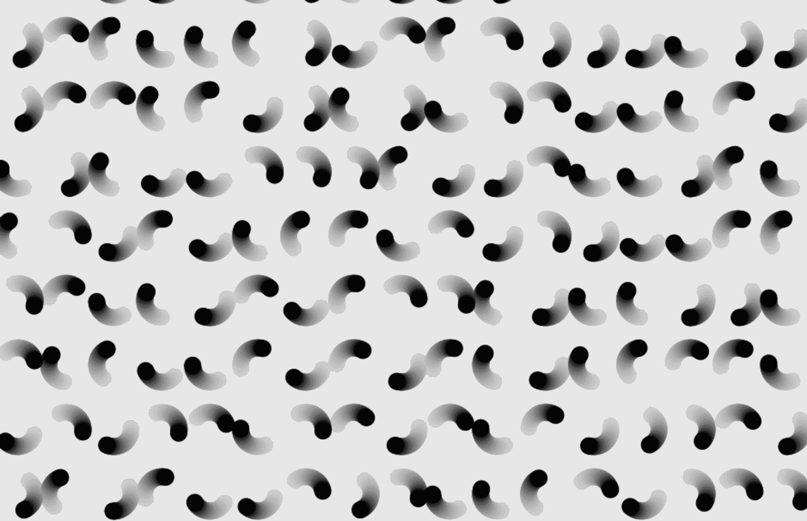
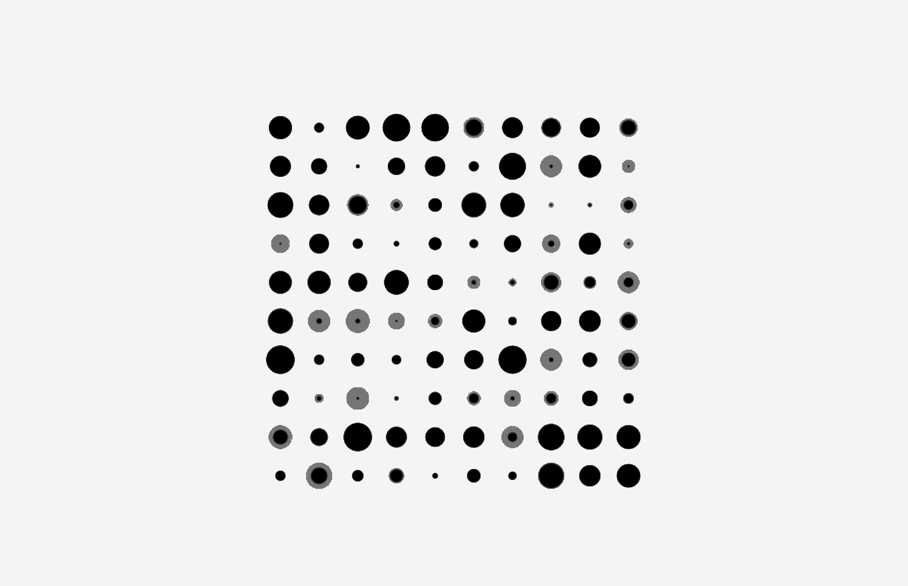
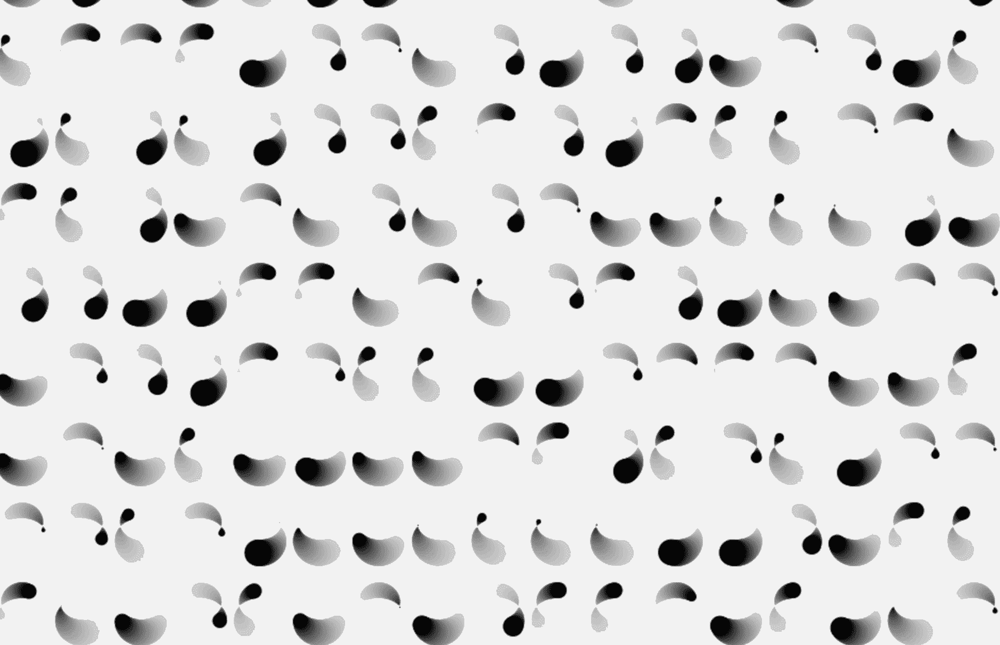

# 在创造性编码中使用网格

> 原文：<https://medium.com/hackernoon/creative-coding-grids-2e6bcaa07596>



## 如何用 Javascript 创建一个可重用的网格系统

我非常喜欢重复。所以我几乎每天都在使用网格。这是在屏幕上布局的一种快速简单的方式。

这些教程的所有代码和库都可以在这里找到:【https://github.com/GeorgeGally/creative_coding 

网格创建真的很简单。我们有水平和垂直方向上需要的项目数量，以及网格的宽度和高度。扔在一个良好的措施开始的位置，把它很好地放置在屏幕上我们想要的地方，我们有我们的网格。

让我们将这些条件传递给网格创建函数:

```
function Grid(_num_items_horiz, _num_items_vert, _grid_w, _grid_h, _startx, _starty){ return this;}
```

我最近从[为潮人编写的 Javascript Hacks】中学到的一件事是，你可以使用||来测试一个变量是否未定义，而不是使用 *if 语句*，就像这样:](https://hackernoon.com/javascript-hacks-for-hipsters-624d50c76e8e#.z23l3royd)

```
*// usual way*
// if (_num_items_horiz == undefined) _num_items_horiz = 1;*// hipster way*
var num_items_horiz = _num_items_horiz || 1;
```

我们创建一个 *createGrid()* 函数，[通过 x 和 y 点循环](https://hackernoon.com/tagged/loops)来创建我们的网格，并将它们推送到一个数组上:

```
function Grid(_num_items_horiz, _num_items_vert, _grid_w, _grid_h, _startx, _starty){ *// these are temp variables to store the original _num_items  
  // variables passed in the constructor*  var num_items_horiz = _num_items_horiz || 1;
  var num_items_vert = _num_items_vert || 1;

  this.horiz = 0;
  this.vert = 0; this.start = {x: _startx || 0 , y: _starty || 0}; this.grid_w = _grid_w || w;
  this.grid_h = _grid_h || h; // empty arrays to store our grid positions 
  this.x = [];
  this.y = []; *//work out how far apart the grid items are* this.spacing_x = this.grid_w / this.num_items_horiz;
  this.spacing_y = this.grid_h / this.num_items_vert; **this.createGrid = function() {
    for (var _y = 0; _y < this.grid_h; _y+=this.spacing_y) {
     for (var _x = 0; _x < this.grid_w; _x+=this.spacing_x) {***// we use spacing/2 so that the grid fits nicely 
      // in our defined area ***
      this.x.push(this.start.x + this.spacing_x/2 + _x);
      this.y.push(this.start.y + this.spacing_y/2 + _y);
     }
   }** createGrid(); 
  return this;} 
```

剩下要做的唯一一件事就是创建一个 add()函数，这样就可以动态地添加条目，所以最终的代码如下所示:

```
function Grid(_num_items_horiz, _num_items_vert, _grid_w, _grid_h, _startx, _starty){ if (_num_items_horiz == undefined) _num_items_horiz = 1;
  if (_num_items_vert == undefined) _num_items_vert = 1;
  var _horiz = _num_items_horiz || 1;
  var _vert = _num_items_vert || 1; this.spacing_x;
  this.spacing_y; this.num_items_horiz = 0;
  this.num_items_vert = 0; this.start = {x: _startx || 0 , y: _starty || 0}; this.grid_w = _grid_w || w;
  this.grid_h = _grid_h || h; this.x = [];
  this.y = []; **this.add = function(_horiz, _vert) {** *// if we don't pass a value just add 1 to the size* **this.num_items_horiz += _horiz || 1;
    this.num_items_vert += _vert || 1;
    this.spacing_x = this.grid_w / this.num_items_horiz;
    this.spacing_y = this.grid_h / this.num_items_vert;    
    this.createGrid(); 
    return this;** **}** **this.setStart = function(_x, _y) {
    this.start = {x: _x || 0 , y: _y || 0};
    createGrid();
    return this;
  }** this.createGrid = function() {
    for (var _y = 0; _y < this.grid_h; _y+=this.spacing_y) {
     for (var _x = 0; _x < this.grid_w; _x+=this.spacing_x) { 
      this.x.push(this.start.x + this.spacing_x/2 + _x);
      this.y.push(this.start.y + this.spacing_y/2 + _y);
     }
   };
 } **this.add(_horiz, _vert);** return this;}
```

好了，无聊的事情结束了。让我们使用我们的网格。

让我们使用一个[粒子](https://hackernoon.com/tagged/particle)系统来使它变得简单(如果你还没有跟上，[看这里关于如何创建一个](https://hackernoon.com/how-to-make-particles-1cbeee937593))。让我们像这样建立一个粒子网格:



要创建我们的网格，我们现在可以这样做:

```
// create grid
var num_grid_horiz = 10;
var num_grid_vert = 10;
var grid_w = 400;
var grid_h = 400;
var grid_startx = w/2 - grid_w/2;
var grid_starty = h/2 - grid_h/2;var grid = new Grid(num_grid_horiz, num_grid_vert, grid_w, grid_h, grid_startx, grid_starty);
```

这将还给我们一个网格对象，可以包含一个 x 和 y 位置的数组。现在很容易使用。我们只是通过我们的网格迭代得到它们的位置，grid.x[0]和 grid.y[0]得到它们的第一个位置，grid.x[1]和 grid.y[1]得到它们的第二个位置，以此类推。完整的代码如下所示:

```
var ctx = createCanvas("canvas1");// create grid
var num_grid_horiz = 10;
var num_grid_vert = 10;
var grid_w = 400;
var grid_h = 400;
var grid_startx = w/2 - grid_w/2;
var grid_starty = h/2 - grid_h/2;var grid = new Grid(num_grid_horiz, num_grid_vert, grid_w, grid_h, grid_startx, grid_starty);console.log(grid);// create particles
var balls = [];
**var number_of_balls = num_grid_horiz * num_grid_vert;**for (var i = 0; i < number_of_balls; i++) {
  **addBall(grid.x[i], grid.y[i]);**
}function addBall(_x, _y){
  var ball = {
    x: _x,
    y: _y,
    speed_x: random(1),
    speed_y: random(1),
    size: 20,
    colour: rgb(0),
    angle: random(360)
  }
  balls.push(ball);
} function draw(){
  ctx.background(235, 0.5);
  moveBall();
  drawBall();
} function moveBall(){ for (var i = 0; i < balls.length; i++) {
    var b = balls[i];
    b.size = random(2, 30);
  }} function drawBall(){

  for (var i = 0; i < balls.length; i++) {
    var b = balls[i];
    ctx.fillStyle = b.colour;
    ctx.fillEllipse(b.x, b.y, b.size);
  }}
```

现在我们有了。让我们在此基础上创建一个稍微复杂一些的东西:



创建上面的图像，这只是标题图像的一个微小的变化。我们用正弦振荡改变粒子的大小，并按照 [Math.sin 和 Math.cos 教程](http://All the code and libraries for these tutorials can be found here: https://github.com/GeorgeGally/creative_coding)使用正弦和余弦移动粒子:

```
var ctx = createCanvas("canvas1");// create grid
**var num_grid_horiz = 20;
var num_grid_vert = 10;****var grid = new Grid(num_grid_horiz, num_grid_vert);**console.log(grid);// create particles
var balls = [];
var number_of_balls = num_grid_horiz * num_grid_vert;
for (var i = 0; i < number_of_balls; i++) {
  addBall(grid.x[i], grid.y[i]);
}function addBall(_x, _y){
  var ball = {
    x: _x,
    y: _y,
 **startx: _x,
    starty: _y,**
    speed_x: 1,
    speed_y: random(1),
    size: 20,
    colour: rgb(0),
    angle: random(360)
  }
  balls.push(ball);
}function draw(){
  ctx.background(235, 0.1);
  moveBall();
  drawBall();
}function moveBall(){for (var i = 0; i < balls.length; i++) {
    var b = balls[i];
   ** b.angle += b.speed_x/10;
    b.x = b.startx + Math.cos(b.angle) * 20;
    b.y = b.starty + Math.sin(b.angle) * 20;
    b.size = 5 + Math.sin(b.angle) * 20;**
  }}function drawBall(){
  for (var i = 0; i < balls.length; i++) {
    var b = balls[i];
    ctx.fillStyle = b.colour;
    ctx.fillEllipse(b.x, b.y, b.size);
  }
}
```

仅此而已。我们完了。快乐的重复。

像往常一样，完整的代码可以在我的 github 上找到，这篇文章是第 11 部分(一定要时不时地拉一下，因为我经常更新内容):[https://github.com/GeorgeGally/creative_coding](https://github.com/GeorgeGally/creative_coding)

【https://hackernoon.com/@radarboy3000】[**参见往期《创意编码入门》**](https://hackernoon.com/@radarboy3000)

**在 Instagram 上关注我这里:**[**https://www.instagram.com/radarboy3000/**](https://www.instagram.com/radarboy3000/)

**在推特上关注我这里:**[**https://twitter.com/radarboy_japan**](https://twitter.com/radarboy_japan)

**友好点，喜欢我的脸书页面在这里获取教程和工作坊更新:【https://www.facebook.com/radarboy3000】[](https://www.facebook.com/radarboy3000)**

**[](http://bit.ly/HackernoonFB)****[](https://goo.gl/k7XYbx)****[](https://goo.gl/4ofytp)**

> **[黑客中午](http://bit.ly/Hackernoon)是黑客如何开始他们的下午。我们是这个家庭的一员。我们现在[接受投稿](http://bit.ly/hackernoonsubmission)并乐意[讨论广告&赞助](mailto:partners@amipublications.com)机会。**
> 
> **如果你喜欢这个故事，我们推荐你阅读我们的[最新科技故事](http://bit.ly/hackernoonlatestt)和[趋势科技故事](https://hackernoon.com/trending)。直到下一次，不要把世界的现实想当然！**

****